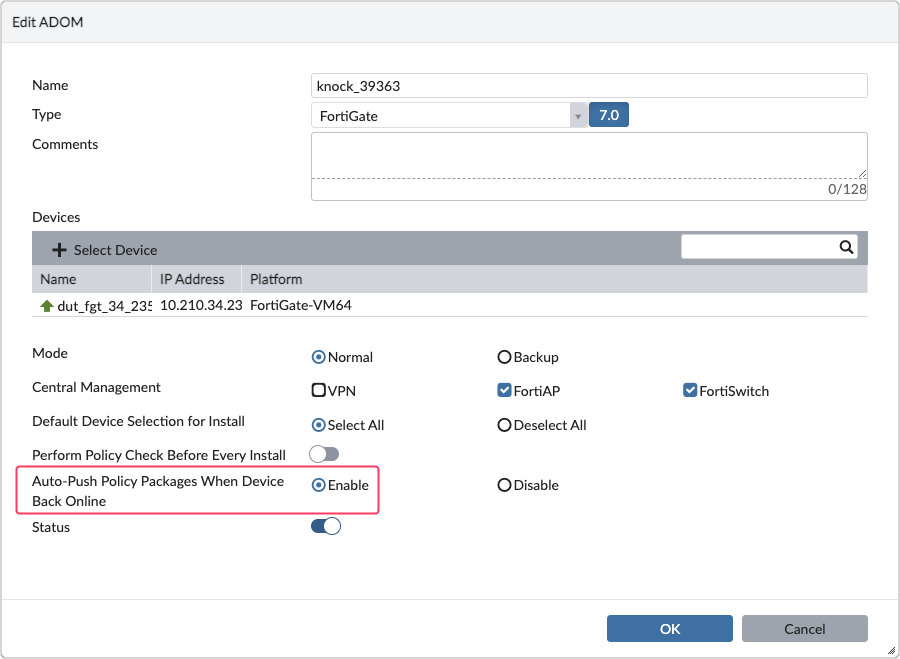

Policy Package Management
=========================

Folders
-------

How to create a folder hierarchy
++++++++++++++++++++++++++++++++

**REQUEST:**

.. code-block:: json

   {
     "id": 1,
     "method": "set",
     "params": [
       {
         "data": [
           {
             "name": "folder_001",
             "subobj": [
               {
                 "name": "folder_002",
                 "subobj": [
                   {
                     "name": "folder_003",
                     "subobj": [
                       {
                         "name": "folder_004",
                         "type": "folder"
                       }
                     ],
                     "type": "folder"
                   }
                 ],
                 "type": "folder"
               }
             ],
             "type": "folder"
           }
         ],
         "url": "pm/pkg/adom/demo_001"
       }
     ],
     "session": 46811
   }

**RESPONSE:**

.. code-block:: json

   { 
     "id": 1,
     "result": [
       { 
         "status": { 
           "code": 0, 
           "message": "OK"
         }, 
         "url": "pm/pkg/adom/demo_001"
       }
     ], 
     "session": 46811
   }

How to move a folder?
+++++++++++++++++++++

**REQUEST:**

.. code-block:: json

   {
     "id": 1,
     "method": "exec",
     "params": [
       {
         "url": "/securityconsole/package/move",
         "data": {
           "adom": "demo_001",
           "pkg": "italy",
           "dst_parent": "world/emea",
           "dst_name": "italy"
         }
       }
     ],
     "session": 11111,
   }

How to delete a folder?
+++++++++++++++++++++++

**REQUEST:**

.. code-block:: json

   {
     "id": 1,
     "jsonrpc": "1.0",
     "method": "delete",
     "params": [
       {
         "url": "/pm/pkg/adom/demo/foobar"
       }
     ],
     "session": "NlLwCb+SB5wikMi1MPdTOnRtWOg6gM9z36yMMttHuWPZKoWW4Ia7/B/pGUjZMr4uZGqrw7J9aBImePfl9eZhbw==",
     "verbose": 1
   }

**RESPONSE:**

.. code-block:: json

   {
     "id": 1,
     "result": [
       {
         "status": {
           "code": 0,
           "message": "OK"
         },
         "url": "/pm/pkg/adom/demo/foobar"
       }
     ]
   }

Policy Packages
---------------

How to create a policy package?
+++++++++++++++++++++++++++++++

We create policy package ``pp.003`` in adom ``DEMO``:

**REQUEST:**

.. code-block:: shell

   {
     "id": 1,
     "jsonrpc": "1.0",
     "method": "add",
     "params": [
       {
         "data": {
           "name": "pp.003",
           "package settings": {
             "central-nat": "disable",
             "consolidated-firewall-mode": "disable",
             "fwpolicy-implicit-log": "disable",
             "fwpolicy6-implicit-log": "disable",
             "ngfw-mode": "profile-based"
           },
           "type": "pkg"
         },
         "url": "/pm/pkg/adom/DEMO"
       }
     ],
     "session": "4VUbMWg40/hOwzHt5/BRKRIbaAd0MBkTwprdFs4iG+w8QPSwyoa/MVrwHtVV7oQ463ifbp1I30eZ9FSluYtJuQ==",
     "verbose": 1
   }

**RESPONSE:**

.. code-block:: json

   {
     "id": 1,
     "result": [
       {
         "status": {
           "code": 0,
           "message": "OK"
         },
         "url": "/pm/pkg/adom/DEMO"
       }
     ]
   }

Starting with FMG 7.0.1 (#708471), the response will also contain the ``pkg oid``.

How to get the list of Policy Package?
++++++++++++++++++++++++++++++++++++++

Following example shows how to get the list of Policy Packages in the ``demo`` ADOM:

.. tab-set::

   .. tab-item:: REQUEST

      .. code-block:: json

         {
           "id": 3,
           "method": "get",
           "params": [
             {
               "url": "/pm/pkg/adom/demo"
             }
           ],
           "session": "{{session}}"
         }

   .. tab-item:: RESPONSE

      .. code-block:: json         

         {
           "id": 3,
           "result": [
             {
               "data": [
                 {
                   "name": "default",
                   "obj ver": 13,
                   "oid": 4971,
                   "package settings": {
                     "central-nat": 0,
                     "consolidated-firewall-mode": 0,
                     "fwpolicy-implicit-log": 0,
                     "fwpolicy6-implicit-log": 0,
                     "hitc-taskid": 0,
                     "hitc-timestamp": 0,
                     "ngfw-mode": 0,
                     "policy-offload-level": 0
                   },
                   "type": "pkg"
                 },
                 {
                   "name": "fgt-742-001",
                   "obj ver": 5,
                   "oid": 6584,
                   "package settings": {
                     "central-nat": 0,
                     "consolidated-firewall-mode": 0,
                     "fwpolicy-implicit-log": 0,
                     "fwpolicy6-implicit-log": 0,
                     "hitc-taskid": 0,
                     "hitc-timestamp": 0,
                     "ngfw-mode": 0,
                     "policy-offload-level": 0
                   },
                   "type": "pkg"
                 },
                 {
                   "name": "ppkg_001",
                   "obj ver": 6,
                   "oid": 10850,
                   "package settings": {
                     "central-nat": 0,
                     "consolidated-firewall-mode": 0,
                     "fwpolicy-implicit-log": 0,
                     "fwpolicy6-implicit-log": 0,
                     "hitc-taskid": 0,
                     "hitc-timestamp": 0,
                     "ngfw-mode": 0,
                     "policy-offload-level": 0
                   },
                   "scope member": [
                     {
                       "name": "dc_emea_dev_001",
                       "vdom": "root"
                     },
                     {
                       "name": "dc_emea_dev_002",
                       "vdom": "root"
                     },
                     {
                       "name": "dc_emea_dev_003",
                       "vdom": "root"
                     }
                   ],
                   "type": "pkg"
                 }
               ],
               "status": {
                 "code": 0,
                 "message": "OK"
               },
               "url": "/pm/pkg/adom/demo"
             }
           ]
         }

      .. note::

         - You can observe that when the Policy Package is assigned to managed 
           devices, then FortiManager returns the ``scope member`` attribute

How to get a single Policy Package?
+++++++++++++++++++++++++++++++++++

Following example returns the details of the ``ppkg_001`` Policy Package from 
the ``demo`` ADOM:

.. tab-set::

   .. tab-item:: REQUEST

      .. code-block:: json

         {
           "id": 3,
           "method": "get",
           "params": [
             {
               "url": "/pm/pkg/adom/demo/ppkg_001"
             }
           ],
           "session": "{{session}}"
         }

   .. tab-item:: RESPONSE

      .. code-block:: json

         {
           "id": 3,
           "result": [
             {
               "data": {
                 "name": "ppkg_001",
                 "obj ver": 6,
                 "oid": 10850,
                 "package settings": {
                   "central-nat": 0,
                   "consolidated-firewall-mode": 0,
                   "fwpolicy-implicit-log": 0,
                   "fwpolicy6-implicit-log": 0,
                   "hitc-taskid": 0,
                   "hitc-timestamp": 0,
                   "ngfw-mode": 0,
                   "policy-offload-level": 0
                 },
                 "scope member": [
                   {
                     "name": "dc_emea_dev_001",
                     "vdom": "root"
                   },
                   {
                     "name": "dc_emea_dev_002",
                     "vdom": "root"
                   },
                   {
                     "name": "dc_emea_dev_003",
                     "vdom": "root"
                   }
                 ],
                 "type": "pkg"
               },
               "status": {
                 "code": 0,
                 "message": "OK"
               },
               "url": "/pm/pkg/adom/demo/ppkg_001"
             }
           ]
         }           
         
      .. note:: 

         - By default, FortiManager returns the Installation Targets of the 
           Policy Package via the ``scope member`` attribute
           
How to get the Installation Targets of a Policy Package?
++++++++++++++++++++++++++++++++++++++++++++++++++++++++

See :ref:`How to get the list of Policy Package?` or :ref:`How to get a single 
Policy Package?`

How to assign a device to a Policy Package?
+++++++++++++++++++++++++++++++++++++++++++

We want to assign device ``hub1`` to policy package ``hubs.pp`` in ADOM
``DEMO_007``.

**REQUEST:**

.. code-block:: json

   {
     "id": 1,
     "jsonrpc": "1.0",
     "method": "add",
     "params": [
       {
         "data": {
           "name": "hub1",
           "vdom": "root"
         },
         "url": "/pm/pkg/adom/DEMO_007/hubs.pp/scope member"
       }
     ],
     "session": "RNBTLp49bHV+yvRAw1FRGkvjURd7V13+GtS8Vk8KQ/VFZ4gPrIfGd4f09nrKk6ppw9QCUj1C1CbZz4d7/e7GmA==",
     "verbose": 1
   }

**RESPONSE:**

.. code-block:: json

   {
     "id": 1,
     "result": [
       {
         "status": {
           "code": 0,
           "message": "OK"
         },
         "url": "/pm/pkg/adom/DEMO_007/hubs.pp/scope member"
       }
     ]
   }

Policy Package Installation
+++++++++++++++++++++++++++

How to install a Policy Package?
________________________________

To install the ``branches`` Policy Package from ADOM ``demo``:

.. tab-set::
   
   .. tab-item:: REQUEST

      .. code-block:: json

         {
           "id": 3,
           "method": "exec",
           "params": [
             {
               "data": {
                 "adom": "demo",
                 "adom_rev_comments": "Changes from SR #01233",
                 "adom_rev_name": "ADOM Revision #01233",
                 "dev_rev_comments": "sr_01233",
                 "flags": [
                   "none"
                 ],
                 "pkg": "branches"
               },
               "url": "/securityconsole/install/package"
             }
           ],
           "session": "{{session}}"
         }

      .. note::

         - There's not ``scope`` attribute; it means that the Policy Package
           will be install against all the assigned Installation Targets

         - ``adom_rev_comments`` will be used as a comment for the created ADOM
           Revision

         - ``adom_rev_name`` will be used as the name for the created ADOM
           Revision

         - ``dev_rev_comments`` will be used as the comment for the created
           Device Revision (see section :ref:`Device revisions`)

   .. tab-item:: RESPONSE

      .. code-block:: json
      
         {
           "id": 3,
           "result": [
             {
               "data": {
                 "task": 3468
               },
               "status": {
                 "code": 0,
                 "message": "OK"
               },
               "url": "/securityconsole/install/package"
             }
           ]
         }

How to install a Policy Package against a device?
_________________________________________________

It is required to add the ``scope`` attribute:

**REQUEST:**

.. code-block:: json

		{
		  "id": 1,
		  "jsonrpc": "1.0",
		  "method": "exec",
		  "params": [
		    {
		      "data": {
		        "adom": "DEMO",
			      "flags": [
			        "none"
			      ],
			      "pkg": "pp.branches",
			      "scope": [
			        {
			          "name": "branch2_fgt",
			          "vdom": "root"
			        }
			      ]
		      },
		      "url": "/securityconsole/install/package"
		    }
		  ],
		  "session": "3xJ+a4TrhW5fSFSy3AQixRxRnINFsQhvOMXiSMVC1ryEMVZQ/enwiTasPzY9X1e64KT/UoTdl8lfory4wXub4A==",
		  "verbose": 1
		}

**RESPONSE:**

.. code-block:: json

		{
		  "id": 1,
		  "result": [
		    {
		      "data": {
		        "task": 536
		      },
		      "status": {
		        "code": 0,
		        "message": "OK"
		      },
		      "url": "/securityconsole/install/package"
		    }
		  ]
		}

.. note::

   - The ``scope`` attribute is a list, hence it could contains multiple
     devices or device groups.
   
   - The devices/device groups listed in the ``scope`` should belong to the
     list of assigned installation targets for this Policy Package. 
     
     The membership could be indirect or direct: 
       - Direct membership means the device listed in the ``scope`` attribute
         is also in the installation targets list of the Policy Package.
       
       - Indirect membership means the device listed in the ``scope`` attribute
         is a member of a device group or of a nested device group of a device
         group present in the installation targets list of the policy package .

         For instance, if the installation targets list of the Policy Package
         is having device group ``branches``, then you can use device
         ``branch_001`` in the ``scope`` attribute if it belongs to this device
         group or one of its nested device groups.

How to install a Policy Package against a Device Group?
_______________________________________________________

We have Policy Package ``pp_france`` in foldler ``france`` which is in turn in
folder ``emea``. 
Policy Package ``pp_france`` is having device group ``france`` and device
``test-001`` as installation targets. 
Goal is to install Policy Package ``pp_france`` against device group ``france``
only.

**REQUEST:**

.. code-block:: json

	  {
	    "id": 1,
	    "jsonrpc": "1.0",
	    "method": "exec",
	    "params": [
	      {
	        "data": {
		  "adom": "root",
		  "flags": [
		    "none"
		  ],
		  "pkg": "emea/france/pp_france",
		  "scope": [
		    {
		     "name": "france"
		    }
		  ]
	        },
		"url": "/securityconsole/install/package"
	      }
	    ],
	    "session": "Of286Bft82otZnCz6da2+FEskUyY6q4Opnyd1/nkpAoEMem7osWNVkU0XEGC24lIobP43qxJsmmnqUVGd88Cqw==",
	    "verbose": 1
	  }

**RESPONSE:**

.. code:: json

	  {
	    "id": 1,
	    "result": [
	      {
	        "data": {
		  "task": 148
		},
		"status": {
		  "code": 0,  
		  "message": "OK"
		},
		"url": "/securityconsole/install/package"
	      }
	    ]
	  }

#02764941 is stating that when the scope is just having a ``name`` attribute, it is considered a device group.

If device group ``france`` is in a device group ``emea``, we can just use the full path in the ``name`` attribute:

**REQUEST**:

.. code-block:: json
   :emphasize-lines: 15
		     
	  {
	    "id": 1,
	    "jsonrpc": "1.0",
	    "method": "exec",
	    "params": [
	      {
	        "data": {
		  "adom": "root",
		  "flags": [
		    "none"
		  ],
		  "pkg": "emea/france/pp_france",
		  "scope": [
		    {
		     "name": "emea/france"
		    }
		  ]
	        },
		"url": "/securityconsole/install/package"
	      }
	    ],
	    "session": "Of286Bft82otZnCz6da2+FEskUyY6q4Opnyd1/nkpAoEMem7osWNVkU0XEGC24lIobP43qxJsmmnqUVGd88Cqw==",
	    "verbose": 1
	  }

**RESPONSE:**

.. code:: json

	  {
	    "id": 1,
	    "result": [
	      {
	        "data": {
		  "task": 148
		},
		"status": {
		  "code": 0,  
		  "message": "OK"
		},
		"url": "/securityconsole/install/package"
	      }
	    ]
	  }

How to install a policy package located in a folder?
____________________________________________________

To install policy package ``pp_corporate`` placed in folder ``/duts/emea``,
from ADOM ``adom_dut``:

**REQUEST:**

.. code-block::

   {
     "id": 1,
     "jsonrpc": "1.0",
     "method": "exec",
     "params": [
       {
         "data": {
           "adom": "adom_dut",
           "flags": [
             "none"
           ],
           "pkg": "duts/emea/pp_corporate",
           "scope": [
             {
               "name": "fgt_dut1",
               "vdom": "root"
             }
           ]
         },
         "url": "/securityconsole/install/package"
       }
     ],
     "session": "za3jFQLMS8vEoQzyoby34nnzKHz6kF7Di1DDyLEID0P2wj09hzdofc09CDocYgZCQ7wT1nlEtzRxAtykowfuEw==",
     "verbose": 1
   }

**RESPONSE:**

.. code-block::

   {
     "id": 1,
     "result": [
       {
         "data": {
           "task": 1273
         },
         "status": {
           "code": 0,
           "message": "OK"
         },
         "url": "/securityconsole/install/package"
       }
     ]
   }

How to install a policy package against a device's device db only?
__________________________________________________________________

Why would we need this?

It could be because we prefer to review definitive configuration offline,
i.e. from fortimanager database.

To achieve this, we can use the ``copy_only`` flag.
It will take pending changes from ADOM DB and will copy them in the target's
device db.

In below example we trigger the copy operation against managed device
``branch12`` considering the pending security changes from policy package
``pp_branches`` in ADOM ``demo``:

**REQUEST:**

.. code-block::

   {
     "id": 1,
     "jsonrpc": "1.0",
     "method": "exec",
     "params": [
       {
         "data": {
           "adom": "DB",
           "flags": [
             "copy_only"
           ],
           "pkg": "pp.003",
           "scope": [
             {
               "name": "branch12",
               "vdom": "root"
             }
           ]
         },
         "url": "/securityconsole/install/package"
       }
     ],
     "session": "o9m+9/oQ101vfDhLYU3WkKa1YJR6p3nA0NFVmuBKw3JxgFYtD7Y3FekxTuMNZ1TgG8gslO6g/gzZtvVIKPZQnmtQETm7OABp",
     "verbose": 1
   }

**RESPONSE:**

.. code-block::

   {
     "id": 1,
     "result": [
       {
         "data": {
           "task": 133
         },
         "status": {
           "code": 0,
           "message": "OK"
         },
         "url": "/securityconsole/install/package"
       }
     ]
   }

How to install a policy package against an offline device?
__________________________________________________________

This is for when the ADOM is configured with *Auto-Push Policy Packages When
Device Back Online* enabled:



It's a three steps process:

#. First we need to trigger a *copy* operation

   **REQUEST:**

   .. code-block:: json

      {
        "id": 3,
        "method": "exec",
        "params": [
          {
            "data": {
              "adom": "knock_39363",
              "adom_rev_name": "dut_fgt_34_235_2022-4-6-20-2-51",
              "flags": [
                "generate_rev",
                "preview"
              ],
              "pkg": "dut_fgt_34_235",
              "scope": [
                {
                  "name": "dut_fgt_34_235",
                  "vdom": "root"
                }
              ]
            },
            "url": "/securityconsole/install/package"
          }
        ],
        "session": "2D7yrlIbNRf/1kt9B+ame4T2G/RFfW2DGboxzrV6xa50olO2utVGM0c7fQtkblrBtt57m8l3x3651mH2hiQ2eg=="
      }

   **RESPONSE:**

   .. code-block:: json

      {
        "id": 3,
        "result": [
          {
            "data": {
              "task": 148
            },
            "status": {
              "code": 0,
              "message": "OK"
            },
            "url": "/securityconsole/install/package"
          }
        ]
      }

   .. note:: 

      - Of course, we need to monitor the returned task's progress   

#. Then we commit!

   **REQUEST:**

   .. code-block:: json

      {
        "id": 4,
        "method": "exec",
        "params": [
          {
            "data": {
              "adom": "knock_39363",
              "scope": [
                {
                  "name": "dut_fgt_34_235",
                  "vdom": "root"
                }
              ]
            },
            "url": "/securityconsole/package/commit"
          }
        ],
        "session": "2D7yrlIbNRf/1kt9B+ame4T2G/RFfW2DGboxzrV6xa50olO2utVGM0c7fQtkblrBtt57m8l3x3651mH2hiQ2eg=="
      }

   **RESPONSE:**

   .. code-block:: json

      {
        "id": 4,
        "result": [
          {
            "data": {
              "task": 149
            },
            "status": {
              "code": 0,
              "message": "OK"
            },
            "url": "/securityconsole/package/commit"
          }
        ]
      }

#. Then we can cancel the install

   **REQUEST:**

   .. code-block:: json

      {
        "id": 5,
        "method": "exec",
        "params": [
          {
            "data": {
              "adom": "knock_39363"
            },
            "url": "/securityconsole/package/cancel/install"
          }
        ],
        "session": "2D7yrlIbNRf/1kt9B+ame4T2G/RFfW2DGboxzrV6xa50olO2utVGM0c7fQtkblrBtt57m8l3x3651mH2hiQ2eg=="
      }

   **RESPONSE:**

   .. code-block:: json

      {
        "id": 5,
        "result": [
          {
            "status": {
              "code": 0,
              "message": "OK"
            },
            "url": "/securityconsole/package/cancel/install"
          }
        ]
      }

How to install multiple policy packages against multiple devices?
_________________________________________________________________

Using a single API call, it is possible to install multiple policy packages to 
different devices by using the ``reinstall`` operation.

Below example is installing policy package ``ppkg_hubs`` and ``ppkg_branches``
against devices ``fgt_00_1`` and ``fgt_01_1`` respectively (in ADOM ``demo``):

**REQUEST:**

.. code-block:: json

   {
     "id": 3,
     "method": "exec",
     "params": [
       {
         "data": {
           "adom": "demo",
           "flags": [
             "generate_rev"
           ],
           "target": [
             {
               "pkg": "ppkg_hubs",
               "scope": {
                 "name": "fgt_00_1",
                 "vdom": "root"
               }
             },
             {
               "pkg": "ppkg_branches",
               "scope": {
                 "name": "fgt_01_1",
                 "vdom": "root"
               }
             }
           ]
         },
         "url": "/securityconsole/reinstall/package"
       }
     ],
     "session": "is4k5yJ0zojKcdpHdovj/jc74ROm39WD/lN4VuxRFDGrlCJev4O8M/R2mdbj9dXoiEu30PO2FzRCc7vFL1dEDQ=="
   }

**RESPONSE:**

.. code-block:: json

   {
     "id": 3,
     "result": [
       {
         "data": {
           "task": 595
         },
         "status": {
           "code": 0,
           "message": "OK"
         },
         "url": "/securityconsole/reinstall/package"
       }
     ]
   }

If you look at the generated task, you will see that FMG will proceed with a
sequential install. Considering the above example, it will first install policy
package ``ppkg_hubs`` against device ``"fgt_00_1"`` and then will install
policy package ``ppkg_branches`` against device ``fgt_01_1``.

How to reinstall a policy package against a device group?
_________________________________________________________

As usual, when you consider a Device Group, you still have to use the ``scope``
but this time only with the ``name`` attribute (i.e. ``vdom`` attribute should be omitted)

The following example shows how to reinstall the ``ppkg_001`` Policy Package from the ``demo``ADOM agains the ``grp_001`` Device Group:

.. tab-set::

   .. tab-item:: REQUEST

      .. code-block:: json
           
         {
           "method": "exec",
           "params": [
             {
               "data": {
                 "adom": "demo",
                 "flags": [
                   "none"
                 ],
                 "extflags": 0,
                 "target": [
                   {
                     "pkg": "ppkg_001",
                     "scope": [
                       {
                         "name": "grp_001"
                       }
                     ]
                   }
                 ]
               },
               "url": "/securityconsole/reinstall/package"
             }
           ],
           "session": "{{session}}",
         }

   .. tab-item:: RESPONSE

      .. code-block:: json
      
         {
           "result": [
             {
               "data": {
                 "task": 4140
               },
               "status": {
                 "code": 0,
                 "message": "OK"
               },
               "url": "/securityconsole/reinstall/package"
             }
           ]
         }

In this case, FortiManager will proceed with a parallel policy package installation for all the device group's members. 

However, should you have two or more ``target`` elements in the above API request, then like for the *How to install multiple policy packages against multiple devices?* case seen in the previous section, FortiManager will go with a sequential installation for them.

How to reinstall multiple policy packages against multiple devices in parallel?
_______________________________________________________________________________

In that case, we have to replicate the *Re-install Policy* mechanism from GUI.

It's a three steps process:

1. Trigger the reinstall in *preview* mode:

This time we use the same API request as in *How to install
multiple policy packages against multiple devices?* but we use the ``preview``
flag: 

**REQUEST:**

.. code-block:: json

   {
     "method": "exec",
     "params": [
       {
         "data": {
           "adom": "{{adom}}",
           "flags": [
             "preview"
           ],
           "extflags": 0,
           "target": [
             {
               "pkg": "ppkg_dut_fgt_1",
               "scope": [
                 {
                   "name": "dut_fgt_1",
                   "vdom": "root"
                 }
               ]
             },
             {
               "pkg": "ppkg_dut_fgt_2",
               "scope": [
                 {
                   "name": "dut_fgt_2",
                   "vdom": "root"
                 }
               ]
             }
           ]
         },
         "url": "/securityconsole/reinstall/package"
       }
     ],
     "session": "{{session_id}}",
     "verbose": 1
   }  

**RESPONSE:**

.. code-block:: json

   {
     "result": [
       {
         "data": {
           "task": 4149
         },
         "status": {
           "code": 0,
           "message": "OK"
         },
         "url": "/securityconsole/reinstall/package"
       }
     ]
   }  

1. Commit the changes against the concerned devices

**REQUEST:**

.. code-block:: json

   {
     "method": "exec",
     "params": [
       {
         "data": {
           "adom": "{{adom}}",
           "scope": [
             {
                 "name": "dut_fgt_1",
                 "vdom": "root"
             },
             {
                 "name": "dut_fgt_2",
                 "vdom": "root"
             }
           ]
         },
         "url": "/securityconsole/package/commit"
       }
     ],
     "session": "{{session_id}}",
     "verbose": 1
   }  

**RESPONSE:**

.. code-block:: json

   {
     "result": [
       {
         "data": {
           "task": 4150
         },
         "status": {
           "code": 0,
           "message": "OK"
         },
         "url": "/securityconsole/package/commit"
       }
     ]
   }  

3. Cancel the install operation

**REQUEST:**

.. code-block:: json

   {
       "id": 1, 
       "method": "exec", 
       "params": [
           { 
               "data": { 
                   "adom": "{{adom}}"
               },
               "url": "/securityconsole/package/cancel/install"
           }
       ],
       "session": "{{session_id}}"
   }

**RESPONSE:**

.. code-block:: json

   {
     "id": 1,
     "result": [
       {
         "status": {
           "code": 0,
           "message": "OK"
         },
         "url": "/securityconsole/package/cancel/install"
       }
     ]
   }

How to schedule a policy package install?
_________________________________________

The following example demonstrates how to schedule a policy package installation
for he ``ppkg_001`` policy package in the ``demo``ADOM. The policy package
will be installed on the ``dev_001`` and ``dev_002`` managed devices.

.. tab-set::

   .. tab-item:: REQUEST

      .. code-block:: json
      
         {
           "id": 3,
           "method": "add",
           "params": [
             {
               "data": {
                 "adom_rev_name": "scheduled_install_ppkg_001",
                 "datetime": "2022-10-27 23:24",
                 "scope": [
                   {
                     "name": "dev_001",
                     "vdom": "root"
                   },
                   {
                     "name": "dev_002",
                     "vdom": "root"
                   }             
                 ]
               },
               "url": "/pm/pkg/adom/demo/ppkg_001/schedule"
             }
           ],
           "session": "{{session}}"
         }

      .. note::

         The ``datetime`` attribute specifies the date and time when the policy
         package install will be triggered.

   .. tab-item:: RESPONSE

      .. code-block:: json         

         {
           "id": 3,
           "result": [
             {
               "status": {
                 "code": 0,
                 "message": "OK"
               },
               "url": "/pm/pkg/adom/demo/ppkg_001/schedule"
             }
           ]
         }

How to check for a scheduled policy package installation?
_________________________________________________________

The following example shows how to retrieve the schedule information for
the ``ppkg_001`` policy package in the ``demo`` ADOM:

.. tab-set::

   .. tab-item:: REQUEST

      .. code-block:: json
      
         {
           "id": 3,
           "method": "get",
           "params": [
             {
               "fields": [
                 "name",
                 "schedule"
               ],
               "filter": [
                 "name",
                 "==",
                 "ppkg_001"
               ],
               "option": [
                 "schedule"
               ],
               "url": "/pm/pkg/adom/demo"
             }
           ],
           "session": "{{session}}"
         }

   .. tab-item:: RESPONSE

      .. code-block:: json      

         {
           "id": 3,
           "result": [
             {
               "data": [
                 {
                   "name": "ppkg_001",
                   "oid": 7131,
                   "schedule": {
                     "adom_rev_name": "scheduled_install_ppkg_001",
                     "datetime": "2022-10-27 23:24",
                     "scope": [
                       {
                         "name": "dev_001",
                         "vdom": "root"
                       },
                       {
                         "name": "dev_002",
                         "vdom": "root"
                       }
                     ]
                   }
                 }
               ],
               "status": {
                 "code": 0,
                 "message": "OK"
               },
               "url": "/pm/pkg/adom/demo"
             }
           ]
         }

      .. note:: 
      
         The ``schedule`` option appears to apply only to the entire            
         ``pm/pkg/adom/{adom}`` table.

         To narrow the output to the desired ``ppkg_001`` policy package, a
         ``filter`` attribute has been applied.

How to cancel a policy package scheduled install?
_________________________________________________

The following example shows how to cancel a scheduled policy package
installation for the ``ppkg_001`` policy package in the ``demo`` ADOM:

.. tab-set::

   .. tab-item:: REQUEST

      .. code-block:: json 
      
         {
           "id": 3,
           "method": "delete",
           "params": [
             {
               "url": "/pm/pkg/adom/demo/ppkg_001/schedule"
             }
           ],
           "session": "{{session}}"
         }

   .. tab-item:: RESPONSE

      .. code-block:: json 

         {
           "id": 3,
           "result": [
             {
               "status": {
                 "code": 0,
                 "message": "OK"
               },
               "url": "/pm/pkg/adom/demo/ppkg_001/schedule"
             }
           ]
         }

How to copy a firewall policy?
++++++++++++++++++++++++++++++

Here the word *copy* refers to the action of copying a firewall policy from ADOM
DB to Device DB.

For more information see section :ref:`How to copy objects?`

Below example shows how to copy a firewall policy from the ``dc_helsinki`` ADOM
to the ``dut_fgt_10`` managed device and its ``root`` VDOM:

.. tab-set::

   .. tab-item:: REQUEST

      .. code-block:: json

         {
           "id": 3,
           "method": "exec",
           "params": [
             {
               "data": {
                 "adom": "dc_helsinki",
                 "category": 181,
                 "override_conflict": 1,
                 "query_only": 0,
                 "scope": [
                   {
                     "name": "dut_fgt_10",
                     "vdom": "root"
                   }
                 ],
                 "src_list": [
                   {
                     "oid": 4835
                   }
                 ]
               },
               "url": "/securityconsole/install/global"
             }
           ],
           "session": "{{session}"
         }

      .. note::

         - ``181`` is the category ID for the ``firewall policy``
         - ``4835`` is the policy OID of the firewall policy we want to copy
         - We don't have to specify the policy package name, the policy OID is
           unique
         - See section :ref:`How to copy objects?`; it describes how to get
           those category ID and OID

   .. tab-item:: RESPONSE    

      .. code-block:: json

         {
           "id": 3,
           "result": [
             {
               "data": {
                 "task": 1355
               },
               "status": {
                 "code": 0,
                 "message": "OK"
               },
               "url": "/securityconsole/install/global"
             }
           ]
         }        

Policy Package Status
+++++++++++++++++++++

.. note::
  
   See also :ref:`Policy Package Status for Managed devices`

How to get the status of all Policy Packages in an ADOM?
________________________________________________________

The following example shows how to get the Policy Package status for all policy
package in the ``demo`` ADOM:


.. tab-set::

   .. tab-item:: REQUEST

      .. code-block:: json
      
         {
           "id": 1,
           "method": "get",
           "params": [
             {
               "url": "/pm/config/adom/demo/_package/status"
             }
           ],
           "session": "{{session}}",
           "verbose": 1
         }

   .. tab-item:: RESPONSE

      .. code-block:: json

         {
           "id": 3,
           "result": [
             {
               "data": [
                 {
                   "dev": "dev_001",
                   "pkg": "folder_001/folder_002/pkg_001",
                   "status": "modified",
                   "vdom": "root"
                 },
                 {
                   "dev": "dev_002",
                   "pkg": "folder_001/folder_002/pkg_002",
                   "status": "modified",
                   "vdom": "root"
                 },
                 {
                   "dev": "dev_003",
                   "pkg": "folder_001/folder_002/pkg_003",
                   "status": "modified",
                   "vdom": "root"
                 },
                 {
                   "dev": "dev_004",
                   "pkg": "pkg_004",
                   "status": "installed",
                   "vdom": "root"
                 },                 
               ],
               "status": {
                 "code": 0,
                 "message": "OK"
               },
               "url": "/pm/config/adom/demo/_package/status"
             }
           ]
         }
 
      .. note::
        
         - FortiManager onlys returns the status of **assigned** Policy 
           Packages which have been **already installed**

         - It shows the full path of the Policy Package. For instance, Policy
           Package ``pkg_001`` to ``pkg_003`` are in the
           ``folder_002`` folder which in turn is in the ``folder_002`` folder.
           But the ``pkg_004`` Policy Package is in the implicit ``root`` 
           folder.

         - It also returns the ``status``. In this output all Policy Package are
           with the ``modified`` status. It means that they contains changes not
           yet pushed to theit assigtned  managed devices

How to get the status of a specific Policy Package?
___________________________________________________

The following examples shows how to get the Policy Package status for the
``pkg_001`` Policy Package located in the ``folder_001/folder_002`` folder in
the ``demo`` ADOM.

.. tab-set:: 

   .. tab-item:: REQUEST

      .. code-block:: json

         {
           "id": 6,
           "method": "get",
           "params": [
             {
               "url": "/pm/config/adom/demo/pkg/folder_001/folder_002/pkg_001/_package/status"
             }
           ],
           "session": "{{session}}",
           "verbose": 1
         }

   .. tab-item:: RESPONSE

      .. code-block:: json

         {
           "id": 6,
           "result": [
             {
               "data": [
                 {
                   "dev": "dev_001",
                   "pkg": "folder_001/folder_002/pkg_001",
                   "status": "modified",
                   "vdom": "root"
                 }
               ],
               "status": {
                 "code": 0,
                 "message": "OK"
               },
               "url": "/pm/config/adom/demo/pkg/folder_001/folder_002/pkg_001/_package/status"
             }
           ]
         }

      .. important::

         - This is the response you get when you enter a wrong path for the
           Policy Package:

           .. code-block:: json

              {
                "id": 6,
                "result": [
                  {
                    "status": {
                      "code": -6,
                      "message": "Invalid url"
                    },
                    "url": "/pm/config/adom/emea/pkg/wrong/path/pkg_001/_package/status"
                  }
                ],
                "session": 34540
              }

         - This is the response you get when you specify a Policy Package name
           which is not assigned or has never been installed:

           .. code-block:: json

              {
                "id": 6,
                "result": [
                  {
                    "status": {
                      "code": 0,
                      "message": "OK"
                    },
                    "url": "/pm/config/adom/demo/pkg/default/_package/status"
                  }
                ]
              }

How to get the status of a specific Policy Package using a filter?
__________________________________________________________________

Caught in #1071099.

The following example shows how to get the status of the ``ppkg_001`` Policy
Package in the ``folder_001/folder_002`` folder of the ``demo`` ADOM and using a
filter:

.. tab-set:: 

   .. tab-item:: REQUEST

      .. code-block:: json

         {
           "id": 4,
           "method": "get",
           "params": [
             {
               "filter": [
                 "pkg",
                 "==",
                 [
                   "folder_001",
                   "folder_002",
                   "ppkg_001"
                 ]
               ],
               "url": "/pm/config/adom/demo/_package/status"
             }
           ],
           "session": "{{session}}",
           "verbose": 1
         }

      .. note::

         - The ``filter`` attribute contains a search criteria for the ``pkg``
           attribute. It has to be strictly equal to the specified path

         - The *path* in this case is a list where each element are representing
           the path.

   .. tab-item:: RESPONSE

      .. code-block:: json

         {
           "id": 4,
           "result": [
             {
               "data": [
                 {
                   "dev": "dev_001",
                   "pkg": "folder_001/folder_002/ppkg_001",
                   "status": "modified",
                   "vdom": "root"
                 }
               ],
               "status": {
                 "code": 0,
                 "message": "OK"
               },
               "url": "/pm/config/adom/demo/_package/status"
             }
           ]
         }

      .. important::

         - In the past (before FortiManager 7.6.1), filters could be applied
           using either of the following formats:

           #. Intuitive with slashes:

              .. code-block:: 

                 [
                   "pkg",
                   "==",
                   "folder_001/folder_002/ppkg_001"
                 ]

           #. Less intuitive with spaces:

              .. code-block:: 

                 [
                   "pkg",
                   "==",
                   "folder_001 folder_002 ppkg_001"
                 ]

         - However, folder or Policy Package names might contain slashes or 
           spaces, making these approaches problematic. This is why the new 
           format is now preferred.

      .. tip::

         - As an alternative to the filter based on the ``pkg`` attribute, you 
           can consider using the ``oid`` one:

           .. code-block:: json

              [
                "oid",
                "==",
                "1234"
              ]

How to get list of Policy Packages according to their status?
_____________________________________________________________

What if you need to get the list of all Policy Packages assigned to your managed
devices, but only the ones matching a very specific status? Like the ones that
are in the ``modified`` status which means they shoud be re-installed?

The following example shows how to get all the assigned Policy Packages from the
``demo`` ADOM which are with the ``modified`` status:

.. tab-set:: 

   .. tab-item:: REQUEST

      .. code-block:: json

         {
           "id": 3,
           "method": "get",
           "params": [
            {
             "filter": [
               "status",
               "==",
               "modified"
             ],
             "url": "/pm/config/adom/knock_75362/_package/status/"
            }
           ],
           "session": "{{session}}",
           "verbose": 1
         }


   .. tab-item:: RESPONSE

      .. code-block:: json

         {
           "id": 3,
           "result": [
             {
               "data": [
                 {
                   "dev": "dev_001",
                   "pkg": "ppkg_001",
                   "status": "modified",
                   "vdom": "root"
                 },
                 {
                   "dev": "dev_002",
                   "pkg": "ppkg_001",
                   "status": "modified",
                   "vdom": "root"
                 }
               ],
               "status": {
                 "code": 0,
                 "message": "OK"
               },
               "url": "/pm/config/adom/demo/_package/status/"
             }
           ]
         }

      .. note::

         This output shows that there is only one Policy Package - ``ppkg_001``
         - with the ``modified`` status.

         It is in the ``modified`` status for the ``dev_001`` and ``dev_002``
         managed devices. The ``dev_001`` Policy Package could also have been
         assigned to the ``dev_003`` managed device, but it is not in the
         ``modified`` status (maybe the FortiManager administrator re-installed
         the ``ppkg_001`` Policy Package for the ``dev_003`` managed device).

         This ``demo`` ADOM could be with other assigned Policy Packages like
         ``ppkg_002``, ``ppkg_003``, etc., but they are definitely not in the 
         ``modified`` status.

How to figure out whether interface pair view are supported by a type of policies?
++++++++++++++++++++++++++++++++++++++++++++++++++++++++++++++++++++++++++++++++++

Caught in #0601320.

For instance, if one of the policy is having source or destination
interface set to ``any``, section view mode isn't supported.

**REQUEST:**

.. code-block:: json

		{
		  "id": 1,
		  "jsonrpc": "1.0",
		  "method": "get",
		  "params": [
		    {
		      "fields": [
		        "srcintf",
			"dstintf"
		      ],
		      "url": "/pm/config/adom/TEST/pkg/emea/spain/pp.fw/_query/interface_pair_view/firewall/policy"
		    }
		  ],
		  "session": "JDr9djBNCnlYSOnS3dc/SmaReOUbJtwseckMQnIPkL6BvVdb+8rJnO3vxnSED/Xa27E2Xki8jr/k3JYh4FCpIYSY5/0JIjvF",
		  "verbose": 1
		}

**RESPONSE:**

.. code-block:: json

		{
		  "id": 1,
		  "result": [
		    {
		      "interface_pair_view": 1,
		      "status": {
		        "code": 0,
			"message": "OK"
		      },
		      "url": "/pm/config/adom/TEST/pkg/emea/spain/pp.fw/_query/interface_pair_view/firewall/policy"
		    }
		  ]
		}

Returned attribute ``interface_pair_view`` is ``1`` meaning we can use
the interface pair view mode in the mentioned policy package.

Other FortiManager API endpoints are possible:

.. code-block:: text

   /pm/config/adom/TEST/pkg/<pkg>/_query/interface_pair_view/firewall/proxy-policy
   /pm/config/adom/TEST/pkg/<pkg>/_query/interface_pair_view/firewall/security-policy

.. note::

   For policies in Policy Block, while the endpoint is:

   .. code-block:: text

      /pm/config/adom/<adom>/pblock/<pblock>/firewall/policy

   then you still need to use this endpoint when you want to get the interface
   pair view feasability:

   .. code-block:: text

      /pm/config/adom/<adom>/pkg/Policy Blocks/<pblock>/_query/interface_pair_view/firewall/policy

How to clone a Policy Package?
++++++++++++++++++++++++++++++

**REQUEST:**

.. code-block:: json

                {
                  "id": 1,
                  "result": [
                    {
                      "data": {
                        "task": 62
                      },                
                      "status": {
                        "code": 0,
                        "message": "OK"
                      },
                      "url": "/securityconsole/package/clone"
                    }
                  ]
                }

**RESPONSE:**

.. code-block:: json

                {
                  "id": 1,
                  "result": [
                    {
                      "data": {
                        "task": 62
                      },
                      "status": {
                        "code": 0,
                        "message": "OK"
                      },
                      "url": "/securityconsole/package/clone"
                    }
                  ]
                }

How to trigger an install preview for a single device?
++++++++++++++++++++++++++++++++++++++++++++++++++++++

When you install a Policy Package, the FortiManager UI lets you select an
*Install Preview* action in order to review the CLI that will be pushed down to
the managed devices.

This section describes how to operate this *Install Preview* action by using the API.

It's a four steps process:

1. Trigger the Policy Package Install in preview mode
2. Trigger the Install Preview 
3. Collect the Install Preview output
4. Cancel the Policy Package install process

Step #1: Trigger the Policy Package Install in preview mode
___________________________________________________________

The following example shows how to trigger the install of the ``ppkg_001`` Policy Package against the ``dev_001`` device in the ``demo`` ADOM:

.. tab-set::
  
   .. tab-item:: REQUEST

      .. code-block:: json

         {
           "id": 1,
           "method": "exec",
           "params": [
             {
               "data": {
                 "adom": "demo",
                 "adom_rev_comments": "Test [1]",
                 "adom_rev_name": "Revision [1]",
                 "flags": [
                   "preview"
                 ],
                 "pkg": "ppkg_001",
                 "scope": [
                   {
                     "name": "dev_001",
                     "vdom": "root"
                   }
                 ]
               },
               "url": "/securityconsole/install/package"
             }
           ],
           "session": "{{session}}"
         }

   .. tab-item:: RESPONSE

      .. code-block:: json

         {
           "id": 1,
           "result": [
             {                
               "data": {
                 "task": 69
               },
               "status": {
                 "code": 0,
                 "message": "OK"
               },
               "url": "/securityconsole/install/package"
             }
           ]
         }

      .. note::
        
         - You have to track the progress of the returned task id ``69``
         - Once the task is completed, you can proceed with next step

Step #2: Trigger the Install Preview 
____________________________________

The following example shows how to trigger an install device preview operation for the ``dev_001`` device in the ``demo`` ADOM:

.. tab-set::
  
   .. tab-item:: REQUEST

      .. code-block:: json

         {
           "id": 1,
           "method": "exec",
           "params": [
             {
               "data": {
                 "adom": "demo",
                 "device": "dev_001",
                 "flags": [
                   "none"
                 ],
                 "vdoms": [
                   "root"
                 ]
               },
               "url": "/securityconsole/install/preview"
             }
           ],
           "session": "{{session}}"
         }

      .. note::

         - Attribute ``flags`` could be ``none`` or ``json``
         - It determines the nature of the output produced in the preview 
           report
         - ``none`` means CLI format
         - ``json`` means JSON format

      .. warning::
         
         - There is a bug (#0713778) where using:
   
           .. code-block:: json

              "flags": "json"

           or:

           .. code-block::

              "flags": ["json"]

           doesn't work: the preview report is still CLI based.

           The solution is to use this form:

           .. code-block::

              "flags": 1

   .. tab-item:: RESPONSE

      .. code-block:: json

         {
           "id": 1,
           "result": [
             {
               "data": {
                 "task": 70
               },
               "status": {
                 "code": 0,
                 "message": "OK"
               },
               "url": "/securityconsole/install/preview"
             }
           ]
         }

      .. note::
        
         - You have to track the progress of the returned task id ``70``
         - Once the task is completed, you can proceed with next step

Step #3: Collect the Install Preview output
___________________________________________

The following example shows how to obtain the Install Preview output for the ``dev_001`` device in the ``demo`` ADOM:

.. tab-set::

   .. tab-item:: REQUEST

      .. code-block:: json
             
         {
           "id": 1,
           "method": "exec",
           "params": [
             {
               "data": {
                 "adom": "demo",
                 "device": "dev_001"
               },
               "url": "/securityconsole/preview/result"
             }
           ],
           "session": "{{session}}"
         }

   .. tab-item:: RESPONSE

      .. code-block:: json

         {
           "id": 1,
           "result": [                
             {
               "data": {                
                 "message": "config system dns\n    set primary 8.8.8.8\n    unset secondary\nend\nconfig firewall address\n    edit \"host_001\"\n        set uuid 09ce3330-b06e-51ea-6497-48f76b1e8626\n        set color 3\n        set subnet 10.0.0.1 255.255.255.255\n    next\nend\nconfig system dhcp server\n    edit 1\n        set status disable\n        set dns-service default\n        set ntp-service default\n        set default-gateway 172.16.2.102\n        set netmask 255.255.255.0\n        set interface \"port3\"\n        config ip-range\n            edit 1\n                set start-ip 172.16.2.1\n                set end-ip 172.16.2.101\n            next\n            edit 2\n                set start-ip 172.16.2.103\n                set end-ip 172.16.2.254\n            next\n        end\n        set timezone-option default\n    next\nend\nconfig firewall policy\n    edit 1\n        set srcaddr \"host_001\"\n    next\nend\n"
               },
               "status": {
                 "code": 0,
                 "message": "OK"
               },
               "url": "/securityconsole/preview/result"
             }
           ]
         }

      .. note::

         - In the output returned by the ``message`` attribute, FortiManager 
           reported pending changes coming from ADOM DB (objects & policies) 
           but also from Device DB
           
         - When you trigger an install preview for a device only, it will only 
           expose the pending changes coming from the corresponding device's 
           Device DB (see :ref:`How to get an Install Preview for a single 
           device?`)

Step #4: Cancel the Policy Package install process
__________________________________________________

The following example shows how to cancel a Policy Package Installation:

.. tab-set::

   .. tab-item:: REQUEST

      .. code-block:: json

         {
           "id": 1,
           "method": "exec",
           "params": [
             {
               "data": {
                 "adom": "demo"
               },
               "url": "/securityconsole/package/cancel/install"
             }
           ],
           "session": "{{session}}"
         }

   .. tab-item:: RESPONSE

      .. code-block:: json

         {
           "id": 1,
           "result": [
             {
               "status": {
                 "code": 0,
                 "message": "OK"
               },
               "url": "/securityconsole/package/cancel/install"
             }
           ]
         }

How to trigger an install preview for multiple devices?
+++++++++++++++++++++++++++++++++++++++++++++++++++++++

Starting with FortiManager 7.4.4/7.6.0 (#1027482), it is possible to trigger an
Install Preview operation for multiple devices.

The per-device Install Preview tasks will be done in parellel.

It's a three steps process:

#. Trigger the Policy Package Install in preview mode, this time by specifying
   multple devices
#. Trigger the Install Preview, again by specifying multiple target
   devices
#. Collect the Install Preview output, again by specifying multiple target
   devices

Step #1: Trigger the Policy Package Install in preview mode for multiple devices
________________________________________________________________________________

The following example shows how to trigger the install of the ``ppkg_001`` Policy Package against the ``dev_001``, ``dev_002`` and ``dev_003`` devices in 
the ``demo`` ADOM:

.. tab-set::
  
   .. tab-item:: REQUEST

      .. code-block:: json

         {
           "id": 3,
           "method": "exec",
           "params": [
             {
               "data": {
                 "adom": "demo",
                 "flags": [
                   "preview",
                 ],
                 "pkg": "ppkg_001",
                 "scope": [
                   {
                     "name": "dev_001",
                     "vdom": "root"
                   },
                   {
                     "name": "dev_002",
                     "vdom": "root"
                   },
                   {
                     "name": "dev_003",
                     "vdom": "root"
                   }
                 ]
               },
               "url": "/securityconsole/install/package"
             }
           ],
           "session": "{{session}}"
         }

   .. tab-item:: RESPONSE

      .. code-block:: json

         {
           "id": 3,
           "result": [
             {
               "data": {
                 "task": 1062
               },
               "status": {
                 "code": 0,
                 "message": "OK"
               },
               "url": "/securityconsole/install/package"
             }
           ]
         }    

      .. note::

         - You have to track the progress of the returned task id ``1062``
         - Once the task is completed, you can proceed with next step             

Step #2: Trigger an install preview for multiple devices
++++++++++++++++++++++++++++++++++++++++++++++++++++++++

The following example shows how to trigger an install device preview operation for the ``dev_001``, ``dev_002`` and ``dev_003`` devices in the ``demo`` ADOM:

.. tab-set::
  
   .. tab-item:: REQUEST

      .. code-block:: json

         {
           "id": 3,
           "method": "exec",
           "params": [
             {
               "data": {
                 "adom": "demo",
                 "flags": ["none"],
                 "scope": [
                   {
                     "name": "dev_001",
                     "vdom": "root"
                   },
                   {
                     "name": "dev_002",
                     "vdom": "root"
                   },
                   {
                     "name": "dev_003",
                     "vdom": "root"
                   }
                 ]
               },
               "url": "/securityconsole/install/preview"
             }
           ],
           "session": "{{session}}"
         }

      .. note::

         - Attribute ``flags`` could be ``none`` or ``json``
         - It determines the nature of the output produced in the preview 
           report
         - ``none`` means CLI format
         - ``json`` means JSON format

      .. warning::
         
         - There is a bug (#0713778) where using:
   
           .. code-block:: json

              "flags": "json"

           or:

           .. code-block::

              "flags": ["json"]

           doesn't work: the preview report is still CLI based.

           The solution is to use this form:

           .. code-block::

              "flags": 1

   .. tab-item:: RESPONSE

      .. code-block:: json

         {
           "id": 3,
           "result": [
             {
               "data": {
                 "task": 1063
               },
               "status": {
                 "code": 0,
                 "message": "OK"
               },
               "url": "/securityconsole/install/preview"
             }
           ]
         }
        
      .. note::

         - You have to track the progress of the returned task id ``1063``
         - Once the task is completed, you can proceed with next step

Step #3: Collect the install device preview output
++++++++++++++++++++++++++++++++++++++++++++++++++

The following example shows how to obtain the Install Preview output for the ``dev_001``, ``dev_002`` and ``dev_003`` devices in the ``demo`` ADOM:

.. tab-set::

   .. tab-item:: REQUEST

      .. code-block:: json

         {
           "id": 4,
           "method": "exec",
           "params": [
             {
               "data": {
                 "adom": "demo",
                 "scope": [
                   {
                     "name": "dev_001",
                     "vdom": "root"
                   },
                   {
                     "name": "dev_002",
                     "vdom": "root"
                   },
                   {
                     "name": "dev_003",
                     "vdom": "root"
                   }
                 ]
               },
               "url": "/securityconsole/preview/result"
             }
           ],
           "session": "{{session}}"
         }

   .. tab-item:: RESPONSE

      .. dropdown:: Click to expand
         :color: primary
         :icon: chevron-up

         .. code-block:: json            

            {
              "id": 5,
              "result": [
                {
                  "data": {
                    "message": "[{ \"name\": \"fgt_001\", \"oid\": 34872, \"result\": \"=== Preview result ===\\n{ \\\"result\\\": [{ \\\"data\\\": [{ \\\"data\\\": [{ \\\"category\\\": 8, \\\"data\\\": [{ \\\"aggregate-type\\\": 0, \\\"algorithm\\\": 2, \\\"alias\\\": { \\\"n\\\": \\\"ul_isp1\\\"}, \\\"allowaccess\\\": { \\\"n\\\": 23, \\\"o\\\": 0}, \\\"ap-discover\\\": 1, \\\"arpforward\\\": 1, \\\"atm-protocol\\\": 0, \\\"auth-cert\\\": [], \\\"auth-type\\\": 4, \\\"auto-auth-extension-device\\\": 0, \\\"bandwidth-measure-time\\\": 0, \\\"bfd\\\": 0, \\\"bfd-desired-min-tx\\\": 250, \\\"bfd-detect-mult\\\": 3, \\\"bfd-required-min-rx\\\": 250, \\\"broadcast-forward\\\": 0, \\\"captive-portal\\\": 0, \\\"color\\\": 0, \\\"dedicated-to\\\": 0, \\\"defaultgw\\\": 1, \\\"description\\\": \\\"\\\", \\\"device-identification\\\": 0, \\\"device-user-identification\\\": 1, \\\"dhcp-classless-route-addition\\\": 0, \\\"dhcp-relay-agent-option\\\": 1, \\\"dhcp-relay-interface\\\": [], \\\"dhcp-relay-interface-select-method\\\": 0, \\\"dhcp-relay-ip\\\": [], \\\"dhcp-relay-link-selection\\\": \\\"0.0.0.0\\\", \\\"dhcp-relay-request-all-server\\\": 0, \\\"dhcp-relay-service\\\": 0, \\\"dhcp-relay-type\\\": 0, \\\"dhcp-renew-time\\\": 0, \\\"diff_flag\\\": 2, \\\"disc-retry-timeout\\\": 1, \\\"disconnect-threshold\\\": 0, \\\"distance\\\": 5, \\\"dns-server-override\\\": 1, \\\"dns-server-protocol\\\": 1, \\\"drop-fragment\\\": 0, \\\"drop-overlapped-fragment\\\": 0, \\\"eap-ca-cert\\\": [], \\\"eap-method\\\": 0, \\\"eap-password\\\": \\\"******\\\", \\\"eap-supplicant\\\": 0, \\\"eap-user-cert\\\": [], \\\"egress-cos\\\": 0, \\\"egress-shaping-profile\\\": [], \\\"estimated-downstream-bandwidth\\\": 0, \\\"estimated-upstream-bandwidth\\\": 0, \\\"explicit-ftp-proxy\\\": 0, \\\"explicit-web-proxy\\\": 0, \\\"external\\\": 0, \\\"fail-action-on-extender\\\": 0, \\\"fail-alert-interfaces\\\": [], \\\"fail-alert-method\\\": 1, \\\"fail-detect\\\": 0, \\\"fail-detect-option\\\": 2, \\\"fortilink\\\": 0, \\\"fortilink-neighbor-detect\\\": 1, \\\"fortilink-split-interface\\\": 1, \\\"forward-domain\\\": 0, \\\"gateway-address\\\": \\\"0.0.0.0\\\", \\\"gi-gk\\\": 0, \\\"gwaddr\\\": \\\"0.0.0.0\\\", \\\"icmp-accept-redirect\\\": 1, \\\"icmp-send-redirect\\\": 1, \\\"ident-accept\\\": 0, \\\"idle-timeout\\\": 0, \\\"ike-saml-server\\\": [], \\\"inbandwidth\\\": 0, \\\"ingress-cos\\\": 0, \\\"ingress-shaping-profile\\\": [], \\\"ingress-spillover-threshold\\\": 0, \\\"interconnect-profile\\\": 1, \\\"interface\\\": [], \\\"internal\\\": 0, \\\"ip\\\": [\\\"0.0.0.0\\\", \\\"0.0.0.0\\\"], \\\"ip-managed-by-fortiipam\\\": 0, \\\"ipmac\\\": 0, \\\"ips-sniffer-mode\\\": 0, \\\"ipunnumbered\\\": \\\"0.0.0.0\\\", \\\"l2forward\\\": 0, \\\"l2tp-client\\\": 0, \\\"lacp-ha-secondary\\\": 1, \\\"lacp-ha-slave\\\": 1, \\\"lacp-mode\\\": 2, \\\"lacp-speed\\\": 0, \\\"lcp-echo-interval\\\": 5, \\\"lcp-max-echo-fails\\\": 3, \\\"link-up-delay\\\": 50, \\\"lldp-network-policy\\\": [], \\\"lldp-reception\\\": 3, \\\"lldp-transmission\\\": 2, \\\"managed-subnetwork-size\\\": 256, \\\"management-ip\\\": [\\\"0.0.0.0\\\", \\\"0.0.0.0\\\"], \\\"measured-downstream-bandwidth\\\": 0, \\\"measured-upstream-bandwidth\\\": 0, \\\"member\\\": [], \\\"min-links\\\": 1, \\\"min-links-down\\\": 0, \\\"mode\\\": 0, \\\"monitor-bandwidth\\\": 0, \\\"mtu\\\": 1500, \\\"mtu-override\\\": 0, \\\"mux-type\\\": 0, \\\"name\\\": \\\"port2\\\", \\\"ndiscforward\\\": 1, \\\"netbios-forward\\\": 0, \\\"netflow-sampler\\\": 0, \\\"np-qos-profile\\\": 0, \\\"outbandwidth\\\": 0, \\\"padt-retry-timeout\\\": 1, \\\"password\\\": \\\"******\\\", \\\"phy-mode\\\": 0, \\\"poe\\\": 1, \\\"polling-interval\\\": 20, \\\"pppoe-unnumbered-negotiate\\\": 1, \\\"pptp-auth-type\\\": 4, \\\"pptp-client\\\": 0, \\\"pptp-password\\\": \\\"******\\\", \\\"pptp-server-ip\\\": \\\"0.0.0.0\\\", \\\"pptp-timeout\\\": 0, \\\"preserve-session-route\\\": 0, \\\"priority\\\": 1, \\\"priority-override\\\": 1, \\\"proxy-captive-portal\\\": 0, \\\"pvc-atm-qos\\\": 1, \\\"pvc-chan\\\": 0, \\\"pvc-crc\\\": 2, \\\"pvc-pcr\\\": 0, \\\"pvc-scr\\\": 0, \\\"pvc-vlan-id\\\": 7, \\\"pvc-vlan-rx-id\\\": 7, \\\"pvc-vlan-rx-op\\\": 1, \\\"pvc-vlan-tx-id\\\": 7, \\\"pvc-vlan-tx-op\\\": 3, \\\"reachable-time\\\": 30000, \\\"remote-ip\\\": [\\\"0.0.0.0\\\", \\\"0.0.0.0\\\"], \\\"replacemsg-override-group\\\": [], \\\"retransmission\\\": 1, \\\"ring-rx\\\": 0, \\\"ring-tx\\\": 0, \\\"role\\\": 3, \\\"sample-direction\\\": 3, \\\"sample-rate\\\": 2000, \\\"secondary-IP\\\": 0, \\\"security-8021x-dynamic-vlan-id\\\": 0, \\\"security-8021x-mode\\\": 0, \\\"security-exempt-list\\\": [], \\\"security-groups\\\": [], \\\"security-mac-auth-bypass\\\": 0, \\\"security-mode\\\": 1, \\\"sflow-sampler\\\": 0, \\\"sfp-dsl\\\": 0, \\\"sfp-dsl-adsl-fallback\\\": 0, \\\"sfp-dsl-autodetect\\\": 1, \\\"sfp-dsl-mac\\\": \\\"00:00:00:00:00:00\\\", \\\"snmp-index\\\": 107, \\\"speed\\\": 1, \\\"spillover-threshold\\\": 0, \\\"src-check\\\": 1, \\\"status\\\": 1, \\\"stp\\\": 0, \\\"stp-ha-secondary\\\": 2, \\\"stpforward\\\": 0, \\\"stpforward-mode\\\": 0, \\\"subst\\\": 0, \\\"substitute-dst-mac\\\": \\\"00:00:00:00:00:00\\\", \\\"sw-algorithm\\\": 3, \\\"swc-first-create\\\": 0, \\\"switch-controller-access-vlan\\\": 0, \\\"switch-controller-arp-inspection\\\": 0, \\\"switch-controller-dhcp-snooping\\\": 0, \\\"switch-controller-dhcp-snooping-option82\\\": 0, \\\"switch-controller-dhcp-snooping-verify-mac\\\": 0, \\\"switch-controller-dynamic\\\": [], \\\"switch-controller-feature\\\": 0, \\\"switch-controller-igmp-snooping\\\": 0, \\\"switch-controller-igmp-snooping-fast-leave\\\": 0, \\\"switch-controller-igmp-snooping-proxy\\\": 0, \\\"switch-controller-iot-scanning\\\": 0, \\\"switch-controller-learning-limit\\\": 0, \\\"switch-controller-mgmt-vlan\\\": 4094, \\\"switch-controller-nac\\\": [], \\\"switch-controller-netflow-collect\\\": 0, \\\"switch-controller-rspan-mode\\\": 0, \\\"switch-controller-source-ip\\\": 1, \\\"switch-controller-traffic-policy\\\": [], \\\"system-id\\\": \\\"00:00:00:00:00:00\\\", \\\"system-id-type\\\": 1, \\\"tc-mode\\\": 0, \\\"tcp-mss\\\": 0, \\\"timestamp\\\": 1716507207, \\\"trunk\\\": 0, \\\"trust-ip-1\\\": [\\\"0.0.0.0\\\", \\\"0.0.0.0\\\"], \\\"trust-ip-2\\\": [\\\"0.0.0.0\\\", \\\"0.0.0.0\\\"], \\\"trust-ip-3\\\": [\\\"0.0.0.0\\\", \\\"0.0.0.0\\\"], \\\"trust-ip6-1\\\": \\\"::\\\\\\/0\\\", \\\"trust-ip6-2\\\": \\\"::\\\\\\/0\\\", \\\"trust-ip6-3\\\": \\\"::\\\\\\/0\\\", \\\"type\\\": 0, \\\"user\\\": \\\"devops\\\", \\\"vci\\\": 35, \\\"vdom\\\": [\\\"\\\\\\\"root\\\\\\\"\\\"], \\\"vectoring\\\": 1, \\\"vlan-protocol\\\": 0, \\\"vlanforward\\\": 0, \\\"vlanid\\\": 0, \\\"vpi\\\": 0, \\\"vrf\\\": 0, \\\"vrrp-virtual-mac\\\": 0, \\\"wccp\\\": 0, \\\"weight\\\": 0, \\\"wifi-5g-threshold\\\": \\\"-78\\\", \\\"wifi-acl\\\": 0, \\\"wifi-ap-band\\\": 0, \\\"wifi-auth\\\": 0, \\\"wifi-auto-connect\\\": 1, \\\"wifi-auto-save\\\": 0, \\\"wifi-broadcast-ssid\\\": 1, \\\"wifi-dns-server1\\\": \\\"0.0.0.0\\\", \\\"wifi-dns-server2\\\": \\\"0.0.0.0\\\", \\\"wifi-encrypt\\\": 1, \\\"wifi-fragment-threshold\\\": 2346, \\\"wifi-gateway\\\": \\\"0.0.0.0\\\", \\\"wifi-key\\\": \\\"******\\\", \\\"wifi-keyindex\\\": 1, \\\"wifi-mac-filter\\\": 0, \\\"wifi-passphrase\\\": \\\"******\\\", \\\"wifi-radius-server\\\": [], \\\"wifi-rts-threshold\\\": 2346, \\\"wifi-security\\\": 9, \\\"wifi-ssid\\\": \\\"fortinet\\\", \\\"wins-ip\\\": \\\"0.0.0.0\\\"}]}], \\\"diff_flag\\\": 2, \\\"vdom\\\": \\\"global\\\"}, { \\\"data\\\": [{ \\\"category\\\": 2223, \\\"data\\\": [{ \\\"cos-queue\\\": 0, \\\"description\\\": \\\"Rate control for quarantined traffic\\\", \\\"diff_flag\\\": 3, \\\"guaranteed-bandwidth\\\": 163840, \\\"guaranteed-burst\\\": 8192, \\\"id\\\": 1, \\\"maximum-burst\\\": 163840, \\\"name\\\": \\\"quarantine\\\", \\\"policer-status\\\": 1, \\\"timestamp\\\": 1716507207, \\\"type\\\": 1, \\\"user\\\": \\\"devops\\\"}, { \\\"cos-queue\\\": 0, \\\"description\\\": \\\"Rate control for sniffer mirrored traffic\\\", \\\"diff_flag\\\": 3, \\\"guaranteed-bandwidth\\\": 50000, \\\"guaranteed-burst\\\": 8192, \\\"id\\\": 2, \\\"maximum-burst\\\": 163840, \\\"name\\\": \\\"sniffer\\\", \\\"policer-status\\\": 1, \\\"timestamp\\\": 1716507207, \\\"type\\\": 1, \\\"user\\\": \\\"devops\\\"}]}, { \\\"category\\\": 140, \\\"data\\\": [{ \\\"associated-interface\\\": [\\\"any\\\"], \\\"clearpass-spt\\\": 0, \\\"color\\\": 0, \\\"diff_flag\\\": 3, \\\"dirty\\\": 2, \\\"fabric-object\\\": 0, \\\"list\\\": null, \\\"name\\\": \\\"EMS_ALL_UNKNOWN_CLIENTS\\\", \\\"node-ip-only\\\": 0, \\\"obj-type\\\": 9, \\\"sub-type\\\": 3, \\\"tagging\\\": null, \\\"timestamp\\\": 1716507207, \\\"type\\\": 15, \\\"user\\\": \\\"devops\\\", \\\"uuid\\\": \\\"9012e90a-7a9a-51ee-b72b-f422d629c203\\\"}, { \\\"associated-interface\\\": [\\\"any\\\"], \\\"clearpass-spt\\\": 0, \\\"color\\\": 0, \\\"diff_flag\\\": 3, \\\"dirty\\\": 2, \\\"fabric-object\\\": 0, \\\"list\\\": null, \\\"name\\\": \\\"EMS_ALL_UNMANAGEABLE_CLIENTS\\\", \\\"node-ip-only\\\": 0, \\\"obj-type\\\": 9, \\\"sub-type\\\": 3, \\\"tagging\\\": null, \\\"timestamp\\\": 1716507207, \\\"type\\\": 15, \\\"user\\\": \\\"devops\\\", \\\"uuid\\\": \\\"9012d71c-7a9a-51ee-9809-c8aa6b444624\\\"}]}, { \\\"category\\\": 1563, \\\"data\\\": [{ \\\"allowlist\\\": 0, \\\"block-blocklisted-certificates\\\": 1, \\\"caname\\\": [\\\"Fortinet_CA_SSL\\\"], \\\"comment\\\": \\\"Read-only profile that does no inspection.\\\", \\\"diff_flag\\\": 2, \\\"mapi-over-https\\\": 0, \\\"name\\\": \\\"no-inspection\\\", \\\"rpc-over-https\\\": 0, \\\"server-cert\\\": [], \\\"server-cert-mode\\\": 0, \\\"ssl-anomaly-log\\\": 1, \\\"ssl-exemption-ip-rating\\\": 1, \\\"ssl-exemption-log\\\": 0, \\\"ssl-handshake-log\\\": 0, \\\"ssl-negotiation-log\\\": { \\\"n\\\": 1, \\\"o\\\": 0}, \\\"ssl-server-cert-log\\\": 0, \\\"supported-alpn\\\": 3, \\\"timestamp\\\": 1716507207, \\\"untrusted-caname\\\": [\\\"Fortinet_CA_Untrusted\\\"], \\\"use-ssl-server\\\": 0, \\\"user\\\": \\\"devops\\\"}]}, { \\\"category\\\": 181, \\\"data\\\": [{ \\\"action\\\": 1, \\\"anti-replay\\\": 1, \\\"application-list\\\": [], \\\"auth-cert\\\": [], \\\"auth-path\\\": 0, \\\"auto-asic-offload\\\": 1, \\\"av-profile\\\": [\\\"\\\\\\\"av_profile_001\\\\\\\"\\\"], \\\"block-notification\\\": 0, \\\"captive-portal-exempt\\\": 0, \\\"capture-packet\\\": 0, \\\"cgn-eif\\\": 0, \\\"cgn-eim\\\": 0, \\\"cgn-resource-quota\\\": 16, \\\"cgn-session-quota\\\": 16777215, \\\"cifs-profile\\\": [], \\\"comments\\\": { \\\"n\\\": \\\"Test #003\\\", \\\"o\\\": \\\"Test #001\\\"}, \\\"custom-log-fields\\\": [], \\\"decrypted-traffic-mirror\\\": [], \\\"delay-tcp-npu-session\\\": 0, \\\"diff_flag\\\": 2, \\\"diffserv-copy\\\": 0, \\\"diffserv-forward\\\": 0, \\\"diffserv-reverse\\\": 0, \\\"diffservcode-forward\\\": \\\"000000\\\", \\\"diffservcode-rev\\\": \\\"000000\\\", \\\"disclaimer\\\": 0, \\\"dlp-profile\\\": [], \\\"dnsfilter-profile\\\": [], \\\"dsri\\\": 0, \\\"dstaddr\\\": [\\\"\\\\\\\"host_101\\\\\\\"\\\"], \\\"dstaddr-negate\\\": 0, \\\"dstaddr6\\\": [], \\\"dstaddr6-negate\\\": 0, \\\"dstintf\\\": [\\\"\\\\\\\"port1\\\\\\\"\\\"], \\\"dynamic-shaping\\\": 0, \\\"email-collect\\\": 0, \\\"emailfilter-profile\\\": [], \\\"fec\\\": 0, \\\"file-filter-profile\\\": [], \\\"firewall-session-dirty\\\": 0, \\\"fixedport\\\": 0, \\\"fsso-agent-for-ntlm\\\": [], \\\"fsso-groups\\\": [], \\\"geoip-anycast\\\": 0, \\\"geoip-match\\\": 0, \\\"global-label\\\": \\\"Project #1\\\", \\\"groups\\\": [], \\\"gtp-profile\\\": [], \\\"http-policy-redirect\\\": 0, \\\"icap-profile\\\": [], \\\"identity-based-route\\\": [], \\\"inbound\\\": 0, \\\"inspection-mode\\\": 1, \\\"internet-service\\\": 0, \\\"internet-service-custom\\\": [], \\\"internet-service-custom-group\\\": [], \\\"internet-service-group\\\": [], \\\"internet-service-name\\\": [], \\\"internet-service-negate\\\": 0, \\\"internet-service-src\\\": 0, \\\"internet-service-src-custom\\\": [], \\\"internet-service-src-custom-group\\\": [], \\\"internet-service-src-group\\\": [], \\\"internet-service-src-name\\\": [], \\\"internet-service-src-negate\\\": 0, \\\"internet-service6\\\": 0, \\\"internet-service6-custom\\\": [], \\\"internet-service6-custom-group\\\": [], \\\"internet-service6-group\\\": [], \\\"internet-service6-name\\\": [], \\\"internet-service6-negate\\\": 0, \\\"internet-service6-src\\\": 0, \\\"internet-service6-src-custom\\\": [], \\\"internet-service6-src-custom-group\\\": [], \\\"internet-service6-src-group\\\": [], \\\"internet-service6-src-name\\\": [], \\\"internet-service6-src-negate\\\": 0, \\\"ip-version-type\\\": \\\"ipv4\\\", \\\"ippool\\\": 0, \\\"ips-sensor\\\": [], \\\"ips-voip-filter\\\": [], \\\"label\\\": \\\"Project #1\\\", \\\"logtraffic\\\": 2, \\\"logtraffic-start\\\": 0, \\\"match-vip\\\": 1, \\\"match-vip-only\\\": 0, \\\"name\\\": \\\"Policy_001\\\", \\\"nat\\\": 0, \\\"nat46\\\": 0, \\\"nat64\\\": 0, \\\"natinbound\\\": 0, \\\"natip\\\": [\\\"0.0.0.0\\\", \\\"0.0.0.0\\\"], \\\"natoutbound\\\": 0, \\\"network-service-dynamic\\\": [], \\\"network-service-src-dynamic\\\": [], \\\"np-acceleration\\\": 1, \\\"ntlm\\\": 0, \\\"ntlm-enabled-browsers\\\": [], \\\"ntlm-guest\\\": 0, \\\"obj seq\\\": 0, \\\"outbound\\\": 1, \\\"passive-wan-health-measurement\\\": 0, \\\"per-ip-shaper\\\": [], \\\"permit-any-host\\\": 0, \\\"permit-stun-host\\\": 0, \\\"pfcp-profile\\\": [], \\\"policy-behaviour-type\\\": \\\"standard\\\", \\\"policy-expiry\\\": 0, \\\"policy-expiry-date\\\": [\\\"0000-00-00\\\", \\\"00:00:00\\\"], \\\"policy-offload\\\": 1, \\\"policyid\\\": 1, \\\"poolname\\\": [], \\\"poolname6\\\": [], \\\"profile-group\\\": [], \\\"profile-protocol-options\\\": [\\\"default\\\"], \\\"profile-type\\\": 0, \\\"radius-mac-auth-bypass\\\": 0, \\\"replacemsg-override-group\\\": [], \\\"reputation-direction\\\": 2, \\\"reputation-direction6\\\": 42, \\\"reputation-minimum\\\": 0, \\\"reputation-minimum6\\\": 0, \\\"rtp-addr\\\": [], \\\"rtp-nat\\\": 0, \\\"schedule\\\": [\\\"\\\\\\\"always\\\\\\\"\\\"], \\\"schedule-timeout\\\": 0, \\\"sctp-filter-profile\\\": [], \\\"send-deny-packet\\\": 0, \\\"service\\\": [\\\"\\\\\\\"ALL\\\\\\\"\\\"], \\\"service-negate\\\": 0, \\\"session-ttl\\\": \\\"0\\\", \\\"sgt\\\": [], \\\"sgt-check\\\": 0, \\\"src-vendor-mac\\\": [], \\\"srcaddr\\\": [\\\"\\\\\\\"host_001\\\\\\\"\\\"], \\\"srcaddr-negate\\\": 0, \\\"srcaddr6\\\": [], \\\"srcaddr6-negate\\\": 0, \\\"srcintf\\\": [\\\"\\\\\\\"port2\\\\\\\"\\\"], \\\"ssh-filter-profile\\\": [], \\\"ssh-policy-redirect\\\": 0, \\\"ssl-ssh-profile\\\": [\\\"no-inspection\\\"], \\\"status\\\": 1, \\\"tcp-mss-receiver\\\": 0, \\\"tcp-mss-sender\\\": 0, \\\"tcp-session-without-syn\\\": 2, \\\"tcp-timeout-pid\\\": [], \\\"timeout-send-rst\\\": 0, \\\"timestamp\\\": 1716507207, \\\"tos\\\": \\\"0x00\\\", \\\"tos-mask\\\": \\\"0x00\\\", \\\"tos-negate\\\": 0, \\\"traffic-shaper\\\": [], \\\"traffic-shaper-reverse\\\": [], \\\"udp-timeout-pid\\\": [], \\\"user\\\": \\\"devops\\\", \\\"users\\\": [], \\\"utm-status\\\": 1, \\\"uuid\\\": \\\"0f84c644-cab0-51ee-57fd-17a89439cf9d\\\", \\\"videofilter-profile\\\": [], \\\"vlan-cos-fwd\\\": 255, \\\"vlan-cos-rev\\\": 255, \\\"voip-profile\\\": [], \\\"vpntunnel\\\": [], \\\"waf-profile\\\": [], \\\"wanopt\\\": 0, \\\"wanopt-detection\\\": 1, \\\"wanopt-passive-opt\\\": 0, \\\"wanopt-peer\\\": [], \\\"wanopt-profile\\\": [], \\\"wccp\\\": 0, \\\"webcache\\\": 0, \\\"webcache-https\\\": 0, \\\"webfilter-profile\\\": [], \\\"webproxy-forward-server\\\": [], \\\"webproxy-profile\\\": [], \\\"ztna-device-ownership\\\": 0, \\\"ztna-ems-tag\\\": [], \\\"ztna-geo-tag\\\": [], \\\"ztna-policy-redirect\\\": 0, \\\"ztna-status\\\": 0, \\\"ztna-tags-match-logic\\\": 0}]}], \\\"diff_flag\\\": 2, \\\"vdom\\\": \\\"root\\\"}]}]}\"}, { \"name\": \"fgt_002\", \"oid\": 35009, \"result\": \"=== Preview result ===\\n{ \\\"result\\\": [{ \\\"data\\\": [{ \\\"data\\\": [{ \\\"category\\\": 2223, \\\"data\\\": [{ \\\"cos-queue\\\": 0, \\\"description\\\": \\\"Rate control for quarantined traffic\\\", \\\"diff_flag\\\": 3, \\\"guaranteed-bandwidth\\\": 163840, \\\"guaranteed-burst\\\": 8192, \\\"id\\\": 1, \\\"maximum-burst\\\": 163840, \\\"name\\\": \\\"quarantine\\\", \\\"policer-status\\\": 1, \\\"timestamp\\\": 1716507209, \\\"type\\\": 1, \\\"user\\\": \\\"devops\\\"}, { \\\"cos-queue\\\": 0, \\\"description\\\": \\\"Rate control for sniffer mirrored traffic\\\", \\\"diff_flag\\\": 3, \\\"guaranteed-bandwidth\\\": 50000, \\\"guaranteed-burst\\\": 8192, \\\"id\\\": 2, \\\"maximum-burst\\\": 163840, \\\"name\\\": \\\"sniffer\\\", \\\"policer-status\\\": 1, \\\"timestamp\\\": 1716507209, \\\"type\\\": 1, \\\"user\\\": \\\"devops\\\"}]}, { \\\"category\\\": 140, \\\"data\\\": [{ \\\"associated-interface\\\": [\\\"any\\\"], \\\"clearpass-spt\\\": 0, \\\"color\\\": 0, \\\"diff_flag\\\": 3, \\\"dirty\\\": 2, \\\"fabric-object\\\": 0, \\\"list\\\": null, \\\"name\\\": \\\"EMS_ALL_UNKNOWN_CLIENTS\\\", \\\"node-ip-only\\\": 0, \\\"obj-type\\\": 9, \\\"route-tag\\\": 0, \\\"sub-type\\\": 3, \\\"tagging\\\": null, \\\"timestamp\\\": 1716507209, \\\"type\\\": 15, \\\"user\\\": \\\"devops\\\", \\\"uuid\\\": \\\"d5770b1e-c984-51ee-6b42-10ce7f9a3166\\\"}, { \\\"associated-interface\\\": [\\\"any\\\"], \\\"clearpass-spt\\\": 0, \\\"color\\\": 0, \\\"diff_flag\\\": 3, \\\"dirty\\\": 2, \\\"fabric-object\\\": 0, \\\"list\\\": null, \\\"name\\\": \\\"EMS_ALL_UNMANAGEABLE_CLIENTS\\\", \\\"node-ip-only\\\": 0, \\\"obj-type\\\": 9, \\\"route-tag\\\": 0, \\\"sub-type\\\": 3, \\\"tagging\\\": null, \\\"timestamp\\\": 1716507209, \\\"type\\\": 15, \\\"user\\\": \\\"devops\\\", \\\"uuid\\\": \\\"d57711ea-c984-51ee-f38d-edcd3007fe0c\\\"}]}, { \\\"category\\\": 181, \\\"data\\\": [{ \\\"action\\\": 1, \\\"anti-replay\\\": 1, \\\"application-list\\\": [], \\\"auth-cert\\\": [], \\\"auth-path\\\": 0, \\\"auto-asic-offload\\\": 1, \\\"av-profile\\\": [\\\"\\\\\\\"av_profile_001\\\\\\\"\\\"], \\\"block-notification\\\": 0, \\\"captive-portal-exempt\\\": 0, \\\"capture-packet\\\": 0, \\\"casb-profile\\\": [], \\\"cgn-eif\\\": 0, \\\"cgn-eim\\\": 0, \\\"cgn-resource-quota\\\": 16, \\\"cgn-session-quota\\\": 16777215, \\\"cifs-profile\\\": [], \\\"comments\\\": { \\\"n\\\": \\\"Test #003\\\", \\\"o\\\": \\\"Test #001\\\"}, \\\"custom-log-fields\\\": [], \\\"decrypted-traffic-mirror\\\": [], \\\"delay-tcp-npu-session\\\": 0, \\\"diameter-filter-profile\\\": [], \\\"diff_flag\\\": 2, \\\"diffserv-copy\\\": 0, \\\"diffserv-forward\\\": 0, \\\"diffserv-reverse\\\": 0, \\\"diffservcode-forward\\\": \\\"000000\\\", \\\"diffservcode-rev\\\": \\\"000000\\\", \\\"disclaimer\\\": 0, \\\"dlp-profile\\\": [], \\\"dnsfilter-profile\\\": [], \\\"dsri\\\": 0, \\\"dstaddr\\\": [\\\"\\\\\\\"host_101\\\\\\\"\\\"], \\\"dstaddr-negate\\\": 0, \\\"dstaddr6\\\": [], \\\"dstaddr6-negate\\\": 0, \\\"dstintf\\\": [\\\"\\\\\\\"port1\\\\\\\"\\\"], \\\"dynamic-shaping\\\": 0, \\\"email-collect\\\": 0, \\\"emailfilter-profile\\\": [], \\\"fec\\\": 0, \\\"file-filter-profile\\\": [], \\\"firewall-session-dirty\\\": 0, \\\"fixedport\\\": 0, \\\"fsso-agent-for-ntlm\\\": [], \\\"fsso-groups\\\": [], \\\"geoip-anycast\\\": 0, \\\"geoip-match\\\": 0, \\\"global-label\\\": \\\"Project #1\\\", \\\"groups\\\": [], \\\"gtp-profile\\\": [], \\\"http-policy-redirect\\\": 0, \\\"icap-profile\\\": [], \\\"identity-based-route\\\": [], \\\"inbound\\\": 0, \\\"inspection-mode\\\": 1, \\\"internet-service\\\": 0, \\\"internet-service-custom\\\": [], \\\"internet-service-custom-group\\\": [], \\\"internet-service-group\\\": [], \\\"internet-service-name\\\": [], \\\"internet-service-negate\\\": 0, \\\"internet-service-src\\\": 0, \\\"internet-service-src-custom\\\": [], \\\"internet-service-src-custom-group\\\": [], \\\"internet-service-src-group\\\": [], \\\"internet-service-src-name\\\": [], \\\"internet-service-src-negate\\\": 0, \\\"internet-service6\\\": 0, \\\"internet-service6-custom\\\": [], \\\"internet-service6-custom-group\\\": [], \\\"internet-service6-group\\\": [], \\\"internet-service6-name\\\": [], \\\"internet-service6-negate\\\": 0, \\\"internet-service6-src\\\": 0, \\\"internet-service6-src-custom\\\": [], \\\"internet-service6-src-custom-group\\\": [], \\\"internet-service6-src-group\\\": [], \\\"internet-service6-src-name\\\": [], \\\"internet-service6-src-negate\\\": 0, \\\"ip-version-type\\\": \\\"ipv4\\\", \\\"ippool\\\": 0, \\\"ips-sensor\\\": [], \\\"ips-voip-filter\\\": [], \\\"label\\\": \\\"Project #1\\\", \\\"logtraffic\\\": 2, \\\"logtraffic-start\\\": 0, \\\"match-vip\\\": 1, \\\"match-vip-only\\\": 0, \\\"name\\\": \\\"Policy_001\\\", \\\"nat\\\": 0, \\\"nat46\\\": 0, \\\"nat64\\\": 0, \\\"natinbound\\\": 0, \\\"natip\\\": [\\\"0.0.0.0\\\", \\\"0.0.0.0\\\"], \\\"natoutbound\\\": 0, \\\"network-service-dynamic\\\": [], \\\"network-service-src-dynamic\\\": [], \\\"np-acceleration\\\": 1, \\\"ntlm\\\": 0, \\\"ntlm-enabled-browsers\\\": [], \\\"ntlm-guest\\\": 0, \\\"obj seq\\\": 0, \\\"outbound\\\": 1, \\\"passive-wan-health-measurement\\\": 0, \\\"pcp-inbound\\\": 0, \\\"pcp-outbound\\\": 0, \\\"pcp-poolname\\\": [], \\\"per-ip-shaper\\\": [], \\\"permit-any-host\\\": 0, \\\"permit-stun-host\\\": 0, \\\"pfcp-profile\\\": [], \\\"policy-behaviour-type\\\": \\\"standard\\\", \\\"policy-expiry\\\": 0, \\\"policy-expiry-date\\\": [\\\"0000-00-00\\\", \\\"00:00:00\\\"], \\\"policy-offload\\\": 1, \\\"policyid\\\": 1, \\\"poolname\\\": [], \\\"poolname6\\\": [], \\\"port-preserve\\\": 1, \\\"profile-group\\\": [], \\\"profile-protocol-options\\\": [\\\"default\\\"], \\\"profile-type\\\": 0, \\\"radius-mac-auth-bypass\\\": 0, \\\"replacemsg-override-group\\\": [], \\\"reputation-direction\\\": 2, \\\"reputation-direction6\\\": 42, \\\"reputation-minimum\\\": 0, \\\"reputation-minimum6\\\": 0, \\\"rtp-addr\\\": [], \\\"rtp-nat\\\": 0, \\\"schedule\\\": [\\\"\\\\\\\"always\\\\\\\"\\\"], \\\"schedule-timeout\\\": 0, \\\"sctp-filter-profile\\\": [], \\\"send-deny-packet\\\": 0, \\\"service\\\": [\\\"\\\\\\\"ALL\\\\\\\"\\\"], \\\"service-negate\\\": 0, \\\"session-ttl\\\": \\\"0\\\", \\\"sgt\\\": [], \\\"sgt-check\\\": 0, \\\"src-vendor-mac\\\": [], \\\"srcaddr\\\": [\\\"\\\\\\\"host_001\\\\\\\"\\\"], \\\"srcaddr-negate\\\": 0, \\\"srcaddr6\\\": [], \\\"srcaddr6-negate\\\": 0, \\\"srcintf\\\": [\\\"\\\\\\\"port2\\\\\\\"\\\"], \\\"ssh-filter-profile\\\": [], \\\"ssh-policy-redirect\\\": 0, \\\"ssl-ssh-profile\\\": [\\\"no-inspection\\\"], \\\"status\\\": 1, \\\"tcp-mss-receiver\\\": 0, \\\"tcp-mss-sender\\\": 0, \\\"tcp-session-without-syn\\\": 2, \\\"tcp-timeout-pid\\\": [], \\\"timeout-send-rst\\\": 0, \\\"timestamp\\\": 1716507210, \\\"tos\\\": \\\"0x00\\\", \\\"tos-mask\\\": \\\"0x00\\\", \\\"tos-negate\\\": 0, \\\"traffic-shaper\\\": [], \\\"traffic-shaper-reverse\\\": [], \\\"udp-timeout-pid\\\": [], \\\"user\\\": \\\"devops\\\", \\\"users\\\": [], \\\"utm-status\\\": 1, \\\"uuid\\\": \\\"0f84c644-cab0-51ee-57fd-17a89439cf9d\\\", \\\"videofilter-profile\\\": [], \\\"virtual-patch-profile\\\": [], \\\"vlan-cos-fwd\\\": 255, \\\"vlan-cos-rev\\\": 255, \\\"voip-profile\\\": [], \\\"vpntunnel\\\": [], \\\"waf-profile\\\": [], \\\"wanopt\\\": 0, \\\"wanopt-detection\\\": 1, \\\"wanopt-passive-opt\\\": 0, \\\"wanopt-peer\\\": [], \\\"wanopt-profile\\\": [], \\\"wccp\\\": 0, \\\"webcache\\\": 0, \\\"webcache-https\\\": 0, \\\"webfilter-profile\\\": [], \\\"webproxy-forward-server\\\": [], \\\"webproxy-profile\\\": [], \\\"ztna-device-ownership\\\": 0, \\\"ztna-ems-tag\\\": [], \\\"ztna-ems-tag-secondary\\\": [], \\\"ztna-geo-tag\\\": [], \\\"ztna-policy-redirect\\\": 0, \\\"ztna-status\\\": 0, \\\"ztna-tags-match-logic\\\": 0}]}], \\\"diff_flag\\\": 2, \\\"vdom\\\": \\\"root\\\"}]}]}\"}, { \"name\": \"dev_003\", \"oid\": 35145, \"result\": \"=== Preview result ===\\n{ \\\"result\\\": [{ \\\"data\\\": [{ \\\"data\\\": [{ \\\"category\\\": 2223, \\\"data\\\": [{ \\\"cos-queue\\\": 0, \\\"description\\\": \\\"Rate control for quarantined traffic\\\", \\\"diff_flag\\\": 3, \\\"guaranteed-bandwidth\\\": 163840, \\\"guaranteed-burst\\\": 8192, \\\"id\\\": 1, \\\"maximum-burst\\\": 163840, \\\"name\\\": \\\"quarantine\\\", \\\"policer-status\\\": 1, \\\"timestamp\\\": 1716507208, \\\"type\\\": 1, \\\"user\\\": \\\"devops\\\"}, { \\\"cos-queue\\\": 0, \\\"description\\\": \\\"Rate control for sniffer mirrored traffic\\\", \\\"diff_flag\\\": 3, \\\"guaranteed-bandwidth\\\": 50000, \\\"guaranteed-burst\\\": 8192, \\\"id\\\": 2, \\\"maximum-burst\\\": 163840, \\\"name\\\": \\\"sniffer\\\", \\\"policer-status\\\": 1, \\\"timestamp\\\": 1716507208, \\\"type\\\": 1, \\\"user\\\": \\\"devops\\\"}]}, { \\\"category\\\": 140, \\\"data\\\": [{ \\\"associated-interface\\\": [\\\"any\\\"], \\\"clearpass-spt\\\": 0, \\\"color\\\": 0, \\\"diff_flag\\\": 3, \\\"dirty\\\": 2, \\\"fabric-object\\\": 0, \\\"list\\\": null, \\\"name\\\": \\\"EMS_ALL_UNKNOWN_CLIENTS\\\", \\\"node-ip-only\\\": 0, \\\"obj-type\\\": 9, \\\"route-tag\\\": 0, \\\"sub-type\\\": 3, \\\"tagging\\\": null, \\\"timestamp\\\": 1716507208, \\\"type\\\": 15, \\\"user\\\": \\\"devops\\\", \\\"uuid\\\": \\\"1cc03850-0211-51ef-8b32-de8d14b976f2\\\"}, { \\\"associated-interface\\\": [\\\"any\\\"], \\\"clearpass-spt\\\": 0, \\\"color\\\": 0, \\\"diff_flag\\\": 3, \\\"dirty\\\": 2, \\\"fabric-object\\\": 0, \\\"list\\\": null, \\\"name\\\": \\\"EMS_ALL_UNMANAGEABLE_CLIENTS\\\", \\\"node-ip-only\\\": 0, \\\"obj-type\\\": 9, \\\"route-tag\\\": 0, \\\"sub-type\\\": 3, \\\"tagging\\\": null, \\\"timestamp\\\": 1716507208, \\\"type\\\": 15, \\\"user\\\": \\\"devops\\\", \\\"uuid\\\": \\\"1cc07a18-0211-51ef-35ca-7644b7d6b20d\\\"}]}, { \\\"category\\\": 181, \\\"data\\\": [{ \\\"action\\\": 1, \\\"anti-replay\\\": 1, \\\"application-list\\\": [], \\\"auth-cert\\\": [], \\\"auth-path\\\": 0, \\\"auto-asic-offload\\\": 1, \\\"av-profile\\\": [\\\"\\\\\\\"av_profile_001\\\\\\\"\\\"], \\\"block-notification\\\": 0, \\\"captive-portal-exempt\\\": 0, \\\"capture-packet\\\": 0, \\\"casb-profile\\\": [], \\\"cgn-eif\\\": 0, \\\"cgn-eim\\\": 0, \\\"cgn-resource-quota\\\": 16, \\\"cgn-session-quota\\\": 16777215, \\\"cifs-profile\\\": [], \\\"comments\\\": { \\\"n\\\": \\\"Test #003\\\", \\\"o\\\": \\\"Test #001\\\"}, \\\"custom-log-fields\\\": [], \\\"decrypted-traffic-mirror\\\": [], \\\"delay-tcp-npu-session\\\": 0, \\\"diameter-filter-profile\\\": [], \\\"diff_flag\\\": 2, \\\"diffserv-copy\\\": 0, \\\"diffserv-forward\\\": 0, \\\"diffserv-reverse\\\": 0, \\\"diffservcode-forward\\\": \\\"000000\\\", \\\"diffservcode-rev\\\": \\\"000000\\\", \\\"disclaimer\\\": 0, \\\"dlp-profile\\\": [], \\\"dnsfilter-profile\\\": [], \\\"dsri\\\": 0, \\\"dstaddr\\\": [\\\"\\\\\\\"host_101\\\\\\\"\\\"], \\\"dstaddr-negate\\\": 0, \\\"dstaddr6\\\": [], \\\"dstaddr6-negate\\\": 0, \\\"dstintf\\\": [\\\"\\\\\\\"port1\\\\\\\"\\\"], \\\"dynamic-shaping\\\": 0, \\\"email-collect\\\": 0, \\\"emailfilter-profile\\\": [], \\\"fec\\\": 0, \\\"file-filter-profile\\\": [], \\\"firewall-session-dirty\\\": 0, \\\"fixedport\\\": 0, \\\"fsso-agent-for-ntlm\\\": [], \\\"fsso-groups\\\": [], \\\"geoip-anycast\\\": 0, \\\"geoip-match\\\": 0, \\\"global-label\\\": \\\"Project #1\\\", \\\"groups\\\": [], \\\"gtp-profile\\\": [], \\\"http-policy-redirect\\\": 0, \\\"icap-profile\\\": [], \\\"identity-based-route\\\": [], \\\"inbound\\\": 0, \\\"inspection-mode\\\": 1, \\\"internet-service\\\": 0, \\\"internet-service-custom\\\": [], \\\"internet-service-custom-group\\\": [], \\\"internet-service-group\\\": [], \\\"internet-service-name\\\": [], \\\"internet-service-negate\\\": 0, \\\"internet-service-src\\\": 0, \\\"internet-service-src-custom\\\": [], \\\"internet-service-src-custom-group\\\": [], \\\"internet-service-src-group\\\": [], \\\"internet-service-src-name\\\": [], \\\"internet-service-src-negate\\\": 0, \\\"internet-service6\\\": 0, \\\"internet-service6-custom\\\": [], \\\"internet-service6-custom-group\\\": [], \\\"internet-service6-group\\\": [], \\\"internet-service6-name\\\": [], \\\"internet-service6-negate\\\": 0, \\\"internet-service6-src\\\": 0, \\\"internet-service6-src-custom\\\": [], \\\"internet-service6-src-custom-group\\\": [], \\\"internet-service6-src-group\\\": [], \\\"internet-service6-src-name\\\": [], \\\"internet-service6-src-negate\\\": 0, \\\"ip-version-type\\\": \\\"ipv4\\\", \\\"ippool\\\": 0, \\\"ips-sensor\\\": [], \\\"ips-voip-filter\\\": [], \\\"label\\\": \\\"Project #1\\\", \\\"logtraffic\\\": 2, \\\"logtraffic-start\\\": 0, \\\"match-vip\\\": 1, \\\"match-vip-only\\\": 0, \\\"name\\\": \\\"Policy_001\\\", \\\"nat\\\": 0, \\\"nat46\\\": 0, \\\"nat64\\\": 0, \\\"natinbound\\\": 0, \\\"natip\\\": [\\\"0.0.0.0\\\", \\\"0.0.0.0\\\"], \\\"natoutbound\\\": 0, \\\"network-service-dynamic\\\": [], \\\"network-service-src-dynamic\\\": [], \\\"np-acceleration\\\": 1, \\\"ntlm\\\": 0, \\\"ntlm-enabled-browsers\\\": [], \\\"ntlm-guest\\\": 0, \\\"obj seq\\\": 0, \\\"outbound\\\": 1, \\\"passive-wan-health-measurement\\\": 0, \\\"pcp-inbound\\\": 0, \\\"pcp-outbound\\\": 0, \\\"pcp-poolname\\\": [], \\\"per-ip-shaper\\\": [], \\\"permit-any-host\\\": 0, \\\"permit-stun-host\\\": 0, \\\"pfcp-profile\\\": [], \\\"policy-behaviour-type\\\": \\\"standard\\\", \\\"policy-expiry\\\": 0, \\\"policy-expiry-date\\\": [\\\"0000-00-00\\\", \\\"00:00:00\\\"], \\\"policy-offload\\\": 1, \\\"policyid\\\": 1, \\\"poolname\\\": [], \\\"poolname6\\\": [], \\\"port-preserve\\\": 1, \\\"profile-group\\\": [], \\\"profile-protocol-options\\\": [\\\"default\\\"], \\\"profile-type\\\": 0, \\\"radius-mac-auth-bypass\\\": 0, \\\"replacemsg-override-group\\\": [], \\\"reputation-direction\\\": 2, \\\"reputation-direction6\\\": 42, \\\"reputation-minimum\\\": 0, \\\"reputation-minimum6\\\": 0, \\\"rtp-addr\\\": [], \\\"rtp-nat\\\": 0, \\\"schedule\\\": [\\\"\\\\\\\"always\\\\\\\"\\\"], \\\"schedule-timeout\\\": 0, \\\"sctp-filter-profile\\\": [], \\\"send-deny-packet\\\": 0, \\\"service\\\": [\\\"\\\\\\\"ALL\\\\\\\"\\\"], \\\"service-negate\\\": 0, \\\"session-ttl\\\": \\\"0\\\", \\\"sgt\\\": [], \\\"sgt-check\\\": 0, \\\"src-vendor-mac\\\": [], \\\"srcaddr\\\": [\\\"\\\\\\\"host_001\\\\\\\"\\\"], \\\"srcaddr-negate\\\": 0, \\\"srcaddr6\\\": [], \\\"srcaddr6-negate\\\": 0, \\\"srcintf\\\": [\\\"\\\\\\\"port2\\\\\\\"\\\"], \\\"ssh-filter-profile\\\": [], \\\"ssh-policy-redirect\\\": 0, \\\"ssl-ssh-profile\\\": [\\\"no-inspection\\\"], \\\"status\\\": 1, \\\"tcp-mss-receiver\\\": 0, \\\"tcp-mss-sender\\\": 0, \\\"tcp-session-without-syn\\\": 2, \\\"tcp-timeout-pid\\\": [], \\\"timeout-send-rst\\\": 0, \\\"timestamp\\\": 1716507209, \\\"tos\\\": \\\"0x00\\\", \\\"tos-mask\\\": \\\"0x00\\\", \\\"tos-negate\\\": 0, \\\"traffic-shaper\\\": [], \\\"traffic-shaper-reverse\\\": [], \\\"udp-timeout-pid\\\": [], \\\"user\\\": \\\"devops\\\", \\\"users\\\": [], \\\"utm-status\\\": 1, \\\"uuid\\\": \\\"0f84c644-cab0-51ee-57fd-17a89439cf9d\\\", \\\"videofilter-profile\\\": [], \\\"virtual-patch-profile\\\": [], \\\"vlan-cos-fwd\\\": 255, \\\"vlan-cos-rev\\\": 255, \\\"voip-profile\\\": [], \\\"vpntunnel\\\": [], \\\"waf-profile\\\": [], \\\"wanopt\\\": 0, \\\"wanopt-detection\\\": 1, \\\"wanopt-passive-opt\\\": 0, \\\"wanopt-peer\\\": [], \\\"wanopt-profile\\\": [], \\\"wccp\\\": 0, \\\"webcache\\\": 0, \\\"webcache-https\\\": 0, \\\"webfilter-profile\\\": [], \\\"webproxy-forward-server\\\": [], \\\"webproxy-profile\\\": [], \\\"ztna-device-ownership\\\": 0, \\\"ztna-ems-tag\\\": [], \\\"ztna-ems-tag-secondary\\\": [], \\\"ztna-geo-tag\\\": [], \\\"ztna-policy-redirect\\\": 0, \\\"ztna-status\\\": 0, \\\"ztna-tags-match-logic\\\": 0}]}], \\\"diff_flag\\\": 2, \\\"vdom\\\": \\\"root\\\"}]}]}\"}]"
                  },
                  "status": {
                    "code": 0,
                    "message": "OK"
                  },
                  "url": "/securityconsole/preview/result"
                }
              ]
            }

      .. note::

         - The Install Preview ouput for multiple devices is placed in  
           ``message`` attribute.

How to get the Policy Package hitcount?
+++++++++++++++++++++++++++++++++++++++

Caught in #0673650 (and applicable to FMG 6.4.7+ and FMG 7.0.3+).

*Hitcount* refers to the set of attributes linked to a firewall policy that 
maintain several utilization information like the Last Used, First Use, Packets, Bytes, etc. as shown below:

.. thumbnail:: images/image_004.png

Getting the hitcount details is an *on demand* action that requires two steps.

The following example shows how to get the policy hitcount information for the
firewall policies in the ``ppkg_001`` Policy Package of the ``demo`` ADOM:

- **Step #1: Trigger the hitcount refresh**

  .. tab-set:: 
     
     .. tab-item:: REQUEST
  
      .. code-block:: json
      
         {
           "id": 1,
           "method": "exec",
           "params": [
             {
               "data": {
                 "adom": "demo",
                 "pkg": "ppkg_001"
               },
               "url": "/sys/hitcount"
             }
           ],
           "session": "{{session}}",
         }
  
     .. tab-item:: RESPONSE
  
      .. code-block:: json
  
         {
           "id": 1,
           "result": [
             {
               "status": {
                 "code": 0,
                 "message": "OK"
               },
               "taskid": 217,
               "url": "/sys/hitcount"
             }
           ]
         }

      .. note::

         - You need to remember the returned ``taskid`` value for the next
           step 

- **Step #2: Monitor the task!**

  - As usual, when FortiManager returns a ``taskid``, you have to monitor the 
    task and wait for its successfull completion

    .. tab-set::

       .. tab-item:: REQUEST

          .. code-block:: json

             {
               "id": 7,
               "method": "get",
               "params": [
                 {
                   "url": "/task/task/217"
                 }
               ],
               "session": "{{session}}",
               "verbose": 1
             }

       .. tab-item:: RESPONSE

          .. code-block:: json

             {
               "id": 7,
               "result": [
                 {
                   "data": {
                     "adom": 32718,
                     "end_tm": 1723443374,
                     "flags": 0,
                     "id": 1496,
                     "line": [
                       {
                         "detail": "update adom hitcount succeed",
                         "end_tm": 1723443374,
                         "err": 0,
                         "history": [
                           {
                             "detail": "2024-08-12 08:16:06:",
                             "name": "retrieve hitcount for adom/package (demo/ppkg_001)",
                             "percent": 0,
                             "state": 0,
                             "vdom": null
                           },
                           {
                             "detail": "2024-08-12 08:16:08:start to update adom hitcount",
                             "name": "retrieve hitcount for adom/package (demo/ppkg_001)",
                             "percent": 1,
                             "state": 1,
                             "vdom": null
                           },
                           {
                             "detail": "2024-08-12 08:16:14:update adom hitcount in progress",
                             "name": "retrieve hitcount for adom/package (demo/ppkg_001)",
                             "percent": 90,
                             "state": 1,
                             "vdom": null
                           },
                           {
                             "detail": "2024-08-12 08:16:14:update adom hitcount succeed",
                             "name": "retrieve hitcount for adom/package (demo/ppkg_001)",
                             "percent": 100,
                             "state": 4,
                             "vdom": null
                           }
                         ],
                         "ip": "",
                         "name": "retrieve hitcount for adom/package (demo/ppkg_001)",
                         "oid": 0,
                         "percent": 100,
                         "poid": 0,
                         "start_tm": 1723443366,
                         "state": "done",
                         "vdom": ""
                       }
                     ],
                     "num_done": 1,
                     "num_err": 0,
                     "num_lines": 1,
                     "num_warn": 0,
                     "percent": 100,
                     "pid": 0,
                     "src": "device manager",
                     "start_tm": 1723443366,
                     "state": "done",
                     "title": "get hitcount for policy package ppkg_001",
                     "tot_percent": 100,
                     "user": "devops"
                   },
                   "status": {
                     "code": 0,
                     "message": "OK"
                   },
                   "url": "/task/task/217"
                 }
               ]
             }                                

- **Step #3 - Collect the result**

  .. tab-set::
    
     .. tab-item:: REQUEST

        .. code-block:: json

           {
             "id": 4,
             "method": "exec",
             "params": [
               {
                 "data": {
                   "taskid": 217
                 },
                 "url": "/sys/task/result"
               }
             ],
             "session": "{{session}}"
           }

     .. tab-item:: RESPONSE

        .. code-block:: json

           {
             "id": 4,
             "result": [
               {
                 "data": {
                   "firewall policy": [
                     {
                       "byte": 2266808,
                       "dstintf": "any",
                       "first_hit": 1702099572,
                       "first_session": 0,
                       "hitcount": 6911,
                       "last_hit": 1702145401,
                       "last_session": 0,
                       "name": "Implicit Deny",
                       "pkts": 6911,
                       "policyid": 0,
                       "sesscount": 0,
                       "srcintf": "any"
                     },
                     {
                       "byte": 198373,
                       "dstintf": "WAN1",
                       "first_hit": 1701085009,
                       "first_session": 1701085009,
                       "hitcount": 380,
                       "last_hit": 1702981443,
                       "last_session": 1702981443,
                       "name": "Generic_Internet",
                       "pkts": 1534,
                       "policyid": 2,
                       "sesscount": 0,
                       "srcintf": "vl_lan",
                       "uuid": "2654008a-896d-51ee-e595-b22bf9abffc0"
                     },
                     {
                       "byte": 0,
                       "dstintf": "HUB1",
                       "first_hit": 0,
                       "first_session": 0,
                       "hitcount": 0,
                       "last_hit": 0,
                       "last_session": 0,
                       "name": "Health Check Access",
                       "pkts": 0,
                       "policyid": 1071741826,
                       "sesscount": 0,
                       "srcintf": "Branch-Lo",
                       "uuid": "9ac943e0-7d1e-51ee-42fb-fe716908a3d9"
                     }
                   ],
                   "firewall policy6": [],
                   "firewall proxy-policy": [
                     {
                       "byte": 0,
                       "dstintf": "any",
                       "first_hit": 0,
                       "first_session": 0,
                       "hitcount": 0,
                       "last_hit": 0,
                       "last_session": 0,
                       "name": "Implicit Deny",
                       "pkts": 0,
                       "policyid": 0,
                       "sesscount": 0,
                       "srcintf": "any"
                     }
                   ],
                   "firewall security-policy": [],
                   "global footer policy": [],
                   "global header policy": []
                 },
                 "status": {
                   "code": 0,
                   "message": "OK"
                 },
                 "taskid": 217,
                 "url": "/sys/task/result"
               }
             ]
           }

        .. note::

           - If you're getting the following response:

             .. code-block:: json

                {
                  "id": 4,
                  "result": [
                    {
                      "status": {
                        "code": -10,
                        "message": "The data is invalid for selected url"
                      },
                      "taskid": 217,
                      "url": "/sys/task/result"
                    }
                  ]
                }

             then it probably means the task is still on-going.
              
           - Please proceed with step #2!

Starting with FortiManager 7.4.1, the Last Used (i.e, ``_last_hit`` attribute) 
can be maintained as it is in FortiManager side, even if it gets reset on the
FortiGate side (caught in #0910402).

It's configurable with the following FortiManager CLI:

.. code-block:: text

   config system global
       set save-last-hit-in-adomdb enable
   end

.. note:: 

   - Default value for ``save-last-hit-in-adomdb`` is ``disable``

Furthermore, the ``_last_hit`` attribute can be retrieved by getting the
firewall policies.

For instance, to get the ``last_hit`` attribute for firewall policies in the ``sites_BRANCH_PPKG`` Policy Package from the ``production`` ADOM:

.. tab-set:: 
  
   .. tab-item:: REQUEST

      .. code-block:: json

         {
           "id": 3,
           "method": "get",
           "params": [
             {
               "fields": [
                 "name",
                 "policyid",
                 "_last_hit"
               ],
               "loadsub": 0,
               "url": "/pm/config/adom/production/pkg/sites_BRANCH_PPKG/firewall/policy"
             }
           ],
           "session": "{{session}}",
           "verbose": 1
         }        

   .. tab-item:: RESPONSE

      .. code-block:: json

         {
           "id": 3,
           "result": [
             {
               "data": [
                 {
                   "_last_hit": 0,
                   "obj seq": 1,
                   "oid": 5460,
                   "policyid": 1
                 },
                 {
                   "_last_hit": 1705003857,
                   "name": "Generic_Internet",
                   "obj seq": 2,
                   "oid": 5784,
                   "policyid": 2
                 }
               ],
               "status": {
                 "code": 0,
                 "message": "OK"
               },
               "url": "/pm/config/adom/production/pkg/sites_BRANCH_PPKG/firewall/policy"
             }
           ]
         } 

      .. note::

         - The ``_last_hit`` is returned in epoch format       

However, to get an up to date *Last Used* information, you still have to trigger a hitcount refresh by using the ``/sys/hitcount`` |json_rpc_u| described above.

How to get the policy package checksum?
+++++++++++++++++++++++++++++++++++++++

Idea is to be able to detect whether a policy package has been modified or not.

The good news, is that there's nothing special to do.
It is just enough to get the policy package and look at the returned ``obj
ver`` attribute:

**REQUEST:**

.. code-block:: json
 
   {
     "id": 1,
     "method": "get",
     "params": [
       {
         "url": "pm/pkg/adom/CUSTOMER_001/FGT60D-001"
       }
     ],
     "session": "6iOnXClkXrGNFaLSHv3P18vdC0K3detcN+CAfvcwPRJjd0i54+WYRimlIclzP1i4W+/KZAvg16NGDoOT3Z7gmg==",
     "verbose": 1
   }
 
**RESPONSE:**

.. code-block:: json

   {
     "id": 1,
     "result": [ 
       {
         "data": {
           "name": "FGT60D-001",
           "obj ver": 4,
           "oid": 955,
           "type": "pkg"
         },
         "status": {
           "code": 0,
           "message": "OK"
         },
         "url": "pm/pkg/adom/CUSTOMER_001/FGT60D-001"
       }
     ] 
   }
 
We can also use the option ``chksum`` as documented in section *Option chksum*.

With FMG 5.6.0-INTERIM build 1510, we can also retrieve a checksum value using
following request: 

**REQUEST:**

.. code-block:: json

   {
     "id": 1,
     "method": "get",
     "params": [
       {
         "url": "pm/config/adom/CM-LAB-001/pkg/PP_EXAMPLE/policy/package/settings"
       } 
     ],
     "session": "5jZjkRrZBtpgEDR1G9RiPBKjEiNG/9+zwKZNnzFsvfsbSAie70YEA4ilLhabdGrVLqXvpUGyDdeuv7iV4+SgsA==",
     "verbose": 1
   }
 
**RESPONSE:**

.. code-block:: json

   {
     "id": 1,
     "result": [
       {
         "data": {
           "central-nat": "disable",
           "checksum": "1494203765-161359940",
           "fwpolicy-implicit-log": "disable",
           "fwpolicy6-implicit-log": "disable"
         },
         "status": {
           "code": 0,
           "message": "OK"
         },
         "url": "pm/config/adom/CM-LAB-001/pkg/PP_EXAMPLE/policy/package/settings"
       }
     ]
   }

Policy Package Revision
+++++++++++++++++++++++

How to get the list of changes made on a Policy Package?
________________________________________________________

The following example shows how to get all the changes made on the ``ppkg_001``
Policy Package from the ``demo`` ADOM:

.. tab-set::

   .. tab-item:: REQUEST

      .. code-block:: json

         {
           "id": 3,
           "method": "get",
           "params": [
             {
               "url": "/pm/config/adom/demo/_objrev/pkg/ppkg_001/firewall/policy"
             }
           ],
           "session": "{{session}}",
           "verbose": 1
         }

   .. tab-item:: RESPONSE

      .. code-block:: json

         {
           "id": 3,
           "result": [
             {
               "data": [
                 {
                   "act": 2,
                   "category": 181,
                   "config": "{ \"_byte\": 0, \"_first_hit\": 0, \"_first_session\": 0, \"_global-dst-intf\": null, \"_global-label-color\": 0, \"_global-src-intf\": null, \"_global-vpn\": [ ], \"_global-vpn-tgt\": 0, \"_hitcount\": 0, \"_label-color\": 0, \"_last_hit\": 0, \"_last_session\": 0, \"_pkts\": 0, \"_sesscount\": 0, \"action\": 0, \"anti-replay\": 1, \"application-list\": [ ], \"auth-cert\": [ ], \"auth-path\": 0, \"auth-redirect-addr\": null, \"auto-asic-offload\": 1, \"av-profile\": [ ], \"block-notification\": 0, \"captive-portal-exempt\": 0, \"capture-packet\": 0, \"casb-profile\": [ ], \"cgn-eif\": 0, \"cgn-eim\": 0, \"cgn-log-server-grp\": null, \"cgn-resource-quota\": 16, \"cgn-session-quota\": 16777215, \"cifs-profile\": [ ], \"comments\": null, \"custom-log-fields\": [ ], \"decrypted-traffic-mirror\": [ ], \"delay-tcp-npu-session\": 0, \"diameter-filter-profile\": [ ], \"diffserv-copy\": 0, \"diffserv-forward\": 0, \"diffserv-reverse\": 0, \"diffservcode-forward\": \"000000\", \"diffservcode-rev\": \"000000\", \"disclaimer\": 0, \"dlp-profile\": [ ], \"dnsfilter-profile\": [ ], \"dsri\": 0, \"dstaddr\": [ \"all\" ], \"dstaddr-negate\": 0, \"dstaddr6\": [ ], \"dstaddr6-negate\": 0, \"dstintf\": [ \"any\" ], \"dynamic-shaping\": 0, \"email-collect\": 0, \"emailfilter-profile\": [ ], \"fec\": 0, \"file-filter-profile\": [ ], \"firewall-session-dirty\": 0, \"fixedport\": 0, \"fsso-agent-for-ntlm\": [ ], \"fsso-groups\": [ ], \"geoip-anycast\": 0, \"geoip-match\": 0, \"global-label\": null, \"groups\": [ ], \"gtp-profile\": [ ], \"http-policy-redirect\": 0, \"icap-profile\": [ ], \"identity-based-route\": [ ], \"inbound\": 0, \"inspection-mode\": 1, \"internet-service\": 0, \"internet-service-custom\": [ ], \"internet-service-custom-group\": [ ], \"internet-service-group\": [ ], \"internet-service-name\": [ ], \"internet-service-negate\": 0, \"internet-service-src\": 0, \"internet-service-src-custom\": [ ], \"internet-service-src-custom-group\": [ ], \"internet-service-src-group\": [ ], \"internet-service-src-name\": [ ], \"internet-service-src-negate\": 0, \"internet-service6\": 0, \"internet-service6-custom\": [ ], \"internet-service6-custom-group\": [ ], \"internet-service6-group\": [ ], \"internet-service6-name\": [ ], \"internet-service6-negate\": 0, \"internet-service6-src\": 0, \"internet-service6-src-custom\": [ ], \"internet-service6-src-custom-group\": [ ], \"internet-service6-src-group\": [ ], \"internet-service6-src-name\": [ ], \"internet-service6-src-negate\": 0, \"ip-version-type\": \"ipv4\", \"ippool\": 0, \"ips-sensor\": [ ], \"ips-voip-filter\": [ ], \"label\": null, \"logtraffic\": 2, \"logtraffic-start\": 0, \"match-vip\": 1, \"match-vip-only\": 0, \"name\": null, \"nat\": 0, \"nat46\": 0, \"nat64\": 0, \"natinbound\": 0, \"natip\": [ \"0.0.0.0\", \"0.0.0.0\" ], \"natoutbound\": 0, \"network-service-dynamic\": [ ], \"network-service-src-dynamic\": [ ], \"np-acceleration\": 1, \"ntlm\": 0, \"ntlm-enabled-browsers\": [ ], \"ntlm-guest\": 0, \"oid\": 11296, \"outbound\": 1, \"passive-wan-health-measurement\": 0, \"pcp-inbound\": 0, \"pcp-outbound\": 0, \"pcp-poolname\": [ ], \"per-ip-shaper\": [ ], \"permit-any-host\": 0, \"permit-stun-host\": 0, \"pfcp-profile\": [ ], \"policy-behaviour-type\": \"standard\", \"policy-expiry\": 0, \"policy-expiry-date\": \"0000-00-00 00:00:00\", \"policy-expiry-date-utc\": null, \"policy-offload\": 1, \"policyid\": 1, \"poolname\": [ ], \"poolname6\": [ ], \"profile-group\": [ ], \"profile-protocol-options\": [ \"default\" ], \"profile-type\": 0, \"radius-mac-auth-bypass\": 0, \"redirect-url\": null, \"replacemsg-override-group\": [ ], \"reputation-direction\": 2, \"reputation-direction6\": 42, \"reputation-minimum\": 0, \"reputation-minimum6\": 0, \"rtp-addr\": [ ], \"rtp-nat\": 0, \"schedule\": [ \"always\" ], \"schedule-timeout\": 0, \"sctp-filter-profile\": [ ], \"send-deny-packet\": 0, \"service\": [ \"ALL\" ], \"service-negate\": 0, \"session-ttl\": \"0\", \"sgt\": [ ], \"sgt-check\": 0, \"src-vendor-mac\": [ ], \"srcaddr\": [ \"all\" ], \"srcaddr-negate\": 0, \"srcaddr6\": [ ], \"srcaddr6-negate\": 0, \"srcintf\": [ \"any\" ], \"ssh-filter-profile\": [ ], \"ssh-policy-redirect\": 0, \"ssl-ssh-profile\": [ \"no-inspection\" ], \"status\": 1, \"tcp-mss-receiver\": 0, \"tcp-mss-sender\": 0, \"tcp-session-without-syn\": 2, \"tcp-timeout-pid\": [ ], \"timeout-send-rst\": 0, \"tos\": \"0x00\", \"tos-mask\": \"0x00\", \"tos-negate\": 0, \"traffic-shaper\": [ ], \"traffic-shaper-reverse\": [ ], \"udp-timeout-pid\": [ ], \"users\": [ ], \"utm-status\": 0, \"uuid\": \"44d742cc-cef2-51ee-71ef-68f2fe808584\", \"videofilter-profile\": [ ], \"virtual-patch-profile\": [ ], \"vlan-cos-fwd\": 255, \"vlan-cos-rev\": 255, \"vlan-filter\": null, \"voip-profile\": [ ], \"vpn_dst_node\": null, \"vpn_src_node\": null, \"vpntunnel\": [ ], \"waf-profile\": [ ], \"wanopt\": 0, \"wanopt-detection\": 1, \"wanopt-passive-opt\": 0, \"wanopt-peer\": [ ], \"wanopt-profile\": [ ], \"wccp\": 0, \"webcache\": 0, \"webcache-https\": 0, \"webfilter-profile\": [ ], \"webproxy-forward-server\": [ ], \"webproxy-profile\": [ ], \"ztna-device-ownership\": 0, \"ztna-ems-tag\": [ ], \"ztna-ems-tag-secondary\": [ ], \"ztna-geo-tag\": [ ], \"ztna-policy-redirect\": 0, \"ztna-status\": 0, \"ztna-tags-match-logic\": 0 }",
                   "flags": 0,
                   "key": "1",
                   "note": "",
                   "oid": 0,
                   "pkg_oid": 11294,
                   "timestamp": 1708325042,
                   "user": "admin"
                 },
                 {
                   "act": 3,
                   "category": 181,
                   "config": "{ \"_byte\": 0, \"_first_hit\": 0, \"_first_session\": 0, \"_global-dst-intf\": null, \"_global-label-color\": 0, \"_global-src-intf\": null, \"_global-vpn\": [ ], \"_global-vpn-tgt\": 0, \"_hitcount\": 0, \"_label-color\": 0, \"_last_hit\": 0, \"_last_session\": 0, \"_pkts\": 0, \"_sesscount\": 0, \"action\": 1, \"anti-replay\": 1, \"application-list\": [ ], \"auth-cert\": [ ], \"auth-path\": 0, \"auth-redirect-addr\": null, \"auto-asic-offload\": 1, \"av-profile\": [ ], \"block-notification\": 0, \"captive-portal-exempt\": 0, \"capture-packet\": 0, \"casb-profile\": [ ], \"cgn-eif\": 0, \"cgn-eim\": 0, \"cgn-log-server-grp\": null, \"cgn-resource-quota\": 16, \"cgn-session-quota\": 16777215, \"cifs-profile\": [ ], \"comments\": null, \"custom-log-fields\": [ ], \"decrypted-traffic-mirror\": [ ], \"delay-tcp-npu-session\": 0, \"diameter-filter-profile\": [ ], \"diffserv-copy\": 0, \"diffserv-forward\": 0, \"diffserv-reverse\": 0, \"diffservcode-forward\": \"000000\", \"diffservcode-rev\": \"000000\", \"disclaimer\": 0, \"dlp-profile\": [ ], \"dnsfilter-profile\": [ ], \"dsri\": 0, \"dstaddr\": [ \"host_102\" ], \"dstaddr-negate\": 0, \"dstaddr6\": [ ], \"dstaddr6-negate\": 0, \"dstintf\": [ \"wan\" ], \"dynamic-shaping\": 0, \"email-collect\": 0, \"emailfilter-profile\": [ ], \"fec\": 0, \"file-filter-profile\": [ ], \"firewall-session-dirty\": 0, \"fixedport\": 0, \"fsso-agent-for-ntlm\": [ ], \"fsso-groups\": [ ], \"geoip-anycast\": 0, \"geoip-match\": 0, \"global-label\": null, \"groups\": [ ], \"gtp-profile\": [ ], \"http-policy-redirect\": 0, \"icap-profile\": [ ], \"identity-based-route\": [ ], \"inbound\": 0, \"inspection-mode\": 1, \"internet-service\": 0, \"internet-service-custom\": [ ], \"internet-service-custom-group\": [ ], \"internet-service-group\": [ ], \"internet-service-name\": [ ], \"internet-service-negate\": 0, \"internet-service-src\": 0, \"internet-service-src-custom\": [ ], \"internet-service-src-custom-group\": [ ], \"internet-service-src-group\": [ ], \"internet-service-src-name\": [ ], \"internet-service-src-negate\": 0, \"internet-service6\": 0, \"internet-service6-custom\": [ ], \"internet-service6-custom-group\": [ ], \"internet-service6-group\": [ ], \"internet-service6-name\": [ ], \"internet-service6-negate\": 0, \"internet-service6-src\": 0, \"internet-service6-src-custom\": [ ], \"internet-service6-src-custom-group\": [ ], \"internet-service6-src-group\": [ ], \"internet-service6-src-name\": [ ], \"internet-service6-src-negate\": 0, \"ip-version-type\": \"ipv4\", \"ippool\": 0, \"ips-sensor\": [ ], \"ips-voip-filter\": [ ], \"label\": null, \"logtraffic\": 2, \"logtraffic-start\": 0, \"match-vip\": 1, \"match-vip-only\": 0, \"name\": \"\", \"nat\": 0, \"nat46\": 0, \"nat64\": 0, \"natinbound\": 0, \"natip\": [ \"0.0.0.0\", \"0.0.0.0\" ], \"natoutbound\": 0, \"network-service-dynamic\": [ ], \"network-service-src-dynamic\": [ ], \"np-acceleration\": 1, \"ntlm\": 0, \"ntlm-enabled-browsers\": [ ], \"ntlm-guest\": 0, \"oid\": 11298, \"outbound\": 1, \"passive-wan-health-measurement\": 0, \"pcp-inbound\": 0, \"pcp-outbound\": 0, \"pcp-poolname\": [ ], \"per-ip-shaper\": [ ], \"permit-any-host\": 0, \"permit-stun-host\": 0, \"pfcp-profile\": [ ], \"policy-behaviour-type\": \"standard\", \"policy-expiry\": 0, \"policy-expiry-date\": \"0000-00-00 00:00:00\", \"policy-expiry-date-utc\": null, \"policy-offload\": 1, \"policyid\": 3, \"poolname\": [ ], \"poolname6\": [ ], \"profile-group\": [ ], \"profile-protocol-options\": [ \"default\" ], \"profile-type\": 0, \"radius-mac-auth-bypass\": 0, \"redirect-url\": null, \"replacemsg-override-group\": [ ], \"reputation-direction\": 2, \"reputation-direction6\": 42, \"reputation-minimum\": 0, \"reputation-minimum6\": 0, \"rtp-addr\": [ ], \"rtp-nat\": 0, \"schedule\": [ \"always\" ], \"schedule-timeout\": 0, \"sctp-filter-profile\": [ ], \"send-deny-packet\": 0, \"service\": [ \"ALL\" ], \"service-negate\": 0, \"session-ttl\": \"0\", \"sgt\": [ ], \"sgt-check\": 0, \"src-vendor-mac\": [ ], \"srcaddr\": [ \"host_002\", \"host_001\" ], \"srcaddr-negate\": 0, \"srcaddr6\": [ ], \"srcaddr6-negate\": 0, \"srcintf\": [ \"lan\" ], \"ssh-filter-profile\": [ ], \"ssh-policy-redirect\": 0, \"ssl-ssh-profile\": [ \"no-inspection\" ], \"status\": 1, \"tcp-mss-receiver\": 0, \"tcp-mss-sender\": 0, \"tcp-session-without-syn\": 2, \"tcp-timeout-pid\": [ ], \"timeout-send-rst\": 0, \"tos\": \"0x00\", \"tos-mask\": \"0x00\", \"tos-negate\": 0, \"traffic-shaper\": [ ], \"traffic-shaper-reverse\": [ ], \"udp-timeout-pid\": [ ], \"users\": [ ], \"utm-status\": 0, \"uuid\": \"4828b014-cef2-51ee-2ab3-cce3da14bded\", \"videofilter-profile\": [ ], \"virtual-patch-profile\": [ ], \"vlan-cos-fwd\": 255, \"vlan-cos-rev\": 255, \"vlan-filter\": null, \"voip-profile\": [ ], \"vpn_dst_node\": null, \"vpn_src_node\": null, \"vpntunnel\": [ ], \"waf-profile\": [ ], \"wanopt\": 0, \"wanopt-detection\": 1, \"wanopt-passive-opt\": 0, \"wanopt-peer\": [ ], \"wanopt-profile\": [ ], \"wccp\": 0, \"webcache\": 0, \"webcache-https\": 0, \"webfilter-profile\": [ ], \"webproxy-forward-server\": [ ], \"webproxy-profile\": [ ], \"ztna-device-ownership\": 0, \"ztna-ems-tag\": [ ], \"ztna-ems-tag-secondary\": [ ], \"ztna-geo-tag\": [ ], \"ztna-policy-redirect\": 0, \"ztna-status\": 0, \"ztna-tags-match-logic\": 0 }",
                   "flags": 0,
                   "key": "3",
                   "note": "",
                   "oid": 11298,
                   "pkg_oid": 11294,
                   "timestamp": 1708325089,
                   "user": "admin"
                 },
                 {
                   "act": 1,
                   "category": 181,
                   "config": "{ \"_byte\": 0, \"_first_hit\": 0, \"_first_session\": 0, \"_global-label-color\": 0, \"_global-vpn\": [ ], \"_global-vpn-tgt\": 0, \"_hitcount\": 0, \"_label-color\": 0, \"_last_hit\": 0, \"_last_session\": 0, \"_pkts\": 0, \"_sesscount\": 0, \"action\": 0, \"anti-replay\": 1, \"application-list\": [ ], \"auth-cert\": [ ], \"auth-path\": 0, \"auto-asic-offload\": 1, \"av-profile\": [ ], \"block-notification\": 0, \"captive-portal-exempt\": 0, \"capture-packet\": 0, \"casb-profile\": [ ], \"cgn-eif\": 0, \"cgn-eim\": 0, \"cgn-resource-quota\": 16, \"cgn-session-quota\": 16777215, \"cifs-profile\": [ ], \"custom-log-fields\": [ ], \"decrypted-traffic-mirror\": [ ], \"delay-tcp-npu-session\": 0, \"diameter-filter-profile\": [ ], \"diffserv-copy\": 0, \"diffserv-forward\": 0, \"diffserv-reverse\": 0, \"diffservcode-forward\": \"000000\", \"diffservcode-rev\": \"000000\", \"disclaimer\": 0, \"dlp-profile\": [ ], \"dnsfilter-profile\": [ ], \"dsri\": 0, \"dstaddr\": [ \"all\" ], \"dstaddr-negate\": 0, \"dstaddr6\": [ ], \"dstaddr6-negate\": 0, \"dstintf\": [ \"wan\" ], \"dynamic-shaping\": 0, \"email-collect\": 0, \"emailfilter-profile\": [ ], \"fec\": 0, \"file-filter-profile\": [ ], \"firewall-session-dirty\": 0, \"fixedport\": 0, \"fsso-agent-for-ntlm\": [ ], \"fsso-groups\": [ ], \"geoip-anycast\": 0, \"geoip-match\": 0, \"groups\": [ ], \"gtp-profile\": [ ], \"http-policy-redirect\": 0, \"icap-profile\": [ ], \"identity-based-route\": [ ], \"inbound\": 0, \"inspection-mode\": 1, \"internet-service\": 0, \"internet-service-custom\": [ ], \"internet-service-custom-group\": [ ], \"internet-service-group\": [ ], \"internet-service-name\": [ ], \"internet-service-negate\": 0, \"internet-service-src\": 0, \"internet-service-src-custom\": [ ], \"internet-service-src-custom-group\": [ ], \"internet-service-src-group\": [ ], \"internet-service-src-name\": [ ], \"internet-service-src-negate\": 0, \"internet-service6\": 0, \"internet-service6-custom\": [ ], \"internet-service6-custom-group\": [ ], \"internet-service6-group\": [ ], \"internet-service6-name\": [ ], \"internet-service6-negate\": 0, \"internet-service6-src\": 0, \"internet-service6-src-custom\": [ ], \"internet-service6-src-custom-group\": [ ], \"internet-service6-src-group\": [ ], \"internet-service6-src-name\": [ ], \"internet-service6-src-negate\": 0, \"ip-version-type\": \"ipv4\", \"ippool\": 0, \"ips-sensor\": [ ], \"ips-voip-filter\": [ ], \"logtraffic\": 2, \"logtraffic-start\": 0, \"match-vip\": 1, \"match-vip-only\": 0, \"nat\": 0, \"nat46\": 0, \"nat64\": 0, \"natinbound\": 0, \"natip\": [ \"0.0.0.0\", \"0.0.0.0\" ], \"natoutbound\": 0, \"network-service-dynamic\": [ ], \"network-service-src-dynamic\": [ ], \"np-acceleration\": 1, \"ntlm\": 0, \"ntlm-enabled-browsers\": [ ], \"ntlm-guest\": 0, \"oid\": 11307, \"outbound\": 1, \"passive-wan-health-measurement\": 0, \"pcp-inbound\": 0, \"pcp-outbound\": 0, \"pcp-poolname\": [ ], \"per-ip-shaper\": [ ], \"permit-any-host\": 0, \"permit-stun-host\": 0, \"pfcp-profile\": [ ], \"policy-behaviour-type\": \"standard\", \"policy-expiry\": 0, \"policy-expiry-date\": \"0000-00-00 00:00:00\", \"policy-offload\": 1, \"policyid\": 12, \"poolname\": [ ], \"poolname6\": [ ], \"profile-group\": [ ], \"profile-protocol-options\": [ \"default\" ], \"profile-type\": 0, \"radius-mac-auth-bypass\": 0, \"replacemsg-override-group\": [ ], \"reputation-direction\": 2, \"reputation-direction6\": 42, \"reputation-minimum\": 0, \"reputation-minimum6\": 0, \"rtp-addr\": [ ], \"rtp-nat\": 0, \"schedule\": [ \"always\" ], \"schedule-timeout\": 0, \"sctp-filter-profile\": [ ], \"send-deny-packet\": 0, \"service\": [ \"ALL\" ], \"service-negate\": 0, \"session-ttl\": \"0\", \"sgt\": [ ], \"sgt-check\": 0, \"src-vendor-mac\": [ ], \"srcaddr\": [ \"all\" ], \"srcaddr-negate\": 0, \"srcaddr6\": [ ], \"srcaddr6-negate\": 0, \"srcintf\": [ \"lan\" ], \"ssh-filter-profile\": [ ], \"ssh-policy-redirect\": 0, \"ssl-ssh-profile\": [ \"no-inspection\" ], \"status\": 0, \"tcp-mss-receiver\": 0, \"tcp-mss-sender\": 0, \"tcp-session-without-syn\": 2, \"tcp-timeout-pid\": [ ], \"timeout-send-rst\": 0, \"tos\": \"0x00\", \"tos-mask\": \"0x00\", \"tos-negate\": 0, \"traffic-shaper\": [ ], \"traffic-shaper-reverse\": [ ], \"udp-timeout-pid\": [ ], \"users\": [ ], \"utm-status\": 0, \"uuid\": \"a027db5a-cef2-51ee-313e-00ee89b1203e\", \"videofilter-profile\": [ ], \"virtual-patch-profile\": [ ], \"vlan-cos-fwd\": 255, \"vlan-cos-rev\": 255, \"voip-profile\": [ ], \"vpn_dst_node\": null, \"vpn_src_node\": null, \"vpntunnel\": [ ], \"waf-profile\": [ ], \"wanopt\": 0, \"wanopt-detection\": 1, \"wanopt-passive-opt\": 0, \"wanopt-peer\": [ ], \"wanopt-profile\": [ ], \"wccp\": 0, \"webcache\": 0, \"webcache-https\": 0, \"webfilter-profile\": [ ], \"webproxy-forward-server\": [ ], \"webproxy-profile\": [ ], \"ztna-device-ownership\": 0, \"ztna-ems-tag\": [ ], \"ztna-ems-tag-secondary\": [ ], \"ztna-geo-tag\": [ ], \"ztna-policy-redirect\": 0, \"ztna-status\": 0, \"ztna-tags-match-logic\": 0 }",
                   "flags": 0,
                   "key": "12",
                   "note": "",
                   "oid": 11307,
                   "pkg_oid": 11294,
                   "timestamp": 1708325195,
                   "user": "admin"
                 }
               ],
               "status": {
                 "code": 0,
                 "message": "OK"
               },
               "url": "/pm/config/adom/demo/_objrev/pkg/ppkg_001/firewall/policy"
             }
           ]
         }
 
     .. note::
 
        - For each change the ``act`` is giving you the nature of the change:

          .. list-table::
             :header-rows: 1
             :widths: auto

             * - Value
               - meaning

             * - ``1``
               - New policy created

             * - ``2``
               - Existing policy deleted

             * - ``3``
               - Existing policy modified


        - The ``key`` attribute is the ``policyid``
        - The ``config`` attribute is a copy of the firewall policy containing
          the change
        - FortiManager returns an ordered list of changes; the first item is the
          first change          

Can we revert a Policy Package from a specific changes?
_______________________________________________________

You can only revert a firewall policy provided it does exist (see :ref:`How to 
revert a firewall policy from a past changes?`

Policy Blocks
-------------

How to create a Policy Block?
+++++++++++++++++++++++++++++

.. tab-set:: 
  
   .. tab-item:: REQUEST

      .. code-block:: json

         {
           "id": 1,
           "method": "add",
           "params": [
             {
               "data": {
                 "name": "ppb_002",
         	        "package settings": {
         	          "central-nat": "disable",
         	          "consolidated-firewall-mode": "disable",
         	          "fwpolicy-implicit-log": "disable",
         	          "fwpolicy6-implicit-log": "disable",
         	          "ngfw-mode": "profile-based"
         	        },
         	      "type": "pkg"
               },
               "url": "/pm/pblock/adom/DEMO_014/"
             }
           ],
           "session": "{{session}}"
         }

   .. tab-item:: RESPONSE

      .. code-block:: json         

         {
       	   "id": 1,
       		 "result": [
       		   {
       		     "status": {
       		       "code": 0,
       		       "message": "OK"
       		     },
       		     "url": "/pm/pblock/adom/DEMO_014/"
       		   }
       		 ]
       	 }
       
How to add a policy in a Policy Block?
++++++++++++++++++++++++++++++++++++++

**REQUEST:**

.. code-block:: json

		{
		  "id": 1,
		  "jsonrpc": "1.0",
		  "method": "add",
		  "params": [
		    {
		      "data": {
		        "action": "accept",
			"dstaddr": [
			  "all"
			],
			"dstintf": [
			  "any"
			],
			"logtraffic": "utm",
			"logtraffic-start": "disable",
			"name": "Policy_002",
			"schedule": [
			  "always"
			],
			"service": [
			  "ALL"
			],
			"srcaddr": [
			  "all"
			],
			"srcintf": [
			  "any"
			]
		      },
		      "url": "/pm/config/adom/DEMO_014/pblock/ppb_001/firewall/policy"
		    }
		  ],
		  "session": "0ZY5z0s/JngkUaryMxPtobzfWQwDekg5dW2E04a1oib0bOxmYoqsev/QRq1wn/K1XG2Fl2yeXim+UF2C3pCq6w==",
		  "verbose": 1
		}

**RESPONSE:**

.. code-block:: json

		{
		  "id": 1,
		  "result": [
		    {
		      "data": {
		        "policyid": 1071741828
		      },
		      "status": {
		        "code": 0,
			"message": "OK"
		      },
		      "url": "/pm/config/adom/DEMO_014/pblock/ppb_001/firewall/policy"
		    }
		  ]
		}

How to insert a Policy Block in a Policy Package?
+++++++++++++++++++++++++++++++++++++++++++++++++

You can use the ``before`` and ``after`` attribute followed by the ``policyid`` 
of the firewall policy.

The following request inserts the ``ppb_001`` Policy Block **before** the firewall policy with ``policyid`` ``2`` in the ``pp.device1`` Policy Package
from the ``DEMO_014`` ADOM:

.. tab-set:: 
   
   .. tab-item:: REQUEST

      .. code-block:: json

         {
           "id": 3,
           "method": "add",
           "params": [
             {
               "before": "2",
               "data": {
                 "_policy_block": "ppb_001"
               },
               "url": "/pm/config/adom/DEMO_014/pkg/pp.device1/firewall/policy"
             }
           ],
           "session": "{{session}}"
         }

      .. warning::

         - The ``policyid`` has to be passed as a string!

How to where used a Policy Block?
+++++++++++++++++++++++++++++++++

This is for when you want to get the list of Policy Packages (and relative ``policyid`` of the Policy Packages' firewall policies) referencing the given
Policy Block.

For instance, to where used the ``pblk_001`` Policy Block from the ``demo``
ADOM:

.. tab-set:: 

   .. tab-item:: REQUEST

      .. code-block:: json

         {
           "id": 3,
           "method": "get",
           "params": [
             {
               "option": [
                 "where_used"
               ],
               "url": "/pm/pblock/adom/demo/pblk_001"
             }
           ],
           "session": "{{session}}"
         }

   .. tab-item:: RESPONSE

      .. code-block:: json         
         
         {
           "id": 3,
           "result": [
             {
               "data": {
                 "name": "pblk_001",
                 "oid": 5276,
                 "package settings": {
                   "central-nat": 0,
                   "consolidated-firewall-mode": 0,
                   "fwpolicy-implicit-log": 0,
                   "fwpolicy6-implicit-log": 0,
                   "hitc-taskid": 0,
                   "hitc-timestamp": 0,
                   "ngfw-mode": 0,
                   "policy-offload-level": 0
                 },
                 "type": "pblock",
                 "where_used": [
                   {
                     "data": [
                       {
                         "category": 181,
                         "mapping_name": "firewall policy",
                         "mattr": "policyid",
                         "mkey": "110",
                         "pkg": {
                           "name": "ppkg_001",
                           "oid": 6079
                         }
                       },
                       {
                         "category": 181,
                         "mapping_name": "firewall policy",
                         "mattr": "policyid",
                         "mkey": "3",
                         "pkg": {
                           "name": "ppkg_002",
                           "oid": 6181
                         }
                       }
                     ],
                     "root": {
                       "name": "demo",
                       "oid": 165
                     }
                   }
                 ]
               },
               "status": {
                 "code": 0,
                 "message": "OK"
               },
               "url": "/pm/pblock/adom/demo/pblk_001"
             }
           ]
         }
		  
      .. note::

         - The response indicates that the `pblk_001` Policy Block is used in
           the ``ppkg_001`` and ``ppkg_002`` Policy Packages 
         - The relative ``policyid`` is given by the ``mkey`` attribute
         - It is ``110`` in the ``ppkg_001`` Policy Package and ``3`` in the
           ``ppkg_002`` Policy Package
         - It means that next firewall policy that will get created in the
           ``ppkg_001`` and ``ppkg_002`` Policy Packages will be ``111`` and
           ``4`` respectively

How to clone a firewall policy from a Policy Package to a Policy Block?
+++++++++++++++++++++++++++++++++++++++++++++++++++++++++++++++++++++++

Why would you need to perform such clone operation?

It is just how the FortiManager GUI is implementing the copy & paste operation:

- FortiManager administrator right-clicks and copy a firewall policy from a 
  Policy Package
- Then he right-clicks and paste it in a Policy Block

The above process is triggering two |fmg_api| calls:

#. A clone operation
#. A move operation

Clone operation
_______________

To clone firewall policy with ``policyid`` ``1`` from the ``ppkg_001`` Policy 
Package into the ``sites_HBLK`` Policy Block from the ``dc_emea`` ADOM:

.. tab-set:: 

   .. tab-item:: REQUEST

      .. code-block:: json

         {
           "id": 3,
           "method": "clone",
           "params": [
             {
               "data": {
                 "name": "New_Policy_Name",
                 "new parent": "pblock/sites_HBLK"
               },
               "url": "/pm/config/adom/dc_emea/pkg/ppkg_001/firewall/policy/1"
             }
           ],
           "session": "{{session}}"
         }

      .. note::

         - Cloned firewall policy will have its ``name`` attribute set with 
           ``New_Policy_Name``

   .. tab-item:: RESPONSE

      .. code-block:: json

         {
           "id": 3,
           "result": [
             {
               "data": {
                 "policyid": 1071741830
               },
               "status": {
                 "code": 0,
                 "message": "OK"
               },
               "url": "/pm/config/adom/dc_emea/pkg/ppkg_001/firewall/policy/1"
             }
           ]
         }

      .. note::

         - The FortiManager returns the ``policyid`` of the cloned firewall
           policy: ``1071741830``

         - The cloned firewall policy is located at the end of the firewall 
           policy list

Move operation
______________

To cloned firewall policy has been placed at the end of the firewall policy list in the Policy Block.

To move the cloned firewall policy with ``policyid`` ``1071741830`` above the firewall policy with ``policyid`` ``1071741828``, both being in the ``sites_HBLK`` Policy Block of the ``dc_emea`` ADOM:

.. tab-set:: 

   .. tab-item:: REQUEST

      .. code-block:: json

         {
           "id": 3,
           "method": "move",
           "params": [
             {
               "option": "before",
               "target": "1071741828",
               "url": "pm/config/adom/dc_emea/pblock/sites_HBLK/firewall/policy/1071741830"
             }
           ],
           "session": "{{session}}"
         }

   .. tab-item:: RESPONSE

      .. code-block:: json

         {
           "id": 3,
           "result": [
             {
               "data": {
                 "policyid": 1071741830
               },
               "status": {
                 "code": 0,
                 "message": "OK"
               },
               "url": "pm/config/adom/dc_emea/pblock/sites_HBLK/firewall/policy/1071741830"
             }
           ]
         }

      .. note::

         - FortiManager confirms the success of the ``move`` operation by
           returning the ``policyid`` of the moved firewall policy 
           (``1071741830``)

         
Firewall Policies
-----------------

How to get a firewall policy based on its position?
+++++++++++++++++++++++++++++++++++++++++++++++++++

When you get a table like the firewall policy table, FortiManager is returning a
list. Then, like with every lists, to get a specific list element you have to
use an index. Considering the index of the first element in a list is ``0``, to
get the *Nth* element you need to use the  `N- 1` index.

This section shows how you can use the ``range`` attribute which is working as
explained below:

.. card:

   *For a range of [a, n], the output will contain n elements, starting from 
   the ath matching result.*

How to get the first firewall policy?
_____________________________________

The following example shows how to get the 1st firewall policy from the
``ppkg_001`` Policy Package in the ``demo`` ADOM:

.. tab-set::

   .. tab-item:: REQUEST

      .. code-block:: json

         {
           "id": 3,
           "method": "get",
           "params": [
             {
               "fields": [
                 "policyid",
                 "name"
               ],
               "loadsub": 0,
               "range": [
                 0,
                 1
               ],
               "url": "/pm/config/adom/demo/pkg/ppkg_001/firewall/policy"
             }
           ],
           "session": "{{session}}",
           "verbose": 1
         }

      .. note::

         - ``0`` in the ``range`` attribute means you're asking for the first
           element of the returned list. Then the ``1`` means you're asking for 
           only 1 element.

   .. tab-item:: RESPONSE

      .. code-block:: json

         {
           "id": 3,
           "result": [
             {
               "data": [
                 {
                   "name": "Policy_0019",
                   "obj seq": 1,
                   "oid": 5667,
                   "policyid": 9
                 }
               ],
               "status": {
                 "code": 0,
                 "message": "OK"
               },
               "url": "/pm/config/adom/demo/pkg/ppkg_001/firewall/policy"
             }
           ]
         }

      .. note::

         - ``policyid`` aren't telling you the policy position. As you can see
           in the response above, the first policy is with a ``policyid`` of 9

How to get the nth firewall policy?
___________________________________

The following example shows how to get the 5th firewall policy from the
``ppkg_001`` Policy Package in the ``demo`` ADOM:

.. tab-set::

   .. tab-item:: REQUEST

      .. code-block:: json

         {
           "id": 3,
           "method": "get",
           "params": [
             {
               "fields": [
                 "policyid",
                 "name"
               ],
               "loadsub": 0,
               "range": [
                 4,
                 1
               ],
               "url": "/pm/config/adom/demo/pkg/ppkg_001/firewall/policy"
             }
           ],
           "session": "{{session}}",
           "verbose": 1
         }

      .. note::

         - ``4`` in the ``range`` attribute means you're asking for the 5th
           element of the returned list (don't forget that the first element
           index is ``0``). Then the ``1`` means you're asking for only 1 
           element.

   .. tab-item:: RESPONSE

      .. code-block:: json

         {
           "id": 3,
           "result": [
             {
               "data": [
                 {
                   "name": "Policy_005",
                   "obj seq": 5,
                   "oid": 5689,
                   "policyid": 22
                 }
               ],
               "status": {
                 "code": 0,
                 "message": "OK"
               },
               "url": "/pm/config/adom/demo/pkg/ppkg_001/firewall/policy"
             }
           ]
         }

How to get the last firewall policy?
____________________________________

First you need to get the total number of firewall policies. The following
example shows how to get the number of firewall policy from the ``ppkg_001``
Policy Package in the ``demo`` ADOM:

.. tab-set::

   .. tab-item:: REQUEST

      .. code-block:: json

         {
           "id": 3,
           "method": "get",
           "params": [
             {
               "option": [
                 "count"
               ],
               "url": "/pm/config/adom/demo/pkg/ppkg_001/firewall/policy"
             }
           ],
           "session": "{{session}}",
           "verbose": 1
         }

   .. tab-item:: RESPONSE

      .. code-block:: json

         {
           "id": 3,
           "result": [
             {
               "data": 18,
               "status": {
                 "code": 0,
                 "message": "OK"
               },
               "url": "/pm/config/adom/demo/pkg/ppkg_001/firewall/policy"
             }
           ]
         }

In the example above, you have 18 firewall policy. It means that the last policy
is having the index ``17``.

The following example shows how to get the 17th firewall policy (hence the last)
from the ``ppkg_001`` Policy Package in the ``demo`` ADOM:

.. tab-set::

   .. tab-item:: REQUEST

      .. code-block:: json

         {
           "id": 3,
           "method": "get",
           "params": [
             {
               "fields": [
                 "policyid",
                 "name"
               ],
               "loadsub": 0,
               "range": [
                 17,
                 1
               ],
               "url": "/pm/config/adom/demo/pkg/ppkg_001/firewall/policy"
             }
           ],
           "session": "{{session}}",
           "verbose": 1
         }

      .. note::

         - ``4`` in the ``range`` attribute means you're asking for the 5th
           element of the returned list (don't forget that the first element
           index is ``0``). Then the ``1`` means you're asking for only 1 
           element.

   .. tab-item:: RESPONSE

      .. code-block:: json

         {
           "id": 3,
           "result": [
             {
               "data": [
                 {
                   "name": "Policy_018",
                   "obj seq": 18,
                   "oid": 5699,
                   "policyid": 32
                 }
               ],
               "status": {
                 "code": 0,
                 "message": "OK"
               },
               "url": "/pm/config/adom/demo/pkg/ppkg_001/firewall/policy"
             }
           ]
         }

How to get the default values for a firewall policy?
++++++++++++++++++++++++++++++++++++++++++++++++++++

This is when you plan to suggest default values in an application you're developping and where you offer to add a new firewall policy.

You can get the firewall policy table of a Policy Package using the ``object template`` attribute.

To get the default value for a firewall policy in the ``pp.003`` Policy Package from the ``DEMO`` ADOM:

.. tab-set:: 
  
   .. tab-item:: REQUEST

      .. code-block:: json
      
         {
           "id": 1,
           "method": "get",
           "params": [
             {
               "object template": 1,
               "url": "/pm/config/adom/DEMO/pkg/pp.003/firewall/policy/"
             }
           ],
           "session": "{{session}}",
           "verbose": 1
         }

How to add a firewall policy?
+++++++++++++++++++++++++++++

To add a new firewall policy in the ``dut_fgt_02`` Policy Package from the ``dc_amer`` ADOM:

.. tab-set:: 

   .. tab-item:: REQUEST

      .. code-block:: json
      
         {
           "id": 3,
           "method": "add",
           "params": [
             {
               "data": {
                 "action": "accept",
                 "dstaddr": [
                   "host_001",
                   "host_002"
                 ],
                 "dstintf": [
                   "internal1",
                   "internal2"
                 ],
                 "logtraffic": "all",
                 "schedule": "always",
                 "service": [
                   "FTP",
                   "HTTPS"
                 ],
                 "srcaddr": [
                   "host_003",
                   "host_004"
                 ],
                 "srcintf": [
                   "internal3",
                   "internal4"
                 ],
                 "status": "enable"
               },
               "url": "/pm/config/adom/dc_amer/pkg/dut_fgt_02/firewall/policy"
             }
           ],
           "session": "{{session}}"
         }

.. tab-set:: 

   .. tab-item:: RESPONSE      

      .. code-block:: json
      
         {
           "id": 3,
           "result": [
             {
               "data": {
                 "policyid": 2
               },
               "status": {
                 "code": 0,
                 "message": "OK"
               },
               "url": "/pm/config/adom/dc_amer/pkg/dut_fgt_02/firewall/policy"
             }
           ]
         }
      
      .. note::
      
         - FortiManager returns the ``policyid`` of the created policy.

If a specific ``policyid`` is required, and provided it isn't already used, 
then you can specify it:

.. tab-set:: 

   .. tab-item:: REQUEST
      
      .. code-block:: json
      
         {
           "id": 3,
           "method": "add",
           "params": [
             {
               "data": {
                 "action": "accept",
                 "dstaddr": [
                   "host_001",
                   "host_002"
                 ],
                 "dstintf": [
                   "internal1",
                   "internal2"
                 ],
                 "logtraffic": "all",
                 "policyid": 10,
                 "schedule": "always",
                 "service": [
                   "FTP",
                   "HTTPS"
                 ],
                 "srcaddr": [
                   "host_003",
                   "host_004"
                 ],
                 "srcintf": [
                   "internal3",
                   "internal4"
                 ],
                 "status": "enable"
               },
               "url": "/pm/config/adom/dc_amer/pkg/dut_fgt_02/firewall/policy"
             }
           ],
           "session": "{{session}}"
         }
 
   .. tab-item:: RESPONSE
      
      .. code-block:: json 

         {
           "id": 3,
           "result": [
             {
               "data": {
                 "policyid": 10
               },
               "status": {
                 "code": 0,
                 "message": "OK"
               },
               "url": "/pm/config/adom/dc_amer/pkg/dut_fgt_02/firewall/policy"
             }
           ]
         }

How to delete a firewall policy?
++++++++++++++++++++++++++++++++

TBD.

How to delete multiple firewall policies?
+++++++++++++++++++++++++++++++++++++++++

The below example shows how to delete multiple firewall policies by combining in
a single API call the ``delete`` and ``filter`` operation:

.. tab-set:: 

   .. tab-item:: REQUEST

      .. code-block:: json

         {
           "id": 3,
           "method": "delete",
           "params": [
             {
               "url": "pm/config/adom/dc_amer/pkg/dut_fgt_2/firewall/policy",
               "confirm": 1,
               "filter": [
                 "policyid",
                 "in",
                 1,2,3,
               ]
             }
           ],
           "session": "{{session}}"
         }

   .. tab-item:: RESPONSE

      .. code-block:: json

         {
           "result": [
             {
               "data": null,
               "id": 3,
               "status": {
                 "code": 0,
                 "message": "OK"
               },
               "url": "/pm/config/adom/dc_amer/pkg/dut_fgt_02/firewall/policy"
             }
           ]
         }

How to purge all firewall policies?
+++++++++++++++++++++++++++++++++++

The following example shows you how to purge all firewall policies from the ``ppkg_001`` Policy Package in the ``demo`` ADOM:

.. tab-set::

   .. tab-item:: REQUEST

      .. code-block:: json

         {
           "id": 3,
           "method": "delete",
           "params": [
             {
               "confirm": 1,
               "url": "/pm/config/adom/demo/pkg/ppkg_001/firewall/policy"
             }
           ],
           "session": "{{session}}"
         }        

   .. tab-item:: RESPONSE

      .. code-block:: json

         {
           "id": 3,
           "result": [
             {
               "status": {
                 "code": 0,
                 "message": "OK"
               },
               "url": "/pm/config/adom/demo/pkg/ppkg_001/firewall/policy"
             }
           ]
         }        

How to update a firewall policy?
++++++++++++++++++++++++++++++++

Update elements of an existing firewall policy
______________________________________________

You just need to specify in the JSON RPC body the elements you want to update:

**REQUEST:**

.. code-block:: json

   {
     "id": 3,
     "method": "update",
     "params": [
       {
         "data": {
           "ips-sensor": "default",
           "name": "Project_XXX_Traffic",
           "nat": "enable",
           "utm-status": "enable"
         },
         "url": "/pm/config/adom/dc_amer/pkg/dut_fgt_02/firewall/policy/10"
       }
     ],
     "session": "EnRb2hecAsLL/i6DwUZ0WpibwI5a4KC58vm7ta1IivNT4Gwjqhp5sXUG+3YmdwIvnTlkdltTtHYzxSrOBbTcxg=="
   }

**RESPONSE:**

.. code-block:: json

   {
     "id": 3,
     "result": [
       {
         "data": {
           "policyid": 10
         },
         "status": {
           "code": 0,
           "message": "OK"
         },
         "url": "/pm/config/adom/dc_amer/pkg/dut_fgt_02/firewall/policy/10"
       }
     ]
   }


How to update a specific field without overwriting it?
______________________________________________________

The goal is just to add new ``srcaddr`` elements of a specific policy without
overwriting the existing ones.

For instance, if ``srcaddr`` is set with:

.. code-block:: json
  
   [
     "host_001",
     "host_002"
   ]

then after this API request, it will be with:

.. code-block:: json

   [
    "host_001",
    "host_002",
    "host_005",
    "host_006"
   ]

**REQUEST:**

.. code-block:: json

   {
     "id": 3,
     "method": "add",
     "params": [
       {
         "data": [
           "host_005",
           "host_006"
         ],
         "url": "/pm/config/adom/dc_amer/pkg/dut_fgt_02/firewall/policy/10/srcaddr"
       }
     ],
     "session": "RI6Bcs0YtRnh8dJoVsNqmV4A8+CNQZEyFIO5bZafv8xWMykF6ySvFSoitQld49G1bG3Sfug6h1LKmdR/1jt3uw=="
   }
   
**RESPONSE:**

.. code-block:: json

   {
     "id": 3,
     "result": [
       {
         "status": {
           "code": 0,
           "message": "OK"
         },
         "url": "/pm/config/adom/dc_amer/pkg/dut_fgt_02/firewall/policy/10/srcaddr"
       }
     ]
   }


How to move a firewall policy?
++++++++++++++++++++++++++++++

Considering we know the ``policyid`` of the source policy and the ``policyid``
of the destination policy (i.e., the destination location), we can use the ``move``
operation.

This request is moving ``policyid`` ``3`` after ``policyid`` ``4`` (for policy
package ``pp.003`` of ADOM ``demo``):

**REQUEST:**

.. code-block:: json

   {
     "id": 1,
     "jsonrpc": "1.0",
     "method": "move",
     "params": [
       {
         "option": "after",
         "target": "4",
         "url": "/pm/config/adom/demo/pkg/pp.003/firewall/policy/3"
       }
     ],
     "session": "tAgknLN52psfVRRYxPcGgWM45/i1OkEQ8bcnBc2LMyNThEmZfqY6h2C5h0IqDsEMX5p3+wjoKuRdodehh10zLUw+iEXyxwio",
     "verbose": 1
   }

**RESPONSE:**

.. code-block:: json

   {
     "id": 1,
     "result": [
       {
         "data": {
           "policyid": 3
         },
         "status": {
           "code": 0,
           "message": "OK"
         },
         "url": "/pm/config/adom//pkg/pp.003/firewall/policy/3"
       }
     ]
   }

How to insert a policy?
+++++++++++++++++++++++

Three options are available:

- Use the ``add`` and ``move`` operations

  1. You add a policy, it gets automatically placed at the last position
  2. You move the policy to the desired location

- Using the ``object position`` attribute to specify the desired location

- Using the ``before`` and ``after`` attributes

Those three alternatives are described below.

Use the ``add`` and ``move`` operations
_______________________________________

- To add a new firewall policy, please review :ref:`How to add a firewall 
  policy?`
- To move a firewall policy, please review: :ref:`How to move a firewall
  policy?`

Use the ``object position`` attribute
______________________________________

Caught in #0306003.

To insert a new firewall policy after the firewall policy with ``policyid`` 
``13`` in the ``pp.001`` Policy Package from the ``DEMO`` ADOM:

.. tab-set:: 

   .. tab-item:: REQUEST

      .. code-block:: json
      
         {
           "id": 1,
           "method": "add",
           "params": [
             {
               "data": {
                 "action": "accept",
                 "dstaddr": [
                   "host_001"
                 ],
                 "dstintf": [
                   "ul_isp1"
                 ],
                 "logtraffic": "all",
                 "name": "This is a test!",
                 "object position": [
                   "after",
                   "13"
                 ],
                 "schedule": [
                   "always"
                 ],
                 "service": [
                   "FTP"
                 ],
                 "srcaddr": [
                   "host_002"
                 ],
                 "srcintf": [
                   "lan"
                 ]
               },
               "url": "/pm/config/adom/DEMO/pkg/pp.001/firewall/policy"
             }
           ],
           "session": "{{session}}"
         }

   .. tab-item:: RESPONSE

      .. code-block:: json

         {
           "id": 1,
           "result": [
             {
               "data": {
                 "policyid": 51
               },
               "status": {
                 "code": 0,
                 "message": "OK"
               },
               "url": "/pm/config/adom/DEMO/pkg/pp.001/firewall/policy"
             }
           ]
         }

      .. note::

         - ``policyid`` ``51``  is the policy id of the newly created   
           firewall policy

Using the ``before`` and ``after`` attributes
_____________________________________________

A new way of placing a firewall policy has been observed.

It consists in adding attribute ``before`` or ``after`` placed outside of the 
``data`` block.

To insert a new firewall policy before the firewall policy with ``policyid`` 
``3`` in the ``pp.001`` Policy Package from the ``DEMO`` ADOM:

.. tab-set:: 

   .. tab-item:: REQUEST

      .. code-block:: json

         {
           "id": 1,
           "method": "add",
           "params": [
             {
               "before": "3",
               "data": {
                 "action": "accept",
                 "dstaddr": [
                   "all"
                 ],
                 "dstintf": [
                   "dmz"
                 ],
                 "ips-sensor": "all_default",
                 "logtraffic": "all",
                 "name": "Test_001",
                 "profile-protocol-options": [
                   "default"
                 ],
                 "schedule": [
                   "always"
                 ],
                 "service": [
                   "ALL"
                 ],
                 "srcaddr": [
                   "all"
                 ],
                 "srcintf": [
                   "wan"
                 ],
                 "ssl-ssh-profile": [
                   "no-inspection"
                 ],
                 "utm-status": "enable"
               },
               "url": "/pm/config/adom/DEMO/pkg/pp.001/firewall/policy"
             }
           ],
           "session": "{{session}}"
         }


   .. tab-item:: REQUEST

      .. code-block:: json
      
         {
           "id": 1,
           "result": [
             {
               "data": {
                 "policyid": 52
               },
               "status": {
                 "code": 0,
                 "message": "OK"
               },
               "url": "/pm/config/adom/DEMO/pkg/pp.001/firewall/policy"
             }
           ]
         }

      .. note::

         - ``policyid`` ``52``  is the policy id of the newly created firewall
           policy

How to insert a policy in an existing section?
++++++++++++++++++++++++++++++++++++++++++++++

This section explains how to insert a new policy into an existing section. The new policy will be added at the end of the section.

The process requires two API calls:

- Retrieve the ``policyid`` of the last policy in the section.
- Add the new policy after the retrieved ``policyid``.

#. Retrieve the ``policyid`` of the last policy in the section

   The example below shows how to get the `policyid` of the last policy of the
   section named ``Project #2`` in the ``ppkg_001`` Policy Package from the
   ``demo`` ADOM:

   .. tab-set::

      .. tab-item:: REQUEST

         .. code-block:: json

            {
              "id": 3,
              "method": "get",
              "params": [
                {
                  "fields": [
                    "policyid",
                    "name",
                    "global-label"
                  ],
                  "filter": [
                    "global-label",
                    "==",
                    "Project #2"
                  ],
                  "loadsub": 0,
                  "range": [
                    0,
                    1
                  ],
                  "sortings": [
                    {
                      "policyid": -1
                    }
                  ],
                  "url": "/pm/config/adom/demo/pkg/ppkg_001/firewall/policy"
                }
              ],
              "session": "{{session}}"
            }

         .. note::

            - The ``filter`` attribute is used to get the policies of the
              section named ``Project #2``
            - The ``sortings`` attribute is used to sort the policies in
              descending order of their ``policyid`` attribute
            - The ``range`` attribute is used to get the first policy of the
              sorted list

      .. tab-item:: RESPONSE

         .. code-block:: json

            {
              "id": 3,
              "result": [
                {
                  "data": [
                    {
                      "global-label": "Project #2",
                      "obj seq": 21,
                      "oid": 6363,
                      "policyid": 101
                    }
                  ],
                  "status": {
                    "code": 0,
                    "message": "OK"
                  },
                  "url": "/pm/config/adom/demo/pkg/ppkg_001/firewall/policy"
                }
              ]
            }        

         .. note::

            - The `policyid` of the last policy in the section named ``Project
              #2`` is ``101``

#. Add the new policy after the last policy of the section

   The example below shows how to add a new policy after the last policy of the
   section named ``Project #2`` in the ``ppkg_001`` Policy Package from the
   ``demo`` ADOM:
  
   .. tab-set::
  
      .. tab-item:: REQUEST
  
         .. code-block:: json

            {
              "id": 4,
              "method": "set",
              "params": [
                {
                  "data": {
                    "action": "accept",
                    "dstaddr": [
                      "host_001",
                      "host_002"
                    ],
                    "dstintf": [
                      "wan"
                    ],
                    "global-label": "Project #2",
                    "logtraffic": "all",
                    "object position": [
                      "after",
                      "101"
                    ],
                    "schedule": "always",
                    "service": [
                      "FTP",
                      "HTTPS"
                    ],
                    "srcaddr": [
                      "host_003",
                      "host_004"
                    ],
                    "srcintf": [
                      "lan"
                    ],
                    "status": "enable"
                  },
                  "url": "/pm/config/adom/demo/pkg/ppkg_001/firewall/policy"
                }
              ],
              "session": "{{session}}"
            }

         .. note::
  
            - The ``object position`` attribute is used to specify the position
              of the new policy.
  
      .. tab-item:: RESPONSE
  
         .. code-block:: json
  
            {
              "id": 3,
              "result": [
                {
                  "data": {
                    "policyid": 102
                  },
                  "status": {
                    "code": 0,
                    "message": "OK"
                  },
                  "url": "/pm/config/adom/demo/pkg/ppkg_001/firewall/policy"
                }
              ]
            }
  
         .. note::
  
            - The `policyid` of the newly created policy is ``102``

How to clone a policy?
++++++++++++++++++++++

Cloning a policy doesn't require to specify the destination
``policyid`` since it is auto-generated.

**REQUEST:**

.. code-block:: json

		{
		  "id": 1,
		  "jsonrpc": "1.0",
		  "method": "clone",
		  "params": [
		    {
		      "url": "/pm/config/adom/DEMO_013/pkg/pp.hub1/firewall/policy/1"
		    }
		  ],
		  "session": "ngFWU2SEY8rBX368VnxURvNKOfncqe7i5GWjOomUkeNrZPzBs/rhclDiyvNL825baHw+Sjq3z0YmV01imbg16Q==",
		  "verbose": 1
		}

**RESPONSE:**

.. code-block:: json

		{
		  "id": 1,
		  "result": [
		    {
		      "data": {
		        "policyid": 4
		      },
		      "status": {
		        "code": 0,
			"message": "OK"
		      },
		      "url": "/pm/config/adom/DEMO_013/pkg/pp.hub1/firewall/policy/1"
		    }
		  ]
		}

But we can also force a specific ``policyid`` if required:

**REQUEST:**

.. code-block:: json

		{
		  "id": 1,
		  "jsonrpc": "1.0",
		  "method": "clone",
		  "params": [
		    {
		      "data": {
		        "policyid": 111
		      },
		      "url": "/pm/config/adom/DEMO_013/pkg/pp.hub1/firewall/policy/1"
		    }
		  ],
		  "session": "LmM3A03tHkgNxRJiSRxCMCrcqzZCBZYJKiZRfJDlJ1d5JTk3hrIlLqZITXTdAwJX4yToHOQ0NRojwHP6DEZX0Q==",
		  "verbose": 1
		}

**RESPONSE:**

.. code-block:: json

		{
		  "id": 1,
		  "result": [
		    {
		      "data": {
		        "policyid": 111
		      },
		      "status": {
		        "code": 0,
			"message": "OK"
		      },
		      "url": "/pm/config/adom/DEMO_013/pkg/pp.hub1/firewall/policy/1"
		    }
		  ]
		}

How to insert a section title for a firewall policy?
++++++++++++++++++++++++++++++++++++++++++++++++++++

The following example shows how to insert a section title for the firewall
policy with ``policyid`` ``1`` in the ``ppkg_001`` Policy Package from the
``demo`` ADOM:

.. tab-set::

   .. tab-item:: REQUEST

      .. code-block:: json
      
         {
           "id": 3,
           "method": "set",
           "params": [
             {
               "data": {
                 "name": "Project #001",
                 "_global-label-color": 22
               },
               "url": "pm/config/adom/demo/pkg/ppkg_001/firewall/policy/1/section value"
             }
           ],
           "session": "{{session}}"
         }

   .. tab-item:: RESPONSE

      .. code-block:: json		

         {
           "id": 3,
           "result": [
             {
               "status": {
                 "code": 0,
                 "message": "OK"
               },
               "url": "pm/config/adom/demo/pkg/ppkg_001/firewall/policy/1/section value"
             }
           ]
         }

You can also use this more traditional method:

.. tab-set::

   .. tab-item:: REQUEST

      .. code-block:: json

         {
           "id": 3,
           "method": "set",
           "params": [
             {
               "data": {
                 "_global-label-color": 22,
                 "global-label": "Project #001"
               },
               "url": "/pm/config/adom/demo/pkg/ppkg_001/firewall/policy/1"
             }
           ],
           "session": "{{session}}"
         }

   .. tab-item:: RESPONSE

      .. code-block:: json		

         {
           "id": 3,
           "result": [
             {
               "data": {
                 "policyid": 1
               },
               "status": {
                 "code": 0,
                 "message": "OK"
               },
               "url": "/pm/config/adom/demo/pkg/ppkg_001/firewall/policy/1"
             }
           ]
         }      

How to get the section title of a policy?
+++++++++++++++++++++++++++++++++++++++++

The section title is saved in the ``global-label`` attribute of each policies:

**REQUEST**:

.. code-block:: json

		{
		  "id": 1,
		  "jsonrpc": "1.0",
		  "method": "get",
		  "params": [
		    {
		      "fields": [
		        "name",
			"policyid",
			"global-label"
		      ],
		      "loadsub": 0,
		      "url": "/pm/config/adom/DEMO_014/pkg/pp.device1/firewall/policy"
		    }
		  ],
		  "session": "CHaKn3hVODf8U3cz1PByenpgjjeFTlwgtDj8b163pVqiaNW7JnUk+IMnVPVi90Jf+lxcpib6HLJPhislBJlPwg==",
		  "verbose": 1
		}

**RESPONSE:**

.. code-block:: json

		{
		  "id": 1,
		  "result": [
		    {
		      "data": [
		        {
			  "obj seq": 1,
			  "policyid": 1
			},
			{
			  "global-label": "Project #001",
			  "obj seq": 2,
			  "policyid": 4
			},
			{
			  "global-label": "Project #001",
			  "obj seq": 3,
			  "policyid": 5
			},
			{
			  "global-label": "Project #001",
			  "obj seq": 4,
			  "policyid": 2
			},
			{
			  "global-label": "Project #001",
			  "obj seq": 5,
			  "policyid": 3
			}
		      ],
		      "status": {
		        "code": 0,
			"message": "OK"
		      },
		      "url": "/pm/config/adom/DEMO_014/pkg/pp.device1/firewall/policy"
		    }
		  ]
		}

In this output, we can see that policy #1 (ie. ``"obj seq": 1``) isn't
having any section title while all other policies are in a section
title named ``Project #001``. 

How to insert a section title for a consolidated policy?
++++++++++++++++++++++++++++++++++++++++++++++++++++++++

Caught in #0597802.

**REQUEST:**

.. code-block:: json

		{
		  "id": 4,
		  "method": "set",
		  "params": [
		    {
		      "url": "pm/config/adom/root/pkg/pkg1/firewall/consolidated/policy/2/section value",
		      "data": {
		        "name": "section 1"
		      }
		    }
		  ]
		}

**RESPONSE:**

TBD

How to get creation and modification timestamps along with the owner of the change?
+++++++++++++++++++++++++++++++++++++++++++++++++++++++++++++++++++++++++++++++++++

We need to pass the ``extra info`` option.

**REQUEST:**

.. code-block:: json

		{
		  "id": 1,
		  "jsonrpc": "1.0",
		  "method": "get",
		  "params": [
		    {
		      "fields": [
		        "policyid"
		      ],
		      "loadsub": 0,
		      "option": [
		        "extra info"
		      ],
		      "url": "/pm/config/adom/TEST/pkg/pp.001/firewall/policy"
		    }
		  ],
		  "session": "8DvhCgFU4hHlb2yaTj89lH0Yx1muBZYEtkAqfCstMKzolG0wsXSCkHrUn4/ZoClSBrGjruJ5ey6aZP6OjZ3pwxhUNUj0Lyzi",
		  "verbose": 1
		}

**RESPONSE:**

.. code-block:: json

		{
		  "id": 1,
		  "result": [
		    {
		      "data": [
		        {
			  "_created timestamp": 1584462465,
			  "_last-modified-by": "admin",
			  "_modified timestamp": 1584462794,
			  "obj seq": 1,
			  "obj ver": 4,
			  "policyid": 1
			},
			{
			  "_created timestamp": 1584462465,
			  "_last-modified-by": "admin",
			  "_modified timestamp": 1584462465,
			  "obj seq": 2,
			  "obj ver": 1,
			  "policyid": 2
			}
		      ],
		      "status": {
		        "code": 0,
			"message": "OK"
		      },
		      "url": "/pm/config/adom/TEST/pkg/pp.001/firewall/policy"
		    }
		  ]
		}		      

It should work for all objects with timestamp/owner change support.
For instance, we can also get same information for the firewall addresses:

**REQUEST:**

.. code-block:: json

		{
		  "id": 1,
		  "jsonrpc": "1.0",
		  "method": "get",
		  "params": [
		    {
		      "fields": [
		        "name"
		      ],
		      "loadsub": 0,
		      "option": [
		        "extra info"
		      ],
		      "url": "/pm/config/adom/TEST/obj/firewall/address"
		    }
		  ],
		  "session": "zGBZ3O/1FRg8fW+pObix36eCH4aUBabYbNqzCMtW3sG3hXAfhtNJMvSZg5atCfjR7hbXrYPcsOmZTD5O/w6htwbVzTZOSep9",
		  "verbose": 1
		}

**RESPONSE:**

.. code-block:: json

		{
		  "id": 1,
		  "result": [
		    {
		      "data": [
		        {
			  "_created timestamp": 1584462001,
			  "_last-modified-by": "admin",
			  "_modified timestamp": 1584462001,
			  "name": "FABRIC_DEVICE",
			  "obj ver": 1
			},
			{
			  "_created timestamp": 1584462001,
			  "_last-modified-by": "admin",
			  "_modified timestamp": 1584462001,
			  "name": "FIREWALL_AUTH_PORTAL_ADDRESS",
			  "obj ver": 1
			}
		      ],
		      "status": {
		        "code": 0, 
			"message": "OK"
		      },
		      "url": "/pm/config/adom/TEST/obj/firewall/address"
		    }
		  ]
		}

How to get the meta-fields for policies?
++++++++++++++++++++++++++++++++++++++++

**REQUEST:**

.. code-block:: json

		{
		  "id": 1,
		  "jsonrpc": "1.0",
		  "method": "get",
		  "params": [
		    {
		      "fields": [
		        "policyid",
			"meta fields"
		      ],
		      "loadsub": 0,
		      "option": [
		        "get meta"
		      ],
		      "url": "/pm/config/adom/TEST/pkg/pp.001/firewall/policy"
		    }
		  ],
		  "session": "MUhOUM7HF72aAOx9qSmnjeRie3pBjtNPrOhN15/VPC+NxVuILkXFCLAbTPlIgqF/vWQ9uyBtTuV3RmD14xXoP9dLTMLWoqyJ",
		  "verbose": 1
		}

**RESPONSE:**

.. code-block:: json

		{
		  "id": 1,
		  "result": [
		    {
		      "data": [
		        {
			  "meta fields": {
			    "change_type": "temporary"
			  },
			  "obj seq": 1,
			  "policyid": 1
			},
			{
			  "meta fields": {
			    "change_type": ""
			  },
			  "obj seq": 2,
			  "policyid": 2
			}
		      ],
		      "status": {
		        "code": 0,
			"message": "OK"
		      },
		      "url": "/pm/config/adom/TEST/pkg/pp.001/firewall/policy"
		    }
		  ]
		}
	
How to do a policy lookup?
++++++++++++++++++++++++++

When we debug the fortimanager while operating the policy lookup from its UI:

.. code-block::

   diagnose debug service sys 255
   diagnose debug enable
   diagnose debug timestamp enable

to lookup for a policy matching the following criterias:

  +----------------------+-----------------+
  | **Device/VDOM**      | ``branch1_fgt`` |
  +----------------------+-----------------+  
  | **Source Interface** | ``vl_lan``      |
  +----------------------+-----------------+
  | **Protocol**         | ``IP``          |
  +----------------------+-----------------+
  | **Protocol Number**  | ``6``           |
  +----------------------+-----------------+  
  | **Source**           | *Empty*         |
  +----------------------+-----------------+  
  | **Destination**      | ``8.8.8.8``     |
  +----------------------+-----------------+  

we can see two operations:

1. Fortimanager is first doing a route lookup!

**REQUEST:**

.. code-block:: json

   {
     "id": "9cd0139f-1713-4b57-b5f4-48a74f53baee",
     "method": "exec",
     "params": [
       {
         "data": {
           "action": "get",
           "resource": "/api/v2/monitor/router/lookup/select?&destination=8.8.8.8&ipv6=0",
           "target": [
             "adom/DEMO/device/branch1_fgt"
           ]
         },
         "target start": 1,
         "url": "sys/proxy/json"
       }
     ],
     "session": 11017
   }

**RESPONSE:**

.. code-block:: json

   {
     "id": "2e65b687-2d69-42c8-a716-a0ebb07162c0",
     "result": [
       {
         "data": [
           {
             "response": {
               "action": "select",
               "build": 8348,
               "http_method": "GET",
               "name": "lookup",
               "path": "router",
               "results": {
                 "gateway": "0.0.0.0",
                 "interface": "ol_mpls_0",
                 "network": "0.0.0.0/0",
                 "success": true
               },
               "serial": "FGVM04REDACTED73",
               "status": "success",
               "vdom": "root",
               "version": "v6.2.3"
             },
             "status": {
               "code": 0,
               "message": "OK"
             },
             "target": "branch1_fgt"
           }
         ],
         "status": {
           "code": 0,
           "message": "OK"
         },
         "url": "sys/proxy/json"
       }
     ]
   }

And we assume that because there are existing routes, fortimanager proceeds with
the next step.

2. It does the policy lookup!

**REQUEST:**

.. code-block:: json

   {
     "id": "9bddbb32-7a3f-4547-af43-cb9812c9fc81",
     "method": "exec",
     "params": [
       {
         "data": {
           "action": "get",
           "resource": "/api/v2/monitor/firewall/policy-lookup/select?&srcintf=vl_lan&protocol=6&protocol_number=6&sourceip=&sourceport=&dest=8.8.8.8&destport=0",
           "target": [
             "adom/DEMO/device/branch1_fgt"
           ]
         },
         "target start": 1,
         "url": "sys/proxy/json"
       }
     ],
     "session": 11017
   }

**RESPONSE:**

.. code-block:: json

   {
     "id": "9bddbb32-7a3f-4547-af43-cb9812c9fc81",
     "result": [
       {
         "data": [
           {
             "response": {
               "action": "select",
               "build": 8348,
               "http_method": "GET",
               "name": "policy-lookup",
               "path": "firewall",
               "results": {
                 "success": false
               },
               "serial": "FGVM04REDACTED73",
               "status": "success",
               "vdom": "root",
               "version": "v6.2.3"
             },
             "status": {
               "code": 0,
               "message": "OK"
             },
             "target": "branch1_fgt"
           }
         ],
         "status": {
           "code": 0,
           "message": "OK"
         },
         "url": "sys/proxy/json"
       }
     ]
   }

Well, we don't have a match, but at least we can see how the policy lookup was
done by fortimanager :-)

Operating the firewall policy *Install On* column
+++++++++++++++++++++++++++++++++++++++++++++++++

This is about replacing the default *Installation Targets* value of the
*Install On* column by one or more managed devices or device groups.

.. thumbnail:: images/image_006.png

To operate the *Install On* column of a firewall policy, recent FortiManager versions offer the following capabilities:

- You can click the *pen* icon to select specific devices or device groups; you 
  can only select devices or device groups being part of the Policy Package's 
  installation targets

- You can right-click and select:

  - *Edit Install On*, and in this case, you can select specific devices or
    device groups; you can only select devices or device groups being part of 
    the Policy Package's installation targets

  - *Set Install On To Default*, and in this case all, devices and devices group
    set in the Policy Package's installation targets will be considered

  - *Set Install On To None*, and in this case, this firewall policy won't   
    used at all

In the following screenshot, the ``pp_branches`` Policy Package is shared with 
some managed devices:

.. thumbnail:: images/install_on_001.png

- Policy ID 1 will be installed on all managed devices specified in the
  installation targets list of this policy package (i.e. set to *Default*).

- Policy ID 2 won't be installed since its *Install On* column is empty (i.e.
  set to *None*)  

- Policy ID 2 will be installed on device ``branch11`` only.


How to get the existing values for the *Install On* column?
___________________________________________________________

You just have to pass the option ``scope member`` when getting the firewall
policies information.

It works when getting the firewall policy table.

For instance, to get the first three firewall policies from the ``ppkg_001`` 
Policy Package in the ``dc_jani`` ADOM:

.. tab-set:: 

   .. tab-item:: REQUEST

      .. code-block:: json

         {
           "id": 3,
           "method": "get",
           "params": [
             {
               "fields": [
                 "name",
                 "policyid",
                 "comments"
               ],
               "loadsub": 0,
               "option": [
                 "scope member"
               ],
               "range": [
                 0,
                 3
               ],
               "url": "/pm/config/adom/dc_jani/pkg/pkg_001/firewall/policy"
             }
           ],
           "session": "{{session}}",
           "verbose": 1
         }

   .. tab-item:: RESPONSE

      .. code-block:: json

         {
           "id": 3,
           "result": [
             {
               "data": [
                 {
                   "comments": "Install On: dev_003, dev_004",
                   "name": "Policy_001",
                   "obj flags": 16,
                   "obj seq": 1,
                   "oid": 5916,
                   "policyid": 1,
                   "scope member": [
                     {
                       "name": "dev_003",
                       "vdom": "root"
                     },
                     {
                       "name": "dev_004",
                       "vdom": "root"
                     }
                   ]
                 },
                 {
                   "comments": "Install On: Installation Targets (Default)",
                   "name": "Policy_002",
                   "obj seq": 2,
                   "oid": 5917,
                   "policyid": 2
                 },
                 {
                   "comments": "Install On: None",
                   "name": "Policy_003",
                   "obj seq": 3,
                   "oid": 5918,
                   "policyid": 3,
                   "scope member": []
                 }
               ],
               "status": {
                 "code": 0,
                 "message": "OK"
               },
               "url": "/pm/config/adom/dc_jani/pkg/pkg_001/firewall/policy"
             }
           ]
         }
      
This output shows the FortiManager behavior when it returns firewall policies
with specific devices, the *Default*, or the *None* target in the *Install On* 
column.

- There is a ``scope member`` showing up when the policy is having its cell
  *Install On* set with managed devices and/or device groups (see firewall 
  policy with ``policyid`` ``1``)

- There's no ``scope member`` returned when the firewall policy is having its
  cell *Install On* set with *Default* (see firewall
  policy with ``policyid`` ``2``)

- There is an empty ``scope member`` returned when the firewall policy is having
  its cell *Install On* set to *None* (see firewall
  policy with ``policyid`` ``3``)

.. note:: 

   With FortiManager 6, when the *Install On* cell was set with *None*, then the
   response was not having any ``scope member`` returned.

   In that case, how could you  figure out whether you were in the *Default* 
   *Installation Targets* situation or the *None* one?
   
   You add to check for the presence of the ``obj flags`` attribute (see 
   #0305108).
   
   When you're in the *Default* *Installation Targets* case, this is what you 
   should get:
   
   .. code-block::
   
      [...]
      "obj flags": 16,
      [...]
   
   Here the ``"obj flags": 16`` confirms there's a ``scope member`` but since, 
   it is using the *Default* value, it is not showing up. 
   
   Hence, it's normal not to have any ``scope member`` returned.
   
   You could interprete the above output as:
   
   .. code-block::
   
      [...]
      "scope member": null,
      [...]
   
   When you're in the *None* case, this is what we should get:
   
   .. code-block::
   
      [...]
      [...]
   
   Here the absence of ``"obj flags": 16`` clearly indicates there is no ``scope
   member`` at all. 
   
   Hence, it's normal not to have the ``scope member`` nor the ``obj flags``. 
   
   You could interprete the above output as:
   
   .. code-block::
   
      [...]
      "scope member": [],
      [...]
   
   The empty array clearly shows the ``scope member`` is empty (i.e. *None*).
   
   You will have to wait for FortiManager 7.0.11/7.2.5/7.4.3 (#0953665) to get a
   more meaningful response.


It also works when getting a specific firewall policy by ``policyid``.

For instance, to firewall policy with ``policyid`` ``3``, from the ``ppkg_001`` 
Policy Package in the ``dc_jani`` ADOM:

.. tab-set:: 
   
   .. tab-item:: REQUEST

      .. code-block:: json

         {
           "id": 3,
           "method": "get",
           "params": [
             {
               "fields": [
                 "name",
                 "policyid",
                 "comments"
               ],
               "loadsub": 0,
               "option": [
                 "scope member"
               ],
               "url": "/pm/config/adom/dc_jani/pkg/pkg_001/firewall/policy/3"
             }
           ],
           "session": "{{session}}",
           "verbose": 1
         }

   .. tab-item:: RESPONSE

      .. code-block:: json

         {
           "id": 3,
           "result": [
             {
               "data": {
                 "comments": "Install On: None",
                 "name": "Policy_003",
                 "obj flags": 16,
                 "obj seq": 3,
                 "oid": 5918,
                 "policyid": 3,
                 "scope member": []
               },
               "status": {
                 "code": 0,
                 "message": "OK"
               },
               "url": "/pm/config/adom/dc_jani/pkg/pkg_001/firewall/policy/3"
             }
           ]
         }        

      .. note::

         - In this case, firewall policy with ``policyid`` ``3`` is having its
           *Install On* column set to *None*

         - Now an explicit empty ``scope member`` list is returned

How to change the *Install On* column?
______________________________________

Now that you know how to get the *Install On* value for any situations, let's
see how to change it. 

You want the ``branch11`` managed device to be the unique target for policy ID 2.

With FortiManager version lesser than 6.0, the very first time (i.e. when we
replace the default *Installation Targets* value by a specific managed device),
we have to use method ``set`` or ``update``: 

.. tab-set:: 

   .. tab-item:: REQUEST

      .. code-block:: json
      
         {
           "id": 1, 
           "method": "set", 
           "params": [
             {
               "data": [
                 {
                   "name": "branch11", 
                   "vdom": "root"
                 }
               ], 
               "url": "/pm/config/adom/demo/pkg/pp_branches/firewall/policy/2/scope member"
             }
           ], 
           "session": "{{session}}"
         }

      .. note::

         - You just need to append the ``scope member`` at the end of the
           main URL to operate the *Install On* column

   .. tab-item:: RESPONSE

      .. code-block:: json

         {
           "id": 1, 
           "result": [
             {
               "status": {
                 "code": 0, 
                 "message": "OK"
               }, 
               "url": "/pm/config/adom/demo/pkg/pp_branches/firewall/policy/2/scope member"
             }
           ]
         }

You can review your Policy Package with the FortiManager GUI, policy seq #2 (i.e. ``policyid`` 2) should have ``branch11`` showing up in the *Install On* column.

But if you keep using ``update`` or ``set`` to add additional managed devices,
we're going to overwrite the existing list of managed devices placed in the
``scope member`` table.

So once default *Installation Target* value is replaced by one or multiple
managed devices (i.e. the ``scope member`` table has been created) we can keep
adding additional managed devices on top of the existing ones, by using the
method ``add``. 

Starting with FMG 6.0.0, it is possible to use method ``add`` even when the
*Install On* column is having its default value (i.e. *Installation Targets*) -
(#0482431).

Now that you have added ``branch11`` in the *Install Column* of policy ID 2, add additional devices. 

You need to use the ``add`` method with the devices (one or multiple) you want to add:

.. tab-set:: 
  
   .. tab-item:: REQUEST

      .. code-block:: json

         {
           "id": 1, 
           "method": "add", 
           "params": [
             {
               "data": [
                 {
                   "name": "branch12", 
                   "vdom": "root"
                 }
               ], 
               "url": "/pm/config/adom/demo/pkg/pp_branches/firewall/policy/2/scope member"
             }
           ], 
           "session": "{{session}}"
         }

   .. tab-item:: RESPONSE

      .. code-block:: json

         {
           "id": 1, 
           "result": [
             {
               "status": {
                 "code": 0, 
                 "message": "OK"
               }, 
               "url": "/pm/config/adom/demo/pkg/pp_branches/firewall/policy/2/scope member"
             }
           ]
         }

Policy seq #2 is now having ``branch11`` and ``branch12`` under column *Install
On*.  

It's possible to add multiple firewalls:

.. tab-set:: 

   .. tab-item:: REQUEST

      .. code-block:: json

         {
           "id": 1, 
           "method": "add", 
           "params": [
             {
               "data": [
                 {
                   "name": "branch13", 
                   "vdom": "root"
                 }, 
                 {
                   "name": "branch14", 
                   "vdom": "root"
                 }
               ], 
               "url": "/pm/config/adom/demo/pkg/pp_branches/firewall/policy/2/scope member"
             }
           ], 
           "session": "{{session}}"
         }

   .. tab-item:: RESPONSE

      .. code-block:: json

         {
           "id": 1, 
           "result": [
             {
               "status": {
                 "code": 0, 
                 "message": "OK"
               }, 
               "url": "/pm/config/adom/demo/pkg/pp_branches/firewall/policy/2/scope member"
             }
           ]
         }

Policy seq #2 is now having ``branch11``, ``branch12``, ``branch13`` and
``branch14`` under column *Install On*.

To delete a specific target from the ``scope member`` table, you can use the 
method ``delete``:

.. tab-set:: 

   .. tab-item:: REQUEST

      .. code-block:: json

         {
           "id": 1, 
           "method": "delete", 
           "params": [
             {
               "data": [
                 {
                   "name": "branch14", 
                   "vdom": "root"
                 }
               ], 
               "url": "/pm/config/adom/demo/pkg/pp_branches/firewall/policy/2/scope member"
             }
           ], 
           "session": "{{session}}"
         }

   .. tab-item:: RESPONSE

      .. code-block:: json

         {
           "id": 1, 
           "result": [
             {
               "status": {
                 "code": 0, 
                 "message": "OK"
               }, 
               "url": "/pm/config/adom/demo/pkg/pp_branches/firewall/policy/2/scope member"
             }
           ]
         }
      
Policy seq #2 is now having ``branch11``, ``branch12`` and ``branch13`` under
column *Install On*.

It's possible to delete multiple firewalls:

.. tab-set:: 

   .. tab-item:: REQUEST

      .. code-block:: json

         {
           "id": 1, 
           "method": "delete", 
           "params": [
             {
               "data": [
                 {
                   "name": "branch12", 
                   "vdom": "root"
                 }, 
                 {
                   "name": "branch13", 
                   "vdom": "root"
                 }
               ], 
               "url": "/pm/config/adom/demo/pkg/pp_branches/firewall/policy/2/scope member"
             }
           ], 
           "session": "{{session}}"
         }

   .. tab-item:: RESPONSE

      .. code-block:: json

         {
           "id": 1, 
           "result": [
             {
               "status": {
                 "code": 0, 
                 "message": "OK"
               }, 
               "url": "/pm/config/adom/demo/pkg/pp_branches/firewall/policy/2/scope member"
             }
           ]
         }

Policy seq #2 is now having ``branch11`` under column *Install On*.

To set *Install On* to *None* (i.e. to empty the cell), you can use the method
``set`` with an empty list: 

.. tab-set:: 

   .. tab-item:: REQUEST

      .. code-block:: json
      
         {
           "id": 1, 
           "method": "set", 
           "params": [
             {
               "data": [
                 {}
               ], 
               "url": "/pm/config/adom/demo/pkg/pp_branches/firewall/policy/2/scope member"
             }
           ], 
           "session": "{{session}}"
         }

   .. tab-item:: RESPONSE

      .. code-block:: json

         {
           "id": 1, 
           "result": [
             {
               "status": {
                 "code": 0, 
                 "message": "OK"
               }, 
               "url": "/pm/config/adom/demo/pkg/pp_branches/firewall/policy/2/scope member"
             }
           ]
         }

To get back the default value of *Install On* (i.e. *Installation Targets*), you
just need to ``unset``: 

.. tab-set:: 

   .. tab-item:: REQUEST

      .. code-block:: json

         {
           "id": 1, 
           "method": "unset", 
           "params": [
             {
               "url": "/pm/config/adom/demo/pkg/pp_branches/firewall/policy/2/scope member"
             }
           ], 
           "session": "{{session}}"
         }

   .. tab-item:: RESPONSE

      .. code-block:: json

         {
           "id": 1, 
           "result": [
             {
               "status": {
                 "code": 0, 
                 "message": "OK"
               }, 
               "url": "/pm/config/adom/demo/pkg/pp_branches/firewall/policy/2/scope member"
             }
           ]
         }

How to get the firewall policies along with used object definitions?
++++++++++++++++++++++++++++++++++++++++++++++++++++++++++++++++++++

When you just get the firewall policies, FortiManager just return something
like:

.. code-block:: 

   [...]
   "srcaddr": ["object1", "object2", ...]
   [...]

But you don't get what's behind objects ``object1`` and ``object2``.

Should you want to get object definitions at the time you get the firewall
policies, just use the ``expand datasrc`` as shown below:

.. tab-set:: 

   .. tab-item:: REQUEST

      .. code-block:: json
      
         {
           "id": 1,
           "method": "get",
           "params": [
             {
               "expand datasrc": [
                 {
                   "datasrc": [
                     {
                       "fields": [
                         "name",
                         "subnet",
                         "comment",
                         "color"
                       ],
                       "obj type": "firewall address"
                     }
                   ],
                   "name": "srcaddr"
                 },
                 {
                   "datasrc": [
                     {
                       "fields": [
                         "name",
                         "subnet",
                         "comment",
                         "color"
                       ],
                       "obj type": "firewall address"
                     }
                   ],
                   "name": "dstaddr"
                 },
                 {
                   "datasrc": [
                     {
                       "fields": [
                         "name",
                         "description",
                         "wildcar",
                         "wildcard-intf",
                         "default-mapping",
                         "defmap-intf",
                         "color"
                       ],
                       "obj type": "dynamic interface"
                     }
                   ],
                   "name": "srcintf"
                 },
                 {
                   "datasrc": [
                     {
                       "fields": [
                         "name",
                         "description",
                         "wildcar",
                         "wildcard-intf",
                         "default-mapping",
                         "defmap-intf",
                         "color"
                       ],
                       "obj type": "dynamic interface"
                     }
                   ],
                   "name": "dstintf"
                 },
                 {
                   "datasrc": [
                     {
                       "fields": [
                         "name",
                         "tcp-portrange",
                         "color",
                         "comment"
                       ],
                       "obj type": "firewall service custom"
                     }
                   ],
                   "name": "service"
                 },
                 {
                   "datasrc": [
                     {
                       "fields": [
                         "name",
                         "day",
                         "color"
                       ],
                       "obj type": "firewall schedule recurring"
                     }
                   ],
                   "name": "schedule"
                 },
                 {
                   "datasrc": [
                     {
                       "obj type": "ips sensor"
                     }
                   ],
                   "name": "ips-sensor"
                 },
                 {
                   "datasrc": [
                     {
                       "obj type": "webfilter profile"
                     }
                   ],
                   "name": "webfilter-profile"
                 }
               ],
               "fields": [
                 "name",
                 "policyid",
                 "srcintf",
                 "dstintf",
                 "srcaddr",
                 "dstaddr",
                 "service",
                 "action",
                 "schedule",
                 "utm-status",
                 "logtraffic-start",
                 "webfilter-profile",
                 "ips-sensor",
                 "global-label",
                 "comments"
               ],
               "loadsub": 0,
               "range": null,
               "url": "/pm/config/adom/deutsche_bank_benchmark/pkg/ppkg_001/firewall/policy/"
             }
           ],
           "session": "qk4LfxNkgZuewjwk7mp4Vt4e+f2OJR3Bvo/xdj73PN5pul8AZq7a58qp4LJ+DwvJHIvT1r17SAoGYjKyTueJGw==",
           "verbose": 1
         }

   .. tab-item:: RESPONSE

      .. code-block::

         {
           "id": 1,
           "result": [
             {
               "data": [
                 {
                   "action": "accept",
                   "comments": "Created with FMG API",
                   "dstaddr": [
                     {
                       "color": 28,
                       "comment": "Created with FMG API",
                       "name": "tc_004_dst_000001",
                       "obj type": "firewall address",
                       "subnet": [
                         "10.0.0.1",
                         "255.255.255.255"
                       ]
                     }
                   ],
                   "dstintf": [
                     {
                       "color": 16,
                       "default-mapping": "enable",
                       "defmap-intf": "wan",
                       "description": "Created with FortiManager Ansible",
                       "name": "wan",
                       "obj type": "dynamic interface",
                       "wildcard-intf": "wan"
                     }
                   ],
                   "global-label": "Project #1",
                   "ips-sensor": [
                     {
                       "_baseline": [],
                       "block-malicious-url": "disable",
                       "comment": "Prevent critical attacks.",
                       "extended-log": "disable",
                       "name": "default",
                       "obj type": "ips sensor",
                       "replacemsg-group": [],
                       "scan-botnet-connections": "disable"
                     }
                   ],
                   "logtraffic-start": "enable",
                   "name": "Policy_000001",
                   "obj seq": 1,
                   "policyid": 1,
                   "schedule": [
                     {
                       "color": 0,
                       "day": [
                         "sunday",
                         "monday",
                         "tuesday",
                         "wednesday",
                         "thursday",
                         "friday",
                         "saturday"
                       ],
                       "name": "always",
                       "obj type": "firewall schedule recurring"
                     }
                   ],
                   "service": [
                     {
                       "color": 0,
                       "comment": null,
                       "name": "ALL",
                       "obj seq": 1,
                       "obj type": "firewall service custom",
                       "tcp-portrange": [],
                       "unset attrs": [
                         "icmptype",
                         "icmpcode"
                       ]
                     }
                   ],
                   "srcaddr": [
                     {
                       "color": 18,
                       "comment": "Created with FMG API",
                       "name": "tc_004_src_000001",
                       "obj type": "firewall address",
                       "subnet": [
                         "10.0.0.1",
                         "255.255.255.255"
                       ]
                     }
                   ],
                   "srcintf": [
                     {
                       "color": 6,
                       "default-mapping": "enable",
                       "defmap-intf": "lan",
                       "description": "Created with FortiManager Ansible",
                       "name": "lan",
                       "obj type": "dynamic interface",
                       "wildcard-intf": "lan"
                     }
                   ],
                   "utm-status": "enable",
                   "webfilter-profile": [
                     {
                       "comment": "Default web filtering.",
                       "extended-log": "disable",
                       "https-replacemsg": "enable",
                       "log-all-url": "disable",
                       "name": "default",
                       "obj type": "webfilter profile",
                       "options": null,
                       "ovrd-perm": null,
                       "post-action": "normal",
                       "replacemsg-group": [],
                       "web-content-log": "enable",
                       "web-extended-all-action-log": "disable",
                       "web-filter-activex-log": "enable",
                       "web-filter-applet-log": "enable",
                       "web-filter-command-block-log": "enable",
                       "web-filter-cookie-log": "enable",
                       "web-filter-cookie-removal-log": "enable",
                       "web-filter-js-log": "enable",
                       "web-filter-jscript-log": "enable",
                       "web-filter-referer-log": "enable",
                       "web-filter-unknown-log": "enable",
                       "web-filter-vbs-log": "enable",
                       "web-ftgd-err-log": "enable",
                       "web-ftgd-quota-usage": "enable",
                       "web-invalid-domain-log": "enable",
                       "web-url-log": "enable",
                       "wisp": "disable",
                       "wisp-algorithm": "auto-learning",
                       "wisp-servers": [],
                       "youtube-channel-status": "disable"
                     }
                   ]
                 },
         [...]

As you can see, it’s quite a tedious process because you need to specify not 
only all the fields (like ``srcaddr``, ``dstaddr``, ``srcintf``, etc.) you want
details for but also all the expected object types (like ``firewall address``,
``firewall addrgrp``, etc.) you require details on.

Starting with FortiManager 7.6.1 you can just get the firewall policy with the
``get referred object map`` option (#1072681) as shown in the following example:

.. tab-set:: 

   .. tab-item:: REQUEST

      .. code-block:: json

         {
           "id": 3,
           "method": "get",
           "params": [
             {
               "option": [
                 "get referred object map"
               ],
               "url": "/pm/config/adom/demo/pkg/pkg_001/firewall/policy/1"
             }
           ],
           "session": "{{session}}",
           "verbose": 1
         }            

   .. tab-item:: RESPONSE

      .. dropdown:: Click to expand
         :color: primary
         :icon: chevron-up        

         .. code-block:: json

            {
              "id": 3,
              "result": [
                {
                  "data": {
                    "_byte": 0,
                    "_first_hit": 0,
                    "_first_session": 0,
                    "_global-dst-intf": null,
                    "_global-label-color": 2,
                    "_global-src-intf": null,
                    "_global-vpn": [],
                    "_global-vpn-tgt": null,
                    "_hitcount": 0,
                    "_label-color": 0,
                    "_last_hit": 0,
                    "_last_session": 0,
                    "_pkts": 0,
                    "_sesscount": 0,
                    "action": "accept",
                    "anti-replay": "enable",
                    "application-list": [
                      "default"
                    ],
                    "auto-asic-offload": "enable",
                    "av-profile": [],
                    "block-notification": "disable",
                    "captive-portal-exempt": "disable",
                    "capture-packet": "disable",
                    "cgn-resource-quota": 16,
                    "cgn-session-quota": 16777215,
                    "cgn-sw-eif-ctrl": "disable",
                    "custom-log-fields": [],
                    "delay-tcp-npu-session": "disable",
                    "diameter-filter-profile": [],
                    "diffserv-copy": "disable",
                    "diffserv-forward": "disable",
                    "diffserv-reverse": "disable",
                    "disclaimer": "disable",
                    "dlp-profile": [],
                    "dnsfilter-profile": [],
                    "dsri": "disable",
                    "dstaddr": [
                      "host_101",
                      "grp_ab"
                    ],
                    "dstaddr-negate": "disable",
                    "dstaddr6": [],
                    "dstaddr6-negate": "disable",
                    "dstintf": [
                      "wan"
                    ],
                    "dynamic-shaping": "disable",
                    "email-collect": "disable",
                    "emailfilter-profile": [],
                    "fec": "disable",
                    "file-filter-profile": [],
                    "fsso-agent-for-ntlm": [],
                    "fsso-groups": [],
                    "geoip-anycast": "disable",
                    "geoip-match": "physical-location",
                    "global-label": "Project #1",
                    "groups": [],
                    "internet-service": "disable",
                    "internet-service-src": "disable",
                    "internet-service-src-name": [],
                    "internet-service6": "disable",
                    "internet-service6-src": "disable",
                    "ip-version-type": "ipv4",
                    "ips-sensor": [],
                    "ips-voip-filter": [],
                    "label": "Project #1",
                    "log-http-transaction": "disable",
                    "logtraffic": "all",
                    "logtraffic-start": "disable",
                    "match-vip": "enable",
                    "match-vip-only": "disable",
                    "name": "Policy_001",
                    "nat": "disable",
                    "nat46": "disable",
                    "nat64": "disable",
                    "natip": [
                      "0.0.0.0",
                      "0.0.0.0"
                    ],
                    "np-acceleration": "enable",
                    "obj seq": 1,
                    "oid": 5829,
                    "passive-wan-health-measurement": "disable",
                    "pcp-inbound": "disable",
                    "pcp-outbound": "disable",
                    "pcp-poolname": [],
                    "per-ip-shaper": [],
                    "permit-any-host": "disable",
                    "policy-behaviour-type": "standard",
                    "policy-expiry": "disable",
                    "policy-expiry-date": "0000-00-00 00:00:00",
                    "policy-expiry-date-utc": null,
                    "policyid": 1,
                    "port-preserve": "enable",
                    "profile-protocol-options": [
                      "default"
                    ],
                    "profile-type": "single",
                    "radius-ip-auth-bypass": "disable",
                    "radius-mac-auth-bypass": "disable",
                    "referred object map": {
                      "application/list": [
                        {
                          "app-replacemsg": "enable",
                          "comment": "Monitor all applications.",
                          "control-default-network-services": "disable",
                          "deep-app-inspection": "enable",
                          "default-network-services": null,
                          "enforce-default-app-port": "disable",
                          "entries": [
                            {
                              "action": "pass",
                              "application": [],
                              "behavior": [
                                "all"
                              ],
                              "category": [],
                              "exclusion": [],
                              "id": 1,
                              "log": "enable",
                              "log-packet": "disable",
                              "obj seq": 1,
                              "oid": 3564,
                              "parameters": null,
                              "per-ip-shaper": [],
                              "popularity": [
                                "1",
                                "2",
                                "3",
                                "4",
                                "5"
                              ],
                              "protocols": [
                                "all"
                              ],
                              "quarantine": "none",
                              "quarantine-expiry": "5m",
                              "quarantine-log": "enable",
                              "rate-count": 0,
                              "rate-duration": 60,
                              "rate-mode": "continuous",
                              "rate-track": "none",
                              "risk": [],
                              "session-ttl": 0,
                              "shaper": [],
                              "shaper-reverse": [],
                              "technology": [
                                "all"
                              ],
                              "vendor": [
                                "all"
                              ]
                            }
                          ],
                          "extended-log": "disable",
                          "force-inclusion-ssl-di-sigs": "disable",
                          "name": "default",
                          "oid": 3563,
                          "options": "allow-dns",
                          "other-application-action": "pass",
                          "other-application-log": "disable",
                          "p2p-block-list": null,
                          "replacemsg-group": [],
                          "unknown-application-action": "pass",
                          "unknown-application-log": "disable"
                        }
                      ],
                      "dynamic/certificate/local": [
                        {
                          "description": null,
                          "dynamic_mapping": null,
                          "name": "Fortinet_CA_SSL",
                          "oid": 5344
                        },
                        {
                          "description": null,
                          "dynamic_mapping": null,
                          "name": "Fortinet_CA_Untrusted",
                          "oid": 5345
                        }
                      ],
                      "dynamic/interface": [
                        {
                          "color": 0,
                          "default-mapping": "enable",
                          "defmap-intf": "port2",
                          "defmap-intrazone-deny": null,
                          "defmap-zonemember": [],
                          "description": "added by creating adom",
                          "dynamic_mapping": null,
                          "egress-shaping-profile": [],
                          "ingress-shaping-profile": [],
                          "name": "lan",
                          "oid": 3129,
                          "platform_mapping": [
                            {
                              "egress-shaping-profile": [],
                              "intf-zone": "lan",
                              "name": "FortiGateRugged-70F",
                              "oid": 3130
                            },
                            {
                              "egress-shaping-profile": [],
                              "intf-zone": "lan",
                              "name": "FortiGateRugged-70F-3G4G",
                              "oid": 3141
                            }
                          ],
                          "single-intf": "enable",
                          "wildcard": "disable",
                          "wildcard-intf": null,
                          "zone-only": "disable"
                        },
                        {
                          "color": 0,
                          "default-mapping": "enable",
                          "defmap-intf": "port1",
                          "defmap-intrazone-deny": "disable",
                          "defmap-zonemember": [],
                          "description": "added by creating adom",
                          "dynamic_mapping": null,
                          "egress-shaping-profile": [],
                          "ingress-shaping-profile": [],
                          "name": "wan",
                          "oid": 112,
                          "platform_mapping": [
                            {
                              "egress-shaping-profile": [],
                              "intf-zone": "wan",
                              "intrazone-deny": "disable",
                              "name": "FortiGate-40F",
                              "oid": 113
                            },
                            {
                              "egress-shaping-profile": [],
                              "intf-zone": "wan",
                              "intrazone-deny": "disable",
                              "name": "FortiGate-40F-3G4G",
                              "oid": 121
                            },
                            {
                              "egress-shaping-profile": [],
                              "intf-zone": "wan",
                              "intrazone-deny": "disable",
                              "name": "FortiWiFi-40F",
                              "oid": 3147
                            },
                            {
                              "egress-shaping-profile": [],
                              "intf-zone": "wan",
                              "intrazone-deny": "disable",
                              "name": "FortiWiFi-40F-3G4G",
                              "oid": 3154
                            }
                          ],
                          "single-intf": "enable",
                          "wildcard": "disable",
                          "wildcard-intf": null,
                          "zone-only": "disable"
                        }
                      ],
                      "firewall/address": [
                        {
                          "_image-base64": null,
                          "allow-routing": "disable",
                          "associated-interface": [
                            "any"
                          ],
                          "clearpass-spt": "unknown",
                          "color": 9,
                          "comment": null,
                          "dirty": "dirty",
                          "dynamic_mapping": null,
                          "fabric-object": "disable",
                          "hw-model": null,
                          "hw-vendor": null,
                          "list": null,
                          "name": "host_001",
                          "node-ip-only": "disable",
                          "obj-tag": null,
                          "obj-type": "ip",
                          "oid": 5527,
                          "organization": null,
                          "os": null,
                          "policy-group": null,
                          "route-tag": 0,
                          "subnet": [
                            "21.103.33.206",
                            "255.255.255.255"
                          ],
                          "subnet-name": null,
                          "sw-version": null,
                          "tag-detection-level": null,
                          "tag-type": null,
                          "tagging": null,
                          "type": "ipmask",
                          "uuid": "9ca639b8-771c-51ef-6788-2dfe06e592df"
                        },
                        {
                          "_image-base64": null,
                          "allow-routing": "disable",
                          "associated-interface": [
                            "any"
                          ],
                          "clearpass-spt": "unknown",
                          "color": 7,
                          "comment": "This is a change",
                          "dirty": "dirty",
                          "dynamic_mapping": null,
                          "fabric-object": "disable",
                          "hw-model": null,
                          "hw-vendor": null,
                          "list": null,
                          "name": "host_002",
                          "node-ip-only": "disable",
                          "obj-tag": null,
                          "obj-type": "ip",
                          "oid": 5528,
                          "organization": null,
                          "os": null,
                          "policy-group": null,
                          "route-tag": 0,
                          "subnet": [
                            "157.112.175.196",
                            "255.255.255.255"
                          ],
                          "subnet-name": null,
                          "sw-version": null,
                          "tag-detection-level": null,
                          "tag-type": null,
                          "tagging": null,
                          "type": "ipmask",
                          "uuid": "9caa2802-771c-51ef-60cd-54a46be4666b"
                        },
                        {
                          "_image-base64": null,
                          "allow-routing": "disable",
                          "associated-interface": [
                            "any"
                          ],
                          "clearpass-spt": "unknown",
                          "color": 32,
                          "comment": null,
                          "dirty": "dirty",
                          "dynamic_mapping": null,
                          "fabric-object": "disable",
                          "hw-model": null,
                          "hw-vendor": null,
                          "list": null,
                          "name": "host_003",
                          "node-ip-only": "disable",
                          "obj-tag": null,
                          "obj-type": "ip",
                          "oid": 5529,
                          "organization": null,
                          "os": null,
                          "policy-group": null,
                          "route-tag": 0,
                          "subnet": [
                            "47.61.8.231",
                            "255.255.255.255"
                          ],
                          "subnet-name": null,
                          "sw-version": null,
                          "tag-detection-level": null,
                          "tag-type": null,
                          "tagging": null,
                          "type": "ipmask",
                          "uuid": "9caab40c-771c-51ef-ab7f-99d5fe4018ff"
                        },
                        {
                          "_image-base64": null,
                          "allow-routing": "disable",
                          "associated-interface": [
                            "any"
                          ],
                          "clearpass-spt": "unknown",
                          "color": 9,
                          "comment": null,
                          "dirty": "dirty",
                          "dynamic_mapping": null,
                          "fabric-object": "disable",
                          "hw-model": null,
                          "hw-vendor": null,
                          "list": null,
                          "name": "host_004",
                          "node-ip-only": "disable",
                          "obj-tag": null,
                          "obj-type": "ip",
                          "oid": 5530,
                          "organization": null,
                          "os": null,
                          "policy-group": null,
                          "route-tag": 0,
                          "subnet": [
                            "120.63.87.108",
                            "255.255.255.255"
                          ],
                          "subnet-name": null,
                          "sw-version": null,
                          "tag-detection-level": null,
                          "tag-type": null,
                          "tagging": null,
                          "type": "ipmask",
                          "uuid": "9caafeee-771c-51ef-6502-25519b568d79"
                        },
                        {
                          "_image-base64": null,
                          "allow-routing": "disable",
                          "associated-interface": [
                            "any"
                          ],
                          "clearpass-spt": "unknown",
                          "color": 2,
                          "comment": null,
                          "dirty": "dirty",
                          "dynamic_mapping": null,
                          "fabric-object": "disable",
                          "hw-model": null,
                          "hw-vendor": null,
                          "list": null,
                          "name": "host_005",
                          "node-ip-only": "disable",
                          "obj-tag": null,
                          "obj-type": "ip",
                          "oid": 5531,
                          "organization": null,
                          "os": null,
                          "policy-group": null,
                          "route-tag": 0,
                          "subnet": [
                            "110.128.128.181",
                            "255.255.255.255"
                          ],
                          "subnet-name": null,
                          "sw-version": null,
                          "tag-detection-level": null,
                          "tag-type": null,
                          "tagging": null,
                          "type": "ipmask",
                          "uuid": "9cab354e-771c-51ef-6c0a-f737f60ca843"
                        },
                        {
                          "_image-base64": null,
                          "allow-routing": "disable",
                          "associated-interface": [
                            "any"
                          ],
                          "clearpass-spt": "unknown",
                          "color": 5,
                          "comment": null,
                          "dirty": "dirty",
                          "dynamic_mapping": null,
                          "fabric-object": "disable",
                          "hw-model": null,
                          "hw-vendor": null,
                          "list": null,
                          "name": "host_006",
                          "node-ip-only": "disable",
                          "obj-tag": null,
                          "obj-type": "ip",
                          "oid": 5532,
                          "organization": null,
                          "os": null,
                          "policy-group": null,
                          "route-tag": 0,
                          "subnet": [
                            "8.97.206.227",
                            "255.255.255.255"
                          ],
                          "subnet-name": null,
                          "sw-version": null,
                          "tag-detection-level": null,
                          "tag-type": null,
                          "tagging": null,
                          "type": "ipmask",
                          "uuid": "9cab6726-771c-51ef-37c1-57fcd757d248"
                        },
                        {
                          "_image-base64": null,
                          "allow-routing": "disable",
                          "associated-interface": [
                            "any"
                          ],
                          "clearpass-spt": "unknown",
                          "color": 2,
                          "comment": null,
                          "dirty": "dirty",
                          "dynamic_mapping": null,
                          "fabric-object": "disable",
                          "hw-model": null,
                          "hw-vendor": null,
                          "list": null,
                          "name": "host_101",
                          "node-ip-only": "disable",
                          "obj-tag": null,
                          "obj-type": "ip",
                          "oid": 5627,
                          "organization": null,
                          "os": null,
                          "policy-group": null,
                          "route-tag": 0,
                          "subnet": [
                            "88.240.225.7",
                            "255.255.255.255"
                          ],
                          "subnet-name": null,
                          "sw-version": null,
                          "tag-detection-level": null,
                          "tag-type": null,
                          "tagging": null,
                          "type": "ipmask",
                          "uuid": "9cbddae6-771c-51ef-7053-502bbf80d022"
                        }
                      ],
                      "firewall/addrgrp": [
                        {
                          "_image-base64": null,
                          "allow-routing": "disable",
                          "category": "default",
                          "color": 0,
                          "comment": null,
                          "dynamic_mapping": null,
                          "exclude": "disable",
                          "exclude-member": [],
                          "fabric-object": "disable",
                          "member": [
                            "host_001",
                            "host_002",
                            "host_003"
                          ],
                          "name": "grp_a",
                          "oid": 6075,
                          "tagging": null,
                          "type": "default",
                          "uuid": "ad10d1fa-803b-51ef-fea9-e2358ffbff9f"
                        },
                        {
                          "_image-base64": null,
                          "allow-routing": "disable",
                          "category": "default",
                          "color": 0,
                          "comment": null,
                          "dynamic_mapping": null,
                          "exclude": "disable",
                          "exclude-member": [],
                          "fabric-object": "disable",
                          "member": [
                            "grp_b",
                            "grp_a"
                          ],
                          "name": "grp_ab",
                          "oid": 6077,
                          "tagging": null,
                          "type": "default",
                          "uuid": "c610450a-803b-51ef-56b9-f5ee2b3929d4"
                        },
                        {
                          "_image-base64": null,
                          "allow-routing": "disable",
                          "category": "default",
                          "color": 0,
                          "comment": null,
                          "dynamic_mapping": null,
                          "exclude": "disable",
                          "exclude-member": [],
                          "fabric-object": "disable",
                          "member": [
                            "host_004",
                            "host_005",
                            "host_006"
                          ],
                          "name": "grp_b",
                          "oid": 6076,
                          "tagging": null,
                          "type": "default",
                          "uuid": "bbee4090-803b-51ef-4714-ef244f0d9bdf"
                        }
                      ],
                      "firewall/profile-protocol-options": [
                        {
                          "cifs": {
                            "domain-controller": [],
                            "oid": 4335,
                            "oversize-limit": 10,
                            "ports": [
                              445
                            ],
                            "scan-bzip2": "enable",
                            "server-credential-type": "none",
                            "server-keytab": null,
                            "status": "enable",
                            "tcp-window-maximum": 8388608,
                            "tcp-window-minimum": 131072,
                            "tcp-window-size": 262144,
                            "tcp-window-type": "auto-tuning",
                            "uncompressed-nest-limit": 12,
                            "uncompressed-oversize-limit": 10
                          },
                          "comment": "All default services.",
                          "dns": {
                            "oid": 4333,
                            "ports": [
                              53
                            ],
                            "status": "enable"
                          },
                          "ftp": {
                            "comfort-amount": 1,
                            "comfort-interval": 10,
                            "explicit-ftp-tls": "disable",
                            "inspect-all": "disable",
                            "oid": 4327,
                            "options": "splice",
                            "oversize-limit": 10,
                            "ports": [
                              21
                            ],
                            "scan-bzip2": "enable",
                            "ssl-offloaded": "no",
                            "status": "enable",
                            "stream-based-uncompressed-limit": 0,
                            "tcp-window-maximum": 8388608,
                            "tcp-window-minimum": 131072,
                            "tcp-window-size": 262144,
                            "tcp-window-type": "auto-tuning",
                            "uncompressed-nest-limit": 12,
                            "uncompressed-oversize-limit": 10
                          },
                          "http": {
                            "address-ip-rating": "enable",
                            "block-page-status-code": 403,
                            "comfort-amount": 1,
                            "comfort-interval": 10,
                            "domain-fronting": "block",
                            "h2c": "disable",
                            "inspect-all": "disable",
                            "oid": 4326,
                            "oversize-limit": 10,
                            "ports": [
                              80
                            ],
                            "proxy-after-tcp-handshake": "disable",
                            "range-block": "disable",
                            "retry-count": 0,
                            "scan-bzip2": "enable",
                            "ssl-offloaded": "no",
                            "status": "enable",
                            "stream-based-uncompressed-limit": 0,
                            "streaming-content-bypass": "enable",
                            "strip-x-forwarded-for": "disable",
                            "switching-protocols": "bypass",
                            "tcp-window-maximum": 8388608,
                            "tcp-window-minimum": 131072,
                            "tcp-window-size": 262144,
                            "tcp-window-type": "auto-tuning",
                            "tunnel-non-http": "enable",
                            "uncompressed-nest-limit": 12,
                            "uncompressed-oversize-limit": 10,
                            "unknown-content-encoding": "block",
                            "unknown-http-version": "reject",
                            "unset attrs": [
                              "options",
                              "post-lang"
                            ],
                            "verify-dns-for-policy-matching": "enable"
                          },
                          "imap": {
                            "inspect-all": "disable",
                            "oid": 4328,
                            "options": "fragmail",
                            "oversize-limit": 10,
                            "ports": [
                              143
                            ],
                            "proxy-after-tcp-handshake": "disable",
                            "scan-bzip2": "enable",
                            "ssl-offloaded": "no",
                            "status": "enable",
                            "uncompressed-nest-limit": 12,
                            "uncompressed-oversize-limit": 10
                          },
                          "mail-signature": {
                            "oid": 4332,
                            "status": "disable"
                          },
                          "mapi": {
                            "oid": 4334,
                            "options": "fragmail",
                            "oversize-limit": 10,
                            "ports": [
                              135
                            ],
                            "scan-bzip2": "enable",
                            "status": "enable",
                            "uncompressed-nest-limit": 12,
                            "uncompressed-oversize-limit": 10
                          },
                          "name": "default",
                          "nntp": {
                            "inspect-all": "disable",
                            "oid": 4331,
                            "options": "splice",
                            "oversize-limit": 10,
                            "ports": [
                              119
                            ],
                            "proxy-after-tcp-handshake": "disable",
                            "scan-bzip2": "enable",
                            "status": "enable",
                            "uncompressed-nest-limit": 12,
                            "uncompressed-oversize-limit": 10
                          },
                          "oid": 4325,
                          "oversize-log": "disable",
                          "pop3": {
                            "inspect-all": "disable",
                            "oid": 4329,
                            "options": "fragmail",
                            "oversize-limit": 10,
                            "ports": [
                              110
                            ],
                            "proxy-after-tcp-handshake": "disable",
                            "scan-bzip2": "enable",
                            "ssl-offloaded": "no",
                            "status": "enable",
                            "uncompressed-nest-limit": 12,
                            "uncompressed-oversize-limit": 10
                          },
                          "replacemsg-group": [],
                          "rpc-over-http": "disable",
                          "smtp": {
                            "inspect-all": "disable",
                            "oid": 4330,
                            "options": [
                              "fragmail",
                              "splice"
                            ],
                            "oversize-limit": 10,
                            "ports": [
                              25
                            ],
                            "proxy-after-tcp-handshake": "disable",
                            "scan-bzip2": "enable",
                            "server-busy": "disable",
                            "ssl-offloaded": "no",
                            "status": "enable",
                            "uncompressed-nest-limit": 12,
                            "uncompressed-oversize-limit": 10
                          },
                          "ssh": {
                            "comfort-amount": 1,
                            "comfort-interval": 10,
                            "oid": 4336,
                            "oversize-limit": 10,
                            "scan-bzip2": "enable",
                            "ssl-offloaded": "no",
                            "stream-based-uncompressed-limit": 0,
                            "tcp-window-maximum": 8388608,
                            "tcp-window-minimum": 131072,
                            "tcp-window-size": 262144,
                            "tcp-window-type": "auto-tuning",
                            "uncompressed-nest-limit": 12,
                            "uncompressed-oversize-limit": 10
                          },
                          "switching-protocols-log": "disable"
                        }
                      ],
                      "firewall/schedule/recurring": [
                        {
                          "color": 0,
                          "day": [
                            "sunday",
                            "monday",
                            "tuesday",
                            "wednesday",
                            "thursday",
                            "friday",
                            "saturday"
                          ],
                          "end": "00:00",
                          "fabric-object": "disable",
                          "name": "always",
                          "oid": 4322,
                          "start": "00:00",
                          "uuid": "10473272-770f-51ef-2dfd-8afbe74b9071"
                        }
                      ],
                      "firewall/service/category": [
                        {
                          "comment": "General services.",
                          "fabric-object": "disable",
                          "name": "General",
                          "obj seq": 1,
                          "oid": 3427,
                          "uuid": "10262ca8-770f-51ef-dba0-5a20b3c513ae"
                        }
                      ],
                      "firewall/service/custom": [
                        {
                          "app-category": [],
                          "app-service-type": "disable",
                          "application": [],
                          "category": [
                            "General"
                          ],
                          "color": 0,
                          "comment": null,
                          "fabric-object": "disable",
                          "fqdn": null,
                          "helper": "auto",
                          "iprange": "0.0.0.0",
                          "name": "ALL",
                          "obj seq": 1,
                          "oid": 3437,
                          "protocol": "IP",
                          "protocol-number": 0,
                          "proxy": "disable",
                          "tcp-rst-timer": 0,
                          "udp-portrange": [],
                          "uuid": "102762da-770f-51ef-b08b-bc9b7d703b20"
                        }
                      ],
                      "firewall/ssl-ssh-profile": [
                        {
                          "allowlist": "disable",
                          "block-blocklisted-certificates": "enable",
                          "caname": [
                            "Fortinet_CA_SSL"
                          ],
                          "comment": "Read-only profile that does no inspection.",
                          "dot": {
                            "cert-validation-failure": "block",
                            "cert-validation-timeout": "allow",
                            "client-certificate": "bypass",
                            "expired-server-cert": "block",
                            "oid": 4436,
                            "proxy-after-tcp-handshake": "disable",
                            "quic": "inspect",
                            "revoked-server-cert": "block",
                            "sni-server-cert-check": "enable",
                            "status": "disable",
                            "unsupported-ssl-cipher": "allow",
                            "unsupported-ssl-negotiation": "allow",
                            "unsupported-ssl-version": "block",
                            "untrusted-server-cert": "allow"
                          },
                          "ech-outer-sni": null,
                          "ftps": {
                            "cert-validation-failure": "block",
                            "cert-validation-timeout": "allow",
                            "client-certificate": "bypass",
                            "expired-server-cert": "block",
                            "min-allowed-ssl-version": "tls-1.1",
                            "oid": 4431,
                            "revoked-server-cert": "block",
                            "sni-server-cert-check": "enable",
                            "status": "disable",
                            "unsupported-ssl-cipher": "allow",
                            "unsupported-ssl-negotiation": "allow",
                            "unsupported-ssl-version": "block",
                            "untrusted-server-cert": "allow"
                          },
                          "https": {
                            "cert-probe-failure": "allow",
                            "cert-validation-failure": "block",
                            "cert-validation-timeout": "allow",
                            "client-certificate": "bypass",
                            "encrypted-client-hello": "block",
                            "expired-server-cert": "block",
                            "min-allowed-ssl-version": "tls-1.1",
                            "oid": 4430,
                            "proxy-after-tcp-handshake": "disable",
                            "quic": "bypass",
                            "revoked-server-cert": "block",
                            "sni-server-cert-check": "enable",
                            "status": "disable",
                            "unsupported-ssl-cipher": "allow",
                            "unsupported-ssl-negotiation": "allow",
                            "unsupported-ssl-version": "block",
                            "untrusted-server-cert": "allow"
                          },
                          "imaps": {
                            "cert-validation-failure": "block",
                            "cert-validation-timeout": "allow",
                            "client-certificate": "inspect",
                            "expired-server-cert": "block",
                            "oid": 4432,
                            "proxy-after-tcp-handshake": "disable",
                            "revoked-server-cert": "block",
                            "sni-server-cert-check": "enable",
                            "status": "disable",
                            "unsupported-ssl-cipher": "allow",
                            "unsupported-ssl-negotiation": "allow",
                            "unsupported-ssl-version": "block",
                            "untrusted-server-cert": "allow"
                          },
                          "name": "no-inspection",
                          "oid": 4428,
                          "pop3s": {
                            "cert-validation-failure": "block",
                            "cert-validation-timeout": "allow",
                            "client-certificate": "inspect",
                            "expired-server-cert": "block",
                            "oid": 4433,
                            "proxy-after-tcp-handshake": "disable",
                            "revoked-server-cert": "block",
                            "sni-server-cert-check": "enable",
                            "status": "disable",
                            "unsupported-ssl-cipher": "allow",
                            "unsupported-ssl-negotiation": "allow",
                            "unsupported-ssl-version": "block",
                            "untrusted-server-cert": "allow"
                          },
                          "smtps": {
                            "cert-validation-failure": "block",
                            "cert-validation-timeout": "allow",
                            "client-certificate": "inspect",
                            "expired-server-cert": "block",
                            "oid": 4434,
                            "proxy-after-tcp-handshake": "disable",
                            "revoked-server-cert": "block",
                            "sni-server-cert-check": "enable",
                            "status": "disable",
                            "unsupported-ssl-cipher": "allow",
                            "unsupported-ssl-negotiation": "allow",
                            "unsupported-ssl-version": "block",
                            "untrusted-server-cert": "allow"
                          },
                          "ssh": {
                            "inspect-all": "disable",
                            "oid": 4435,
                            "ports": [
                              22
                            ],
                            "proxy-after-tcp-handshake": "disable",
                            "ssh-algorithm": "compatible",
                            "ssh-tun-policy-check": "disable",
                            "status": "disable",
                            "unsupported-version": "bypass"
                          },
                          "ssl": {
                            "cert-probe-failure": "allow",
                            "client-certificate": "bypass",
                            "encrypted-client-hello": "block",
                            "inspect-all": "disable",
                            "min-allowed-ssl-version": "tls-1.1",
                            "oid": 4429,
                            "unsupported-ssl-cipher": "allow",
                            "unsupported-ssl-negotiation": "allow",
                            "unsupported-ssl-version": "block"
                          },
                          "ssl-anomaly-log": "enable",
                          "ssl-exempt": null,
                          "ssl-exemption-ip-rating": "enable",
                          "ssl-exemption-log": "disable",
                          "ssl-handshake-log": "disable",
                          "ssl-negotiation-log": "enable",
                          "ssl-server": null,
                          "ssl-server-cert-log": "disable",
                          "supported-alpn": "all"
                        }
                      ]
                    },
                    "replacemsg-override-group": [],
                    "reputation-minimum": 0,
                    "reputation-minimum6": 0,
                    "rtp-nat": "disable",
                    "schedule": [
                      "always"
                    ],
                    "schedule-timeout": "disable",
                    "sctp-filter-profile": [],
                    "service": [
                      "ALL"
                    ],
                    "service-negate": "disable",
                    "session-ttl": "0",
                    "sgt": [],
                    "sgt-check": "disable",
                    "src-vendor-mac": [],
                    "srcaddr": [
                      "host_001"
                    ],
                    "srcaddr-negate": "disable",
                    "srcaddr6": [],
                    "srcaddr6-negate": "disable",
                    "srcintf": [
                      "lan"
                    ],
                    "ssl-ssh-profile": [
                      "no-inspection"
                    ],
                    "status": "enable",
                    "tcp-mss-receiver": 0,
                    "tcp-mss-sender": 0,
                    "tcp-session-without-syn": "disable",
                    "timeout-send-rst": "disable",
                    "tos": "0x00",
                    "tos-mask": "0x00",
                    "tos-negate": "disable",
                    "traffic-shaper": [],
                    "traffic-shaper-reverse": [],
                    "users": [],
                    "utm-status": "enable",
                    "uuid": "3be6bd5c-771f-51ef-6b7a-ba0ec27ac141",
                    "virtual-patch-profile": [],
                    "vlan-cos-fwd": 255,
                    "vlan-cos-rev": 255,
                    "vlan-filter": null,
                    "voip-profile": [],
                    "vpn_dst_node": null,
                    "vpn_src_node": null,
                    "wccp": "disable",
                    "webcache-https": "disable",
                    "webfilter-profile": []
                  },
                  "status": {
                    "code": 0,
                    "message": "OK"
                  },
                  "url": "/pm/config/adom/demo/pkg/pkg_001/firewall/policy/1"
                }
              ]
            }

      .. note::

         - Look for the ``referrer object map`` sub-table.

Partial Install
+++++++++++++++

Legacy Partial Install API
__________________________

How to partial install a firewall policy?
@@@@@@@@@@@@@@@@@@@@@@@@@@@@@@@@@@@@@@@@@

The idea behind the *partial installation* mechanism is to install a very
specific object (could be a firewall policy, a firewall address, a firewall
address group with members, an UTM profiles, etc.) but not the other pending
changes!

The partial installation is mainly for objects maintained in ADOM DB.

To enable it:

.. code-block:: text

   config system global
       set partial-install enable
       set partial-install-force enable
       set partial-install-rev enable
   end

where:

- ``partial-install``:

  .. list-table::
     :widths: auto
     :header-rows: 1

     * - Value
       - Description

     * - ``enable``
       - Enable the partial installation mechanism

     * - ``disable``
       - Disable the partial installation mechanism
  
- ``partial-install-force``:
  
  .. list-table::
     :widths: auto
     :header-rows: 1

     * - Value
       - Description

     * - ``enable``
       - Force the installation of the targetd object along with the pending
         changes in Device DB

     * - ``disable``
       - If any pending changes are detected in Device DB, partial installation
         will be stopped. If no change are detected in Device DB, then partial
         installation will work normally

- ``partial-install-rev``:
  
  .. list-table::
     :widths: auto
     :header-rows: 1

     * - Value
       - Description

     * - ``enable``
       - Create an ADOM Revision

     * - ``disable``
       - Don't create an ADOM Revision

It is possible to partial install most of the objects maintained in the
FortiManager's ADOM DB.

The generic request is:

.. tab-set::

   .. tab-item:: REQUEST

      .. code-block:: json
      
         {
           "id": 1,
           "method": "exec",
           "params": [
             {
               "data": {
                 "adom": "{{adom}}",
                 "scope": [
                   {
                     "name": "{{device}}",
                     "vdom": "{{vdom}}"
                   },
                   {"...", "..."}
                 ],
                 "target": [
                   "{{ target }}"
                 ]
               },
               "url": "/securityconsole/install/objects"
             }
           ],
           "session": "{{session}}",
         }

where ``{{ target }}`` should be replaced by a |fmg_api| ``url``.

The partial installation works as defined below:

- If the *target* does exist on the managed device, FortiManager will update it.
- If the *target* doesn't exist on the managed devices, FortiManager will
  install it. 
- If the *target* is an object with members (think about a firewall address
  group) and some of the members don't exist on the managed devices, they will
  be automatically installed.

The following example shows the generic REQUEST format to partial install a
firewall policy:

.. tab-set::
  
   .. tab-item:: REQUEST

      .. code-block:: json
      
         {
           "id": 1,
           "method": "exec",
           "params": [
             {
               "data": {
                 "adom": "{{adom}}",
                 "scope": [
                   {
                     "name": "{{device}}",
                     "vdom": "{{vdom}}"
                   }
                 ],
                 "target": [
                   "/pm/config/adom/{{adom}}/pkg/{{pkg}}/firewall/policy/{{policyid}}"
                 ]
               },
               "url": "/securityconsole/install/objects"
             }
           ],
           "session": "{{session}}",
         }
      
   .. tab-item:: RESPONSE

      .. code-block:: json
           
         {
           "id": 1,
           "result": [
             {
               "data": {
                 "task": 184
               },
               "status": {
                 "code": 0,
                 "message": "OK"
               },
               "url": "/securityconsole/install/objects"
             }
           ]
         }
   
.. note::
  
   - New or updated objects belonging to the targeted ``policyid`` object will 
     be automatically added or updated.

The rest of this section describes the partial install behavior for different
cases.

#. Update of the policy's properties only

   This is the situation before the test:

   - One policy package with 100 policies already installed on the managed
     device. 
   - The ``comments`` of ``policyid`` ``5`` was modified (new comment is ``Test
     #005``).
   - No other pending changes in ADOM DB.
   - The partial install is performed against the ``policyid`` ``5``.

   This is the installation output we got from FortiManager GUI:

   .. code-block:: text

      Starting log (Run on device)


      Start installing
      dev_001 $ config firewall policy
      dev_001 (policy) $ edit 5
      dev_001 (5) $ set comments "Test #005"
      dev_001 (5) $ next
      dev_001 (policy) $ end
      

      ---> generating verification report
      <--- done generating verification report


      install finished

   .. list-table::
      :widths: auto
      :header-rows: 1


      * - Conclusion
      * - - As expected, the updated ``comments`` - only - is sent to the 
            managed device

#. Update of the policy's properties + new existing objects

   This is the situation before the test:

   - One policy package with 100 policies already installed on the managed
     device
   - The ``comments`` of ``policyid`` ``5`` was modified (new comment is ``Test
     #006``)
   - Firewall addresse ``host_105`` already used in some of
     the 99 other policies (hence aleady existing in managed device) have been
     added in the ``dstaddr`` of ``policyid`` ``5``
   - The partial install is performed against the ``policyid`` ``5``

   This is the installation output we got from FortiManager GUI:

   .. code-block:: text

      Starting log (Run on device)


      Start installing
      dev_001 $ config firewall policy
      dev_001 (policy) $ edit 5
      dev_001 (5) $ set dstaddr "host_004" "host_105"
      dev_001 (5) $ set comments "Test #006"
      dev_001 (5) $ next
      dev_001 (policy) $ end
      
      
      ---> generating verification report
      <--- done generating verification report
      
      
      install finished

   .. list-table::
      :widths: auto
      :header-rows: 1

      * - Conclusion
      * - - As expected, the updated ``comments`` is sent to the managed device
      * - - As expected, the reference (i.e., name only) of the firewall 
            address ``host_105`` is added in the ``dstaddr``

#. New objects added in firewall policy + other ADOM DB pending changes

   This is the situation before the test:

   - One policy package with 100 policies already installed on the managed
     device
   - New firewall address created: ``host_201`` and placed as ``srcaddr`` of
     ``policyid`` ``5``
   - Other pending changes in ADOM DB (other policies from same policy package
     have been modified for instance)
   - The partial install is performed against the ``policyid`` ``5``

   This is the installation output we got from FortiManager GUI:

   .. code-block:: text

      Starting log (Run on device)
      
      
      Start installing
      dev_001 $ config firewall address
      dev_001 (address) $ edit "host_201"
      dev_001 (host_201) $ set uuid edf0802e-dc52-51ec-eead-9a86a08a872a
      dev_001 (host_201) $ set color 17
      dev_001 (host_201) $ set subnet 145.124.204.58 255.255.255.255
      dev_001 (host_201) $ next
      dev_001 (address) $ end
      dev_001 $ config firewall policy
      dev_001 (policy) $ edit 5
      dev_001 (5) $ set srcaddr "host_005" "host_201"
      dev_001 (5) $ next
      dev_001 (policy) $ end
      

      ---> generating verification report
      <--- done generating verification report
      
      
      install finished
 
   .. list-table::
      :header-rows: 1
      :widths: auto

      * - Conclusions
      * - - FortiManager is really in charge! It detected a new firewall 
            address had to be installed on the managed device: ``host_201``
          - Once the new firewall address is installed, it can be referenced and
            added as ``srcaddr``
          - As expected, other pending changes **haven't** been installed!

#. New more complexe objects added + other ADOM DB pending changes
 
   This is the situation before the test:

   - One policy package with 100 policies already installed on the managed
     device

   - New firewall addresses created: ``host_202`` and ``host_203``

   - New firewall address group created: ``grp_host_20x``
     Members are ``host_202`` and ``host_203``

   - Firewall address group ``grp_host_20x`` added as ``dstaddr`` of
     ``policyid`` ``5``

   - New IPS profile created: ``ips_profile_001``

   - New profile group created: ``profile_group_001``

   - ``ips_profile_001`` IPS profile and some other UTM profiles added in 
     the ``profile_group_001`` Profile Group

   - ``profile_group_001`` Profile Group added in ``policyid`` ``5``

   - The partial install is performed against the ``policyid`` ``5``

   This is the installation output we got from FortiManager GUI:

   .. code-block:: text

      Starting log (Run on device)
      
      
      Start installing
      dev_001 $ config firewall address
      dev_001 (address) $ edit "host_202"
      dev_001 (host_202) $ set uuid 347190b0-dc53-51ec-137e-2a05a016d500
      dev_001 (host_202) $ set color 17
      dev_001 (host_202) $ set subnet 145.124.202.58 255.255.255.255
      dev_001 (host_202) $ next
      dev_001 (address) $ edit "host_203"
      dev_001 (host_203) $ set uuid 3c63b8a2-dc53-51ec-634e-3872e5836416
      dev_001 (host_203) $ set color 17
      dev_001 (host_203) $ set subnet 145.123.202.58 255.255.255.255
      dev_001 (host_203) $ next
      dev_001 (address) $ end
      dev_001 $ config firewall addrgrp
      dev_001 (addrgrp) $ edit "grp_host_20x"
      dev_001 (grp_host_20x) $ set uuid 469eec38-dc53-51ec-4fcc-3e14b47114a4
      dev_001 (grp_host_20x) $ set member "host_202" "host_203"
      dev_001 (grp_host_20x) $ set color 18
      dev_001 (grp_host_20x) $ next
      dev_001 (addrgrp) $ end
      dev_001 $ config ips sensor
      dev_001 (sensor) $ edit "ips_profile_001"
      dev_001 (ips_profile_001) $ set comment "Prevent critical attacks."
      dev_001 (ips_profile_001) $ config entries
      dev_001 (entries) $ edit 1
      dev_001 (1) $ set severity medium high critical
      dev_001 (1) $ next
      dev_001 (entries) $ end
      dev_001 (ips_profile_001) $ next
      dev_001 (sensor) $ end
      dev_001 $ config firewall profile-group
      dev_001 (profile-group) $ edit "profile_group_001"
      dev_001 (profile_group_001) $ set ips-sensor "ips_profile_001"
      dev_001 (profile_group_001) $ set application-list "default"
      dev_001 (profile_group_001) $ next
      dev_001 (profile-group) $ end
      dev_001 $ config firewall policy
      dev_001 (policy) $ edit 5
      dev_001 (5) $ set dstaddr "grp_host_20x" "host_004" "host_105"
      dev_001 (5) $ set utm-status enable
      dev_001 (5) $ set profile-type group
      dev_001 (5) $ set profile-group "profile_group_001"
      dev_001 (5) $ next
      dev_001 (policy) $ end
      
      
      ---> generating verification report
      <--- done generating verification report


      install finished

   .. list-table::
      :header-rows: 1
      :widths: auto

      * - Conclusions
      * - - All new objects have been successfully sent to the managed device
          - Only ``policyid`` ``5`` changes have been sent as expected
          - Other pending changes **haven** 't been installed!


.. _partial_install_new_firewall_policy:

5. Partial Install New Firewall Policy

   This is the situation before the test:

   - One policy package with 100 policies already installed on the managed
     device

   - A new firewall policy is created, referencing existing (``host_004`` and
     ``host_104``) and new object (``host_204``)

   - This new firewall policy has been placed between firewall policies with
     ``policyid`` ``5`` and ``6``

   - The partial install is performed against this new firewall policy

   This is the installation output we got from FortiManager GUI:

   .. code-block:: text

      Starting log (Run on device)
      
      
      Start installing
      dev_001 $ config firewall address
      dev_001 (address) $ edit "host_204"
      dev_001 (host_204) $ set uuid dadfea46-dc53-51ec-dee7-d0e7acd6a7da
      dev_001 (host_204) $ set color 17
      dev_001 (host_204) $ set subnet 145.123.202.54 255.255.255.255
      dev_001 (host_204) $ next
      dev_001 (address) $ end
      dev_001 $ config firewall policy
      dev_001 (policy) $ edit 101
      dev_001 (101) $ set uuid ae0d8f6e-dc53-51ec-af49-7683cdf87a8d
      dev_001 (101) $ set action accept
      dev_001 (101) $ set srcintf "port1"
      dev_001 (101) $ set dstintf "port2"
      dev_001 (101) $ set srcaddr "host_104"
      dev_001 (101) $ set dstaddr "host_004" "host_204"
      dev_001 (101) $ set schedule "always"
      dev_001 (101) $ set service "ALL"
      dev_001 (101) $ set logtraffic all
      dev_001 (101) $ set label "Project #1"
      dev_001 (101) $ set global-label "Project #1"
      dev_001 (101) $ next
      dev_001 (policy) $ end
      
      
      ---> generating verification report
      <--- done generating verification report


      install finished

   .. list-table::
      :header-rows: 1
      :widths: auto

      * - Conclusions
      * - - Partial install also works for new firewall policy!

   .. warning::

      - New firewall policy has been pushed to managed device and has been 
        placed at the end of the existing firewall policies!
      
      - This is not conform to what has been configured in FortiManager: new 
        firewall policy should have been placed between firewall policies with 
        ``policyid`` ``5`` and ``6``!

      - The legacy partial install doesn't support pushing a new firewall 
        policy at a specific position
        
        You have to consider the partial install v2 (see :ref:`New Partial 
        Install API`).

How to trigger an install preview for a partial install?
@@@@@@@@@@@@@@@@@@@@@@@@@@@@@@@@@@@@@@@@@@@@@@@@@@@@@@@@

Following example describes how to trigger an install prefiew for the partial
installation of the used ``host_001`` firewall address in the ``dc_amies`` ADOM.

It's a three steps process.

#. You have to trigger the Partial Install 

Below example start the Partial Install process against the ``host_001``
firewall address from the ``dc_amiens`` ADOM.

You are expected to know what's the target device; here it is ``dut_fgt_02`` and
its ``root`` VDOM.

You also have to specify the ``preview`` flag.

.. tab-set::

   .. tab-item:: REQUEST

      .. code-block:: json
                 
         {
           "id": 1, 
           "method": "exec", 
           "params": [
             {
               "data": { 
                 "adom": "dc_amiens", 
                 "flags": [
                   "preview"
                 ], 
                 "scope": [
                   { 
                     "name": "dut_fgt_02", 
                     "vdom": "root"
                   }
                 ],
                 "target": [
                  "/pm/config/adom/dc_amiens/obj/firewall/address/host_001"
                 ]
               },
               "url": "/securityconsole/install/objects"
             }
           ],
           "session": 4902
         }

   .. tab-item:: RESPONSE

      .. code-block:: json

         { 
           "id": 1, 
           "result": [
             { 
               "data": { 
                 "task": 1244
               }, 
               "status": { 
                 "code": 0, 
                 "message": "OK"
               }, 
               "url": "/securityconsole/install/objects"
             }
           ]
         }        

You are given a task ID that you have to monitor.

#. Then you need to explicitely ask for a preview report

You just need to specify the target device (``dc_fgt_02``).
FortiManager will manage to collect the preview information generated via
previous step.

.. tab-set::

   .. tab-item:: REQUEST

      .. code-block:: json

         { 
           "method": "exec", 
           "params": [
              { 
                "data": {
                  "adom": "dc_amiens", 
                  "device": "dc_fgt_02",
                }, 
                "url": "/securityconsole/install/preview"
              }
           ], 
           "session": 4902
         }

   .. tab-item:: RESPONSE

      .. code-block:: json

         { 
           "result": [
             { 
               "data": { 
                 "task": 1245
               }, 
               "status": { 
                 "code": 0, 
                 "message": "OK"
               },
               "url": "/securityconsole/install/preview"
             }
           ]
         }

You're also given a task ID that you have to monitor.

#. Finally, you can obtain the preview report

.. tab-set:: 

   .. tab-item:: REQUEST

      .. code-block:: json

         { 
           "method": "exec", 
           "params": [
             { 
               "data": { 
                 "adom": "dc_amiens",
                 "device": "dut_fgt_02",
                 "flags": 1024
               }, 
               "url": "/securityconsole/preview/result"
             }
           ], 
           "session": 4902
         }

   .. tab-item:: RESPONSE

      .. code-block:: json
        
         { 
           "result": [
             { 
               "data": { 
                 "message": "config firewall address\n    edit \"host_001\"\n        set comment \"Test #001\"\n    next\nend\n"
               }, 
               "status": { 
                 "code": 0, 
                 "message": "OK"
               }, 
               "url": "/securityconsole/preview/result"
             }
           ]
         }

New Partial Install API
+++++++++++++++++++++++

.. note::

   The new Partial Install API is also named *Partial Install v2*

Introducing the new partial install API
_______________________________________

Starting with FMG 7.4.1, a new *partial install* API has been implemented.

The former one (see :ref:`Legacy Partial Install API`) is still available.

New Partial Install API JSON RPC payload
________________________________________

This is the generic JSON RPC payload for the new Partial Install API:

.. code-block:: text

   {
     "method": "exec",
     "params": [
       {
         "data": {
           "adom": "<adom>",
           "objects": [
             ["<action>", "<object>", "<relative_position>", "<position>"],
             ["<other action lines>"]
           ],
           "scope": [
             {
               "name": "<device>",
               "vdom": "<vdom>"
             }
           ],
           "flags": <value>,
         },
         "url": "securityconsole/install/objects/v2"
       }
     ],
     "session": "<session>"
   }

where:

.. list-table::
   :widths: auto
   :header-rows: 1

   * - Item
     - Value

   * - ``action``
     - .. list-table::
          :widths: auto
          :header-rows: 1
          
          * - Item
            - value

          * - ``add`` 
            - When partial installing a new object not yet existing in the 
              managed device 

          * - ``update`` 
            - When partial installing an updated object which already exists in
              managed device 

          * - ``delete`` 
            - When deleting an existing object
  
          * - ``move`` 
            - When moving an object

   * - ``object``
     - Is the object to partial install (a firewall address, a firewall policy,
       etc.)

   * - ``relative_position`` 
     - Indicate how to place the object with regard to specified ``object``

       This argument is applicable for when action is ``add`` or ``move`` and is
       for objects usually placed in ordered table (like a firewall policy for
       instance).

       Possible values are ``after`` and ``before``.

       For ``delete`` and ``update`` actions, this argument still need to be
       present but as en empty string

   * - ``position``
     - Indicate after/before which element to partial install the selected
       object

   * - ``objects``
     - Can contains a list of actions!

       It is possible to combine multiple partial install operations in a single
       API call

   * - ``flags`` 
     - Can have two values

       .. list-table::
          :widths: auto
          :header-rows: 1
          
          * - Item
            - Value

          * - ``0``
            - To trigger a partial install

          * - ``2`` 
            - To trigger a partial install preview


Example:

.. tab-set:: 

   .. tab-item:: REQUEST

      .. code-block:: json
      
         {
           "method": "exec",
           "params": [
             {
               "data": {
                 "adom": "root",
                 "objects": [
                   ["add", "pkg/default/firewall/policy/8", "before", "1"],
                   ["update", "obj/firewall/address/Addr_1", "", ""],
                   ["delete", "pkg/default/firewall/policy/3", "", ""],
                   ["move", "pkg/default/firewall/policy/6", "after", "3"]
                 ],
                 "flags": 0
               },
               "url": "securityconsole/install/objects/v2"
             }
           ],
           "session": 52904,
         }
   
In the above example a partial install (``flags`` is ``0``) is made to:

- Add new firewall policy with ``policyid`` ``8`` before existing firewall
  policy with ``policyid`` ``1``
- Update existing ``Addr_1`` firewall address
- Delete existing firewall policy ``policyid`` ``3``
- Move existing firewall policy with ``policyid`` ``6`` after existing firewall
  policy with ``policyid`` ``3``

Enable Partial Install
______________________

Enter the following command to enable to Partial Install mechanism:


.. code-block:: text

   config system global
       set partial-install enable
   end

.. note::

   - No need to enable the ``partial-install-force``
   - New Partial Install API will only push selected objects and won't consider
     the network and system setting changes pending in Device DB

Partial install to only install the instructed changes
______________________________________________________

Unlike the Legacy Partial Install API, the new Partial Install API will only
push selected objects and won't consider the network and system setting changes
pending in Device DB.

The feature has been implemented in FortiManager 7.4.1 (#875715).

Partial install of a used/updated firewall address
@@@@@@@@@@@@@@@@@@@@@@@@@@@@@@@@@@@@@@@@@@@@@@@@@@

- Preparation

  - Update the ``host_111`` firewall address

    - This object is already used by one of the firewall policy installed in 
      the ``dev_001`` managed device

    - It's former IP address was ``162.148.54.193/255.255.255.255``

    - It's new IP address is ``1.1.1.1/255.255.255.255``

  - In FortiManager GUI, from Device Manager, add a new static route in the 
    ``dev_001`` managed device:

    .. code-block:: text

       config router static
           edit 2
               set dst 10.0.1.0 255.255.255.0
               set gateway 172.16.65.1
               set device port1
           next
       end

  .. note::

     - You're now in a situation where you have both ADOM DB (``host_111``) 
       and Device DB (``dev_001`` ``router.static`` table) pending changes

- Trigger a new partial install

  .. tab-set::
      
     .. tab-item:: REQUEST

        .. code-block:: json

           {
             "id": 3,
             "method": "exec",
             "params": [
               {
                 "data": {
                   "adom": "root",
                   "flags": 0,
                   "objects": [
                     [
                       "update",
                       "obj/firewall/address/host_111",
                       "",
                       ""
                     ]
                   ],
                   "scope": [
                     {
                       "name": "dev_001",
                       "vdom": "root"
                     }
                   ]
                 },
                 "url": "/securityconsole/install/objects/v2"
               }
             ],
             "session": "{{session}}"
           }
        
        .. note::

           - The ``scope`` block is optional
           - If not used, FortiManager will manage to figure out what are the
             managed devices using this object
           - Action is ``update`` because it's an existing but updated
             firewall address

     .. tab-item:: RESPONSE

        .. code-block:: json

           {
             "id": 3,
             "result": [
               {
                 "data": {
                   "task": 13
                 },
                 "status": {
                   "code": 0,
                   "message": "OK"
                 },
                 "url": "/securityconsole/install/objects/v2"
               }
             ]
           }

- The task completed successfully

  This is the *View Installation Log* output:

  .. code-block:: text

     Starting log (Run on device)
   
   
     Start installing
     dev_001 $  config firewall address
     dev_001 (address) $  edit "host_111"
     dev_001 (host_111) $  set subnet 1.1.1.1 255.255.255.255
     dev_001 (host_111) $  next
     dev_001 (address) $  end
   
   
     ---> generating verification report
     <--- done generating verification report
   

     install finished

- Conclusion

  - As expected, FortiManager only installed the selected and updated
    ``host_111`` firewall address
  - Pending static route wasn't installed against the ``dev_001`` managed device

Partial install of an used/updated firewall policy with new/used/updated firewall addresses
@@@@@@@@@@@@@@@@@@@@@@@@@@@@@@@@@@@@@@@@@@@@@@@@@@@@@@@@@@@@@@@@@@@@@@@@@@@@@@@@@@@@@@@@@@@

- Preparation

  - Create the ``host_201`` firewall address

    .. code-block:: text

       config firewall address
           edit host_201
               set subnet 21.103.33.206/32
               set color 9
           next
       end

  - Navigate to the ``ppkg_001`` policy package

  - Edit policy seq #2 (``policyid`` should be ``2`` as well)

    - Add ``host_201`` (new object) in the *Source* column
    - Add ``host_006`` (used object) in the *Destination* column

  - The ``dev_001`` managed device still has the static route pointing to ``10.
    0.1.0/24`` created earlier

  .. note::

     - You're now in a situation where you have both ADOM DB (``host_201`` 
       firewall address and  modified ``ppkg_001`` Policy Package) and Device 
       DB (``dev_001`` ``router.static`` table) pending changes

- Trigger a new partial install

  .. tab-set::
    
     .. tab-item:: REQUEST

        .. code-block:: json

           {
             "id": 3,
             "method": "exec",
             "params": [
               {
                 "data": {
                   "adom": "root",
                   "flags": 0,
                   "objects": [
                     [
                       "update",
                       "pkg/ppkg_001/firewall/policy/2",
                       "",
                       ""
                     ]
                   ],
                   "scope": [
                     {
                       "name": "dev_001",
                       "vdom": "root"
                     }
                   ]
                 },
                 "url": "/securityconsole/install/objects/v2"
               }
             ],
             "session": "{{session}}"
           }

        .. note:: 

           - ``objects`` action is ``update`` because it's an existing but
             updated firewall policy

     .. tab-item:: RESPONSE

        .. code-block:: json

           {
             "id": 2,
             "result": [
               {
                 "data": {
                   "task": 14
                 },
                 "status": {
                   "code": 0,
                   "message": "OK"
                 },
                 "url": "/securityconsole/install/objects/v2"
               }
             ]
           }

- The task completed successfully

  This is the *View Installation Log* output:

  .. code-block:: text

     Starting log (Run on device)
   
   
     Start installing
     FGVM04TM23004347 $  config firewall address
     FGVM04TM23004347 (address) $  edit "host_201"
     FGVM04TM23004347 (host_201) $  set uuid 347c4a0c-5847-51ee-d296-f1b66bde8f41
     FGVM04TM23004347 (host_201) $  set color 10
     FGVM04TM23004347 (host_201) $  set subnet 21.103.33.206 255.255.255.255
     FGVM04TM23004347 (host_201) $  next
     FGVM04TM23004347 (address) $  end
     FGVM04TM23004347 $  config firewall policy
     FGVM04TM23004347 (policy) $  edit 2
     FGVM04TM23004347 (2) $  set srcaddr "host_002" "host_201"
     FGVM04TM23004347 (2) $  set dstaddr "host_006" "host_102"
     FGVM04TM23004347 (2) $  next
     FGVM04TM23004347 (policy) $  end
   
   
     ---> generating verification report
     <--- done generating verification report
   
   
     install finished

- Conclusion

  - As expected, FortiManager only installed the selected and updated
    ``policyid`` ``2``

  - Pending static route wasn't installed against the ``dev_001``
    managed device 
    
Partial install to support install + move policy
_________________________________________________

The :ref:`Legacy Partial Install API` was supporting to partial install a new
firewall policy created within a Policy Package at a specific position in the
existing list of firewall policies.

However, this new policy was successfully created in the managed device, but at
the last position. See :ref:`Partial Install New Firewall Policy <partial_install_new_firewall_policy>`.

The new Partial Install API now support to specify the placement details.

The feature has been implemented in FortiManager 7.4.1 (#875716).

Partial install of a new policy with new/used/updated firewall addresses
@@@@@@@@@@@@@@@@@@@@@@@@@@@@@@@@@@@@@@@@@@@@@@@@@@@@@@@@@@@@@@@@@@@@@@@@

- Preparation

  - Create the ``host_202`` firewall address

    .. code-block:: text

       config firewall address
           edit host_202
               set subnet 22.103.33.206/32
               set color 9
           next
       end

  - Edit the ``host_003`` firewall address

    - Former IP address was: ``47.61.8.231/255.255.255.255``
    - New IP address is: ``1.1.1.1/32``

  - Create the ``grp_001`` firewall address group with ``host_050`` and
    ``host_51`` address group

  - Clone the ``default`` IPS profile into ``ips_profile_001``
  - Edit the cloned ``ips_profile_001``
      - Click *Create New*
      - Enable *Packet logging*
      - Set *Status* to *Enable*

  - Navigate to the ``ppkg_001`` policy package

  - Insert a new firewall policy after policy seq #10 (``policyid`` should be
    ``10`` as well)

    - Newly inserted policy shows up with ``policyid`` ``101`` and with seq #11
    - Enable it
    - Set *Name* column to ``Policy_101``
    - In the *Source* column, add firewall addresses:
      - ``host_202`` (new firewall address)
      - ``host_001`` (used firewall address)
    - In the *Destination* column, add:
      - ``host_003`` (updated firewall address)
      - ``grp_001`` (new firewall address group of used firewall addresses)

    - Set *Action* to *Accept*
    - Add ``ips_sensor_001`` IPS profile in the *Security Profiles* column

  - This is the resulting new firewall policy:

    .. thumbnail:: images//image_001.png

  - The ``dev_001`` managed device still has the static route pointing
    to ``10.0.1.0/24``  created earlier

- Trigger partial install

  .. tab-set::
    
     .. tab-item:: REQUEST

        .. code-block:: json

           {
             "id": 3,
             "method": "exec",
             "params": [
               {
                 "data": {
                   "adom": "demo",
                   "flags": 0,
                   "objects": [
                     [
                       "add",
                       "pkg/ppkg_001/firewall/policy/101",
                       "after",
                       "10"
                     ]
                   ],
                   "scope": [
                     {
                       "name": "dev_001",
                       "vdom": "root"
                     }
                   ]
                 },
                 "url": "/securityconsole/install/objects/v2"
               }
             ],
             "session": "{{session}}"
           }

        .. note::
           - Action is ``add`` because it's a new firewall policy

     .. tab-item:: RESPONSE

        .. code-block:: json

           {
             "id": 3,
             "result": [
               {
                 "data": {
                   "task": 15
                 },
                 "status": {
                   "code": 0,
                   "message": "OK"
                 },
                 "url": "/securityconsole/install/objects/v2"
               }
             ]
           }

- The task completed successfully

  This is the *View Installation Log* output:

  .. code-block:: text

     Starting log (Run on device)
   
   
     Start installing
     dev_001 $  config firewall address
     dev_001 (address) $  edit "host_003"
     dev_001 (host_003) $  set subnet 1.1.1.1 255.255.255.255
     dev_001 (host_003) $  next
     dev_001 (address) $  edit "host_202"
     dev_001 (host_202) $  set uuid 4f701070-584a-51ee-a929-d2686f6d80d5
     dev_001 (host_202) $  set color 30
     dev_001 (host_202) $  set subnet 22.103.33.206 255.255.255.255
     dev_001 (host_202) $  next
     dev_001 (address) $  end
     dev_001 $  config firewall addrgrp
     dev_001 (addrgrp) $  edit "grp_001"
     dev_001 (grp_001) $  set uuid 6dc5814a-584a-51ee-d6c7-da84f06b12a3
     dev_001 (grp_001) $  set member "host_050" "host_051"
     dev_001 (grp_001) $  set color 30
     dev_001 (grp_001) $  next
     dev_001 (addrgrp) $  end
     dev_001 $  config ips sensor
     dev_001 (sensor) $  edit "ips_profile_001"
     dev_001 (ips_profile_001) $  set comment "Prevent critical attacks."
     dev_001 (ips_profile_001) $  config entries
     dev_001 (entries) $  edit 1
     dev_001 (1) $  set severity medium high critical
     dev_001 (1) $  next
     dev_001 (entries) $  edit 2
     dev_001 (2) $  set status enable
     dev_001 (2) $  set log-packet enable
     dev_001 (2) $  next
     dev_001 (entries) $  end
     dev_001 (ips_profile_001) $  next
     dev_001 (sensor) $  end
     dev_001 $  config firewall policy
     dev_001 (policy) $  edit 101
     dev_001 (101) $  set name "Policy_101"
     dev_001 (101) $  set uuid a045d39a-584a-51ee-4ca0-ca6a56de0f60
     dev_001 (101) $  set action accept
     dev_001 (101) $  set srcintf "port2"
     dev_001 (101) $  set dstintf "port1"
     dev_001 (101) $  set srcaddr "host_001" "host_202"
     dev_001 (101) $  set dstaddr "host_003" "grp_001"
     dev_001 (101) $  set schedule "always"
     dev_001 (101) $  set service "ALL"
     dev_001 (101) $  set utm-status enable
     dev_001 (101) $  set logtraffic all
     dev_001 (101) $  set label "Project #1"
     dev_001 (101) $  set global-label "Project #1"
     node_check_object fail! for global-label Project #1
   
     value parse error before 'Project #1'
     Command fail. Return code -7
     dev_001 (101) $  set ips-sensor "ips_profile_001"
     dev_001 (101) $  next
     dev_001 (policy) $  move 101 after 10
     dev_001 (policy) $  end
   
   
     ---> generating verification report
     <--- done generating verification report
   
   
     install finished

- Conclusion

  - As expected, FortiManager only installed the new firewall policy and all its
    new and updated objects, at the correct location

    This is same firewall policy seen from FortiGate GUI:

    .. thumbnail:: images/image_002.png

  - Pending static route wasn't installed against the ``dev_001``
    managed device

Partial install of a deleted firewall policy
@@@@@@@@@@@@@@@@@@@@@@@@@@@@@@@@@@@@@@@@@@@@

- Preparation

  - Navigate to the ``ppkg_001`` policy package

  - Delete firewall policy seq #11 (``policyid`` should be ``101``)

  - The ``dev_001`` managed device still has the static route pointing
    to ``10.0.1.0/24``  created earlier

- Trigger partial install

  .. tab-set::

     .. tab-item:: REQUEST

        .. code-block:: json

           {
             "id": 3,
             "method": "exec",
             "params": [
               {
                 "data": {
                   "adom": "demo",
                   "flags": 0,
                   "objects": [
                     [
                       "delete",
                       "pkg/ppkg_001/firewall/policy/101",
                       "",
                       ""
                     ]
                   ],
                   "scope": [
                     {
                       "name": "dev_001",
                       "vdom": "root"
                     }
                   ]
                 },
                 "url": "/securityconsole/install/objects/v2"
               }
             ],
             "session": "{{session}}"
           }

        .. note:: 
    
           - Action is ``delete`` because it's non existing (just deleted)
             firewall policy 

     .. tab-item:: RESPONSE

        .. code-block:: json

           {
             "id": 3,
             "result": [
               {
                 "data": {
                   "task": 16
                 },
                 "status": {
                   "code": 0,
                   "message": "OK"
                 },
                 "url": "/securityconsole/install/objects/v2"
               }
             ]
           }

- The task completed successfully

  This is the *View Installation Log* output:

  .. code-block:: text

     Starting log (Run on device)
   
   
     Start installing
     dev_001 $  config firewall policy
     dev_001 (policy) $  delete 101
     dev_001 (policy) $  end
   
   
     ---> generating verification report
     <--- done generating verification report
   
   
     install finished

- Conclusion

  - As expected, FortiManager only deleted the selected firewall policy
  - FortiManager didn't delete the now unused:
    - ``host_202`` firewall address
    - ``grp_001`` firewall address group
    - ``ips_profile_001``  IPS profile

    They will be removed during a normal Policy Package install

  - Pending static route wasn't installed against the ``dev_001``
    managed device

Partial install of an updated policy
@@@@@@@@@@@@@@@@@@@@@@@@@@@@@@@@@@@@

The selected policy seq #2 (``policyid`` should be ``2``) is the only one to use
the ``host_201`` firewall address. 

The  ``host_201`` firewall address will be removed from the selected policy (but
not deleted from the ADOM DB).

Goal is the observe the partial install behavior: will it delete the unused
``host_201`` firewall address from the managed device?

- Preparation

  - Navigate to the ``ppkg_001`` policy package

  - Remove the ``host_201`` firewall address from the *Source* column of  policy
    seq #2 (``policyid`` should be ``2``)

  - The ``dev_001`` managed device still has the static route pointing
    to ``10.0.1.0/24``  created earlier

- Trigger partial install

  .. tab-set:: 
    
     .. tab-item:: REQUEST

        .. code-block:: json

           {
             "id": 3,
             "method": "exec",
             "params": [
               {
                 "data": {
                   "adom": "demo",
                   "flags": 0,
                   "objects": [
                     [
                       "update",
                       "pkg/ppkg_001/firewall/policy/2",
                       "",
                       ""
                     ]
                   ],
                   "scope": [
                     {
                       "name": "dev_001",
                       "vdom": "root"
                     }
                   ]
                 },
                 "url": "/securityconsole/install/objects/v2"
               }
             ],
             "session": "{{session}}"
           }

        .. note::

           Action is ``update`` because it's an existing but updated firewall
           policy

     .. tab-item:: RESPONSE

        .. code-block:: json

           {
             "id": 3,
             "result": [
               {
                 "data": {
                   "task": 17
                 },
                 "status": {
                   "code": 0,
                   "message": "OK"
                 },
                 "url": "/securityconsole/install/objects/v2"
               }
             ]
           }
       
- The task completed successfully

  This is the *View Installation Log* output:

  .. code-block:: text

     Starting log (Run on device)
   
   
     Start installing
     dev_001 $  config firewall policy
     dev_001 (policy) $  edit 2
     dev_001 (2) $  set srcaddr "host_002"
     dev_001 (2) $  next
     dev_001 (policy) $  end
   
   
     ---> generating verification report
     <--- done generating verification report
   
   
     install finished

- Conclusion

  - As expected, FortiManager updated the selected firewall policy by removing
    the ``host_201`` firewall address
  - FortiManager didn't delete the now unused:
    - ``host_201`` firewall address

    It will be removed during a normal Policy Package install

  - Pending static route wasn't installed against the ``dev_001``
    managed device

Add support to preview partial install
______________________________________

The feature has been implemented in FortiManager 7.4.0 (#862628).

Preview of a partial install of an updated policy
@@@@@@@@@@@@@@@@@@@@@@@@@@@@@@@@@@@@@@@@@@@@@@@@@

- Preparation

  - Clone the ``ips_profile_001`` into ``ips_profile_004``

  - Create the ``grp_004`` firewall address group with ``host_056`` and
    ``host_57`` address group

  - Navigate to the ``ppkg_001`` policy package

  - Edit policy seq #6 (``policyid`` should be ``6``)
    - Add back the ``host_201`` firewall address in the *Source* column
    - Add the ``grp_004`` firewall address group in the *Destination* column
    - Add the ``ips_profile_004`` IPS profile

  - The ``dev_001`` managed device still has the static route pointing
    to ``10.0.1.0/24``  created earlier

- Trigger partial install with the preview option

  - Step #1: Trigger the partial install with the preview option

    .. tab-set::

       .. tab-item:: REQUEST

          .. code-block:: json

             {
               "id": 3,
               "method": "exec",
               "params": [
                 {
                   "data": {
                     "adom": "demo",
                     "flags": 2,
                     "objects": [
                       [
                         "update",
                         "pkg/ppkg_001/firewall/policy/6",
                         "",
                         ""
                       ]
                     ],
                     "scope": [
                       {
                         "name": "dev_001",
                         "vdom": "root"
                       }
                     ]
                   },
                   "url": "/securityconsole/install/objects/v2"
                 }
               ],
               "session": "{{session}}"
             }
 
          .. note::

             - ``flags`` is set with ``2`` which means ``preview`` because it is
               just required to preview

             - No other install action will be done

       .. tab-item:: RESPONSE

          .. code-block:: json

             {
               "id": 3,
               "result": [
                 {
                   "data": {
                     "task": 20
                   },
                   "status": {
                     "code": 0,
                     "message": "OK"
                   },
                   "url": "/securityconsole/install/objects/v2"
                 }
               ]
             }

  - Step #2: Once the returned task is completed, get the preview result

    .. tab-set::
      
       .. tab-item:: REQUEST

          .. code-block:: json

             {
               "id": 4,
               "method": "exec",
               "params": [
                 {
                   "data": {
                     "adom": "demo",
                     "device": "dev_001"
                   },
                   "url": "/securityconsole/preview/result"
                 }
               ],
               "session": "{{session}}"
             }

       .. tab-item:: RESPONSE

          .. code-block:: json

             {
               "id": 4,
               "result": [
                 {
                   "data": {
                     "message": "config firewall addrgrp\n    edit \"grp_004\"\n        set uuid 919cb4be-5852-51ee-65f5-c09937fa4f54\n        set member \"host_056\" \"host_057\"\n        set color 24\n    next\nend\nconfig ips sensor\n    edit \"ips_profile_004\"\n        set comment \"Prevent critical attacks.\"\n        config entries\n            edit 1\n                set severity medium high critical\n            next\n            edit 2\n                set status enable\n                set log-packet enable\n            next\n        end\n    next\nend\nconfig firewall policy\n    edit 6\n        set srcaddr \"host_006\" \"host_201\"\n        set dstaddr \"host_106\" \"grp_004\"\n        set utm-status enable\n        set ips-sensor \"ips_profile_004\"\n    next\nend\n"
                   },
                   "status": {
                     "code": 0,
                     "message": "OK"
                   },
                   "url": "/securityconsole/preview/result"
                 }
               ]
             }

- Conclusion

  - As expected, FortiManager produced a preview of the requested partial
    install operation

  - Pending static route wasn't installation wasn't part of the preview result

Firewall Policy Revision
++++++++++++++++++++++++

How to get list of changes mage in a firewall policy?
_____________________________________________________

Following example shows how to obtain the list of changes made on firewall policy with ``policyid`` ``14`` in the ``ppkg_001`` Policy Package from the ``demo`` ADOM:

.. tab-set:: 

   .. tab-item:: REQUEST

      .. code-block:: json

         {
           "id": 3,
           "method": "get",
           "params": [
             {
               "url": "/pm/config/adom/demo/_objrev/pkg/ppkg_001/firewall/policy/14"
             }
           ],
           "session": "{{session}}",
           "verbose": 1
         }

   .. tab-item:: RESPONSE

      .. code-block:: json

         {
           "id": 3,
           "result": [
             {
               "data": [
                 {
                   "act": 1,
                   "category": 181,
                   "config": "{ \"_byte\": 0, \"_first_hit\": 0, \"_first_session\": 0, \"_global-label-color\": 0, \"_global-vpn\": [ ], \"_global-vpn-tgt\": 0, \"_hitcount\": 0, \"_label-color\": 0, \"_last_hit\": 0, \"_last_session\": 0, \"_pkts\": 0, \"_sesscount\": 0, \"action\": 1, \"anti-replay\": 1, \"application-list\": [ ], \"auth-cert\": [ ], \"auth-path\": 0, \"auto-asic-offload\": 1, \"av-profile\": [ ], \"block-notification\": 0, \"captive-portal-exempt\": 0, \"capture-packet\": 0, \"casb-profile\": [ ], \"cgn-eif\": 0, \"cgn-eim\": 0, \"cgn-resource-quota\": 16, \"cgn-session-quota\": 16777215, \"cifs-profile\": [ ], \"custom-log-fields\": [ ], \"decrypted-traffic-mirror\": [ ], \"delay-tcp-npu-session\": 0, \"diameter-filter-profile\": [ ], \"diffserv-copy\": 0, \"diffserv-forward\": 0, \"diffserv-reverse\": 0, \"diffservcode-forward\": \"000000\", \"diffservcode-rev\": \"000000\", \"disclaimer\": 0, \"dlp-profile\": [ ], \"dnsfilter-profile\": [ ], \"dsri\": 0, \"dstaddr\": [ \"all\" ], \"dstaddr-negate\": 0, \"dstaddr6\": [ ], \"dstaddr6-negate\": 0, \"dstintf\": [ \"any\" ], \"dynamic-shaping\": 0, \"email-collect\": 0, \"emailfilter-profile\": [ ], \"fec\": 0, \"file-filter-profile\": [ ], \"firewall-session-dirty\": 0, \"fixedport\": 0, \"fsso-agent-for-ntlm\": [ ], \"fsso-groups\": [ ], \"geoip-anycast\": 0, \"geoip-match\": 0, \"groups\": [ ], \"gtp-profile\": [ ], \"http-policy-redirect\": 0, \"icap-profile\": [ ], \"identity-based-route\": [ ], \"inbound\": 0, \"inspection-mode\": 1, \"internet-service\": 0, \"internet-service-custom\": [ ], \"internet-service-custom-group\": [ ], \"internet-service-group\": [ ], \"internet-service-name\": [ ], \"internet-service-negate\": 0, \"internet-service-src\": 0, \"internet-service-src-custom\": [ ], \"internet-service-src-custom-group\": [ ], \"internet-service-src-group\": [ ], \"internet-service-src-name\": [ ], \"internet-service-src-negate\": 0, \"internet-service6\": 0, \"internet-service6-custom\": [ ], \"internet-service6-custom-group\": [ ], \"internet-service6-group\": [ ], \"internet-service6-name\": [ ], \"internet-service6-negate\": 0, \"internet-service6-src\": 0, \"internet-service6-src-custom\": [ ], \"internet-service6-src-custom-group\": [ ], \"internet-service6-src-group\": [ ], \"internet-service6-src-name\": [ ], \"internet-service6-src-negate\": 0, \"ip-version-type\": \"ipv4\", \"ippool\": 0, \"ips-sensor\": [ ], \"ips-voip-filter\": [ ], \"logtraffic\": 2, \"logtraffic-start\": 0, \"match-vip\": 1, \"match-vip-only\": 0, \"name\": \"Policy_001\", \"nat\": 0, \"nat46\": 0, \"nat64\": 0, \"natinbound\": 0, \"natip\": [ \"0.0.0.0\", \"0.0.0.0\" ], \"natoutbound\": 0, \"network-service-dynamic\": [ ], \"network-service-src-dynamic\": [ ], \"np-acceleration\": 1, \"ntlm\": 0, \"ntlm-enabled-browsers\": [ ], \"ntlm-guest\": 0, \"oid\": 11310, \"outbound\": 1, \"passive-wan-health-measurement\": 0, \"pcp-inbound\": 0, \"pcp-outbound\": 0, \"pcp-poolname\": [ ], \"per-ip-shaper\": [ ], \"permit-any-host\": 0, \"permit-stun-host\": 0, \"pfcp-profile\": [ ], \"policy-behaviour-type\": \"standard\", \"policy-expiry\": 0, \"policy-expiry-date\": \"0000-00-00 00:00:00\", \"policy-offload\": 1, \"policyid\": 14, \"poolname\": [ ], \"poolname6\": [ ], \"profile-group\": [ ], \"profile-protocol-options\": [ \"default\" ], \"profile-type\": 0, \"radius-mac-auth-bypass\": 0, \"replacemsg-override-group\": [ ], \"reputation-direction\": 2, \"reputation-direction6\": 42, \"reputation-minimum\": 0, \"reputation-minimum6\": 0, \"rtp-addr\": [ ], \"rtp-nat\": 0, \"schedule\": [ \"always\" ], \"schedule-timeout\": 0, \"sctp-filter-profile\": [ ], \"send-deny-packet\": 0, \"service\": [ \"ALL\" ], \"service-negate\": 0, \"session-ttl\": \"0\", \"sgt\": [ ], \"sgt-check\": 0, \"src-vendor-mac\": [ ], \"srcaddr\": [ \"all\" ], \"srcaddr-negate\": 0, \"srcaddr6\": [ ], \"srcaddr6-negate\": 0, \"srcintf\": [ \"any\" ], \"ssh-filter-profile\": [ ], \"ssh-policy-redirect\": 0, \"ssl-ssh-profile\": [ \"no-inspection\" ], \"status\": 1, \"tcp-mss-receiver\": 0, \"tcp-mss-sender\": 0, \"tcp-session-without-syn\": 2, \"tcp-timeout-pid\": [ ], \"timeout-send-rst\": 0, \"tos\": \"0x00\", \"tos-mask\": \"0x00\", \"tos-negate\": 0, \"traffic-shaper\": [ ], \"traffic-shaper-reverse\": [ ], \"udp-timeout-pid\": [ ], \"users\": [ ], \"utm-status\": 0, \"uuid\": \"64abdc74-cef8-51ee-c4f6-b99de54c6f1a\", \"videofilter-profile\": [ ], \"virtual-patch-profile\": [ ], \"vlan-cos-fwd\": 255, \"vlan-cos-rev\": 255, \"voip-profile\": [ ], \"vpn_dst_node\": null, \"vpn_src_node\": null, \"vpntunnel\": [ ], \"waf-profile\": [ ], \"wanopt\": 0, \"wanopt-detection\": 1, \"wanopt-passive-opt\": 0, \"wanopt-peer\": [ ], \"wanopt-profile\": [ ], \"wccp\": 0, \"webcache\": 0, \"webcache-https\": 0, \"webfilter-profile\": [ ], \"webproxy-forward-server\": [ ], \"webproxy-profile\": [ ], \"ztna-device-ownership\": 0, \"ztna-ems-tag\": [ ], \"ztna-ems-tag-secondary\": [ ], \"ztna-geo-tag\": [ ], \"ztna-policy-redirect\": 0, \"ztna-status\": 0, \"ztna-tags-match-logic\": 0 }",
                   "flags": 0,
                   "key": "14",
                   "note": "",
                   "oid": 11310,
                   "pkg_oid": 11294,
                   "timestamp": 1708327673,
                   "user": "admin"
                 },
                 {
                   "act": 3,
                   "category": 181,
                   "config": "{ \"_byte\": 0, \"_first_hit\": 0, \"_first_session\": 0, \"_global-dst-intf\": null, \"_global-label-color\": 0, \"_global-src-intf\": null, \"_global-vpn\": [ ], \"_global-vpn-tgt\": 0, \"_hitcount\": 0, \"_label-color\": 0, \"_last_hit\": 0, \"_last_session\": 0, \"_pkts\": 0, \"_sesscount\": 0, \"action\": 1, \"anti-replay\": 1, \"application-list\": [ ], \"auth-cert\": [ ], \"auth-path\": 0, \"auth-redirect-addr\": null, \"auto-asic-offload\": 1, \"av-profile\": [ ], \"block-notification\": 0, \"captive-portal-exempt\": 0, \"capture-packet\": 0, \"casb-profile\": [ ], \"cgn-eif\": 0, \"cgn-eim\": 0, \"cgn-log-server-grp\": null, \"cgn-resource-quota\": 16, \"cgn-session-quota\": 16777215, \"cifs-profile\": [ ], \"comments\": null, \"custom-log-fields\": [ ], \"decrypted-traffic-mirror\": [ ], \"delay-tcp-npu-session\": 0, \"diameter-filter-profile\": [ ], \"diffserv-copy\": 0, \"diffserv-forward\": 0, \"diffserv-reverse\": 0, \"diffservcode-forward\": \"000000\", \"diffservcode-rev\": \"000000\", \"disclaimer\": 0, \"dlp-profile\": [ ], \"dnsfilter-profile\": [ ], \"dsri\": 0, \"dstaddr\": [ \"all\" ], \"dstaddr-negate\": 0, \"dstaddr6\": [ ], \"dstaddr6-negate\": 0, \"dstintf\": [ \"any\" ], \"dynamic-shaping\": 0, \"email-collect\": 0, \"emailfilter-profile\": [ ], \"fec\": 0, \"file-filter-profile\": [ ], \"firewall-session-dirty\": 0, \"fixedport\": 0, \"fsso-agent-for-ntlm\": [ ], \"fsso-groups\": [ ], \"geoip-anycast\": 0, \"geoip-match\": 0, \"global-label\": null, \"groups\": [ ], \"gtp-profile\": [ ], \"http-policy-redirect\": 0, \"icap-profile\": [ ], \"identity-based-route\": [ ], \"inbound\": 0, \"inspection-mode\": 1, \"internet-service\": 0, \"internet-service-custom\": [ ], \"internet-service-custom-group\": [ ], \"internet-service-group\": [ ], \"internet-service-name\": [ ], \"internet-service-negate\": 0, \"internet-service-src\": 0, \"internet-service-src-custom\": [ ], \"internet-service-src-custom-group\": [ ], \"internet-service-src-group\": [ ], \"internet-service-src-name\": [ ], \"internet-service-src-negate\": 0, \"internet-service6\": 0, \"internet-service6-custom\": [ ], \"internet-service6-custom-group\": [ ], \"internet-service6-group\": [ ], \"internet-service6-name\": [ ], \"internet-service6-negate\": 0, \"internet-service6-src\": 0, \"internet-service6-src-custom\": [ ], \"internet-service6-src-custom-group\": [ ], \"internet-service6-src-group\": [ ], \"internet-service6-src-name\": [ ], \"internet-service6-src-negate\": 0, \"ip-version-type\": \"ipv4\", \"ippool\": 0, \"ips-sensor\": [ ], \"ips-voip-filter\": [ ], \"label\": null, \"logtraffic\": 2, \"logtraffic-start\": 0, \"match-vip\": 1, \"match-vip-only\": 0, \"name\": \"Policy_001\", \"nat\": 0, \"nat46\": 0, \"nat64\": 0, \"natinbound\": 0, \"natip\": [ \"0.0.0.0\", \"0.0.0.0\" ], \"natoutbound\": 0, \"network-service-dynamic\": [ ], \"network-service-src-dynamic\": [ ], \"np-acceleration\": 1, \"ntlm\": 0, \"ntlm-enabled-browsers\": [ ], \"ntlm-guest\": 0, \"oid\": 11310, \"outbound\": 1, \"passive-wan-health-measurement\": 0, \"pcp-inbound\": 0, \"pcp-outbound\": 0, \"pcp-poolname\": [ ], \"per-ip-shaper\": [ ], \"permit-any-host\": 0, \"permit-stun-host\": 0, \"pfcp-profile\": [ ], \"policy-behaviour-type\": \"standard\", \"policy-expiry\": 0, \"policy-expiry-date\": \"0000-00-00 00:00:00\", \"policy-expiry-date-utc\": null, \"policy-offload\": 1, \"policyid\": 14, \"poolname\": [ ], \"poolname6\": [ ], \"profile-group\": [ ], \"profile-protocol-options\": [ \"default\" ], \"profile-type\": 0, \"radius-mac-auth-bypass\": 0, \"redirect-url\": null, \"replacemsg-override-group\": [ ], \"reputation-direction\": 2, \"reputation-direction6\": 42, \"reputation-minimum\": 0, \"reputation-minimum6\": 0, \"rtp-addr\": [ ], \"rtp-nat\": 0, \"schedule\": [ \"always\" ], \"schedule-timeout\": 0, \"sctp-filter-profile\": [ ], \"send-deny-packet\": 0, \"service\": [ \"INFO_ADDRESS\" ], \"service-negate\": 0, \"session-ttl\": \"0\", \"sgt\": [ ], \"sgt-check\": 0, \"src-vendor-mac\": [ ], \"srcaddr\": [ \"all\" ], \"srcaddr-negate\": 0, \"srcaddr6\": [ ], \"srcaddr6-negate\": 0, \"srcintf\": [ \"any\" ], \"ssh-filter-profile\": [ ], \"ssh-policy-redirect\": 0, \"ssl-ssh-profile\": [ \"no-inspection\" ], \"status\": 1, \"tcp-mss-receiver\": 0, \"tcp-mss-sender\": 0, \"tcp-session-without-syn\": 2, \"tcp-timeout-pid\": [ ], \"timeout-send-rst\": 0, \"tos\": \"0x00\", \"tos-mask\": \"0x00\", \"tos-negate\": 0, \"traffic-shaper\": [ ], \"traffic-shaper-reverse\": [ ], \"udp-timeout-pid\": [ ], \"users\": [ ], \"utm-status\": 0, \"uuid\": \"64abdc74-cef8-51ee-c4f6-b99de54c6f1a\", \"videofilter-profile\": [ ], \"virtual-patch-profile\": [ ], \"vlan-cos-fwd\": 255, \"vlan-cos-rev\": 255, \"vlan-filter\": null, \"voip-profile\": [ ], \"vpn_dst_node\": null, \"vpn_src_node\": null, \"vpntunnel\": [ ], \"waf-profile\": [ ], \"wanopt\": 0, \"wanopt-detection\": 1, \"wanopt-passive-opt\": 0, \"wanopt-peer\": [ ], \"wanopt-profile\": [ ], \"wccp\": 0, \"webcache\": 0, \"webcache-https\": 0, \"webfilter-profile\": [ ], \"webproxy-forward-server\": [ ], \"webproxy-profile\": [ ], \"ztna-device-ownership\": 0, \"ztna-ems-tag\": [ ], \"ztna-ems-tag-secondary\": [ ], \"ztna-geo-tag\": [ ], \"ztna-policy-redirect\": 0, \"ztna-status\": 0, \"ztna-tags-match-logic\": 0 }",
                   "flags": 0,
                   "key": "14",
                   "note": "",
                   "oid": 11310,
                   "pkg_oid": 11294,
                   "timestamp": 1708327690,
                   "user": "admin"
                 }
               ],
               "status": {
                 "code": 0,
                 "message": "OK"
               },
               "url": "/pm/config/adom/demo/_objrev/pkg/ppkg_001/firewall/policy/14"
             }
           ]
         }

     .. note::

        - For each change the ``act`` is giving you the nature of the change:

          .. list-table::
             :header-rows: 1
             :widths: auto

             * - Value
               - meaning

             * - ``1``
               - New policy created

             * - ``2``
               - Existing policy deleted

                 .. note::

                    Not sure you will be able to see this one...

             * - ``3``
               - Existing policy modified


        - The ``key`` attribute is the ``policyid``
        - The ``config`` attribute is a copy of the firewall policy containing
          the change
        - FortiManager returns an ordered list of changes; the first item is the
          first change

How to revert a firewall policy from a past changes?
____________________________________________________

There's no specific *revert* API endpoint.

It's on you to capture the ``config`` attribute of a past change by looking at the list of changes for a firewall policy (see :ref:`How to get list of changes 
mage in a firewall policy?`) and then to ``update`` that same firewall policy.

Following example is considering the output from section :ref:`How to get list 
of changes mage in a firewall policy?`.
It will revert the firewall policy with the config saved when it was just created:

.. tab-set::

   .. tab-item:: REQUEST

      .. code-block:: json

         {
           "id": 4,
           "method": "update",
           "params": [
             {
               "data": {
                 "_byte": 0,
                 "_first_hit": 0,
                 "_first_session": 0,
                 "_global-label-color": 0,
                 "_global-vpn": [],
                 "_global-vpn-tgt": 0,
                 "_hitcount": 0,
                 "_label-color": 0,
                 "_last_hit": 0,
                 "_last_session": 0,
                 "_pkts": 0,
                 "_sesscount": 0,
                 "action": 1,
                 "anti-replay": 1,
                 "application-list": [],
                 "auth-cert": [],
                 "auth-path": 0,
                 "auto-asic-offload": 1,
                 "av-profile": [],
                 "block-notification": 0,
                 "captive-portal-exempt": 0,
                 "capture-packet": 0,
                 "casb-profile": [],
                 "cgn-eif": 0,
                 "cgn-eim": 0,
                 "cgn-resource-quota": 16,
                 "cgn-session-quota": 16777215,
                 "cifs-profile": [],
                 "custom-log-fields": [],
                 "decrypted-traffic-mirror": [],
                 "delay-tcp-npu-session": 0,
                 "diameter-filter-profile": [],
                 "diffserv-copy": 0,
                 "diffserv-forward": 0,
                 "diffserv-reverse": 0,
                 "diffservcode-forward": "000000",
                 "diffservcode-rev": "000000",
                 "disclaimer": 0,
                 "dlp-profile": [],
                 "dnsfilter-profile": [],
                 "dsri": 0,
                 "dstaddr": [
                   "all"
                 ],
                 "dstaddr-negate": 0,
                 "dstaddr6": [],
                 "dstaddr6-negate": 0,
                 "dstintf": [
                   "any"
                 ],
                 "dynamic-shaping": 0,
                 "email-collect": 0,
                 "emailfilter-profile": [],
                 "fec": 0,
                 "file-filter-profile": [],
                 "firewall-session-dirty": 0,
                 "fixedport": 0,
                 "fsso-agent-for-ntlm": [],
                 "fsso-groups": [],
                 "geoip-anycast": 0,
                 "geoip-match": 0,
                 "groups": [],
                 "gtp-profile": [],
                 "http-policy-redirect": 0,
                 "icap-profile": [],
                 "identity-based-route": [],
                 "inbound": 0,
                 "inspection-mode": 1,
                 "internet-service": 0,
                 "internet-service-custom": [],
                 "internet-service-custom-group": [],
                 "internet-service-group": [],
                 "internet-service-name": [],
                 "internet-service-negate": 0,
                 "internet-service-src": 0,
                 "internet-service-src-custom": [],
                 "internet-service-src-custom-group": [],
                 "internet-service-src-group": [],
                 "internet-service-src-name": [],
                 "internet-service-src-negate": 0,
                 "internet-service6": 0,
                 "internet-service6-custom": [],
                 "internet-service6-custom-group": [],
                 "internet-service6-group": [],
                 "internet-service6-name": [],
                 "internet-service6-negate": 0,
                 "internet-service6-src": 0,
                 "internet-service6-src-custom": [],
                 "internet-service6-src-custom-group": [],
                 "internet-service6-src-group": [],
                 "internet-service6-src-name": [],
                 "internet-service6-src-negate": 0,
                 "ip-version-type": "ipv4",
                 "ippool": 0,
                 "ips-sensor": [],
                 "ips-voip-filter": [],
                 "logtraffic": 2,
                 "logtraffic-start": 0,
                 "match-vip": 1,
                 "match-vip-only": 0,
                 "name": "Policy_001",
                 "nat": 0,
                 "nat46": 0,
                 "nat64": 0,
                 "natinbound": 0,
                 "natip": [
                   "0.0.0.0",
                   "0.0.0.0"
                 ],
                 "natoutbound": 0,
                 "network-service-dynamic": [],
                 "network-service-src-dynamic": [],
                 "np-acceleration": 1,
                 "ntlm": 0,
                 "ntlm-enabled-browsers": [],
                 "ntlm-guest": 0,
                 "outbound": 1,
                 "passive-wan-health-measurement": 0,
                 "pcp-inbound": 0,
                 "pcp-outbound": 0,
                 "pcp-poolname": [],
                 "per-ip-shaper": [],
                 "permit-any-host": 0,
                 "permit-stun-host": 0,
                 "pfcp-profile": [],
                 "policy-behaviour-type": "standard",
                 "policy-expiry": 0,
                 "policy-expiry-date": "0000-00-00 00:00:00",
                 "policy-offload": 1,
                 "policyid": 14,
                 "poolname": [],
                 "poolname6": [],
                 "profile-group": [],
                 "profile-protocol-options": [
                   "default"
                 ],
                 "profile-type": 0,
                 "radius-mac-auth-bypass": 0,
                 "replacemsg-override-group": [],
                 "reputation-direction": 2,
                 "reputation-direction6": 42,
                 "reputation-minimum": 0,
                 "reputation-minimum6": 0,
                 "rtp-addr": [],
                 "rtp-nat": 0,
                 "schedule": [
                   "always"
                 ],
                 "schedule-timeout": 0,
                 "sctp-filter-profile": [],
                 "send-deny-packet": 0,
                 "service": [
                   "ALL"
                 ],
                 "service-negate": 0,
                 "session-ttl": "0",
                 "sgt": [],
                 "sgt-check": 0,
                 "src-vendor-mac": [],
                 "srcaddr": [
                   "all"
                 ],
                 "srcaddr-negate": 0,
                 "srcaddr6": [],
                 "srcaddr6-negate": 0,
                 "srcintf": [
                   "any"
                 ],
                 "ssh-filter-profile": [],
                 "ssh-policy-redirect": 0,
                 "ssl-ssh-profile": [
                   "no-inspection"
                 ],
                 "status": 1,
                 "tcp-mss-receiver": 0,
                 "tcp-mss-sender": 0,
                 "tcp-session-without-syn": 2,
                 "tcp-timeout-pid": [],
                 "timeout-send-rst": 0,
                 "tos": "0x00",
                 "tos-mask": "0x00",
                 "tos-negate": 0,
                 "traffic-shaper": [],
                 "traffic-shaper-reverse": [],
                 "udp-timeout-pid": [],
                 "users": [],
                 "utm-status": 0,
                 "uuid": "64abdc74-cef8-51ee-c4f6-b99de54c6f1a",
                 "videofilter-profile": [],
                 "virtual-patch-profile": [],
                 "vlan-cos-fwd": 255,
                 "vlan-cos-rev": 255,
                 "voip-profile": [],
                 "vpn_dst_node": null,
                 "vpn_src_node": null,
                 "vpntunnel": [],
                 "waf-profile": [],
                 "wanopt": 0,
                 "wanopt-detection": 1,
                 "wanopt-passive-opt": 0,
                 "wanopt-peer": [],
                 "wanopt-profile": [],
                 "wccp": 0,
                 "webcache": 0,
                 "webcache-https": 0,
                 "webfilter-profile": [],
                 "webproxy-forward-server": [],
                 "webproxy-profile": [],
                 "ztna-device-ownership": 0,
                 "ztna-ems-tag": [],
                 "ztna-ems-tag-secondary": [],
                 "ztna-geo-tag": [],
                 "ztna-policy-redirect": 0,
                 "ztna-status": 0,
                 "ztna-tags-match-logic": 0
               },
               "revision note": "Revert from create time",
               "url": "/pm/config/adom/demo/pkg/ppkg_001/firewall/policy"
             }
           ],
           "session": "{{session}}"
         }

      .. note::

         - Don't use the ``oid`` attribute or you will probably get an error 
           like:

           .. code-block:: json

              {
                "id": 4,
                "result": [
                  {
                    "status": {
                      "code": -10,
                      "message": "The data is invalid for selected url"
                    },
                    "url": "/pm/config/adom/demo/pkg/ppkg_001/firewall/policy"
                  }
                ]
              }

         - As a best practice, think about adding a ``revision note``

   .. tab-item:: REQUEST

      .. code-block:: json

         {
           "id": 4,
           "result": [
             {
               "data": {
                 "policyid": 14
               },
               "status": {
                 "code": 0,
                 "message": "OK"
               },
               "url": "/pm/config/adom/demo/pkg/ppkg_001/firewall/policy"
             }
           ]
         }        


Global Policies & objects
-------------------------

How to create a global policy package?
++++++++++++++++++++++++++++++++++++++

**REQUEST:**

.. code-block:: json

   {
     "id": 1,
     "jsonrpc": "1.0",
     "method": "add",
     "params": [
       {
         "data": {
           "name": "g_pp_003",
           "type": "pkg"
         },
         "url": "/pm/pkg/global"
       }
     ],
     "session": "YS8S4z10DL1D1lWXA2RrS5H48Pl8gJWtWZ9jm8SsMOHBriZ92czufaVtR7pFjCmKYQT3B652Wgie5nlUbLEobQ==",
     "verbose": 1
   }

**RESPONSE:**

.. code-block:: json

   {
     "id": 1,
     "result": [
       {
         "status": {
           "code": 0,
           "message": "OK"
         },
         "url": "/pm/pkg/global"
       }
     ]
   }

How to add ADOMs as Global Policy Package targets?
++++++++++++++++++++++++++++++++++++++++++++++++++

The following example shows how to add the ``demo_001`` and ``demo_002`` ADOMs as *targets* of the ``g_ppkg_001`` Global Policy Package:

.. tab-set::

   .. tab-item:: REQUEST

      .. code-block:: json
      
         {
           "id": 1,
           "method": "add",
           "params": [
             {
               "data": [
                 {
                   "name": "demo_001"
                 },
                 {
                   "name": "demo_002"
                 }
               ],
               "url": "/pm/pkg/global/g_pppk_001/scope member"
             }
           ],
           "session": "{{session}}"
         }

   .. tab-item:: RESPONSE

      .. code-block:: json         

         {
           "id": 1,
           "result": [
             {
               "status": {
                 "code": 0,
                 "message": "OK"
               },
               "url": "/pm/pkg/global/g_ppkg_001/scope member"
             }
           ]
         }

      .. note::

         - Existing list of target ADOMs won't be overwritten
         - If there was the ``demo_003`` ADOM as target before this ``add`` 
           operation, then the definitive list of targets will be the 
           ``demo_001``, ``demo_002`` and ``demo_003`` ADOMs


How to get ADOMs from the Global Policy Package targets?
++++++++++++++++++++++++++++++++++++++++++++++++++++++++

The following example shows how to get the ADOM targets of the ``g_ppkg_001`` Global Policy Package:

.. tab-set::

   .. tab-item:: REQUEST

      .. code-block:: json

         {
           "id": 3,
           "method": "get",
           "params": [
             {
               "url": "/pm/pkg/global/g_ppkg_001"
             }
           ],
           "session": "{{session}}"
         }

   .. tab-item:: RESPONSE

      .. code-block:: json         

         {
           "id": 3,
           "result": [
             {
               "data": {
                 "name": "g_ppkg_001",
                 "obj ver": 0,
                 "oid": 5623,
                 "package settings": {
                   "central-nat": 0,
                   "consolidated-firewall-mode": 0,
                   "fwpolicy-implicit-log": 0,
                   "fwpolicy6-implicit-log": 0,
                   "hitc-taskid": 0,
                   "hitc-timestamp": 0,
                   "ngfw-mode": 0,
                   "policy-offload-level": 0
                 },
                 "scope member": [
                   {
                     "name": "demo_001"
                   },
                   {
                     "name": "demo_002"
                   },
                   {
                     "name": "demo_003"
                   }
                 ],
                 "type": "pkg"
               },
               "status": {
                 "code": 0,
                 "message": "OK"
               },
               "url": "/pm/pkg/global/g_ppkg_001"
             }
           ]
         }

How to delete ADOMs from the Global Policy Package targets?
+++++++++++++++++++++++++++++++++++++++++++++++++++++++++++

The following example shows how to delete the ``demo_001`` and ``demo_002`` ADOMs *targets* of the ``g_ppkg_001`` Global Policy Package:

.. tab-set::

   .. tab-item:: REQUEST

      .. code-block:: json

         {
           "id": 3,
           "method": "delete",
           "params": [
             {
               "data": [
                 {
                   "name": "demo_001"
                 },
                 {
                   "name": "demo_002"
                 }
               ],
               "url": "/pm/pkg/global/g_ppkg_001/scope member"
             }
           ],
           "session": "{{session}}"
         }

   .. tab-item:: RESPONSE

      .. code-block:: json

         {
           "id": 3,
           "result": [
             {
               "status": {
                 "code": 0,
                 "message": "OK"
               },
               "url": "/pm/pkg/global/g_ppkg_001/scope member"
             }
           ]
         }

      .. note::

         - Existing list of target ADOMs won't be overwritten
         - If there was the ``demo_001``, ``demo_002`` and ``demo_003`` ADOMs 
           as target before this ``delete`` operation, then the definitive list 
           of targets will be the ``demo_001`` ADOM

How to trigger an assign Global Policy Package?
+++++++++++++++++++++++++++++++++++++++++++++++

The following example shows how to trigger an assign operation of the 
``g_ppkg_001`` Global Policy Package against the ``demo_001`` and ``demo_002`` ADOMs:

.. tab-set::
  
   .. tab-item:: REQUEST

      .. code-block:: json
      
         {
           "id": 3,
           "method": "exec",
           "params": [
             {
               "data": {
                 "flags": [
                   "none"
                 ],
                 "pkg": "g_ppkg_001",
                 "target": [
                   {
                     "adom": "demo_001"
                   },
                   {
                     "adom": "demo_002"
                   }
                 ]
               },
               "url": "/securityconsole/assign/package"
             }
           ],
           "session": "{{session}}"
         }
      
      .. note::

         - ``none`` is the default *flag* to copy global policies and its 
           **used** objects only
         - Use flag ``cp_all_objs`` if you want to copy policies and all 
           objects, even the unused ones

      .. tip::
         - Should you want to trigger an **assign** followed by an **install**, 
           just add the flag ``copy_assigned_pkg``, for instance:

           .. code-block::

              "flags": ["cp_all_obs", "copy_assigned_pkg"],

           will copy policies and all objects to target ADOMs, and will also
           trigger a policy package install.

   .. tab-item:: RESPONSE

      .. code-block:: json

         {
           "id": 3,
           "result": [
             {
               "data": {
                 "task": 201
               },
               "status": {
                 "code": 0,
                 "message": "OK"
               },
               "url": "/securityconsole/assign/package"
             }
           ]
         }

      .. note::

         - As usual, when a task is returned, you have to monitor it by getting
           ``task/task/<task_id>``

How to trigger an assign global policy package with exclusion?
++++++++++++++++++++++++++++++++++++++++++++++++++++++++++++++

Consider that the ``demo`` ADOM is with three Policy Packages: ``ppkg_001`` to ``ppkg_003``.

The following example shows how to trigger an assign operation of the ``g_ppkg_001`` Global Policy against the ``demo`` ADOM but only for its ``ppkg_001`` Policy Package:

.. tab-set::

   .. tab-item:: REQUEST

      .. code-block::

         {
           "id": 3,
           "method": "exec",
           "params": [
             {
               "data": {
                 "flags": [
                   "none"
                 ],
                 "pkg": "g_ppkg_001",
                 "target": [
                   {
                     "adom": "demo",
                     "excluded": "enable",
                     "pkg": [
                       "ppkg_002",
                       "ppkg_003"
                     ]
                   }
                 ]
               },
               "url": "/securityconsole/assign/package"
             }
           ],
           "session": "{{session}}"
         }

   .. tab-item:: RESPONSE

      .. code-block::      

         {
           "id": 1,
           "result": [
             {
               "data": {
                 "task": 13
               },
               "status": {
                 "code": 0,
                 "message": "OK"
               },
               "url": "/securityconsole/assign/package"
             }
           ]
         }

How to trigger an unassign Global Policy Package?
+++++++++++++++++++++++++++++++++++++++++++++++++

The following example shows how to trigger an unassign operation for the ``g_ppkg_001`` Global Policy Package and the ``demo`` ADOM, one of its current targets:

.. tab-set::

   .. tab-item:: REQUEST

      .. code-block::

         {
           "id": 1,
           "method": "exec",
           "params": [
             {
               "data": {
                 "flags": [
                   "unassign"
                 ],
                 "pkg": "g_ppkg_001",
                 "target": [
                   {
                     "adom": "demo"
                   }
                 ]
               },
               "url": "/securityconsole/assign/package"
             }
           ],
           "session": "{{session}}"
         }

   .. tab-item:: RESPONSE

      .. code-block::

         {
           "id": 1,
           "result": [
             {
               "data": {
                 "task": 14
               },
               "status": {
                 "code": 0,
                 "message": "OK"
               },
               "url": "/securityconsole/assign/package"
            }
           ]
         }

How to get ADOM options?
------------------------

We don't know what is this one doing yet...

We discovered it during a debug of a FMG 7.0.1-INTERIM build 0080:

**REQUEST:**

.. code-block:: json

   {
     "id": 1,
     "jsonrpc": "1.0",
     "method": "get",
     "params": [
       {
         "url": "/pm/config/adom/demo/_adom/options"
       }
     ],
     "session": "TSigtab+3M9+fLF6QNdSxvkXUPShX97W5/VhKV4R1xb95WKYP8dfG/sEr8wsYfoiHUXqxZEWjnXwMalYShTFMg==",
     "verbose": 1
   }

**RESPONSE:**

.. code-block:: json

   {
     "id": 1,
     "result": [
       {
         "data": {
           "pkg list": []
         },
         "status": {
           "code": 0,
           "message": "OK"
         },
         "url": "/pm/config/adom/demo/_adom/options"
       }
     ]
   }

Central DNAT
------------

How to get central dnat policies?
+++++++++++++++++++++++++++++++++

**REQUEST:**

.. code-block:: json

   {
     "id": 1,
     "jsonrpc": "1.0",
     "method": "get",
     "params": [
       {
         "url": "/pm/config/adom/demo/pkg/ppkg_001/central/dnat"
       }
     ],
     "session": "dDKFLWDRqlQs6gSZwkUB2EPNYVyDL7JZYJ2OcfZgLFwGvtQwjvsx6XlQGuX6lQTdg2v2Jyysu+3avjaPfzw19w==",
     "verbose": 1
   }

**RESPONSE:**

.. code-block:: json

   {
     "id": 1,
     "result": [
       {
         "data": [
           {
             "name": [
               "tc_004_vip_001"
             ],
             "obj seq": 1
           },
           {
             "name": [
               "tc_004_vip_002"
             ],
             "obj seq": 2
           },
           {
             "name": [
               "tc_004_vip_003"
             ],
             "obj seq": 3
           },
           {
             "name": [
               "tc_004_vip_008"
             ],
             "obj seq": 4
           },
           {
             "name": [
               "tc_004_vip_004"
             ],
             "obj seq": 5
           },
           {
             "name": [
               "tc_004_vip_005"
             ],
             "obj seq": 6
           },
           {
             "name": [
               "tc_004_vip_006"
             ],
             "obj seq": 7
           },
           {
             "name": [
               "tc_004_vip_007"
             ],
             "obj seq": 8
           }
         ],
         "status": {
           "code": 0,
           "message": "OK"
         },
         "url": "/pm/config/adom/demo/pkg/ppkg_001/central/dnat"
       }
     ]
   }

How to add central dnat policies?
+++++++++++++++++++++++++++++++++

**REQUEST:**

.. code-block:: json

   {
     "id": 1,
     "jsonrpc": "1.0",
     "method": "set",
     "params": [
       {
         "data": [
           {
             "name": [
               "tc_004_vip_009"
             ]
           },
           {
             "name": [
               "tc_004_vip_010"
             ]
           }
         ],
         "url": "/pm/config/adom/demo/pkg/ppkg_001/central/dnat"
       }
     ],
     "session": "dDKFLWDRqlQs6gSZwkUB2EPNYVyDL7JZYJ2OcfZgLFwGvtQwjvsx6XlQGuX6lQTdg2v2Jyysu+3avjaPfzw19w==",
     "verbose": 1
   }

**RESPONSE:**

.. code-block:: json

   {
     "id": 1,
     "result": [
       {
         "status": {
           "code": 0,
           "message": "OK"
         },
         "url": "/pm/config/adom/demo/pkg/ppkg_001/central/dnat"
       }
     ]
   }


How to trigger an *Import Configuration*?
-----------------------------------------

The *Import Configuration* is when you need to copy objects from Device DB to
ADOM DB. This operation is a strict offline operation! The managed devices don't
need to be connected or even to be real. You can perform an import configuration
against connected or offline managed devices and also against model devices.

It's a three-step process where the list of attributes and their
corresponding values must be used very carefully.

#. Collect the firewall policies, interfaces and zones

   This step involves collecting the list of firewall policies to be imported
   along with the used system interfaces, system zones, and/or system sdwan
   zones. 
   
   The interfaces and zones will be used when creating the per-device mapping 
   in the corresponding normalized interfaces.

   The following example shows how to collect the firewall policies and
   interfaces for the ``dev_001`` managed device that will then imported in the
   ``ppkg_001`` Policy Package in the ``demo`` ADOM:
   
   .. tab-set::  
      .. tab-item:: REQUEST
  
         .. code-block:: json
  
            {
              "id": 1,
              "method": "exec",
              "params": [
                {
                  "data": {
                    "add_mappings": "enable",
                    "adom": "demo",
                    "dst_name": "ppkg_001",
                    "dst_parent": 0,
                    "if_all_objs": "none",
                    "if_all_policy": "enable",
                    "import_action": "policy_search",
                    "position": "top",
                    "name": "dev_001",
                    "vdom": "root"
                  },
                  "url": "/securityconsole/import/dev/objs"
                }
              ],
              "session": "{{session}}"
            }

         .. note::
  
            You could replace the ``name`` and ``vdom`` attributes with:

            .. code-block:: json

               "scope": [
                  {
                    "name": "dev_001",
                    "vdom": "root"
                  }
               ]

            The important attributes are:
            
            - ``import_action`` which set to ``policy_search``. This is to
              search for firewall policies to be imported.
            - ``if_all_policy`` which is set to ``enable``.
            - ``add_mappings`` which is set to ``enable``. This is important to
              create the per-device mapping in the normalized interfaces.

            ``position`` and ``if_all_objs`` attributes can't be explained yet.
  
      .. tab-item:: RESPONSE
  
         .. code-block:: json
  
            {
              "id": 1,
              "result": [
                {
                  "data": {
                    "task": 2518
                  },
                  "status": {
                    "code": 0,
                    "message": "OK"
                  },
                  "url": "/securityconsole/import/dev/objs"
                }
              ]
            }

         .. note::

            Don't forget to monitor the progress of the returned ``task``.

#. Collect the objects

   This step involves collecting the list of objects to be imported.
   
   The following example shows how to collect the objects for the ``dev_001`` 
   managed device ``dev_001`` that will then imported in the ``ppkg_001`` 
   Policy Package in the ``demo`` ADOM:

   .. tab-set::
      
      .. tab-item:: REQUEST

         .. code-block:: json

            {
              "id": 7,
              "method": "exec",
              "params": [
                {
                  "data": {
                    "add_mappings": "enable",
                    "adom": "demo",
                    "dst_name": "ppkg_001",
                    "dst_parent": 0,
                    "if_all_objs": "all",
                    "if_all_policy": "disable",
                    "import_action": "obj_search",
                    "name": "dev_001",
                    "position": "top",
                    "vdom": "root"
                  },
                  "url": "/securityconsole/import/dev/objs"
                }
              ],
              "session": "{{session}}"
            }

         .. note::
  
            You could replace the ``name`` and ``vdom`` attributes with:

            .. code-block:: json

               "scope": [
                  {
                    "name": "dev_001",
                    "vdom": "root"
                  }
               ]

            The important attributes are:
            
            - ``import_action`` which set to ``obj_search``. This is to
              search for firewall policies to be imported.
            - ``if_all_objs`` which is set to ``all``. It has to be set with 
              ``all``!
            - ``if_all_policy`` which is set to ``disable``.
            - ``add_mappings`` which is set to ``enable``. This is important to
              create the per-device mapping for applicable objects.

            ``position`` and ``if_all_objs`` attributes can't be explained yet.
  
      .. tab-item:: RESPONSE

         .. code-block:: json

            {
              "id": 7,
              "result": [
                {
                  "data": {
                    "task": 2519
                  },
                  "status": {
                    "code": 0,
                    "message": "OK"
                  },
                  "url": "/securityconsole/import/dev/objs"
                }
              ]
            }

         .. note::

            Don't forget to monitor the progress of the returned ``task``.

#. Perform the import configuration

   This step effectively perform the import configuration. It imports firewall
   policies and objects collected in the two previous steps and also perform the
   corresponding per-device mapping.
   
   The following example shows how to perform the import configuration for the
   ``dev_001`` managed device. The firewall policies and objects will be 
   imported within the ``ppkg_001`` Policy Package in the ``demo`` ADOM:

   .. tab-set::
      
      .. tab-item:: REQUEST

         .. code-block:: json

            {
              "id": 10,
              "method": "exec",
              "params": [
                {
                  "data": {
                    "add_mappings": "enable",
                    "adom": "demo",
                    "dst_name": "ppkg_001",
                    "dst_parent": 0,
                    "if_all_objs": "filter",
                    "if_all_policy": "enable",
                    "import_action": "do",
                    "name": "dev_001",
                    "position": "top",
                    "vdom": "root"
                  },
                  "url": "/securityconsole/import/dev/objs"
                }
              ],
              "session": "{{session}}"
            }

         .. note::
  
            You could replace the ``name`` and ``vdom`` attributes with:

            .. code-block:: json

               "scope": [
                  {
                    "name": "dev_001",
                    "vdom": "root"
                  }
               ]

            The important attributes are:
            
            - ``import_action`` which set to ``do``. 
            - ``if_all_objs`` which is set to ``filter``. It means to only
              import used objects; the one used in the firewall policies of the
              ``dev_001`` managed devices. If you use the ``all`` value, used an
              unused objects will be imported.
            - ``if_all_policy`` which is set to ``enable``.
            - ``position`` attribute can't be explained yet.

      .. tab-item:: REQUEST

         .. code-block:: json
          
            {
              "id": 10,
              "result": [
                {
                  "data": {
                    "task": 2520
                  },
                  "status": {
                    "code": 0,
                    "message": "OK"
                  },
                  "url": "/securityconsole/import/dev/objs"
                }
              ]
            }            

         .. note::

            Don't forget to monitor the progress of the returned ``task``.

Per-device mapping considerations
+++++++++++++++++++++++++++++++++

For normalized interfaces
_________________________

If your ``dev_001`` managed device is with firewall policies using system
interface ``port1`` and system zone (or system sdwan zone) ```z_underlay``, then
you will get one normalized interface named ``port1`` with a new per-device
mapping for ``dev_001:port1`` and a second normalized interface named
``z_underlay`` with a new per-device mapping for ``dev_001:z_underlay``.

If normalized interfaces ``port1`` and ``z_underlay`` don't exist they will be
created with their per-device mapping as described in the paragraph above.

If your ``dev_001`` managed device is with firewall policies using the
``z_ul_001`` system zone made of the ``port1`` and ``port2`` system interfaces
and your ``dev_002`` managed device is with firewall policies using the
``z_ul_002`` system zone made of the same ``port1`` and ``port2`` system
interfaces then you will still end with two distinct ``z_ul_001``  and
``z_ul_002`` normalized interfaces with the ``dev_001:z_ul_001`` and
``dev_002:z_ul_002`` respective per-device mapping. There's no API method to
tell you you could just end with the ``z_ul`` normalized interfaces the two
``dev_001:z_ul_001`` and ``dev_002:z_ul_002`` respective per-device mapping.

For objects with per-device mapping support
___________________________________________

If your ``dev_001`` managed device is with firewall policies using the
``addr_001`` firewall address with IP address ``10.0.0.1`` and your ``dev_002``
managed device is firewall policies using the same name ``addr_001`` firewall
address but with a different IP address ``10.0.0.2`` then you will end with a
single ``addr_001`` firewall address.

If ``addr_001`` wasn't existing before the import configuration operation, it
will be created with main IP address ``10.0.0.1`` (provided the import
configuration is trigered against the ``dev_001`` managed device first) and the
``dev_002:10.0.0.2`` per-device mapping entry.

If ``addr_001`` was existing before the import configuration operation, it will
be updated with the two ``dev_001:10.0.0.1`` and ``dev_002:10.0.0.2`` per-device
mapping entries.

For objects without per-device mapping support
______________________________________________

FortiManager will always take the FortiGate value. 

For instance if your ``dev_001`` managed device is with firewall policies using
the ``ips_sensor_001`` IPS sensor with a single rule and your ``dev_002``
managed device is with firewall policies using the same name ``ips_sensor_001``
but with two complete different rules, then you will end with a single
``ips_sensor_001`` IPS sensor. 
This sensor will contain the configuration of the managed device that
was used in the most recent import configuration operation. For instance, it
will have two rules if the ``dev_002`` managed device was the one used in the
most recent import configuration operation.