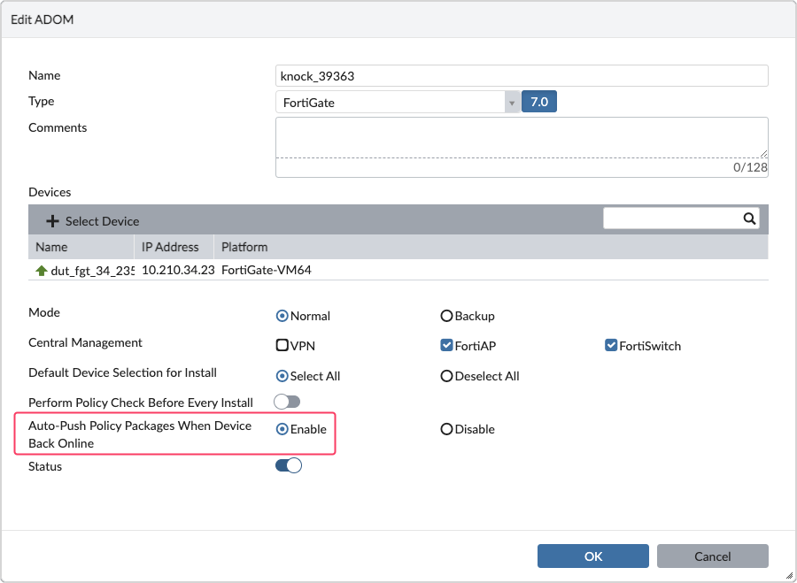
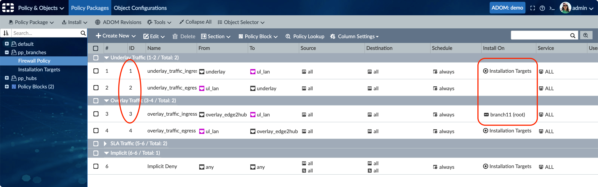

Policy Package Management
=========================

Default values
--------------

How to get the default values for a firewall policy?
++++++++++++++++++++++++++++++++++++++++++++++++++++

**REQUEST:**

.. code-block:: json

   {
     "id": 1,
     "jsonrpc": "1.0",
     "method": "get",
     "params": [
       {
         "object template": 1,
         "url": "/pm/config/adom/DB/pkg/pp.003/firewall/policy/"
       }
     ],
     "session": "HKERCCqx6ximKXlkWN7lxWIgqagVqpj0xXiJtFtYrpiLIL7X3nCuIdlnZw83N+N3JO95oUOOCIwE+emXMuLvcPvKXNHsVYSN",
     "verbose": 1
   }

Folders
-------

How to create a folder hierarchy
++++++++++++++++++++++++++++++++

**REQUEST:**

.. code-block:: json

   {
     "id": 1,
     "method": "set",
     "params": [
       {
         "data": [
           {
             "name": "folder_001",
             "subobj": [
               {
                 "name": "folder_002",
                 "subobj": [
                   {
                     "name": "folder_003",
                     "subobj": [
                       {
                         "name": "folder_004",
                         "type": "folder"
                       }
                     ],
                     "type": "folder"
                   }
                 ],
                 "type": "folder"
               }
             ],
             "type": "folder"
           }
         ],
         "url": "pm/pkg/adom/demo_001"
       }
     ],
     "session": 46811
   }

**RESPONSE:**

.. code-block:: json

   { 
     "id": 1,
     "result": [
       { 
         "status": { 
           "code": 0, 
           "message": "OK"
         }, 
         "url": "pm/pkg/adom/demo_001"
       }
     ], 
     "session": 46811
   }

How to move a folder?
+++++++++++++++++++++

**REQUEST:**

.. code-block:: json

   {
     "id": 1,
     "method": "exec",
     "params": [
       {
         "url": "/securityconsole/package/move",
         "data": {
           "adom": "demo_001",
           "pkg": "italy",
           "dst_parent": "world/emea",
           "dst_name": "italy"
         }
       }
     ],
     "session": 11111,
   }

How to delete a folder?
+++++++++++++++++++++++

**REQUEST:**

.. code-block:: json

   {
     "id": 1,
     "jsonrpc": "1.0",
     "method": "delete",
     "params": [
       {
         "url": "/pm/pkg/adom/demo/foobar"
       }
     ],
     "session": "NlLwCb+SB5wikMi1MPdTOnRtWOg6gM9z36yMMttHuWPZKoWW4Ia7/B/pGUjZMr4uZGqrw7J9aBImePfl9eZhbw==",
     "verbose": 1
   }

**RESPONSE:**

.. code-block:: json

   {
     "id": 1,
     "result": [
       {
         "status": {
           "code": 0,
           "message": "OK"
         },
         "url": "/pm/pkg/adom/demo/foobar"
       }
     ]
   }

Policy Packages
---------------

How to create a policy package?
+++++++++++++++++++++++++++++++

We create policy package ``pp.003`` in adom ``DEMO``:

**REQUEST:**

.. code-block:: shell

   {
     "id": 1,
     "jsonrpc": "1.0",
     "method": "add",
     "params": [
       {
         "data": {
           "name": "pp.003",
           "package settings": {
             "central-nat": "disable",
             "consolidated-firewall-mode": "disable",
             "fwpolicy-implicit-log": "disable",
             "fwpolicy6-implicit-log": "disable",
             "ngfw-mode": "profile-based"
           },
           "type": "pkg"
         },
         "url": "/pm/pkg/adom/DEMO"
       }
     ],
     "session": "4VUbMWg40/hOwzHt5/BRKRIbaAd0MBkTwprdFs4iG+w8QPSwyoa/MVrwHtVV7oQ463ifbp1I30eZ9FSluYtJuQ==",
     "verbose": 1
   }

**RESPONSE:**

.. code-block:: json

   {
     "id": 1,
     "result": [
       {
         "status": {
           "code": 0,
           "message": "OK"
         },
         "url": "/pm/pkg/adom/DEMO"
       }
     ]
   }

Starting with FMG 7.0.1 (Mantis #708471), the response will also contain the
``pkg oid``.

How to assign a device to a Policy Package?
+++++++++++++++++++++++++++++++++++++++++++

We want to assign device ``hub1`` to policy package ``hubs.pp`` in ADOM
``DEMO_007``.

**REQUEST:**

.. code-block:: json

   {
     "id": 1,
     "jsonrpc": "1.0",
     "method": "add",
     "params": [
       {
         "data": {
           "name": "hub1",
           "vdom": "root"
         },
         "url": "/pm/pkg/adom/DEMO_007/hubs.pp/scope member"
       }
     ],
     "session": "RNBTLp49bHV+yvRAw1FRGkvjURd7V13+GtS8Vk8KQ/VFZ4gPrIfGd4f09nrKk6ppw9QCUj1C1CbZz4d7/e7GmA==",
     "verbose": 1
   }

**RESPONSE:**

.. code-block:: json

   {
     "id": 1,
     "result": [
       {
         "status": {
           "code": 0,
           "message": "OK"
         },
         "url": "/pm/pkg/adom/DEMO_007/hubs.pp/scope member"
       }
     ]
   }

How to install a Policy Package?
++++++++++++++++++++++++++++++++

To install the ``branches`` Policy Package from ADOM ``demo``:

.. tab-set::
   
   .. tab-item:: REQUEST

      .. code-block:: json

         {
           "id": 3,
           "method": "exec",
           "params": [
             {
               "data": {
                 "adom": "demo",
                 "adom_rev_comments": "Changes from SR #01233",
                 "adom_rev_name": "ADOM Revision #01233",
                 "dev_rev_comments": "sr_01233",
                 "flags": [
                   "none"
                 ],
                 "pkg": "branches"
               },
               "url": "/securityconsole/install/package"
             }
           ],
           "session": "{{session}}"
         }

      .. note::

         - There's not ``scope`` attribute; it means that the Policy Package
           will be install against all the assigned Installation Targets

         - ``adom_rev_comments`` will be used as a comment for the created ADOM
           Revision

         - ``adom_rev_name`` will be used as the name for the created ADOM
           Revision

         - ``dev_rev_comments`` will be used as the comment for the created
           Device Revision (see section :ref:`Device revisions`)

   .. tab-item:: RESPONSE

      .. code-block:: json
      
         {
           "id": 3,
           "result": [
             {
               "data": {
                 "task": 3468
               },
               "status": {
                 "code": 0,
                 "message": "OK"
               },
               "url": "/securityconsole/install/package"
             }
           ]
         }

How to install a Policy Package against a device?
+++++++++++++++++++++++++++++++++++++++++++++++++

It is required to add the ``scope`` attribute:

**REQUEST:**

.. code-block:: json

		{
		  "id": 1,
		  "jsonrpc": "1.0",
		  "method": "exec",
		  "params": [
		    {
		      "data": {
		        "adom": "DEMO",
			      "flags": [
			        "none"
			      ],
			      "pkg": "pp.branches",
			      "scope": [
			        {
			          "name": "branch2_fgt",
			          "vdom": "root"
			        }
			      ]
		      },
		      "url": "/securityconsole/install/package"
		    }
		  ],
		  "session": "3xJ+a4TrhW5fSFSy3AQixRxRnINFsQhvOMXiSMVC1ryEMVZQ/enwiTasPzY9X1e64KT/UoTdl8lfory4wXub4A==",
		  "verbose": 1
		}

**RESPONSE:**

.. code-block:: json

		{
		  "id": 1,
		  "result": [
		    {
		      "data": {
		        "task": 536
		      },
		      "status": {
		        "code": 0,
		        "message": "OK"
		      },
		      "url": "/securityconsole/install/package"
		    }
		  ]
		}

.. note::

   - The ``scope`` attribute is a list, hence it could contains multiple
     devices or device groups.
   
   - The devices/device groups listed in the ``scope`` should belong to the
     list of assigned installation targets for this Policy Package. 
     
     The membership could be indirect or direct: 
       - Direct membership means the device listed in the ``scope`` attribute
         is also in the installation targets list of the Policy Package.
       
       - Indirect membership means the device listed in the ``scope`` attribute
         is a member of a device group or of a nested device group of a device
         group present in the installation targets list of the policy package .

         For instance, if the installation targets list of the Policy Package
         is having device group ``branches``, then you can use device
         ``branch_001`` in the ``scope`` attribute if it belongs to this device
         group or one of its nested device groups.

How to install a Policy Package against a Device Group?
++++++++++++++++++++++++++++++++++++++++++++++++++++++++

We have Policy Package ``pp_france`` in foldler ``france`` which is in turn in
folder ``emea``. 
Policy Package ``pp_france`` is having device group ``france`` and device
``test-001`` as installation targets. 
Goal is to install Policy Package ``pp_france`` against device group ``france``
only.

**REQUEST:**

.. code-block:: json

	  {
	    "id": 1,
	    "jsonrpc": "1.0",
	    "method": "exec",
	    "params": [
	      {
	        "data": {
		  "adom": "root",
		  "flags": [
		    "none"
		  ],
		  "pkg": "emea/france/pp_france",
		  "scope": [
		    {
		     "name": "france"
		    }
		  ]
	        },
		"url": "/securityconsole/install/package"
	      }
	    ],
	    "session": "Of286Bft82otZnCz6da2+FEskUyY6q4Opnyd1/nkpAoEMem7osWNVkU0XEGC24lIobP43qxJsmmnqUVGd88Cqw==",
	    "verbose": 1
	  }

**RESPONSE:**

.. code:: json

	  {
	    "id": 1,
	    "result": [
	      {
	        "data": {
		  "task": 148
		},
		"status": {
		  "code": 0,  
		  "message": "OK"
		},
		"url": "/securityconsole/install/package"
	      }
	    ]
	  }

Mantis #02764941 is stating that when the scope is just having a ``name`` attribute, it is considered a device group.

If device group ``france`` is in a device group ``emea``, we can just use the full path in the ``name`` attribute:

**REQUEST**:

.. code-block:: json
   :emphasize-lines: 15
		     
	  {
	    "id": 1,
	    "jsonrpc": "1.0",
	    "method": "exec",
	    "params": [
	      {
	        "data": {
		  "adom": "root",
		  "flags": [
		    "none"
		  ],
		  "pkg": "emea/france/pp_france",
		  "scope": [
		    {
		     "name": "emea/france"
		    }
		  ]
	        },
		"url": "/securityconsole/install/package"
	      }
	    ],
	    "session": "Of286Bft82otZnCz6da2+FEskUyY6q4Opnyd1/nkpAoEMem7osWNVkU0XEGC24lIobP43qxJsmmnqUVGd88Cqw==",
	    "verbose": 1
	  }

**RESPONSE:**

.. code:: json

	  {
	    "id": 1,
	    "result": [
	      {
	        "data": {
		  "task": 148
		},
		"status": {
		  "code": 0,  
		  "message": "OK"
		},
		"url": "/securityconsole/install/package"
	      }
	    ]
	  }

How to install a policy package located in a folder?
++++++++++++++++++++++++++++++++++++++++++++++++++++

To install policy package ``pp_corporate`` placed in folder ``/duts/emea``,
from ADOM ``adom_dut``:

**REQUEST:**

.. code-block::

   {
     "id": 1,
     "jsonrpc": "1.0",
     "method": "exec",
     "params": [
       {
         "data": {
           "adom": "adom_dut",
           "flags": [
             "none"
           ],
           "pkg": "duts/emea/pp_corporate",
           "scope": [
             {
               "name": "fgt_dut1",
               "vdom": "root"
             }
           ]
         },
         "url": "/securityconsole/install/package"
       }
     ],
     "session": "za3jFQLMS8vEoQzyoby34nnzKHz6kF7Di1DDyLEID0P2wj09hzdofc09CDocYgZCQ7wT1nlEtzRxAtykowfuEw==",
     "verbose": 1
   }

**RESPONSE:**

.. code-block::

   {
     "id": 1,
     "result": [
       {
         "data": {
           "task": 1273
         },
         "status": {
           "code": 0,
           "message": "OK"
         },
         "url": "/securityconsole/install/package"
       }
     ]
   }

How to install a policy package against a device's device db only?
++++++++++++++++++++++++++++++++++++++++++++++++++++++++++++++++++

Why would we need this?

It could be because we prefer to review definitive configuration offline,
i.e. from fortimanager database.

To achieve this, we can use the ``copy_only`` flag.
It will take pending changes from ADOM DB and will copy them in the target's
device db.

In below example we trigger the copy operation against managed device
``branch12`` considering the pending security changes from policy package
``pp_branches`` in ADOM ``demo``:

**REQUEST:**

.. code-block::

   {
     "id": 1,
     "jsonrpc": "1.0",
     "method": "exec",
     "params": [
       {
         "data": {
           "adom": "DB",
           "flags": [
             "copy_only"
           ],
           "pkg": "pp.003",
           "scope": [
             {
               "name": "branch12",
               "vdom": "root"
             }
           ]
         },
         "url": "/securityconsole/install/package"
       }
     ],
     "session": "o9m+9/oQ101vfDhLYU3WkKa1YJR6p3nA0NFVmuBKw3JxgFYtD7Y3FekxTuMNZ1TgG8gslO6g/gzZtvVIKPZQnmtQETm7OABp",
     "verbose": 1
   }

**RESPONSE:**

.. code-block::

   {
     "id": 1,
     "result": [
       {
         "data": {
           "task": 133
         },
         "status": {
           "code": 0,
           "message": "OK"
         },
         "url": "/securityconsole/install/package"
       }
     ]
   }

How to install a policy package against an offline device?
++++++++++++++++++++++++++++++++++++++++++++++++++++++++++

This is for when the ADOM is configured with *Auto-Push Policy Packages When
Device Back Online* enabled:

It's a three steps process:

#. First we need to trigger a *copy* operation

   **REQUEST:**

   .. code-block:: json

      {
        "id": 3,
        "method": "exec",
        "params": [
          {
            "data": {
              "adom": "knock_39363",
              "adom_rev_name": "dut_fgt_34_235_2022-4-6-20-2-51",
              "flags": [
                "generate_rev",
                "preview"
              ],
              "pkg": "dut_fgt_34_235",
              "scope": [
                {
                  "name": "dut_fgt_34_235",
                  "vdom": "root"
                }
              ]
            },
            "url": "/securityconsole/install/package"
          }
        ],
        "session": "2D7yrlIbNRf/1kt9B+ame4T2G/RFfW2DGboxzrV6xa50olO2utVGM0c7fQtkblrBtt57m8l3x3651mH2hiQ2eg=="
      }

   **RESPONSE:**

   .. code-block:: json

      {
        "id": 3,
        "result": [
          {
            "data": {
              "task": 148
            },
            "status": {
              "code": 0,
              "message": "OK"
            },
            "url": "/securityconsole/install/package"
          }
        ]
      }

   .. note:: 

      - Of course, we need to monitor the returned task's progress   

#. Then we commit!

   **REQUEST:**

   .. code-block:: json

      {
        "id": 4,
        "method": "exec",
        "params": [
          {
            "data": {
              "adom": "knock_39363",
              "scope": [
                {
                  "name": "dut_fgt_34_235",
                  "vdom": "root"
                }
              ]
            },
            "url": "/securityconsole/package/commit"
          }
        ],
        "session": "2D7yrlIbNRf/1kt9B+ame4T2G/RFfW2DGboxzrV6xa50olO2utVGM0c7fQtkblrBtt57m8l3x3651mH2hiQ2eg=="
      }

   **RESPONSE:**

   .. code-block:: json

      {
        "id": 4,
        "result": [
          {
            "data": {
              "task": 149
            },
            "status": {
              "code": 0,
              "message": "OK"
            },
            "url": "/securityconsole/package/commit"
          }
        ]
      }

#. Then we can cancel the install

   **REQUEST:**

   .. code-block:: json

      {
        "id": 5,
        "method": "exec",
        "params": [
          {
            "data": {
              "adom": "knock_39363"
            },
            "url": "/securityconsole/package/cancel/install"
          }
        ],
        "session": "2D7yrlIbNRf/1kt9B+ame4T2G/RFfW2DGboxzrV6xa50olO2utVGM0c7fQtkblrBtt57m8l3x3651mH2hiQ2eg=="
      }

   **RESPONSE:**

   .. code-block:: json

      {
        "id": 5,
        "result": [
          {
            "status": {
              "code": 0,
              "message": "OK"
            },
            "url": "/securityconsole/package/cancel/install"
          }
        ]
      }

Reinstall policy package
++++++++++++++++++++++++

This help when it is required to install multiple policy packages against
different devices with a single API request.

How to install multiple policy packages against multiple devices?
_________________________________________________________________

It is possible to install multiple policy packages to different devices by
using the ``reinstall`` operation.

Below example is installing policy package ``ppkg_hubs`` and ``ppkg_branches``
against devices ``fgt_00_1`` and ``fgt_01_1`` respectively (in ADOM ``demo``):

**REQUEST:**

.. code-block:: json

   {
     "id": 3,
     "method": "exec",
     "params": [
       {
         "data": {
           "adom": "demo",
           "flags": [
             "generate_rev"
           ],
           "target": [
             {
               "pkg": "ppkg_hubs",
               "scope": {
                 "name": "fgt_00_1",
                 "vdom": "root"
               }
             },
             {
               "pkg": "ppkg_branches",
               "scope": {
                 "name": "fgt_01_1",
                 "vdom": "root"
               }
             }
           ]
         },
         "url": "/securityconsole/reinstall/package"
       }
     ],
     "session": "is4k5yJ0zojKcdpHdovj/jc74ROm39WD/lN4VuxRFDGrlCJev4O8M/R2mdbj9dXoiEu30PO2FzRCc7vFL1dEDQ=="
   }

**RESPONSE:**

.. code-block:: json

   {
     "id": 3,
     "result": [
       {
         "data": {
           "task": 595
         },
         "status": {
           "code": 0,
           "message": "OK"
         },
         "url": "/securityconsole/reinstall/package"
       }
     ]
   }

If you look at the generated task, you will see that FMG will proceed with a
sequential install. Considering the above example, it will first install policy
package ``ppkg_hubs`` against device ``"fgt_00_1"`` and then will install
policy package ``ppkg_branches`` against device ``fgt_01_1``.

How to install reinstall a policy package against a device group?
_________________________________________________________________

As usual, when we consider a device group, we still have to use the ``scope``
but time by only using the ``name`` attribute.

In the following example, we install policy package ``ppkg_branches`` against
the device group ``branches``:

**REQUEST:**

.. code-block:: json
     
   {
     "method": "exec",
     "params": [
       {
         "data": {
           "adom": "{{adom}}",
           "flags": [
             "none"
           ],
           "extflags": 0,
           "target": [
             {
               "pkg": "ppkg_branches",
               "scope": [
                 {
                   "name": "branches"
                 }
               ]
             }
           ]
         },
         "url": "/securityconsole/reinstall/package"
       }
     ],
     "session": "{{session_id}}",
     "verbose": 1
   }

**RESPONSE:**

.. code-block:: json

   {
     "result": [
       {
         "data": {
           "task": 4140
         },
         "status": {
           "code": 0,
           "message": "OK"
         },
         "url": "/securityconsole/reinstall/package"
       }
     ]
   }

In this case, the FMG will proceed with a parallel policy package installation
for all the device group's members. However, should you have two or more
``target`` elements in the above API request, then like for the *How to install
multiple policy packages against multiple devices?* case seen in the previous
section, FMG will go with a sequential installation for them.

How to reinstall multiple policy packages against multiple devices in parallel?
_______________________________________________________________________________

In that case, we have to replicate the *Re-install Policy* mechanism from GUI.

It's a three steps process:

1. Trigger the reinstall in *preview* mode:

This time we use the same API request as in *How to install
multiple policy packages against multiple devices?* but we use the ``preview``
flag: 

**REQUEST:**

.. code-block:: json

   {
     "method": "exec",
     "params": [
       {
         "data": {
           "adom": "{{adom}}",
           "flags": [
             "preview"
           ],
           "extflags": 0,
           "target": [
             {
               "pkg": "ppkg_dut_fgt_1",
               "scope": [
                 {
                   "name": "dut_fgt_1",
                   "vdom": "root"
                 }
               ]
             },
             {
               "pkg": "ppkg_dut_fgt_2",
               "scope": [
                 {
                   "name": "dut_fgt_2",
                   "vdom": "root"
                 }
               ]
             }
           ]
         },
         "url": "/securityconsole/reinstall/package"
       }
     ],
     "session": "{{session_id}}",
     "verbose": 1
   }  

**RESPONSE:**

.. code-block:: json

   {
     "result": [
       {
         "data": {
           "task": 4149
         },
         "status": {
           "code": 0,
           "message": "OK"
         },
         "url": "/securityconsole/reinstall/package"
       }
     ]
   }  

1. Commit the changes against the concerned devices

**REQUEST:**

.. code-block:: json

   {
     "method": "exec",
     "params": [
       {
         "data": {
           "adom": "{{adom}}",
           "scope": [
             {
                 "name": "dut_fgt_1",
                 "vdom": "root"
             },
             {
                 "name": "dut_fgt_2",
                 "vdom": "root"
             }
           ]
         },
         "url": "/securityconsole/package/commit"
       }
     ],
     "session": "{{session_id}}",
     "verbose": 1
   }  

**RESPONSE:**

.. code-block:: json

   {
     "result": [
       {
         "data": {
           "task": 4150
         },
         "status": {
           "code": 0,
           "message": "OK"
         },
         "url": "/securityconsole/package/commit"
       }
     ]
   }  

3. Cancel the install operation

**REQUEST:**

.. code-block:: json

   {
       "id": 1, 
       "method": "exec", 
       "params": [
           { 
               "data": { 
                   "adom": "{{adom}}"
               },
               "url": "/securityconsole/package/cancel/install"
           }
       ],
       "session": "{{session_id}}"
   }

**RESPONSE:**

.. code-block:: json

   {
     "id": 1,
     "result": [
       {
         "status": {
           "code": 0,
           "message": "OK"
         },
         "url": "/securityconsole/package/cancel/install"
       }
     ]
   }

How to copy a firewall policy?
++++++++++++++++++++++++++++++

Here the word *copy* refers to the action of copying a firewall policy from ADOM
DB to Device DB.

For more information see section :ref:`How to copy objects?`

Below example shows how to copy a firewall policy from the ``dc_helsinki`` ADOM
to the ``dut_fgt_10`` managed device and its ``root`` VDOM:

.. tab-set::

   .. tab-item:: REQUEST

      .. code-block:: json

         {
           "id": 3,
           "method": "exec",
           "params": [
             {
               "data": {
                 "adom": "dc_helsinki",
                 "category": 181,
                 "override_conflict": 1,
                 "query_only": 0,
                 "scope": [
                   {
                     "name": "dut_fgt_10",
                     "vdom": "root"
                   }
                 ],
                 "src_list": [
                   {
                     "oid": 4835
                   }
                 ]
               },
               "url": "/securityconsole/install/global"
             }
           ],
           "session": "{{session}"
         }

      .. note::

         - ``181`` is the category ID for the ``firewall policy``
         - ``4835`` is the policy OID of the firewall policy we want to copy
         - We don't have to specify the policy package name, the policy OID is
           unique
         - See section :ref:`How to copy objects?`; it describes how to get
           those category ID and OID

   .. tab-item:: RESPONSE    

      .. code-block:: json

         {
           "id": 3,
           "result": [
             {
               "data": {
                 "task": 1355
               },
               "status": {
                 "code": 0,
                 "message": "OK"
               },
               "url": "/securityconsole/install/global"
             }
           ]
         }        

Scheduling operations for policy package
++++++++++++++++++++++++++++++++++++++++

How to schedule a policy package install?
_________________________________________

To schedule a policy package install for policy package ``pp_001`` from ADOM
``adom_72_001`` against two of its installation targets (``adom_72_001_dev_001``
and ``adom_72_001_dev_002``, and their respective ``root`` VDOMs):

**REQUEST:**

.. code-block:: json

   {
     "id": 3,
     "method": "add",
     "params": [
       {
         "data": {
           "adom_rev_name": "scheduled_install_pp_001",
           "datetime": "2022-10-27 23:24",
           "scope": [
             {
               "name": "adom_72_001_dev_001",
               "vdom": "root"
             },
             {
               "name": "adom_72_001_dev_002",
               "vdom": "root"
             }             
           ]
         },
         "url": "/pm/pkg/adom/adom_72_001/pp_001/schedule"
       }
     ],
     "session": "GorqROcoKWFpFT1pTDoxC1VICdiSmSxDm+nWGfs1UvBg8NsQwlSFQ0oShWHKZ0iOf1lWC172lODt0gq86lmdpA=="
   }
   
**RESPONSE:**

.. code-block:: json

   {
     "id": 3,
     "result": [
       {
         "status": {
           "code": 0,
           "message": "OK"
         },
         "url": "/pm/pkg/adom/adom_72_001/pp_001/schedule"
       }
     ]
   }

How to check for a scheduled policy package installation?
_________________________________________________________

To obtain the schedule information for policy package ``pp_001`` from ADOM
``adom_72_001``: 

**REQUEST:**

.. code-block:: json

   {
     "id": 3,
     "method": "get",
     "params": [
       {
         "fields": [
           "name",
           "schedule"
         ],
         "filter": [
           "name",
           "==",
           "pp_001"
         ],
         "option": [
           "schedule"
         ],
         "url": "/pm/pkg/adom/adom_72_001"
       }
     ],
     "session": "bN0lF16C5n3JhtmrB85zE3IZHJeazCTMs16RbfGxVO6mLnKEbBKFS53CpIbB0pe9RebYYaxP6IWDOSS4Bnx1/g=="
   }

**RESPONSE:**

.. code-block:: json

   {
     "id": 3,
     "result": [
       {
         "data": [
           {
             "name": "pp_001",
             "oid": 7131,
             "schedule": {
               "adom_rev_name": "pp_001_2022-10-23-22-56-49",
               "datetime": "2022-10-23 23:56",
               "scope": [
                 {
                   "name": "adom_72_001_dev_001",
                   "vdom": "root"
                 },
                 {
                   "name": "adom_72_001_dev_002",
                   "vdom": "root"
                 }
               ]
             }
           }
         ],
         "status": {
           "code": 0,
           "message": "OK"
         },
         "url": "/pm/pkg/adom/adom_72_001"
       }
     ]
   }

.. note:: 

   - The ``schedule`` option seems to work only for the entire
     ``pm/pkg/adom/{adom}`` table. 
   - This is why the ``filter`` has been used to limit the output to the desired
     ``pp_001`` policy package. 

How to cancel a policy package scheduled install?
_________________________________________________

To cancel the policy package scheduled install for policy package ``pp_001``
from ADOM ``adom_72_001``:

**REQUEST:**

.. code-block:: json 

   {
     "id": 3,
     "method": "delete",
     "params": [
       {
         "url": "/pm/pkg/adom/adom_72_001/pp_001/schedule"
       }
     ],
     "session": "DTepc/8+5+SD3IOwZE/1fVlMMTx1OZA227E8qL+2R+UK7+wW00aUxBQQ80Ptqnb5He5RRJYKBjam9f2SXJ6gOw=="
   }

**RESPONSE:**

.. code-block:: json

   {
     "id": 3,
     "result": [
       {
         "status": {
           "code": 0,
           "message": "OK"
         },
         "url": "/pm/pkg/adom/adom_72_001/pp_001/schedule"
       }
     ]
   }

How to get the status of all policy packages in an ADOM?
++++++++++++++++++++++++++++++++++++++++++++++++++++++++

To get policy package status for all policy package in ADOM ``TEST``:

**REQUEST:**

.. code-block:: json

		{
		  "id": 1,
		  "jsonrpc": "1.0",
		  "method": "get",
		  "params": [
		    {
		      "url": "/pm/config/adom/TEST/_package/status"
		    }
		  ],
		  "session": "zGecPX8WgrXs3Hx0gkZOW36iBAg8g+151Z64dD1q52D448Jm5pZxaSPf9fgx+BXGyYQ/8AzmRAKGgicCrzLk022CDSRIo5qL",
		  "verbose": 1
		}

**RESPONSE:**

.. code-block:: json

		{
		  "id": 1,
		  "result": [
		    {
		      "data": [
		        {
			  "dev": "fr_device_001",
			  "pkg": "emea/france/pp.fw",
			  "status": "installed",
			  "vdom": "root"
			},
			{
			  "dev": "sp_device_001",
			  "pkg": "emea/spain/pp.fw",
			  "status": "installed",
			  "vdom": "root"
			}
		      ],
		      "status": {
		        "code": 0,
			"message": "OK"
		      },
		      "url": "/pm/config/adom/TEST/_package/status"
		    }
		  ]
		}
	  
How to get the status of a specific policy package?
+++++++++++++++++++++++++++++++++++++++++++++++++++

To get the policy package status of policy package ``pp.fw`` placed in policy
package folder ``emea/spain`` in ADOM ``TEST``:

**REQUEST:**

.. code-block:: json
		
		{
		  "id": 1,
		  "jsonrpc": "1.0",
		  "method": "get",
		  "params": [
		    {
		      "url": "/pm/config/adom/TEST/pkg/emea/spain/pp.fw/_package/status"
		    }
		  ],
		  "session": "aHWQmCRzK68XQoEu/7kBNI4Sn3jfqtSkItg0h8ysZwUCg58bpMYwDnNZe6rDSNcYg1as84XmyRb0+5B+9CcFgtxnFBsR9Em0",
		  "verbose": 1
		}

**RESPONSE:**

.. code-block:: json

   {
     "id": 1,
     "result": [
       {
         "data": [
           {
             "dev": "sp_device_001",
             "pkg": "emea/spain/pp.fw",
             "status": "installed",
             "vdom": "root"
           }
         ],
         "status": {
           "code": 0,
           "message": "OK"
         },
         "url": "/pm/config/adom/TEST/pkg/emea/spain/pp.fw/_package/status"
       }
     ]
   }

How to figure out whether interface pair view are supported by a type of policies?
++++++++++++++++++++++++++++++++++++++++++++++++++++++++++++++++++++++++++++++++++

Caught in Mantis #0601320.

For instance, if one of the policy is having source or destination
interface set to ``any``, section view mode isn't supported.

**REQUEST:**

.. code-block:: json

		{
		  "id": 1,
		  "jsonrpc": "1.0",
		  "method": "get",
		  "params": [
		    {
		      "fields": [
		        "srcintf",
			"dstintf"
		      ],
		      "url": "/pm/config/adom/TEST/pkg/emea/spain/pp.fw/_query/interface_pair_view/firewall/policy"
		    }
		  ],
		  "session": "JDr9djBNCnlYSOnS3dc/SmaReOUbJtwseckMQnIPkL6BvVdb+8rJnO3vxnSED/Xa27E2Xki8jr/k3JYh4FCpIYSY5/0JIjvF",
		  "verbose": 1
		}

**RESPONSE:**

.. code-block:: json

		{
		  "id": 1,
		  "result": [
		    {
		      "interface_pair_view": 1,
		      "status": {
		        "code": 0,
			"message": "OK"
		      },
		      "url": "/pm/config/adom/TEST/pkg/emea/spain/pp.fw/_query/interface_pair_view/firewall/policy"
		    }
		  ]
		}

Returned attribute ``interface_pair_view`` is ``1`` meaning we can use
the interface pair view mode in the mentioned policy package.

Other URL are possibles:

.. code-block::

   /pm/config/adom/TEST/pkg/<pkg>/_query/interface_pair_view/firewall/proxy-policy
   /pm/config/adom/TEST/pkg/<pkg>/_query/interface_pair_view/firewall/security-policy

  .. note::

     For policies in policy package block, while the URL is:

     .. code-block::

	/pm/config/adom/<adom>/pblock/<pblock>/firewall/policy

     in order to get the interface pair view feasability, we need to
     use this URL:

     .. code-block::

	/pm/config/adom/<adom>/pkg/Policy Blocks/<pblock>/_query/interface_pair_view/firewall/policy

How to clone a Policy Package?
++++++++++++++++++++++++++++++

**REQUEST:**

.. code-block:: json

                {
                  "id": 1,
                  "result": [
                    {
                      "data": {
                        "task": 62
                      },                
                      "status": {
                        "code": 0,
                        "message": "OK"
                      },
                      "url": "/securityconsole/package/clone"
                    }
                  ]
                }

**RESPONSE:**

.. code-block:: json

                {
                  "id": 1,
                  "result": [
                    {
                      "data": {
                        "task": 62
                      },
                      "status": {
                        "code": 0,
                        "message": "OK"
                      },
                      "url": "/securityconsole/package/clone"
                    }
                  ]
                }

How to trigger an install preview?
++++++++++++++++++++++++++++++++++

When you install a policy package, the FortiManager UI lets you select an
*Install Preview* action in order to review the CLI that will be pushed down to
the managed devices.

We explain here how to operate this *Install Preview* action by using the API.

It's a four steps process:

1. We have to start a policy package install process in preview mode
2. We have to ask for the preview generation
3. We need to collect the preview output
4. We need to cancel the install policy package process

5. We have to start a policy package install process in preview mode

**REQUEST:**

.. code-block:: json

                {
                  "id": 1,
                  "jsonrpc": "1.0",
                  "method": "exec",
                  "params": [
                    {
                      "data": {
                        "adom": "customer_001",
                        "adom_rev_comments": "Test [1]",
                        "adom_rev_name": "Revision [1]",
                        "flags": [
                          "preview"
                        ],
                        "pkg": "pp.dut_fgt2",
                        "scope": [
                          {
                            "name": "dut_fgt2",
                            "vdom": "root"
                          }
                        ]
                      },
                      "url": "/securityconsole/install/package"
                    }
                  ],
                  "session": "TFWLZCzMyiukI25p2kEmmrv7TO9wHkLHWph8rouoG1TCYeojlUx6OVXqn0wyZ1mymYdRfH2n7JvNEJWONzm1Jg==",
                  "verbose": 1
                }

**RESPONSE:**

.. code-block:: json

                {
                  "id": 1,
                  "result": [
                    {                
                      "data": {
                        "task": 69
                      },
                      "status": {
                        "code": 0,
                        "message": "OK"
                      },
                      "url": "/securityconsole/install/package"
                    }
                  ]
                }

Here you have to track the progress of the returned task id ``69`` (you can *get
/task/task/69*)

Once the task is completed, you can proceed with step 2.

2. We have to ask for the preview generation

**REQUEST:**

.. code-block:: json 

                {
                  "id": 1,
                  "jsonrpc": "1.0",
                  "method": "exec",
                  "params": [
                    {
                      "data": {
                        "adom": "customer_001",
                        "device": "dut_fgt2",
                        "flags": [
                          "none"
                        ],
                        "vdoms": [
                          "root"
                        ]
                      },
                      "url": "/securityconsole/install/preview"
                    }
                  ],
                  "session": "6a5HWsj6o0L5da8oTZB26wapTtrMlsQxmNt24mWeL/80VRqy5OdbM6kntlkrX7L3rsw9rbRK1rqZvLlfXTCIKw==",
                  "verbose": 1
                }

.. note::

   Attribute ``flags`` could be ``none`` or ``json``.
   It determines the nature of the output produced in the preview report: CLI
   based when it is ``none`` and obviously JSON based when it is ``json``.

   There is a bug (Mantis #0713778) where using:
   
   .. code-block::

      "flags": "json"

   or:

   .. code-block::

      "flags": ["json"]

   doesn't work: the preview report is still CLI based.

   The solution is to use this form:

   .. code-block::

      "flags": 1

**RESPONSE:**

.. code-block:: json 

                {
                  "id": 1,
                  "result": [
                    {
                      "data": {
                        "task": 70
                      },
                      "status": {
                        "code": 0,
                        "message": "OK"
                      },
                      "url": "/securityconsole/install/preview"
                    }
                  ]
                }

Here you have to track the progress of the returned task id ``70`` (you can *get
/task/task/70*)

Once the task is completed, you can proceed with step 3.

3. We need to collect the preview output

**REQUEST:**

.. code-block:: json
                
                {
                  "id": 1,
                  "jsonrpc": "1.0",
                  "method": "exec",
                  "params": [
                    {
                      "data": {
                        "adom": "customer_001",
                        "device": "dut_fgt2"
                      },
                      "url": "/securityconsole/preview/result"
                    }
                  ],
                  "session": "6a5HWsj6o0L5da8oTZB26wapTtrMlsQxmNt24mWeL/80VRqy5OdbM6kntlkrX7L3rsw9rbRK1rqZvLlfXTCIKw==",
                  "verbose": 1
                }

**RESPONSE:**

.. code-block:: json

                {
                  "id": 1,
                  "result": [                
                    {
                      "data": {                
                        "message": "config system dns\n    set primary 8.8.8.8\n    unset secondary\nend\nconfig firewall address\n    edit \"host_001\"\n        set uuid 09ce3330-b06e-51ea-6497-48f76b1e8626\n        set color 3\n        set subnet 10.0.0.1 255.255.255.255\n    next\nend\nconfig system dhcp server\n    edit 1\n        set status disable\n        set dns-service default\n        set ntp-service default\n        set default-gateway 172.16.2.102\n        set netmask 255.255.255.0\n        set interface \"port3\"\n        config ip-range\n            edit 1\n                set start-ip 172.16.2.1\n                set end-ip 172.16.2.101\n            next\n            edit 2\n                set start-ip 172.16.2.103\n                set end-ip 172.16.2.254\n            next\n        end\n        set timezone-option default\n    next\nend\nconfig firewall policy\n    edit 1\n        set srcaddr \"host_001\"\n    next\nend\n"
                      },
                      "status": {
                        "code": 0,
                        "message": "OK"
                      },
                      "url": "/securityconsole/preview/result"
                    }
                  ]
                }

.. note::

   Here FortiManager will report pending changes coming from ADOM DB (objects &
   policies) but also from Device DB (when you trigger an install preview for a
   device only, it will only expose the pending changes coming from the
   corresponding device's Device DB.

4. We need to cancel the install policy package process

**REQUEST:**

.. code-block:: json

                {
                  "id": 1,
                  "jsonrpc": "1.0",
                  "method": "exec",
                  "params": [
                    {
                      "data": {
                        "adom": "customer_001"
                      },
                      "url": "/securityconsole/package/cancel/install"
                    }
                  ],
                  "session": "6a5HWsj6o0L5da8oTZB26wapTtrMlsQxmNt24mWeL/80VRqy5OdbM6kntlkrX7L3rsw9rbRK1rqZvLlfXTCIKw==",
                  "verbose": 1
                }

**RESPONSE:**

.. code-block:: json

                {
                  "id": 1,
                  "result": [
                    {
                      "status": {
                        "code": 0,
                        "message": "OK"
                      },
                      "url": "/securityconsole/package/cancel/install"
                    }
                  ]
                }

How to get the Policy Package hitcount?
+++++++++++++++++++++++++++++++++++++++

Caught in Mantis #0673650 (and applicable to FMG 6.4.7+ and FMG 7.0.3+).

*Hitcount* refers to the set of attributes linked to a firewall policy that 
maintain several utilization information like the Last Used, First Use, Packets, Bytes, etc. as shown below:

.. thumbnail:: images/image_004.png

Getting the hitcount details is an *on demand* action that requires two steps.

For instance, to get the policy hitcount for firewall policies in the
``ppkg_001`` Policy Package of the ``demo`` ADOM:

- **Step #1: Trigger the hitcount refresh**

  .. tab-set:: 
     
     .. tab-item:: REQUEST
  
      .. code-block:: json
      
         {
           "id": 1,
           "method": "exec",
           "params": [
             {
               "data": {
                 "adom": "demo",
                 "pkg": "ppkg_001"
               },
               "url": "/sys/hitcount"
             }
           ],
           "session": "{{session}}",
         }
  
     .. tab-item:: RESPONSE
  
      .. code-block:: json
  
         {
           "id": 1,
           "result": [
             {
               "status": {
                 "code": 0,
                 "message": "OK"
               },
               "taskid": 217,
               "url": "/sys/hitcount"
             }
           ]
         }

      .. note::

         - You need to remember the returned ``taskid`` value for the next
           step 

- **Step #2 - Collect the result**

  .. tab-set::
    
     .. tab-item:: REQUEST

        .. code-block:: json

           {
             "id": 4,
             "method": "exec",
             "params": [
               {
                 "data": {
                   "taskid": 217
                 },
                 "url": "/sys/task/result"
               }
             ],
             "session": "{{session}}"
           }

     .. tab-item:: RESPONSE

        .. code-block:: json

           {
             "id": 4,
             "result": [
               {
                 "data": {
                   "firewall policy": [
                     {
                       "byte": 2266808,
                       "dstintf": "any",
                       "first_hit": 1702099572,
                       "first_session": 0,
                       "hitcount": 6911,
                       "last_hit": 1702145401,
                       "last_session": 0,
                       "name": "Implicit Deny",
                       "pkts": 6911,
                       "policyid": 0,
                       "sesscount": 0,
                       "srcintf": "any"
                     },
                     {
                       "byte": 198373,
                       "dstintf": "WAN1",
                       "first_hit": 1701085009,
                       "first_session": 1701085009,
                       "hitcount": 380,
                       "last_hit": 1702981443,
                       "last_session": 1702981443,
                       "name": "Generic_Internet",
                       "pkts": 1534,
                       "policyid": 2,
                       "sesscount": 0,
                       "srcintf": "vl_lan",
                       "uuid": "2654008a-896d-51ee-e595-b22bf9abffc0"
                     },
                     {
                       "byte": 0,
                       "dstintf": "HUB1",
                       "first_hit": 0,
                       "first_session": 0,
                       "hitcount": 0,
                       "last_hit": 0,
                       "last_session": 0,
                       "name": "Health Check Access",
                       "pkts": 0,
                       "policyid": 1071741826,
                       "sesscount": 0,
                       "srcintf": "Branch-Lo",
                       "uuid": "9ac943e0-7d1e-51ee-42fb-fe716908a3d9"
                     }
                   ],
                   "firewall policy6": [],
                   "firewall proxy-policy": [
                     {
                       "byte": 0,
                       "dstintf": "any",
                       "first_hit": 0,
                       "first_session": 0,
                       "hitcount": 0,
                       "last_hit": 0,
                       "last_session": 0,
                       "name": "Implicit Deny",
                       "pkts": 0,
                       "policyid": 0,
                       "sesscount": 0,
                       "srcintf": "any"
                     }
                   ],
                   "firewall security-policy": [],
                   "global footer policy": [],
                   "global header policy": []
                 },
                 "status": {
                   "code": 0,
                   "message": "OK"
                 },
                 "taskid": 541,
                 "url": "/sys/task/result"
               }
             ]
           }

Starting with FortiManager 7.4.1, the Last Used (i.e, ``_last_hit`` attribute) 
can be maintained as it is in FortiManager side, even if it gets reset on the
FortiGate side (caught in Mantis #0910402).

It's configurable with the following FortiManager CLI:

.. code-block:: text

   config system global
       set save-last-hit-in-adomdb enable
   end

.. note:: 

   - Default value for ``save-last-hit-in-adomdb`` is ``disable``

Furthermore, the ``_last_hit`` attribute can be retrieved by getting the
firewall policies.

For instance, to get the ``last_hit`` attribute for firewall policies in the ``sites_BRANCH_PPKG`` Policy Package from the ``production`` ADOM:

.. tab-set:: 
  
   .. tab-item:: REQUEST

      .. code-block:: json

         {
           "id": 3,
           "method": "get",
           "params": [
             {
               "fields": [
                 "name",
                 "policyid",
                 "_last_hit"
               ],
               "loadsub": 0,
               "url": "/pm/config/adom/production/pkg/sites_BRANCH_PPKG/firewall/policy"
             }
           ],
           "session": "{{session}}",
           "verbose": 1
         }        

   .. tab-item:: RESPONSE

      .. code-block:: json

         {
           "id": 3,
           "result": [
             {
               "data": [
                 {
                   "_last_hit": 0,
                   "obj seq": 1,
                   "oid": 5460,
                   "policyid": 1
                 },
                 {
                   "_last_hit": 1705003857,
                   "name": "Generic_Internet",
                   "obj seq": 2,
                   "oid": 5784,
                   "policyid": 2
                 }
               ],
               "status": {
                 "code": 0,
                 "message": "OK"
               },
               "url": "/pm/config/adom/production/pkg/sites_BRANCH_PPKG/firewall/policy"
             }
           ]
         } 

      .. note::

         - The ``_last_hit`` is returned in epoch format       

However, to get an up to date *Last Used* information, you still have to trigger a hitcount refresh by using the ``/sys/hitcount`` |json_rpc_u| described above.

How to get the policy package checksum?
+++++++++++++++++++++++++++++++++++++++

Idea is to be able to detect whether a policy package has been modified or not.

The good news, is that there's nothing special to do.
It is just enough to get the policy package and look at the returned ``obj
ver`` attribute:

**REQUEST:**

.. code-block:: json
 
   {
     "id": 1,
     "method": "get",
     "params": [
       {
         "url": "pm/pkg/adom/CUSTOMER_001/FGT60D-001"
       }
     ],
     "session": "6iOnXClkXrGNFaLSHv3P18vdC0K3detcN+CAfvcwPRJjd0i54+WYRimlIclzP1i4W+/KZAvg16NGDoOT3Z7gmg==",
     "verbose": 1
   }
 
**RESPONSE:**

.. code-block:: json

   {
     "id": 1,
     "result": [ 
       {
         "data": {
           "name": "FGT60D-001",
           "obj ver": 4,
           "oid": 955,
           "type": "pkg"
         },
         "status": {
           "code": 0,
           "message": "OK"
         },
         "url": "pm/pkg/adom/CUSTOMER_001/FGT60D-001"
       }
     ] 
   }
 
We can also use the option ``chksum`` as documented in section *Option chksum*.

With FMG 5.6.0-INTERIM build 1510, we can also retrieve a checksum value using
following request: 

**REQUEST:**

.. code-block:: json

   {
     "id": 1,
     "method": "get",
     "params": [
       {
         "url": "pm/config/adom/CM-LAB-001/pkg/PP_EXAMPLE/policy/package/settings"
       } 
     ],
     "session": "5jZjkRrZBtpgEDR1G9RiPBKjEiNG/9+zwKZNnzFsvfsbSAie70YEA4ilLhabdGrVLqXvpUGyDdeuv7iV4+SgsA==",
     "verbose": 1
   }
 
**RESPONSE:**

.. code-block:: json

   {
     "id": 1,
     "result": [
       {
         "data": {
           "central-nat": "disable",
           "checksum": "1494203765-161359940",
           "fwpolicy-implicit-log": "disable",
           "fwpolicy6-implicit-log": "disable"
         },
         "status": {
           "code": 0,
           "message": "OK"
         },
         "url": "pm/config/adom/CM-LAB-001/pkg/PP_EXAMPLE/policy/package/settings"
       }
     ]
   }

Policy Package Blocks
---------------------

How to create a Policy Package block?
+++++++++++++++++++++++++++++++++++++

**REQUEST:**

.. code-block:: json

		{
		  "id": 1,
		  "jsonrpc": "1.0",
		  "method": "add",
		  "params": [
		    {
		      "data": {
		        "name": "ppb_002",
			        "package settings": {
			          "central-nat": "disable",
			          "consolidated-firewall-mode": "disable",
			          "fwpolicy-implicit-log": "disable",
			          "fwpolicy6-implicit-log": "disable",
			          "ngfw-mode": "profile-based"
			        },
			      "type": "pkg"
		      },
		      "url": "/pm/pblock/adom/DEMO_014/"
		    }
		  ],
		  "session": "L2yCbw1c1T5O74gTgFqMlhV6UODwmingu/CagxiW1oBofqVRAsxFRqBTJvH1pC5ZNIPBVBmhjSUVx/7X6vzo8A==",
		  "verbose": 1
		}
		
**RESPONSE:**

.. code-block:: json

   {
	   "id": 1,
		 "result": [
		   {
		     "status": {
		       "code": 0,
		       "message": "OK"
		     },
		     "url": "/pm/pblock/adom/DEMO_014/"
		   }
		 ]
	 }

How to add a policy in a policy package block?
++++++++++++++++++++++++++++++++++++++++++++++

**REQUEST:**

.. code-block:: json

		{
		  "id": 1,
		  "jsonrpc": "1.0",
		  "method": "add",
		  "params": [
		    {
		      "data": {
		        "action": "accept",
			"dstaddr": [
			  "all"
			],
			"dstintf": [
			  "any"
			],
			"logtraffic": "utm",
			"logtraffic-start": "disable",
			"name": "Policy_002",
			"schedule": [
			  "always"
			],
			"service": [
			  "ALL"
			],
			"srcaddr": [
			  "all"
			],
			"srcintf": [
			  "any"
			]
		      },
		      "url": "/pm/config/adom/DEMO_014/pblock/ppb_001/firewall/policy"
		    }
		  ],
		  "session": "0ZY5z0s/JngkUaryMxPtobzfWQwDekg5dW2E04a1oib0bOxmYoqsev/QRq1wn/K1XG2Fl2yeXim+UF2C3pCq6w==",
		  "verbose": 1
		}

**RESPONSE:**

.. code-block:: json

		{
		  "id": 1,
		  "result": [
		    {
		      "data": {
		        "policyid": 1071741828
		      },
		      "status": {
		        "code": 0,
			"message": "OK"
		      },
		      "url": "/pm/config/adom/DEMO_014/pblock/ppb_001/firewall/policy"
		    }
		  ]
		}

How to insert a policy block in a policy package?
+++++++++++++++++++++++++++++++++++++++++++++++++

The following request, insert policy block ``ppb_001`` above policy id
2 of policy package ``pp.device1``:

**REQUEST**:

.. code-block:: json

		{
		  "id": "0134510c-7ca2-403b-8178-8a88ece59b89",
		  "method": "add",
		  "params": [
		    {
		      "before": "2",
		      "data": {
		        "_policy_block": "ppb_001"
		      },
		      "url": "/pm/config/adom/DEMO_014/pkg/pp.device1/firewall/policy"
		    }
		  ],
		  "session": 49476
		}

How to where used a Policy Block?
+++++++++++++++++++++++++++++++++

This is for when you want to get the list of Policy Packages (and relative ``policyid`` the Policy Packages' firewall policies) referencing the given
Policy Block.

For instance, to where used the ``sites_HBLK`` Policy Block from the ``dc_emea``
ADOM:

.. tab-set:: 

   .. tab-item:: REQUEST

      .. code-block:: json

         {
           "id": 3,
           "method": "get",
           "params": [
             {
               "option": [
                 "where_used"
               ],
               "url": "/pm/pblock/adom/dc_emea/sites_HBLK"
             }
           ],
           "session": "{{session}}"
         }

   .. tab-item:: RESPONSE

      .. code-block:: json         
         
         {
           "id": 3,
           "result": [
             {
               "data": {
                 "name": "sites_HBLK",
                 "oid": 5276,
                 "package settings": {
                   "central-nat": 0,
                   "consolidated-firewall-mode": 0,
                   "fwpolicy-implicit-log": 0,
                   "fwpolicy6-implicit-log": 0,
                   "hitc-taskid": 0,
                   "hitc-timestamp": 0,
                   "ngfw-mode": 0,
                   "policy-offload-level": 0
                 },
                 "type": "pblock",
                 "where_used": [
                   {
                     "data": [
                       {
                         "category": 181,
                         "mapping_name": "firewall policy",
                         "mattr": "policyid",
                         "mkey": "110",
                         "pkg": {
                           "name": "ppkg_001",
                           "oid": 6079
                         }
                       },
                       {
                         "category": 181,
                         "mapping_name": "firewall policy",
                         "mattr": "policyid",
                         "mkey": "3",
                         "pkg": {
                           "name": "ppkg_002",
                           "oid": 6181
                         }
                       }
                     ],
                     "root": {
                       "name": "dc_emea",
                       "oid": 165
                     }
                   }
                 ]
               },
               "status": {
                 "code": 0,
                 "message": "OK"
               },
               "url": "/pm/pblock/adom/dc_emea/sites_HBLK"
             }
           ]
         }
		  
      .. note::

         - The response indicates that the `sites_HBLK` Policy Block is used in
           the ``ppkg_001`` and ``ppkg_002`` Policy Packages 
         - The relative ``policyid`` is given by the ``mkey`` attribute
         - It is ``110`` in the ``ppkg_001`` Policy Package and ``3`` in the
           ``ppkg_002`` Policy Package
         - It means that next firewall policy that will get created in the
           ``ppkg_001`` and ``ppkg_002`` Policy Packages will be ``111`` and
           ``4`` respectively

Policies
--------

How to add a firewall policy?
+++++++++++++++++++++++++++++

**REQUEST:**

.. code-block:: json

   {
     "id": 3,
     "method": "add",
     "params": [
       {
         "data": {
           "action": "accept",
           "dstaddr": [
             "host_001",
             "host_002"
           ],
           "dstintf": [
             "internal1",
             "internal2"
           ],
           "logtraffic": "all",
           "schedule": "always",
           "service": [
             "FTP",
             "HTTPS"
           ],
           "srcaddr": [
             "host_003",
             "host_004"
           ],
           "srcintf": [
             "internal3",
             "internal4"
           ],
           "status": "enable"
         },
         "url": "/pm/config/adom/dc_amer/pkg/dut_fgt_02/firewall/policy"
       }
     ],
     "session": "Q0XfVV3dc2iqsU6nj/1dVX7vRxW+w8V9Jj6iCMCV9bLQxDJVv2Gug1MWcnuzMVX4X+Y1o7nDYAoFh5mZ1xHiXw=="
   }

**RESPONSE:**

.. code-block:: json

   {
     "id": 3,
     "result": [
       {
         "data": {
           "policyid": 2
         },
         "status": {
           "code": 0,
           "message": "OK"
         },
         "url": "/pm/config/adom/dc_amer/pkg/dut_fgt_02/firewall/policy"
       }
     ]
   }

.. note::

   - FortiManager returns the ``policyid`` of the created policy.
   - If a specific ``policyid`` is required, and provided it isn't already used,
     you can specify it in the JSON RPC body:

     **REQUEST:**

     .. code-block:: json

        {
          "id": 3,
          "method": "add",
          "params": [
            {
              "data": {
                "action": "accept",
                "dstaddr": [
                  "host_001",
                  "host_002"
                ],
                "dstintf": [
                  "internal1",
                  "internal2"
                ],
                "logtraffic": "all",
                "policyid": 10,
                "schedule": "always",
                "service": [
                  "FTP",
                  "HTTPS"
                ],
                "srcaddr": [
                  "host_003",
                  "host_004"
                ],
                "srcintf": [
                  "internal3",
                  "internal4"
                ],
                "status": "enable"
              },
              "url": "/pm/config/adom/dc_amer/pkg/dut_fgt_02/firewall/policy"
            }
          ],
          "session": "XmqiDybPpUMVcdtJaL1RgmRx0YCPLI6UAVdUBXUzF+GUlKMDza31nydZoJCUnkjFLUEfWpgoh4vZ5qZfljUZHw=="
        }

     **RESPONSE:**

     .. code-block:: json

        {
          "id": 3,
          "result": [
            {
              "data": {
                "policyid": 10
              },
              "status": {
                "code": 0,
                "message": "OK"
              },
              "url": "/pm/config/adom/dc_amer/pkg/dut_fgt_02/firewall/policy"
            }
          ]
        }

How to update a firewall policy?
++++++++++++++++++++++++++++++++

Update elements of an existing firewall policy
______________________________________________

You just need to specify in the JSON RPC body the elements you want to update:

**REQUEST:**

.. code-block:: json

   {
     "id": 3,
     "method": "update",
     "params": [
       {
         "data": {
           "ips-sensor": "default",
           "name": "Project_XXX_Traffic",
           "nat": "enable",
           "utm-status": "enable"
         },
         "url": "/pm/config/adom/dc_amer/pkg/dut_fgt_02/firewall/policy/10"
       }
     ],
     "session": "EnRb2hecAsLL/i6DwUZ0WpibwI5a4KC58vm7ta1IivNT4Gwjqhp5sXUG+3YmdwIvnTlkdltTtHYzxSrOBbTcxg=="
   }

**RESPONSE:**

.. code-block:: json

   {
     "id": 3,
     "result": [
       {
         "data": {
           "policyid": 10
         },
         "status": {
           "code": 0,
           "message": "OK"
         },
         "url": "/pm/config/adom/dc_amer/pkg/dut_fgt_02/firewall/policy/10"
       }
     ]
   }

How to update a specific field without overwriting it?
______________________________________________________

The goal is just to add new ``srcaddr`` elements of a specific policy without
overwriting the existing ones.

For instance, if ``srcaddr`` is set with:

.. code-block:: json
  
   [
     "host_001",
     "host_002"
   ]

then after this API request, it will be with:

.. code-block:: json

   [
    "host_001",
    "host_002",
    "host_005",
    "host_006"
   ]

**REQUEST:**

.. code-block:: json

   {
     "id": 3,
     "method": "add",
     "params": [
       {
         "data": [
           "host_005",
           "host_006"
         ],
         "url": "/pm/config/adom/dc_amer/pkg/dut_fgt_02/firewall/policy/10/srcaddr"
       }
     ],
     "session": "RI6Bcs0YtRnh8dJoVsNqmV4A8+CNQZEyFIO5bZafv8xWMykF6ySvFSoitQld49G1bG3Sfug6h1LKmdR/1jt3uw=="
   }
   
**RESPONSE:**

.. code-block:: json

   {
     "id": 3,
     "result": [
       {
         "status": {
           "code": 0,
           "message": "OK"
         },
         "url": "/pm/config/adom/dc_amer/pkg/dut_fgt_02/firewall/policy/10/srcaddr"
       }
     ]
   }

How to move a firewall policy?
++++++++++++++++++++++++++++++

Considering we know the ``policyid`` of the source policy and the ``policyid``
of the destination policy (i.e., the destination location), we can use the ``move``
operation.

This request is moving ``policyid`` ``3`` after ``policyid`` ``4`` (for policy
package ``pp.003`` of ADOM ``demo``):

**REQUEST:**

.. code-block:: json

   {
     "id": 1,
     "jsonrpc": "1.0",
     "method": "move",
     "params": [
       {
         "option": "after",
         "target": "4",
         "url": "/pm/config/adom/demo/pkg/pp.003/firewall/policy/3"
       }
     ],
     "session": "tAgknLN52psfVRRYxPcGgWM45/i1OkEQ8bcnBc2LMyNThEmZfqY6h2C5h0IqDsEMX5p3+wjoKuRdodehh10zLUw+iEXyxwio",
     "verbose": 1
   }

**RESPONSE:**

.. code-block:: json

   {
     "id": 1,
     "result": [
       {
         "data": {
           "policyid": 3
         },
         "status": {
           "code": 0,
           "message": "OK"
         },
         "url": "/pm/config/adom//pkg/pp.003/firewall/policy/3"
       }
     ]
   }

How to insert a policy?
+++++++++++++++++++++++

Three options are available:

- Use the ``add`` and ``move`` operations

  1. You add a policy, it gets automatically placed at the last position
  2. You move the policy to the desired location

- Using the ``object position`` attribute to specify the desired location

- Using the ``before`` and ``after`` attributes

Those three alternatives are described below.

Use the ``add`` and ``move`` operations
_______________________________________

- To add a new firewall policy, please review :ref:`How to add a firewall 
  policy?`
- To move a firewall policy, please review: :ref:`How to move a firewall
  policy?`

Use the ``object position`` attribute
______________________________________

Caught in Mantis #0306003.

To insert a new firewall policy after the firewall policy with ``policyid`` 
``13`` in the ``pp.001`` Policy Package from the ``DEMO`` ADOM:

.. tab-set:: 

   .. tab-item:: REQUEST

      .. code-block:: json
      
         {
           "id": 1,
           "method": "add",
           "params": [
             {
               "data": {
                 "action": "accept",
                 "dstaddr": [
                   "host_001"
                 ],
                 "dstintf": [
                   "ul_isp1"
                 ],
                 "logtraffic": "all",
                 "name": "This is a test!",
                 "object position": [
                   "after",
                   "13"
                 ],
                 "schedule": [
                   "always"
                 ],
                 "service": [
                   "FTP"
                 ],
                 "srcaddr": [
                   "host_002"
                 ],
                 "srcintf": [
                   "lan"
                 ]
               },
               "url": "/pm/config/adom/DEMO/pkg/pp.001/firewall/policy"
             }
           ],
           "session": "{{session}}"
         }

   .. tab-item:: RESPONSE

      .. code-block:: json

         {
           "id": 1,
           "result": [
             {
               "data": {
                 "policyid": 51
               },
               "status": {
                 "code": 0,
                 "message": "OK"
               },
               "url": "/pm/config/adom/DEMO/pkg/pp.001/firewall/policy"
             }
           ]
         }

      .. note::

         - ``policyid`` ``51``  is the policy id of the newly created   
           firewall policy

Using the ``before`` and ``after`` attributes
_____________________________________________

A new way of placing a new firewall policy has been observed.

It consists in adding attribute ``before`` or ``after`` placed outside of the 
``data`` block.

To insert a new firewall policy before the firewall policy with ``policyid`` 
``3`` in the ``pp.001`` Policy Package from the ``DEMO`` ADOM:

.. tab-set:: 

   .. tab-item:: REQUEST

      .. code-block:: json

         {
           "id": 1,
           "method": "add",
           "params": [
             {
               "before": "3",
               "data": {
                 "action": "accept",
                 "dstaddr": [
                   "all"
                 ],
                 "dstintf": [
                   "dmz"
                 ],
                 "ips-sensor": "all_default",
                 "logtraffic": "all",
                 "name": "Test_001",
                 "profile-protocol-options": [
                   "default"
                 ],
                 "schedule": [
                   "always"
                 ],
                 "service": [
                   "ALL"
                 ],
                 "srcaddr": [
                   "all"
                 ],
                 "srcintf": [
                   "wan"
                 ],
                 "ssl-ssh-profile": [
                   "no-inspection"
                 ],
                 "utm-status": "enable"
               },
               "url": "/pm/config/adom/DEMO/pkg/pp.001/firewall/policy"
             }
           ],
           "session": "{{session}}"
         }

   .. tab-item:: REQUEST

      .. code-block:: json
      
         {
           "id": 1,
           "result": [
             {
               "data": {
                 "policyid": 52
               },
               "status": {
                 "code": 0,
                 "message": "OK"
               },
               "url": "/pm/config/adom/DEMO/pkg/pp.001/firewall/policy"
             }
           ]
         }

      .. note::

         - ``policyid`` ``52``  is the policy id of the newly created firewall
           policy

How to clone a policy?
++++++++++++++++++++++

Cloning a policy doesn't require to specify the destination
``policyid`` since it is auto-generated.

**REQUEST:**

.. code-block:: json

		{
		  "id": 1,
		  "jsonrpc": "1.0",
		  "method": "clone",
		  "params": [
		    {
		      "url": "/pm/config/adom/DEMO_013/pkg/pp.hub1/firewall/policy/1"
		    }
		  ],
		  "session": "ngFWU2SEY8rBX368VnxURvNKOfncqe7i5GWjOomUkeNrZPzBs/rhclDiyvNL825baHw+Sjq3z0YmV01imbg16Q==",
		  "verbose": 1
		}

**RESPONSE:**

.. code-block:: json

		{
		  "id": 1,
		  "result": [
		    {
		      "data": {
		        "policyid": 4
		      },
		      "status": {
		        "code": 0,
			"message": "OK"
		      },
		      "url": "/pm/config/adom/DEMO_013/pkg/pp.hub1/firewall/policy/1"
		    }
		  ]
		}

But we can also force a specific ``policyid`` if required:

**REQUEST:**

.. code-block:: json

		{
		  "id": 1,
		  "jsonrpc": "1.0",
		  "method": "clone",
		  "params": [
		    {
		      "data": {
		        "policyid": 111
		      },
		      "url": "/pm/config/adom/DEMO_013/pkg/pp.hub1/firewall/policy/1"
		    }
		  ],
		  "session": "LmM3A03tHkgNxRJiSRxCMCrcqzZCBZYJKiZRfJDlJ1d5JTk3hrIlLqZITXTdAwJX4yToHOQ0NRojwHP6DEZX0Q==",
		  "verbose": 1
		}

**RESPONSE:**

.. code-block:: json

		{
		  "id": 1,
		  "result": [
		    {
		      "data": {
		        "policyid": 111
		      },
		      "status": {
		        "code": 0,
			"message": "OK"
		      },
		      "url": "/pm/config/adom/DEMO_013/pkg/pp.hub1/firewall/policy/1"
		    }
		  ]
		}

How to insert a section title for a firewall policy?
++++++++++++++++++++++++++++++++++++++++++++++++++++

**REQUEST**:

.. code-block:: json

   {
     "id": 1,
     "method": "set",
     "params": [
       {
         "data": {
           "name": "Project #001"
         },
         "url": "pm/config/adom/DEMO_014/pkg\/pp.device1/firewall/policy/4/section value"
       }
     ],
     "session": 12841
   }
		
**RESPONSE**:

.. code-block:: json

   {
     "id": 1,
     "result": [
       {
         "status": {
           "code": 0,
           "message": "OK"
         },
         "url": "pm/config/adom/DEMO_014/pkg/pp.device1/firewall/policy/4/section value"
       }
     ]
   }

How to get the section title of a policy?
+++++++++++++++++++++++++++++++++++++++++

The section title is saved in the ``global-label`` attribute of each policies:

**REQUEST**:

.. code-block:: json

		{
		  "id": 1,
		  "jsonrpc": "1.0",
		  "method": "get",
		  "params": [
		    {
		      "fields": [
		        "name",
			"policyid",
			"global-label"
		      ],
		      "loadsub": 0,
		      "url": "/pm/config/adom/DEMO_014/pkg/pp.device1/firewall/policy"
		    }
		  ],
		  "session": "CHaKn3hVODf8U3cz1PByenpgjjeFTlwgtDj8b163pVqiaNW7JnUk+IMnVPVi90Jf+lxcpib6HLJPhislBJlPwg==",
		  "verbose": 1
		}

**RESPONSE:**

.. code-block:: json

		{
		  "id": 1,
		  "result": [
		    {
		      "data": [
		        {
			  "obj seq": 1,
			  "policyid": 1
			},
			{
			  "global-label": "Project #001",
			  "obj seq": 2,
			  "policyid": 4
			},
			{
			  "global-label": "Project #001",
			  "obj seq": 3,
			  "policyid": 5
			},
			{
			  "global-label": "Project #001",
			  "obj seq": 4,
			  "policyid": 2
			},
			{
			  "global-label": "Project #001",
			  "obj seq": 5,
			  "policyid": 3
			}
		      ],
		      "status": {
		        "code": 0,
			"message": "OK"
		      },
		      "url": "/pm/config/adom/DEMO_014/pkg/pp.device1/firewall/policy"
		    }
		  ]
		}

In this output, we can see that policy #1 (ie. ``"obj seq": 1``) isn't
having any section title while all other policies are in a section
title named ``Project #001``. 

How to insert a section title for a consolidated policy?
++++++++++++++++++++++++++++++++++++++++++++++++++++++++

Caught in Mantis #0597802.

**REQUEST:**

.. code-block:: json

		{
		  "id": 4,
		  "method": "set",
		  "params": [
		    {
		      "url": "pm/config/adom/root/pkg/pkg1/firewall/consolidated/policy/2/section value",
		      "data": {
		        "name": "section 1"
		      }
		    }
		  ]
		}

**RESPONSE:**

TBD

How to get creation and modification timestamps along with the owner of the change?
+++++++++++++++++++++++++++++++++++++++++++++++++++++++++++++++++++++++++++++++++++

We need to pass the ``extra info`` option.

**REQUEST:**

.. code-block:: json

		{
		  "id": 1,
		  "jsonrpc": "1.0",
		  "method": "get",
		  "params": [
		    {
		      "fields": [
		        "policyid"
		      ],
		      "loadsub": 0,
		      "option": [
		        "extra info"
		      ],
		      "url": "/pm/config/adom/TEST/pkg/pp.001/firewall/policy"
		    }
		  ],
		  "session": "8DvhCgFU4hHlb2yaTj89lH0Yx1muBZYEtkAqfCstMKzolG0wsXSCkHrUn4/ZoClSBrGjruJ5ey6aZP6OjZ3pwxhUNUj0Lyzi",
		  "verbose": 1
		}

**RESPONSE:**

.. code-block:: json

		{
		  "id": 1,
		  "result": [
		    {
		      "data": [
		        {
			  "_created timestamp": 1584462465,
			  "_last-modified-by": "admin",
			  "_modified timestamp": 1584462794,
			  "obj seq": 1,
			  "obj ver": 4,
			  "policyid": 1
			},
			{
			  "_created timestamp": 1584462465,
			  "_last-modified-by": "admin",
			  "_modified timestamp": 1584462465,
			  "obj seq": 2,
			  "obj ver": 1,
			  "policyid": 2
			}
		      ],
		      "status": {
		        "code": 0,
			"message": "OK"
		      },
		      "url": "/pm/config/adom/TEST/pkg/pp.001/firewall/policy"
		    }
		  ]
		}		      

It should work for all objects with timestamp/owner change support.
For instance, we can also get same information for the firewall addresses:

**REQUEST:**

.. code-block:: json

		{
		  "id": 1,
		  "jsonrpc": "1.0",
		  "method": "get",
		  "params": [
		    {
		      "fields": [
		        "name"
		      ],
		      "loadsub": 0,
		      "option": [
		        "extra info"
		      ],
		      "url": "/pm/config/adom/TEST/obj/firewall/address"
		    }
		  ],
		  "session": "zGBZ3O/1FRg8fW+pObix36eCH4aUBabYbNqzCMtW3sG3hXAfhtNJMvSZg5atCfjR7hbXrYPcsOmZTD5O/w6htwbVzTZOSep9",
		  "verbose": 1
		}

**RESPONSE:**

.. code-block:: json

		{
		  "id": 1,
		  "result": [
		    {
		      "data": [
		        {
			  "_created timestamp": 1584462001,
			  "_last-modified-by": "admin",
			  "_modified timestamp": 1584462001,
			  "name": "FABRIC_DEVICE",
			  "obj ver": 1
			},
			{
			  "_created timestamp": 1584462001,
			  "_last-modified-by": "admin",
			  "_modified timestamp": 1584462001,
			  "name": "FIREWALL_AUTH_PORTAL_ADDRESS",
			  "obj ver": 1
			}
		      ],
		      "status": {
		        "code": 0, 
			"message": "OK"
		      },
		      "url": "/pm/config/adom/TEST/obj/firewall/address"
		    }
		  ]
		}

How to get the meta-fields for policies?
++++++++++++++++++++++++++++++++++++++++

**REQUEST:**

.. code-block:: json

		{
		  "id": 1,
		  "jsonrpc": "1.0",
		  "method": "get",
		  "params": [
		    {
		      "fields": [
		        "policyid",
			"meta fields"
		      ],
		      "loadsub": 0,
		      "option": [
		        "get meta"
		      ],
		      "url": "/pm/config/adom/TEST/pkg/pp.001/firewall/policy"
		    }
		  ],
		  "session": "MUhOUM7HF72aAOx9qSmnjeRie3pBjtNPrOhN15/VPC+NxVuILkXFCLAbTPlIgqF/vWQ9uyBtTuV3RmD14xXoP9dLTMLWoqyJ",
		  "verbose": 1
		}

**RESPONSE:**

.. code-block:: json

		{
		  "id": 1,
		  "result": [
		    {
		      "data": [
		        {
			  "meta fields": {
			    "change_type": "temporary"
			  },
			  "obj seq": 1,
			  "policyid": 1
			},
			{
			  "meta fields": {
			    "change_type": ""
			  },
			  "obj seq": 2,
			  "policyid": 2
			}
		      ],
		      "status": {
		        "code": 0,
			"message": "OK"
		      },
		      "url": "/pm/config/adom/TEST/pkg/pp.001/firewall/policy"
		    }
		  ]
		}
	
How to do a policy lookup?
++++++++++++++++++++++++++

When we debug the fortimanager while operating the policy lookup from its UI:

.. code-block::

   diagnose debug service sys 255
   diagnose debug enable
   diagnose debug timestamp enable

to lookup for a policy matching the following criterias:

  +----------------------+-----------------+
  | **Device/VDOM**      | ``branch1_fgt`` |
  +----------------------+-----------------+  
  | **Source Interface** | ``vl_lan``      |
  +----------------------+-----------------+
  | **Protocol**         | ``IP``          |
  +----------------------+-----------------+
  | **Protocol Number**  | ``6``           |
  +----------------------+-----------------+  
  | **Source**           | *Empty*         |
  +----------------------+-----------------+  
  | **Destination**      | ``8.8.8.8``     |
  +----------------------+-----------------+  

we can see two operations:

1. Fortimanager is first doing a route lookup!

**REQUEST:**

.. code-block:: json

   {
     "id": "9cd0139f-1713-4b57-b5f4-48a74f53baee",
     "method": "exec",
     "params": [
       {
         "data": {
           "action": "get",
           "resource": "/api/v2/monitor/router/lookup/select?&destination=8.8.8.8&ipv6=0",
           "target": [
             "adom/DEMO/device/branch1_fgt"
           ]
         },
         "target start": 1,
         "url": "sys/proxy/json"
       }
     ],
     "session": 11017
   }

**RESPONSE:**

.. code-block:: json

   {
     "id": "2e65b687-2d69-42c8-a716-a0ebb07162c0",
     "result": [
       {
         "data": [
           {
             "response": {
               "action": "select",
               "build": 8348,
               "http_method": "GET",
               "name": "lookup",
               "path": "router",
               "results": {
                 "gateway": "0.0.0.0",
                 "interface": "ol_mpls_0",
                 "network": "0.0.0.0/0",
                 "success": true
               },
               "serial": "FGVM04REDACTED73",
               "status": "success",
               "vdom": "root",
               "version": "v6.2.3"
             },
             "status": {
               "code": 0,
               "message": "OK"
             },
             "target": "branch1_fgt"
           }
         ],
         "status": {
           "code": 0,
           "message": "OK"
         },
         "url": "sys/proxy/json"
       }
     ]
   }

And we assume that because there are existing routes, fortimanager proceeds with
the next step.

2. It does the policy lookup!

**REQUEST:**

.. code-block:: json

   {
     "id": "9bddbb32-7a3f-4547-af43-cb9812c9fc81",
     "method": "exec",
     "params": [
       {
         "data": {
           "action": "get",
           "resource": "/api/v2/monitor/firewall/policy-lookup/select?&srcintf=vl_lan&protocol=6&protocol_number=6&sourceip=&sourceport=&dest=8.8.8.8&destport=0",
           "target": [
             "adom/DEMO/device/branch1_fgt"
           ]
         },
         "target start": 1,
         "url": "sys/proxy/json"
       }
     ],
     "session": 11017
   }

**RESPONSE:**

.. code-block:: json

   {
     "id": "9bddbb32-7a3f-4547-af43-cb9812c9fc81",
     "result": [
       {
         "data": [
           {
             "response": {
               "action": "select",
               "build": 8348,
               "http_method": "GET",
               "name": "policy-lookup",
               "path": "firewall",
               "results": {
                 "success": false
               },
               "serial": "FGVM04REDACTED73",
               "status": "success",
               "vdom": "root",
               "version": "v6.2.3"
             },
             "status": {
               "code": 0,
               "message": "OK"
             },
             "target": "branch1_fgt"
           }
         ],
         "status": {
           "code": 0,
           "message": "OK"
         },
         "url": "sys/proxy/json"
       }
     ]
   }

Well, we don't have a match, but at least we can see how the policy lookup was
done by fortimanager :-)

Operating the firewall policy "Install On" column
+++++++++++++++++++++++++++++++++++++++++++++++++

This is about replacing the default *Installation Targets* value of the
*Install On* column by one or more managed devices.

It's when the Policy Package is shared with multiple managed devices (i.e.
*Installation Targets* of the policy package is having multiple managed devices
or device groups) and some of it policies need to be applied to a subset of
them.

In the following screenshot, policy package ``pp_branches`` is shared with some
managed devices:

- Policy ID 1 will be installed on all managed devices specified in the
  installation targets list of this policy package (i.e. set to *Default*).

- Policy ID 2 won't be installed since its *Install On* column is empty (i.e.
  set to *None*)  

- Policy ID 2 will be installed on device ``branch11`` only.

Let's have a look at how to get the existing values for the *Install On*
column. 
We just have to pass the option ``scope member``: 
 
**REQUEST:**

.. code-block:: json

   {
     "id": 1,
     "jsonrpc": "1.0",
     "method": "get",
     "params": [
       {
         "fields": [
           "policyid"
         ],
         "loadsub": 0,
         "option": [
           "scope member"
         ],
         "range": [
           0,
           3
         ],
         "url": "/pm/config/adom/demo/pkg/pp_branches/firewall/policy"
       }
     ],
     "session": "lUByNtb1XCn91cwdoGG0Oj44dgc1e706e0rK+NrmiiOJVmKQlPQkEgpGrZCmGiFPr8PNK22X6N0BCqF/YvkJQV8OQsYz0Ggt",
     "verbose": 1
   }

**RESPONSE:**

.. code-block:: json

   {
     "id": 1,
     "result": [
       {
         "data": [
           {
             "obj seq": 1,
             "policyid": 1
           },
           {
             "obj flags": 16,
             "obj seq": 2,
             "policyid": 2
           },
           {
             "obj flags": 16,
             "obj seq": 3,
             "policyid": 3,
             "scope member": [
               {
                 "name": "branch11",
                 "vdom": "root"
               }
             ]
           }
         ],
         "status": {
           "code": 0,
           "message": "OK"
         },
         "url": "/pm/config/adom/demo/pkg/pp_branches/firewall/policy"
       }
     ]
   }

This output shows the fortimanager behavior when it returns policies with
default, none or specific managed devices set in the column *Install None*. 

- There's no ``scope member`` showing up when the policy is having its cell
  *Install On* set to *Default* (i.e. when it shows up with *Installation
  Targets*).

- There is also no ``scope member`` showing up when the policy is having its
  cell *Install On* set to *None* (i.e. when it shows up as empty).

- There is a ``scope member`` showing up when the policy is having its cell
  *Install On* set with managed devices and/or device groups.

In that case, when fortimanger returns a policy's detail, and when there is no
``scope member`` returned, how can we figure out whether we're in the default
*Installation Targets* situation or the *None* one?

This is the trick.
We have to check for the presence of the ``obj flags`` attribute (see Mantis #0305108).

When we're in the default *Installation Targets* case, this is what we should
get:

.. code-block::

   [...]
   "obj flags": 16,
   [...]

Here the ``"obj flags": 16`` confirms there's a ``scope member`` but since, it
is using its default value, it is not showing up. Hence, it's normal to not
have any ``scope member`` returned.
We could interprete the above output as:

.. code-block::

   [...]
   "scope member": null,
   [...]

When we're in the *None* case, this is what we should get:

.. code-block::

   [...]
   [...]

Here the absence of ``"obj flags": 16`` clearly indicates there is no ``scope
member`` at all. Hence, it's normal to not have the ``scope member`` nor the
``obj flags``. 
We could interprete the above output as:

.. code-block::

   [...]
   "scope member": [],
   [...]

The empty array clearly shows the ``scope member`` is empty (i.e. *None*).

When we're having managed devices or device groups in the *Instal On* column,
we should get an output similar to the following:

**RESPONSE:**

.. code-block::

   [...]
   "obj flags: 16,
   "scope member": [
     {
       "name": "branch11",
       "vdom": "root"
     }, 
   ], 
   [...]
                      
Here ``"obj flags": 16`` confirms the presence of a ``scope member``.
And the presence of the ``scope member`` with some manage devices and/or device
groups clearly indicates the scope of this policy which is this time not the
default. 

Now that we know how to get the *Install On* value for any situations, let's
see how to change it. 
Here we want ``branch11`` to be the unique target for policy ID 2. 

With a fortimanager version lesser than 6.0, the very first time (i.e. when we
replace the default *Installation Targets* value by a specific managed device),
we have to use method ``set`` or ``update``: 

**REQUEST:**

.. code-block:: json

   {
     "id": 1, 
     "jsonrpc": "1.0", 
     "method": "set", 
     "params": [
       {
         "data": [
           {
             "name": "branch11", 
             "vdom": "root"
           }
         ], 
         "url": "/pm/config/adom/demo/pkg/pp_branches/firewall/policy/2/scope member"
       }
     ], 
     "session": "fAKr4h5KhAdRNNP5lp9V+8xMNnOIKk9DAUVBTKW6/Qf7WX5KnJCdMnUSbhBla+ckk0WeZZP34tOKOHMh6V2g7w==", 
     "verbose": 1
   }

As you can see, we just need to append the ``scope member`` at the end of the
main URL to operate the *Install On* column.

**RESPONSE:**

.. code-block:: json

   {
     "id": 1, 
     "result": [
       {
         "status": {
           "code": 0, 
           "message": "OK"
         }, 
         "url": "/pm/config/adom/demo/pkg/pp_branches/firewall/policy/2/scope member"
       }
     ]
   }

We can check our policy package with the fortimanager GUI, policy seq #2 (i.e.
``policyid`` 2) should have ``branch11`` showing up its cell *Install On*.

But if we keep using ``update`` or ``set`` to add additional managed devices,
we're going to overwrite the existing list of managed devices placed in the
``scope member`` table.   

So once default *Installation Target* value is replaced by one or multiple
managed devices (i.e. the ``scope member`` table has been created) we can keep
adding additional managed devices on top of the existing ones, by using the
method ``add``. 

Starting with FMG 6.0.0, it is possible to use method ``add`` even when the
*Install On* column is having its default value (i.e. *Installation Targets*) -
(internal reference: #0482431). 

Now that we have added ``branch11`` in the *Install Column* of policy ID 2,
let's see how to add additional devices. 

We just need to use the ``add`` method with the devices (one or multiple) we
want to add:  

**REQUEST:**

.. code-block:: json

   {
     "id": 1, 
     "jsonrpc": "1.0", 
     "method": "add", 
     "params": [
       {
         "data": [
           {
             "name": "branch12", 
             "vdom": "root"
           }
         ], 
         "url": "/pm/config/adom/demo/pkg/pp_branches/firewall/policy/2/scope member"
       }
     ], 
     "session": "LhTWrRr+cCWInJIyLjDWZCc4mskjLwHYu08+NBj/zZiWVGMzMZGfoXC58gLhYt+29ER7pzXADrKwN3tjMcVYs5eT7d/0wW88", 
     "verbose": 1
   }

**RESPONSE:**

.. code-block:: json

   {
     "id": 1, 
     "result": [
       {
         "status": {
           "code": 0, 
           "message": "OK"
         }, 
         "url": "/pm/config/adom/demo/pkg/pp_branches/firewall/policy/2/scope member"
       }
     ]
   }

Policy seq #2 is now having ``branch11`` and ``branch12`` under column *Install
On*.  

It's possible to add multiple firewalls:

*8REQUEST:**

.. code-block:: json

   {
     "id": 1, 
     "jsonrpc": "1.0", 
     "method": "add", 
     "params": [
       {
         "data": [
           {
             "name": "branch13", 
             "vdom": "root"
           }, 
           {
             "name": "branch14", 
             "vdom": "root"
           }
         ], 
         "url": "/pm/config/adom/demo/pkg/pp_branches/firewall/policy/2/scope member"
       }
     ], 
     "session": "W02P5XGWnufHLJ0zfmfZVDKprCKvCC4t3u2zu1bIeRhpXTGho2wneHk3pGxIe/8RMLK7YNYPgN2c/kCttNTHC4gIvqPLwMj9", 
     "verbose": 1
   }

**RESPONSE:**

.. code-block:: json

   {
     "id": 1, 
     "result": [
       {
         "status": {
           "code": 0, 
           "message": "OK"
         }, 
         "url": "/pm/config/adom/demo/pkg/pp_branches/firewall/policy/2/scope member"
       }
     ]
   }

Policy seq #2 is now having ``branch11``, ``branch12``, ``branch13`` and
``branch14`` under column *Install On*.

To delete a firewall from the ``scope member`` table, we can use the method
``delete``: 

**REQUEST:**

.. code-block: json

   {
     "id": 1, 
     "jsonrpc": "1.0", 
     "method": "delete", 
     "params": [
       {
         "data": [
           {
             "name": "branch14", 
             "vdom": "root"
           }
         ], 
         "url": "/pm/config/adom/demo/pkg/pp_branches/firewall/policy/2/scope member"
       }
     ], 
     "session": "OzO+MU6hTsABhLgZBzSMRZMFFCPQq/mIeO/cetPZ4VcVdGMFlgXV/1Liay7asbjvqUZ10jObLk6iXZ+T4pjLCJUgilSPxHPd", 
     "verbose": 1
   }

**RESPONSE:**

.. code-block:: json

   {
     "id": 1, 
     "result": [
       {
         "status": {
           "code": 0, 
           "message": "OK"
         }, 
         "url": "/pm/config/adom/demo/pkg/pp_branches/firewall/policy/2/scope member"
       }
     ]
   }

Policy seq #2 is now having ``branch11``, ``branch12`` and ``branch13`` under
column *Install On*.

It's possible to delete multiple firewalls:

**REQUEST:**

.. code-block:: json

   {
     "id": 1, 
     "jsonrpc": "1.0", 
     "method": "delete", 
     "params": [
       {
         "data": [
           {
             "name": "branch12", 
             "vdom": "root"
           }, 
           {
             "name": "branch13", 
             "vdom": "root"
           }
         ], 
         "url": "/pm/config/adom/demo/pkg/pp_branches/firewall/policy/2/scope member"
       }
     ], 
     "session": "pWyw+cBGRjGmHC2jlYFvruOreVEoEi1z4Nlgl2EAgJaSOALq/BvishKNAlYz8ToXW/2fNE/g6d+a6+T7ycqwarXSOmpPkPeb", 
     "verbose": 1
   }

**RESPONSE:**

.. code-block:: json

   {
     "id": 1, 
     "result": [
       {
         "status": {
           "code": 0, 
           "message": "OK"
         }, 
         "url": "/pm/config/adom/demo/pkg/pp_branches/firewall/policy/2/scope member"
       }
     ]
   }

Policy seq #2 is now having ``branch11`` under column *Install On*.

To set *Install On* to *None* (i.e. to empty the cell), we can use method
``set`` with an empty list: 

**REQUEST:**

.. code-block:: json

   {
     "id": 1, 
     "jsonrpc": "1.0", 
     "method": "set", 
     "params": [
       {
         "data": [
           {}
         ], 
         "url": "/pm/config/adom/demo/pkg/pp_branches/firewall/policy/2/scope member"
       }
     ], 
     "session": "MTr3dpjifGekuhBGwTq7/Sx6/ORG9ZfI9G6BfQY1WPWyeJ9Av54AnNYO4IDSCaHwZb68WerKRyGSA/aJnow+Rg==", 
     "verbose": 1
   }

**RESPONSE:**

.. code-block:: json

   {
     "id": 1, 
     "result": [
       {
         "status": {
           "code": 0, 
           "message": "OK"
         }, 
         "url": "/pm/config/adom/demo/pkg/pp_branches/firewall/policy/2/scope member"
       }
     ]
   }

To get back the default value of *Install On* (i.e. *Installation Targets*), we
just need to ``unset``: 

**REQUEST:**

.. code-block:: json

   {
     "id": 1, 
     "jsonrpc": "1.0", 
     "method": "unset", 
     "params": [
       {
         "url": "/pm/config/adom/demo/pkg/pp_branches/firewall/policy/2/scope member"
       }
     ], 
     "session": "LiPA+1BJr23cxja91X//ZbTFiAxMVKDjrqfd3U/o+e69HXAUk/A61lRB3lD3CWwrGbJS69DdubK9Pmz+Feaf1q9IBfN5Mmkz", 
     "verbose": 1
   }

**RESPONSE:**

.. code-block:: json

   {
     "id": 1, 
     "result": [
       {
         "status": {
           "code": 0, 
           "message": "OK"
         }, 
         "url": "/pm/config/adom/demo/pkg/pp_branches/firewall/policy/2/scope member"
       }
     ]
   }

How to get the firewall policies along with used object definitions?
++++++++++++++++++++++++++++++++++++++++++++++++++++++++++++++++++++

When you just get the firewall policies, FortiManager just return something
like:

.. code-block:: 

   [...]
   "srcaddr": ["object1", "object2", ...]
   [...]

But you don't get what's behind objects ``object1`` and ``object2``.

Should you want to get object definitions at the time you get the firewall
policies, just use the ``expand datasrc`` as shown below:

**REQUEST:**

.. code-block:: json

   {
     "id": 1,
     "jsonrpc": "1.0",
     "method": "get",
     "params": [
       {
         "expand datasrc": [
           {
             "datasrc": [
               {
                 "fields": [
                   "name",
                   "subnet",
                   "comment",
                   "color"
                 ],
                 "obj type": "firewall address"
               }
             ],
             "name": "srcaddr"
           },
           {
             "datasrc": [
               {
                 "fields": [
                   "name",
                   "subnet",
                   "comment",
                   "color"
                 ],
                 "obj type": "firewall address"
               }
             ],
             "name": "dstaddr"
           },
           {
             "datasrc": [
               {
                 "fields": [
                   "name",
                   "subnet",
                   "comment",
                   "color"
                 ],
                 "obj type": "firewall address"
               }
             ],
             "name": "dstaddr"
           },
           {
             "datasrc": [
               {
                 "fields": [
                   "name",
                   "description",
                   "wildcar",
                   "wildcard-intf",
                   "default-mapping",
                   "defmap-intf",
                   "color"
                 ],
                 "obj type": "dynamic interface"
               }
             ],
             "name": "srcintf"
           },
           {
             "datasrc": [
               {
                 "fields": [
                   "name",
                   "description",
                   "wildcar",
                   "wildcard-intf",
                   "default-mapping",
                   "defmap-intf",
                   "color"
                 ],
                 "obj type": "dynamic interface"
               }
             ],
             "name": "dstintf"
           },
           {
             "datasrc": [
               {
                 "fields": [
                   "name",
                   "tcp-portrange",
                   "color",
                   "comment"
                 ],
                 "obj type": "firewall service custom"
               }
             ],
             "name": "service"
           },
           {
             "datasrc": [
               {
                 "fields": [
                   "name",
                   "day",
                   "color"
                 ],
                 "obj type": "firewall schedule recurring"
               }
             ],
             "name": "schedule"
           },
           {
             "datasrc": [
               {
                 "obj type": "ips sensor"
               }
             ],
             "name": "ips-sensor"
           },
           {
             "datasrc": [
               {
                 "obj type": "webfilter profile"
               }
             ],
             "name": "webfilter-profile"
           }
         ],
         "fields": [
           "name",
           "policyid",
           "srcintf",
           "dstintf",
           "srcaddr",
           "dstaddr",
           "service",
           "action",
           "schedule",
           "utm-status",
           "logtraffic-start",
           "webfilter-profile",
           "ips-sensor",
           "global-label",
           "comments"
         ],
         "loadsub": 0,
         "range": null,
         "url": "/pm/config/adom/deutsche_bank_benchmark/pkg/ppkg_001/firewall/policy/"
       }
     ],
     "session": "qk4LfxNkgZuewjwk7mp4Vt4e+f2OJR3Bvo/xdj73PN5pul8AZq7a58qp4LJ+DwvJHIvT1r17SAoGYjKyTueJGw==",
     "verbose": 1
   }

**RESPONSE:**

.. code-block::

   {
     "id": 1,
     "result": [
       {
         "data": [
           {
             "action": "accept",
             "comments": "Created with FMG API",
             "dstaddr": [
               {
                 "color": 28,
                 "comment": "Created with FMG API",
                 "name": "tc_004_dst_000001",
                 "obj type": "firewall address",
                 "subnet": [
                   "10.0.0.1",
                   "255.255.255.255"
                 ]
               }
             ],
             "dstintf": [
               {
                 "color": 16,
                 "default-mapping": "enable",
                 "defmap-intf": "wan",
                 "description": "Created with FortiManager Ansible",
                 "name": "wan",
                 "obj type": "dynamic interface",
                 "wildcard-intf": "wan"
               }
             ],
             "global-label": "Project #1",
             "ips-sensor": [
               {
                 "_baseline": [],
                 "block-malicious-url": "disable",
                 "comment": "Prevent critical attacks.",
                 "extended-log": "disable",
                 "name": "default",
                 "obj type": "ips sensor",
                 "replacemsg-group": [],
                 "scan-botnet-connections": "disable"
               }
             ],
             "logtraffic-start": "enable",
             "name": "Policy_000001",
             "obj seq": 1,
             "policyid": 1,
             "schedule": [
               {
                 "color": 0,
                 "day": [
                   "sunday",
                   "monday",
                   "tuesday",
                   "wednesday",
                   "thursday",
                   "friday",
                   "saturday"
                 ],
                 "name": "always",
                 "obj type": "firewall schedule recurring"
               }
             ],
             "service": [
               {
                 "color": 0,
                 "comment": null,
                 "name": "ALL",
                 "obj seq": 1,
                 "obj type": "firewall service custom",
                 "tcp-portrange": [],
                 "unset attrs": [
                   "icmptype",
                   "icmpcode"
                 ]
               }
             ],
             "srcaddr": [
               {
                 "color": 18,
                 "comment": "Created with FMG API",
                 "name": "tc_004_src_000001",
                 "obj type": "firewall address",
                 "subnet": [
                   "10.0.0.1",
                   "255.255.255.255"
                 ]
               }
             ],
             "srcintf": [
               {
                 "color": 6,
                 "default-mapping": "enable",
                 "defmap-intf": "lan",
                 "description": "Created with FortiManager Ansible",
                 "name": "lan",
                 "obj type": "dynamic interface",
                 "wildcard-intf": "lan"
               }
             ],
             "utm-status": "enable",
             "webfilter-profile": [
               {
                 "comment": "Default web filtering.",
                 "extended-log": "disable",
                 "https-replacemsg": "enable",
                 "log-all-url": "disable",
                 "name": "default",
                 "obj type": "webfilter profile",
                 "options": null,
                 "ovrd-perm": null,
                 "post-action": "normal",
                 "replacemsg-group": [],
                 "web-content-log": "enable",
                 "web-extended-all-action-log": "disable",
                 "web-filter-activex-log": "enable",
                 "web-filter-applet-log": "enable",
                 "web-filter-command-block-log": "enable",
                 "web-filter-cookie-log": "enable",
                 "web-filter-cookie-removal-log": "enable",
                 "web-filter-js-log": "enable",
                 "web-filter-jscript-log": "enable",
                 "web-filter-referer-log": "enable",
                 "web-filter-unknown-log": "enable",
                 "web-filter-vbs-log": "enable",
                 "web-ftgd-err-log": "enable",
                 "web-ftgd-quota-usage": "enable",
                 "web-invalid-domain-log": "enable",
                 "web-url-log": "enable",
                 "wisp": "disable",
                 "wisp-algorithm": "auto-learning",
                 "wisp-servers": [],
                 "youtube-channel-status": "disable"
               }
             ]
           },
   [...]

Partial Install
+++++++++++++++

Legacy Partial Install API
__________________________

How to partial install a firewall policy?
@@@@@@@@@@@@@@@@@@@@@@@@@@@@@@@@@@@@@@@@@

The idea behind the *partial installation* mechanism is to install a very
specific object (could be a firewall policy, a firewall address, a firewall
address group with members, an UTM profiles, etc.) but not the other pending
changes!

The partial installation is mainly for objects maintained in ADOM DB.

To enable it:

.. code-block:: text

   config system global
       set partial-install enable
       set partial-install-force enable
       set partial-install-rev enable
   end

where:

- ``partial-install``:

  .. list-table::
     :widths: auto
     :header-rows: 1

     * - Value
       - Description

     * - ``enable``
       - Enable the partial installation mechanism

     * - ``disable``
       - Disable the partial installation mechanism
  
- ``partial-install-force``:
  
  .. list-table::
     :widths: auto
     :header-rows: 1

     * - Value
       - Description

     * - ``enable``
       - Force the installation of the targetd object along with the pending
         changes in Device DB

     * - ``disable``
       - If any pending changes are detected in Device DB, partial installation
         will be stopped. If no change are detected in Device DB, then partial
         installation will work normally

- ``partial-install-rev``:
  
  .. list-table::
     :widths: auto
     :header-rows: 1

     * - Value
       - Description

     * - ``enable``
       - Create an ADOM Revision

     * - ``disable``
       - Don't create an ADOM Revision

It is possible to partial install most of the objects maintained in the
FortiManager's ADOM DB.

The generic request is:

.. code-block:: json

   {
     "id": 1,
     "method": "exec",
     "params": [
       {
         "data": {
           "adom": "{{adom}}",
           "scope": [
             {
               "name": "{{device}}",
               "vdom": "{{vdom}}"
             }
           ],
           "target": [
             "{{ target }}"
           ]
         },
         "url": "/securityconsole/install/objects"
       }
     ],
     "session": "{{session_id}}",
   }

where ``{{ target }}`` should be replaced by a |fmg_api| ``url``.

The partial installation works as defined below:

- If the *target* does exist on the managed device, FortiManager will update it.
- If the *target* doesn't exist on the managed devices, FortiManager will
  install it. 
- If the *target* is an object with members (think about a firewall address
  group) and some of the members don't exist on the managed devices, they will
  be automatically installed.

For instance:

.. tabs::
  
   .. tab:: REQUEST

      .. code-block:: json
      
         {
           "id": 1,
           "method": "exec",
           "params": [
             {
               "data": {
                 "adom": "{{adom}}",
                 "scope": [
                   {
                     "name": "{{device}}",
                     "vdom": "{{vdom}}"
                   }
                 ],
                 "target": [
                   "/pm/config/adom/{{adom}}/pkg/{{pkg}}/firewall/policy/{{policyid}}"
                 ]
               },
               "url": "/securityconsole/install/objects"
             }
           ],
           "session": "{{session_id}}",
         }
      
   .. tab:: RESPONSE

      .. code-block:: json
           
         {
           "id": 1,
           "result": [
             {
               "data": {
                 "task": 184
               },
               "status": {
                 "code": 0,
                 "message": "OK"
               },
               "url": "/securityconsole/install/objects"
             }
           ]
         }
   
.. note::
  
   - New or updated objects belonging to the targeted ``policyid`` object will 
     be automatically added or updated.

The rest of this section describes the partial install behavior for different
cases.

#. Update of the policy's properties only

   This is the situation before the test:

   - One policy package with 100 policies already installed on the managed
     device. 
   - The ``comments`` of ``policyid`` ``5`` was modified (new comment is ``Test
     #005``).
   - No other pending changes in ADOM DB.
   - The partial install is performed against the ``policyid`` ``5``.

   This is the installation output we got from FortiManager GUI:

   .. code-block:: text

      Starting log (Run on device)

      Start installing
      FortiGate-VM64 $ config firewall policy
      FortiGate-VM64 (policy) $ edit 5
      FortiGate-VM64 (5) $ set comments "Test #005"
      FortiGate-VM64 (5) $ next
      FortiGate-VM64 (policy) $ end
      

      ---> generating verification report
      <--- done generating verification report

      install finished

   .. list-table::
      :widths: auto
      :header-rows: 1

      * - Conclusion
      * - - The updated ``comments`` - only - is sent to the managed device.

#. Update of the policy's properties + new existing objects

   This is the situation before the test:

   - One policy package with 100 policies already installed on the managed
     device. 
   - The ``comments`` of ``policyid`` ``5`` was modified (new comment is ``Test
     #006``).
   - Firewall addresse ``host_105`` already used in some of
     the 99 other policies (hence aleady existing in managed device) have been
     added in the ``dstaddr`` of ``policyid`` ``5``.
   - The partial install is performed against the ``policyid`` ``5``.     

   This is the installation output we got from FortiManager GUI:

   .. code-block:: text

      Starting log (Run on device)

      Start installing
      FortiGate-VM64 $ config firewall policy
      FortiGate-VM64 (policy) $ edit 5
      FortiGate-VM64 (5) $ set dstaddr "host_004" "host_105"
      FortiGate-VM64 (5) $ set comments "Test #006"
      FortiGate-VM64 (5) $ next
      FortiGate-VM64 (policy) $ end
      
      
      ---> generating verification report
      <--- done generating verification report
      
      
      install finished

   .. list-table::
      :widths: auto
      :header-rows: 1

      * - Conclusion
      * - - The updated ``comments`` is sent to the managed device.
      * - - The reference (i.e., name only) of the firewall address ``host_105``
            is now added in the ``dstaddr``.

#. New objects added in firewall policy + other ADOM DB pending changes

   This is the situation before the test:

   - One policy package with 100 policies already installed on the managed
     device. 
   - New firewall address created: ``host_201`` and placed as ``srcaddr`` of
     ``policyid`` ``5``. 
   - Other pending changes in ADOM DB (other policies from same policy package
     have been modified for instance).
   - The partial install is performed against the ``policyid`` ``5``.     

   This is the installation output we got from FortiManager GUI:

   .. code-block:: text

      Starting log (Run on device)
      
      
      Start installing
      FortiGate-VM64 $ config firewall address
      FortiGate-VM64 (address) $ edit "host_201"
      FortiGate-VM64 (host_201) $ set uuid edf0802e-dc52-51ec-eead-9a86a08a872a
      FortiGate-VM64 (host_201) $ set color 17
      FortiGate-VM64 (host_201) $ set subnet 145.124.204.58 255.255.255.255
      FortiGate-VM64 (host_201) $ next
      FortiGate-VM64 (address) $ end
      FortiGate-VM64 $ config firewall policy
      FortiGate-VM64 (policy) $ edit 5
      FortiGate-VM64 (5) $ set srcaddr "host_005" "host_201"
      FortiGate-VM64 (5) $ next
      FortiGate-VM64 (policy) $ end
      

      ---> generating verification report
      <--- done generating verification report
      
      
      install finished

   +--------------------------------------------------------------------+
   | Conclusions                                                        |
   +====================================================================+
   | - FortiManager is really in charge! It detected a new firewall     |
   |   address had to be installed on the managed device: ``host_201``  |
   | - Once the new firewall address is installed, it can be referenced |
   |   and added as ``srcaddr``.                                        |
   | - **Other pending changes haven't been installed!**                |
   +--------------------------------------------------------------------+

#. New more complexe objects added + other ADOM DB pending changes
 
   This is the situation before the test:

   - One policy package with 100 policies already installed on the managed
     device. 
   - New firewall addresses created: ``host_202`` and ``host_203``
   - New firewall address group created: ``grp_host_20x``. Members are
     ``host_202`` and ``host_203``.
   - Firewall address group ``grp_host_20x`` added as ``dstaddr`` of
     ``policyid`` ``5``.
   - New IPS profile created: ``ips_profile_001``.
   - New profile group created: ``profile_group_001``.
   - IP profile ``ips_profile_001`` and some other UTM profile added in profile
     group ``profile_group_001``.
   - Profile group ``profile_group_001`` added in ``policyid`` ``5``.
   - The partial install is performed against the ``policyid`` ``5``.     

   This is the installation output we got from FortiManager GUI:

   .. code-block:: text

      Starting log (Run on device)
      
      
      Start installing
      FortiGate-VM64 $ config firewall address
      FortiGate-VM64 (address) $ edit "host_202"
      FortiGate-VM64 (host_202) $ set uuid 347190b0-dc53-51ec-137e-2a05a016d500
      FortiGate-VM64 (host_202) $ set color 17
      FortiGate-VM64 (host_202) $ set subnet 145.124.202.58 255.255.255.255
      FortiGate-VM64 (host_202) $ next
      FortiGate-VM64 (address) $ edit "host_203"
      FortiGate-VM64 (host_203) $ set uuid 3c63b8a2-dc53-51ec-634e-3872e5836416
      FortiGate-VM64 (host_203) $ set color 17
      FortiGate-VM64 (host_203) $ set subnet 145.123.202.58 255.255.255.255
      FortiGate-VM64 (host_203) $ next
      FortiGate-VM64 (address) $ end
      FortiGate-VM64 $ config firewall addrgrp
      FortiGate-VM64 (addrgrp) $ edit "grp_host_20x"
      FortiGate-VM64 (grp_host_20x) $ set uuid 469eec38-dc53-51ec-4fcc-3e14b47114a4
      FortiGate-VM64 (grp_host_20x) $ set member "host_202" "host_203"
      FortiGate-VM64 (grp_host_20x) $ set color 18
      FortiGate-VM64 (grp_host_20x) $ next
      FortiGate-VM64 (addrgrp) $ end
      FortiGate-VM64 $ config ips sensor
      FortiGate-VM64 (sensor) $ edit "ips_profile_001"
      FortiGate-VM64 (ips_profile_001) $ set comment "Prevent critical attacks."
      FortiGate-VM64 (ips_profile_001) $ config entries
      FortiGate-VM64 (entries) $ edit 1
      FortiGate-VM64 (1) $ set severity medium high critical
      FortiGate-VM64 (1) $ next
      FortiGate-VM64 (entries) $ end
      FortiGate-VM64 (ips_profile_001) $ next
      FortiGate-VM64 (sensor) $ end
      FortiGate-VM64 $ config firewall profile-group
      FortiGate-VM64 (profile-group) $ edit "profile_group_001"
      FortiGate-VM64 (profile_group_001) $ set ips-sensor "ips_profile_001"
      FortiGate-VM64 (profile_group_001) $ set application-list "default"
      FortiGate-VM64 (profile_group_001) $ next
      FortiGate-VM64 (profile-group) $ end
      FortiGate-VM64 $ config firewall policy
      FortiGate-VM64 (policy) $ edit 5
      FortiGate-VM64 (5) $ set dstaddr "grp_host_20x" "host_004" "host_105"
      FortiGate-VM64 (5) $ set utm-status enable
      FortiGate-VM64 (5) $ set profile-type group
      FortiGate-VM64 (5) $ set profile-group "profile_group_001"
      FortiGate-VM64 (5) $ next
      FortiGate-VM64 (policy) $ end
      
      
      ---> generating verification report
      <--- done generating verification report

      install finished

   +--------------------------------------------------------------------+
   | Conclusions                                                        |
   +====================================================================+
   | - All new objects have been successfully sent to the managed       |
   |   device.                                                          |
   | - ``policyid`` ``5`` changes have been sent as expected.           |
   | - **Other pending changes haven't been installed!**                |
   +--------------------------------------------------------------------+

#. New firewall policy

   This is the situation before the test:

   - One policy package with 100 policies already installed on the managed
     device. 
   - A new firewall policy is created, referencing existing (``host_004`` and
     ``host_104``) and new object (``host_204``).
   - The partial install is performed against this new firewall policy.

   This is the installation output we got from FortiManager GUI:

   .. code-block:: text

      
      Starting log (Run on device)
      
      
      Start installing
      FortiGate-VM64 $ config firewall address
      FortiGate-VM64 (address) $ edit "host_204"
      FortiGate-VM64 (host_204) $ set uuid dadfea46-dc53-51ec-dee7-d0e7acd6a7da
      FortiGate-VM64 (host_204) $ set color 17
      FortiGate-VM64 (host_204) $ set subnet 145.123.202.54 255.255.255.255
      FortiGate-VM64 (host_204) $ next
      FortiGate-VM64 (address) $ end
      FortiGate-VM64 $ config firewall policy
      FortiGate-VM64 (policy) $ edit 101
      FortiGate-VM64 (101) $ set uuid ae0d8f6e-dc53-51ec-af49-7683cdf87a8d
      FortiGate-VM64 (101) $ set action accept
      FortiGate-VM64 (101) $ set srcintf "port1"
      FortiGate-VM64 (101) $ set dstintf "port2"
      FortiGate-VM64 (101) $ set srcaddr "host_104"
      FortiGate-VM64 (101) $ set dstaddr "host_004" "host_204"
      FortiGate-VM64 (101) $ set schedule "always"
      FortiGate-VM64 (101) $ set service "ALL"
      FortiGate-VM64 (101) $ set logtraffic all
      FortiGate-VM64 (101) $ set label "Project #1"
      FortiGate-VM64 (101) $ set global-label "Project #1"
      FortiGate-VM64 (101) $ next
      FortiGate-VM64 (policy) $ end
      
      
      ---> generating verification report
      <--- done generating verification report

      install finished

   +--------------------------------------------------------------------+
   | Conclusions                                                        |
   +====================================================================+
   | - Partial install also works for new firewall policy.              |
   +--------------------------------------------------------------------+ 

   .. warning::

      New firewall policy has been pushed to managed device and has been placed
      at the end of the existing firewall policies! 

How to trigger an install preview for a partial install?
@@@@@@@@@@@@@@@@@@@@@@@@@@@@@@@@@@@@@@@@@@@@@@@@@@@@@@@@

Following example describes how to trigger an install prefiew for the partial
installation of the used ``host_001`` firewall address in the ``dc_amies`` ADOM.

It's a three steps process.

#. You have to trigger the Partial Install 

Below example start the Partial Install process against the ``host_001``
firewall address from the ``dc_amiens`` ADOM.

You are expected to know what's the target device; here it is ``dut_fgt_02`` and
its ``root`` VDOM.

You also have to specify the ``preview`` flag.

.. tab-set::

   .. tab-item:: REQUEST

      .. code-block:: json
                 
         {
           "id": 1, 
           "method": "exec", 
           "params": [
             {
               "data": { 
                 "adom": "dc_amiens", 
                 "flags": [
                   "preview"
                 ], 
                 "scope": [
                   { 
                     "name": "dut_fgt_02", 
                     "vdom": "root"
                   }
                 ],
                 "target": [
                  "/pm/config/adom/dc_amiens/obj/firewall/address/host_001"
                 ]
               },
               "url": "/securityconsole/install/objects"
             }
           ],
           "session": 4902
         }

   .. tab-item:: RESPONSE

      .. code-block:: json

         { 
           "id": 1, 
           "result": [
             { 
               "data": { 
                 "task": 1244
               }, 
               "status": { 
                 "code": 0, 
                 "message": "OK"
               }, 
               "url": "/securityconsole/install/objects"
             }
           ]
         }        

You are given a task ID that you have to monitor.

#. Then you need to explicitely ask for a preview report

You just need to specify the target device (``dc_fgt_02``).
FortiManager will manage to collect the preview information generated via
previous step.

.. tab-set::

   .. tab-item:: REQUEST

      .. code-block:: json

         { 
           "method": "exec", 
           "params": [
              { 
                "data": {
                  "adom": "dc_amiens", 
                  "device": "dc_fgt_02",
                }, 
                "url": "/securityconsole/install/preview"
              }
           ], 
           "session": 4902
         }

   .. tab-item:: RESPONSE

      .. code-block:: json

         { 
           "result": [
             { 
               "data": { 
                 "task": 1245
               }, 
               "status": { 
                 "code": 0, 
                 "message": "OK"
               },
               "url": "/securityconsole/install/preview"
             }
           ]
         }

You're also given a task ID that you have to monitor.

#. Finally, you can obtain the preview report

.. tab-set:: 

   .. tab-item:: REQUEST

      .. code-block:: json

         { 
           "method": "exec", 
           "params": [
             { 
               "data": { 
                 "adom": "dc_amiens",
                 "device": "dut_fgt_02",
                 "flags": 1024
               }, 
               "url": "/securityconsole/preview/result"
             }
           ], 
           "session": 4902
         }

   .. tab-item:: RESPONSE

      .. code-block:: json
        
         { 
           "result": [
             { 
               "data": { 
                 "message": "config firewall address\n    edit \"host_001\"\n        set comment \"Test #001\"\n    next\nend\n"
               }, 
               "status": { 
                 "code": 0, 
                 "message": "OK"
               }, 
               "url": "/securityconsole/preview/result"
             }
           ]
         }

New Partial Install API
+++++++++++++++++++++++

Introducing the new partial install API
_______________________________________

Starting with FMG 7.4.1, a new *partial install* API has been implemented.

The former one (see :ref:`Legacy Partial Install API`) is still available.

New Partial Install API JSON RPC payload
________________________________________

This is the generic JSON RPC payload for the new Partial Install API:

.. code-block:: text

   {
     "method": "exec",
     "params": [
       {
         "data": {
           "adom": "<adom>",
           "objects": [
             ["<action>", "<object>", "<relative_position>", "<position>"],
             ["<other action lines>"]
           ],
           "scope": [
             {
               "name": "<device>",
               "vdom": "<vdom>"
             }
           ],
           "flags": <value>,
         },
         "url": "securityconsole/install/objects/v2"
       }
     ],
     "session": "<session>"
   }

where:

.. list-table::
   :widths: auto
   :header-rows: 1

   * - Item
     - Value

   * - ``action``
     - .. list-table::
          :widths: auto
          :header-rows: 1
          
          * - Item
            - value

          * - ``add`` 
            - When partial installing a new object not yet existing in the 
              managed device 

          * - ``update`` 
            - When partial installing an updated object which already exists in
              managed device 

          * - ``delete`` 
            - When deleting an existing object
  
          * - ``move`` 
            - When moving an object

   * - ``object``
     - Is the object to partial install (a firewall address, a firewall policy,
       etc.)

   * - ``relative_position`` 
     - Indicate how to place the object with regard to specified ``object``

       This argument is applicable for when action is ``add`` or ``move`` and is
       for objects usually placed in ordered table (like a firewall policy for
       instance).

       Possible values are ``after`` and ``before``.

       For ``delete`` and ``update`` actions, this argument still need to be
       present but as en empty string

   * - ``position``
     - Indicate after/before which element to partial install the selected
       object

   * - ``objects``
     - Can contains a list of actions!

       It is possible to combine multiple partial install operations in a single
       API call

   * - ``flags`` 
     - Can have two values

       .. list-table::
          :widths: auto
          :header-rows: 1
          
          * - Item
            - Value

          * - ``0``
            - To trigger a partial install

          * - ``2`` 
            - To trigger a partial install preview

Example:

.. code-block:: json

   {
     "method": "exec",
     "params": [
       {
         "data": {
           "adom": "root",
           "objects": [
             ["add", "pkg/default/firewall/policy/8", "before", "1"],
             ["update", "obj/firewall/address/Addr_1", "", ""],
             ["delete", "pkg/default/firewall/policy/3", "", ""],
             ["move", "pkg/default/firewall/policy/6", "after", "3"]
           ],
           "flags": 0
         },
         "url": "securityconsole/install/objects/v2"
       }
     ],
     "session": 52904,
   }

In the above example a partial install (``flags`` is ``0``) is made to:

- Add new firewall policy with ``policyid`` ``8`` before existing firewall
  policy with ``policyid`` ``1``
- Update existing ``Addr_1`` firewall address
- Delete existing firewall policy ``policyid`` ``3``
- Move existing firewall policy with ``policyid`` ``6`` after existing firewall
  policy with ``policyid`` ``3``

Enable Partial Install
______________________

Enter the following command to enable to Partial Install mechanism:

.. code-block:: text

   config system global
       set partial-install enable
   end

.. note::

   - No need to enable the ``partial-install-force``
   - New Partial Install API will only push selected objects and won't consider
     the network and system setting changes pending in Device DB

Partial install to only install the instructed changes
______________________________________________________

Unlike the Legacy Partial Install API, the new Partial Install API will only
push selected objects and won't consider the network and system setting changes
pending in Device DB.

The feature has been implemented in FortiManager 7.4.1 (#875715).

Partial install of a used/updated firewall address
@@@@@@@@@@@@@@@@@@@@@@@@@@@@@@@@@@@@@@@@@@@@@@@@@@

- Preparation

  - Update the ``host_111`` firewall address

    - It's already used by the ``FGVM04TM23004347`` policy package
    - Former IP address was ``162.148.54.193/255.255.255.255``
    - New IP address is ``1.1.1.1/255.255.255.255``

  - From Device Manager, add a static route in the ``FGVM04TM23004347`` manage device:

    .. code-block:: text

       config router static
           edit 2
               set dst 10.0.1.0 255.255.255.0
               set gateway 172.16.65.1
               set device port1
           next
       end

- Trigger partial install

  .. tab-set::
      
     .. tab-item:: REQUEST

        .. code-block:: json

           {
             "id": 3,
             "method": "exec",
             "params": [
               {
                 "data": {
                   "adom": "root",
                   "flags": 0,
                   "objects": [
                     [
                       "update",
                       "obj/firewall/address/host_111",
                       "",
                       ""
                     ]
                   ],
                   "scope": [
                     {
                       "name": "FGVM04TM23004347",
                       "vdom": "root"
                     }
                   ]
                 },
                 "url": "/securityconsole/install/objects/v2"
               }
             ],
             "session": "{{session}}"
           }
        
        .. note::

           - The ``scope`` block is optional
           - If not used, FortiManager will manage to figure out what are the
             managed devices using this object
           - Action is ``update`` because it's an existing but updated
             firewall address

     .. tab-item:: RESPONSE

        .. code-block:: json

           {
             "id": 3,
             "result": [
               {
                 "data": {
                   "task": 13
                 },
                 "status": {
                   "code": 0,
                   "message": "OK"
                 },
                 "url": "/securityconsole/install/objects/v2"
               }
             ]
           }

- The task completed successfully

  This is the *View Installation Log* output:

  .. code-block:: text

     Starting log (Run on device)
   
   
     Start installing
     FGVM04TM23004347 $  config firewall address
     FGVM04TM23004347 (address) $  edit "host_111"
     FGVM04TM23004347 (host_111) $  set subnet 1.1.1.1 255.255.255.255
     FGVM04TM23004347 (host_111) $  next
     FGVM04TM23004347 (address) $  end
   
   
     ---> generating verification report
     <--- done generating verification report
   

     install finished

- Conclusion

  - As expected, FortiManager only installed the selected and updated
    ``host_111`` firewall address
  - Pending static route wasn't installed against the ``FGVM04TM23004347``
    managed device

Partial install of an used/updated firewall policy with new/used/updated firewall addresses
@@@@@@@@@@@@@@@@@@@@@@@@@@@@@@@@@@@@@@@@@@@@@@@@@@@@@@@@@@@@@@@@@@@@@@@@@@@@@@@@@@@@@@@@@@@

- Preparation

  - Create the ``host_201`` firewall address

    .. code-block:: text

       config firewall address
           edit host_201
               set subnet 21.103.33.206/32
               set color 9
           next
       end

  - Navigate to the ``FGVM04TM23004347`` policy package

  - Edit policy seq #2 (``policyid`` should be ``2`` as well)

    - Add ``host_201`` (new object) in the *Source* column
    - Add ``host_006`` (used object) in the *Destination* column

  - The ``FGVM04TM23004347`` managed device still has the static route pointing
    to ``10.0.1.0/24`` created earlier

- Trigger partial install

  .. tab-set::
    
     .. tab-item:: REQUEST

        .. code-block:: json

           {
             "id": 3,
             "method": "exec",
             "params": [
               {
                 "data": {
                   "adom": "root",
                   "flags": 0,
                   "objects": [
                     [
                       "update",
                       "pkg/FGVM04TM23004347/firewall/policy/2",
                       "",
                       ""
                     ]
                   ],
                   "scope": [
                     {
                       "name": "FGVM04TM23004347",
                       "vdom": "root"
                     }
                   ]
                 },
                 "url": "/securityconsole/install/objects/v2"
               }
             ],
             "session": "{{session}}"
           }

        .. note:: 

           - ``objects`` action is ``update`` because it's an existing but
             updated firewall policy

     .. tab-item:: RESPONSE

        .. code-block:: json

           {
             "id": 2,
             "result": [
               {
                 "data": {
                   "task": 14
                 },
                 "status": {
                   "code": 0,
                   "message": "OK"
                 },
                 "url": "/securityconsole/install/objects/v2"
               }
             ]
           }

- The task completed successfully

  This is the *View Installation Log* output:

  .. code-block:: text

     Starting log (Run on device)
   
   
     Start installing
     FGVM04TM23004347 $  config firewall address
     FGVM04TM23004347 (address) $  edit "host_201"
     FGVM04TM23004347 (host_201) $  set uuid 347c4a0c-5847-51ee-d296-f1b66bde8f41
     FGVM04TM23004347 (host_201) $  set color 10
     FGVM04TM23004347 (host_201) $  set subnet 21.103.33.206 255.255.255.255
     FGVM04TM23004347 (host_201) $  next
     FGVM04TM23004347 (address) $  end
     FGVM04TM23004347 $  config firewall policy
     FGVM04TM23004347 (policy) $  edit 2
     FGVM04TM23004347 (2) $  set srcaddr "host_002" "host_201"
     FGVM04TM23004347 (2) $  set dstaddr "host_006" "host_102"
     FGVM04TM23004347 (2) $  next
     FGVM04TM23004347 (policy) $  end
   
   
     ---> generating verification report
     <--- done generating verification report
   
   
     install finished

- Conclusion

  - As expected, FortiManager only installed the selected and updated
    ``policyid`` ``2``

  - Pending static route wasn't installed against the ``FGVM04TM23004347``
    managed device 
    
Partial install to support install + move policy
_________________________________________________

The :ref:`Legacy Partial Install API` was supporting to partial install a new
firewall policy created within a Policy Package at a specific position in the
existing list of firewall policies.

However, this new policy was successfully created in the managed device, but at
the last position.

The new Partial Install API now support to specify the placement details.

The feature has been implemented in FortiManager 7.4.1 (#875716).

Partial install of a new policy with new/used/updated firewall addresses
@@@@@@@@@@@@@@@@@@@@@@@@@@@@@@@@@@@@@@@@@@@@@@@@@@@@@@@@@@@@@@@@@@@@@@@@

- Preparation

  - Create the ``host_202`` firewall address

    .. code-block:: text

       config firewall address
           edit host_202
               set subnet 22.103.33.206/32
               set color 9
           next
       end

  - Edit the ``host_003`` firewall address

    - Former IP address was: ``47.61.8.231/255.255.255.255``
    - New IP address is: ``1.1.1.1/32``

  - Create the ``grp_001`` firewall address group with ``host_050`` and
    ``host_51`` address group

  - Clone the ``default`` IPS profile into ``ips_profile_001``
  - Edit the cloned ``ips_profile_001``
      - Click *Create New*
      - Enable *Packet logging*
      - Set *Status* to *Enable*

  - Navigate to the ``FGVM04TM23004347`` policy package

  - Insert a new firewall policy after policy seq #10 (``policyid`` should be
    ``10`` as well)

    - Newly inserted policy shows up with ``policyid`` ``101`` and with seq #11
    - Enable it
    - Set *Name* column to ``Policy_101``
    - In the *Source* column, add firewall addresses:
      - ``host_202`` (new firewall address)
      - ``host_001`` (used firewall address)
    - In the *Destination* column, add:
      - ``host_003`` (updated firewall address)
      - ``grp_001`` (new firewall address group of used firewall addresses)

    - Set *Action* to *Accept*
    - Add ``ips_sensor_001`` IPS profile in the *Security Profiles* column

  - This is the resulting new firewall policy:

    .. thumbnail:: images//image_001.png

  - The ``FGVM04TM23004347`` managed device still has the static route pointing
    to ``10.0.1.0/24``  created earlier

- Trigger partial install

  .. tab-set::
    
     .. tab-item:: REQUEST

        .. code-block:: json

           {
             "id": 3,
             "method": "exec",
             "params": [
               {
                 "data": {
                   "adom": "root",
                   "flags": 0,
                   "objects": [
                     [
                       "add",
                       "pkg/FGVM04TM23004347/firewall/policy/101",
                       "after",
                       "10"
                     ]
                   ],
                   "scope": [
                     {
                       "name": "FGVM04TM23004347",
                       "vdom": "root"
                     }
                   ]
                 },
                 "url": "/securityconsole/install/objects/v2"
               }
             ],
             "session": "{{session}}"
           }

        .. note::
           - Action is ``add`` because it's a new firewall policy

     .. tab-item:: RESPONSE

        .. code-block:: json

           {
             "id": 3,
             "result": [
               {
                 "data": {
                   "task": 15
                 },
                 "status": {
                   "code": 0,
                   "message": "OK"
                 },
                 "url": "/securityconsole/install/objects/v2"
               }
             ]
           }

- The task completed successfully

  This is the *View Installation Log* output:

  .. code-block:: text

     Starting log (Run on device)
   
   
     Start installing
     FGVM04TM23004347 $  config firewall address
     FGVM04TM23004347 (address) $  edit "host_003"
     FGVM04TM23004347 (host_003) $  set subnet 1.1.1.1 255.255.255.255
     FGVM04TM23004347 (host_003) $  next
     FGVM04TM23004347 (address) $  edit "host_202"
     FGVM04TM23004347 (host_202) $  set uuid 4f701070-584a-51ee-a929-d2686f6d80d5
     FGVM04TM23004347 (host_202) $  set color 30
     FGVM04TM23004347 (host_202) $  set subnet 22.103.33.206 255.255.255.255
     FGVM04TM23004347 (host_202) $  next
     FGVM04TM23004347 (address) $  end
     FGVM04TM23004347 $  config firewall addrgrp
     FGVM04TM23004347 (addrgrp) $  edit "grp_001"
     FGVM04TM23004347 (grp_001) $  set uuid 6dc5814a-584a-51ee-d6c7-da84f06b12a3
     FGVM04TM23004347 (grp_001) $  set member "host_050" "host_051"
     FGVM04TM23004347 (grp_001) $  set color 30
     FGVM04TM23004347 (grp_001) $  next
     FGVM04TM23004347 (addrgrp) $  end
     FGVM04TM23004347 $  config ips sensor
     FGVM04TM23004347 (sensor) $  edit "ips_profile_001"
     FGVM04TM23004347 (ips_profile_001) $  set comment "Prevent critical attacks."
     FGVM04TM23004347 (ips_profile_001) $  config entries
     FGVM04TM23004347 (entries) $  edit 1
     FGVM04TM23004347 (1) $  set severity medium high critical
     FGVM04TM23004347 (1) $  next
     FGVM04TM23004347 (entries) $  edit 2
     FGVM04TM23004347 (2) $  set status enable
     FGVM04TM23004347 (2) $  set log-packet enable
     FGVM04TM23004347 (2) $  next
     FGVM04TM23004347 (entries) $  end
     FGVM04TM23004347 (ips_profile_001) $  next
     FGVM04TM23004347 (sensor) $  end
     FGVM04TM23004347 $  config firewall policy
     FGVM04TM23004347 (policy) $  edit 101
     FGVM04TM23004347 (101) $  set name "Policy_101"
     FGVM04TM23004347 (101) $  set uuid a045d39a-584a-51ee-4ca0-ca6a56de0f60
     FGVM04TM23004347 (101) $  set action accept
     FGVM04TM23004347 (101) $  set srcintf "port2"
     FGVM04TM23004347 (101) $  set dstintf "port1"
     FGVM04TM23004347 (101) $  set srcaddr "host_001" "host_202"
     FGVM04TM23004347 (101) $  set dstaddr "host_003" "grp_001"
     FGVM04TM23004347 (101) $  set schedule "always"
     FGVM04TM23004347 (101) $  set service "ALL"
     FGVM04TM23004347 (101) $  set utm-status enable
     FGVM04TM23004347 (101) $  set logtraffic all
     FGVM04TM23004347 (101) $  set label "Project #1"
     FGVM04TM23004347 (101) $  set global-label "Project #1"
     node_check_object fail! for global-label Project #1
   
     value parse error before 'Project #1'
     Command fail. Return code -7
     FGVM04TM23004347 (101) $  set ips-sensor "ips_profile_001"
     FGVM04TM23004347 (101) $  next
     FGVM04TM23004347 (policy) $  move 101 after 10
     FGVM04TM23004347 (policy) $  end
   
   
     ---> generating verification report
     <--- done generating verification report
   
   
     install finished

- Conclusion

  - As expected, FortiManager only installed the new firewall policy and all its
    new and updated objects, at the correct location

    This is same firewall policy seen from FortiGate GUI:

    .. thumbnail:: images/image_002.png

  - Pending static route wasn't installed against the ``FGVM04TM23004347``
    managed device

Partial install of a deleted firewall policy
@@@@@@@@@@@@@@@@@@@@@@@@@@@@@@@@@@@@@@@@@@@@

- Preparation

  - Navigate to the ``FGVM04TM23004347`` policy package

  - Delete firewall policy seq #11 (``policyid`` should be ``101``)

  - The ``FGVM04TM23004347`` managed device still has the static route pointing
    to ``10.0.1.0/24``  created earlier

- Trigger partial install

  .. tab-set::

     .. tab-item:: REQUEST

        .. code-block:: json

           {
             "id": 3,
             "method": "exec",
             "params": [
               {
                 "data": {
                   "adom": "root",
                   "flags": 0,
                   "objects": [
                     [
                       "delete",
                       "pkg/FGVM04TM23004347/firewall/policy/101",
                       "",
                       ""
                     ]
                   ],
                   "scope": [
                     {
                       "name": "FGVM04TM23004347",
                       "vdom": "root"
                     }
                   ]
                 },
                 "url": "/securityconsole/install/objects/v2"
               }
             ],
             "session": "{{session}}"
           }

        .. note:: 
    
           - Action is ``delete`` because it's non existing (just deleted)
             firewall policy 

     .. tab-item:: RESPONSE

        .. code-block:: json

           {
             "id": 3,
             "result": [
               {
                 "data": {
                   "task": 16
                 },
                 "status": {
                   "code": 0,
                   "message": "OK"
                 },
                 "url": "/securityconsole/install/objects/v2"
               }
             ]
           }

- The task completed successfully

  This is the *View Installation Log* output:

  .. code-block:: text

     Starting log (Run on device)
   
   
     Start installing
     FGVM04TM23004347 $  config firewall policy
     FGVM04TM23004347 (policy) $  delete 101
     FGVM04TM23004347 (policy) $  end
   
   
     ---> generating verification report
     <--- done generating verification report
   
   
     install finished

- Conclusion

  - As expected, FortiManager only deleted the selected firewall policy
  - FortiManager didn't delete the now unused:
    - ``host_202`` firewall address
    - ``grp_001`` firewall address group
    - ``ips_profile_001``  IPS profile

    They will be removed during a normal Policy Package install

  - Pending static route wasn't installed against the ``FGVM04TM23004347``
    managed device

Partial install of an updated policy
@@@@@@@@@@@@@@@@@@@@@@@@@@@@@@@@@@@@

The selected policy seq #2 (``policyid`` should be ``2``) is the only one to use
the ``host_201`` firewall address. 

The  ``host_201`` firewall address will be removed from the selected policy (but
not deleted from the ADOM DB).

Goal is the observe the partial install behavior: will it delete the unused
``host_201`` firewall address from the managed device?

- Preparation

  - Navigate to the ``FGVM04TM23004347`` policy package

  - Remove the ``host_201`` firewall address from the *Source* column of  policy
    seq #2 (``policyid`` should be ``2``)

  - The ``FGVM04TM23004347`` managed device still has the static route pointing
    to ``10.0.1.0/24``  created earlier

- Trigger partial install

  .. tab-set:: 
    
     .. tab-item:: REQUEST

        .. code-block:: json

           {
             "id": 3,
             "method": "exec",
             "params": [
               {
                 "data": {
                   "adom": "root",
                   "flags": 0,
                   "objects": [
                     [
                       "update",
                       "pkg/FGVM04TM23004347/firewall/policy/2",
                       "",
                       ""
                     ]
                   ],
                   "scope": [
                     {
                       "name": "FGVM04TM23004347",
                       "vdom": "root"
                     }
                   ]
                 },
                 "url": "/securityconsole/install/objects/v2"
               }
             ],
             "session": "{{session}}"
           }

        .. note::

           Action is ``update`` because it's an existing but updated firewall
           policy

     .. tab-item:: RESPONSE

        .. code-block:: json

           {
             "id": 3,
             "result": [
               {
                 "data": {
                   "task": 17
                 },
                 "status": {
                   "code": 0,
                   "message": "OK"
                 },
                 "url": "/securityconsole/install/objects/v2"
               }
             ]
           }
       
- The task completed successfully

  This is the *View Installation Log* output:

  .. code-block:: text

     Starting log (Run on device)
   
   
     Start installing
     FGVM04TM23004347 $  config firewall policy
     FGVM04TM23004347 (policy) $  edit 2
     FGVM04TM23004347 (2) $  set srcaddr "host_002"
     FGVM04TM23004347 (2) $  next
     FGVM04TM23004347 (policy) $  end
   
   
     ---> generating verification report
     <--- done generating verification report
   
   
     install finished

- Conclusion

  - As expected, FortiManager updated the selected firewall policy by removing
    the ``host_201`` firewall address
  - FortiManager didn't delete the now unused:
    - ``host_201`` firewall address

    It will be removed during a normal Policy Package install

  - Pending static route wasn't installed against the ``FGVM04TM23004347``
    managed device

Add support to preview partial install
______________________________________

The feature has been implemented in FortiManager 7.4.0 (#862628).

Preview of a partial install of an updated policy
@@@@@@@@@@@@@@@@@@@@@@@@@@@@@@@@@@@@@@@@@@@@@@@@@

- Preparation

  - Clone the ``ips_profile_001`` into ``ips_profile_004``

  - Create the ``grp_004`` firewall address group with ``host_056`` and
    ``host_57`` address group

  - Navigate to the ``FGVM04TM23004347`` policy package

  - Edit policy seq #6 (``policyid`` should be ``6``)
    - Add back the ``host_201`` firewall address in the *Source* column
    - Add the ``grp_004`` firewall address group in the *Destination* column
    - Add the ``ips_profile_004`` IPS profile

  - The ``FGVM04TM23004347`` managed device still has the static route pointing
    to ``10.0.1.0/24``  created earlier

- Trigger partial install with the preview option

  - Step #1: Trigger the partial install with the preview option

    .. tab-set::

       .. tab-item:: REQUEST

          .. code-block:: json

             {
               "id": 3,
               "method": "exec",
               "params": [
                 {
                   "data": {
                     "adom": "root",
                     "flags": 2,
                     "objects": [
                       [
                         "update",
                         "pkg/FGVM04TM23004347/firewall/policy/6",
                         "",
                         ""
                       ]
                     ],
                     "scope": [
                       {
                         "name": "FGVM04TM23004347",
                         "vdom": "root"
                       }
                     ]
                   },
                   "url": "/securityconsole/install/objects/v2"
                 }
               ],
               "session": "{{session}}"
             }
 
          .. note::

             - ``flags`` is set with ``2`` which means ``preview`` because it is
               just required to preview

             - No other install action will be done

       .. tab-item:: RESPONSE

          .. code-block:: json

             {
               "id": 3,
               "result": [
                 {
                   "data": {
                     "task": 20
                   },
                   "status": {
                     "code": 0,
                     "message": "OK"
                   },
                   "url": "/securityconsole/install/objects/v2"
                 }
               ]
             }

  - Step #2: Once the returned task is completed, get the preview result

    .. tab-set::
      
       .. tab-item:: REQUEST

          .. code-block:: json

             {
               "id": 4,
               "method": "exec",
               "params": [
                 {
                   "data": {
                     "adom": "root",
                     "device": "FGVM04TM23004347"
                   },
                   "url": "/securityconsole/preview/result"
                 }
               ],
               "session": "{{session}}"
             }

       .. tab-item:: RESPONSE

          .. code-block:: json

             {
               "id": 4,
               "result": [
                 {
                   "data": {
                     "message": "config firewall addrgrp\n    edit \"grp_004\"\n        set uuid 919cb4be-5852-51ee-65f5-c09937fa4f54\n        set member \"host_056\" \"host_057\"\n        set color 24\n    next\nend\nconfig ips sensor\n    edit \"ips_profile_004\"\n        set comment \"Prevent critical attacks.\"\n        config entries\n            edit 1\n                set severity medium high critical\n            next\n            edit 2\n                set status enable\n                set log-packet enable\n            next\n        end\n    next\nend\nconfig firewall policy\n    edit 6\n        set srcaddr \"host_006\" \"host_201\"\n        set dstaddr \"host_106\" \"grp_004\"\n        set utm-status enable\n        set ips-sensor \"ips_profile_004\"\n    next\nend\n"
                   },
                   "status": {
                     "code": 0,
                     "message": "OK"
                   },
                   "url": "/securityconsole/preview/result"
                 }
               ]
             }

- Conclusion

  - As expected, FortiManager produced a preview of the requested partial
    install operation

  - Pending static route wasn't installation wasn't part of the preview result

Global Policies & objects
-------------------------

How to create a global policy package?
++++++++++++++++++++++++++++++++++++++

**REQUEST:**

.. code-block:: json

   {
     "id": 1,
     "jsonrpc": "1.0",
     "method": "add",
     "params": [
       {
         "data": {
           "name": "g_pp_003",
           "type": "pkg"
         },
         "url": "/pm/pkg/global"
       }
     ],
     "session": "YS8S4z10DL1D1lWXA2RrS5H48Pl8gJWtWZ9jm8SsMOHBriZ92czufaVtR7pFjCmKYQT3B652Wgie5nlUbLEobQ==",
     "verbose": 1
   }

**RESPONSE:**

.. code-block:: json

   {
     "id": 1,
     "result": [
       {
         "status": {
           "code": 0,
           "message": "OK"
         },
         "url": "/pm/pkg/global"
       }
     ]
   }

How to add ADOMs as global policy package member?
+++++++++++++++++++++++++++++++++++++++++++++++++

**REQUEST:**:

.. code-block:: json

   {
     "id": 1,
     "jsonrpc": "1.0",
     "method": "add",
     "params": [
       {
         "data": [
           {
             "name": "root"
           },
           {
             "name": "demo"
           }
         ],
         "url": "/pm/pkg/global/g_pp.001/scope member"
       }
     ],
     "session": "5gzzbF4O0gZxQDEzOf2+gPP3OfLArrFejNS/GowTxgm7tIw7j94G4Oqw+M67nniHjCDedFi5aOU/535BuBNIYkjagTEFB5Zt",
     "verbose": 1
   }
   
**RESPONSE:**

.. code-block:: json

   {
     "id": 1,
     "result": [
       {
         "status": {
           "code": 0,
           "message": "OK"
         },
         "url": "/pm/pkg/global/g_pp.001/scope member"
       }
     ]
   }

How to assign a global policy package?
++++++++++++++++++++++++++++++++++++++

We assign global policy package `g_pp_001` to ADOMs ``DEMO_001`` and ``DEMO_002``.

**REQUEST:**

.. code-block:: json

   {
     "id": 1,
     "jsonrpc": "1.0",
     "method": "exec",
     "params": [
       {
         "data": {
           "flags": [
             "none"
           ],
           "pkg": "g_pp_001",
           "target": [
             {
               "adom": "DEMO_001"
             },
             {
               "adom": "DEMO_002"
             }
           ]
         },
         "url": "/securityconsole/assign/package"
       }
     ],
     "session": "0FvxOQFGYfgsa8yMcKfAOWl4biEWZemqp/nJ45Bu/iILsCFH1DTk+nozi9XskdJhg9kiZ9jXJOmsD4S0n67H/Q==",
     "verbose": 1
   }

.. note::

   ``none`` is the default *flag* to copy global policies and its **used** objects
   only. Use flag ``cp_all_objs`` if you want copy policies and all objects even
   the unsed ones.

   Should you want to assign and install, just add the flag
   ``copy_assigned_pkg``, for instance:

   .. code-block::

      "flags": ["cp_all_obs", "copy_assigned_pkg"],

   will copy policies and all objects to destination ADOMs, and will also
   trigger a policy package install.

**RESPONSE:**

.. code-block:: json

   {
     "id": 1,
     "result": [
       {
         "data": {
           "task": 201
         },
         "status": {
           "code": 0,
           "message": "OK"
         },
         "url": "/securityconsole/assign/package"
       }
     ]
   }

As usual, when a task is returned, you have to monitor it by getting
``task/task/<task_id>``.

How to assign a global policy package with exclusion?
+++++++++++++++++++++++++++++++++++++++++++++++++++++

We have policy packages ``default``, ``pp.001`` and ``pp.002`` in adom ``DEMO``.

We want the global policy package ``gpp.001`` to be assigned to policy package
``DEMO/pp.001`` only. It means we need to exclude policy package
``DEMO/default`` and ``DEMO/pp.002``:

**REQUEST**:

.. code-block::

   {
     "id": 1,
     "jsonrpc": "1.0",
     "method": "exec",
     "params": [
       {
         "data": {
           "flags": [
             "none"
           ],
           "pkg": "gpp.001",
           "target": [
             {
               "adom": "DEMO",
               "excluded": "enable",
               "pkg": [
                 "default",
                 "pp.002"
               ]
             }
           ]
         },
         "url": "/securityconsole/assign/package"
       }
     ],
     "session": "PfMrFElESOyXfF0yO7gj3E4mh4quskrC2N6VPxrVlGGXhekASYfybyiQvhYOcII3OQ/Zjr9NIUU9xJhQ3aEV1wTxBCPbl8BY",
     "verbose": 1
   }

**RESPONSE:**

.. code-block::

   {
     "id": 1,
     "result": [
       {
         "data": {
           "task": 13
         },
         "status": {
           "code": 0,
           "message": "OK"
         },
         "url": "/securityconsole/assign/package"
       }
     ]
   }

How to unassign a global policy package?
++++++++++++++++++++++++++++++++++++++++

We want to unassign global policy package ``gpp.001`` from adom ``DEMO``,
whatever the policy package it was assigned to:

**REQUEST:**

.. code-block::

   {
     "id": 1,
     "jsonrpc": "1.0",
     "method": "exec",
     "params": [
       {
         "data": {
           "flags": [
             "unassign"
           ],
           "pkg": "gpp.001",
           "target": [
             {
               "adom": "DEMO"
             }
           ]
         },
         "url": "/securityconsole/assign/package"
       }
     ],
     "session": "OuKnOw1gO191qBD9twaKgruy4gOj7TVy7cWlWYD6z+96lDRv7fpeVrHDytJ/axQznfjyBPGVlf4KMuoh1t9zrDjRkwH5+M/S",
     "verbose": 1
   }

**RESPONSE:**

.. code-block::

   {
     "id": 1,
     "result": [
       {
         "data": {
           "task": 14
         },
         "status": {
           "code": 0,
           "message": "OK"
         },
         "url": "/securityconsole/assign/package"
      }
     ]
   }

How to get ADOM options?
------------------------

We don't know what is this one doing yet...

We discovered it during a debug of a FMG 7.0.1-INTERIM build 0080:

**REQUEST:**

.. code-block:: json

   {
     "id": 1,
     "jsonrpc": "1.0",
     "method": "get",
     "params": [
       {
         "url": "/pm/config/adom/demo/_adom/options"
       }
     ],
     "session": "TSigtab+3M9+fLF6QNdSxvkXUPShX97W5/VhKV4R1xb95WKYP8dfG/sEr8wsYfoiHUXqxZEWjnXwMalYShTFMg==",
     "verbose": 1
   }

**RESPONSE:**

.. code-block:: json

   {
     "id": 1,
     "result": [
       {
         "data": {
           "pkg list": []
         },
         "status": {
           "code": 0,
           "message": "OK"
         },
         "url": "/pm/config/adom/demo/_adom/options"
       }
     ]
   }

Central DNAT
------------

How to get central dnat policies?
+++++++++++++++++++++++++++++++++

**REQUEST:**

.. code-block:: json

   {
     "id": 1,
     "jsonrpc": "1.0",
     "method": "get",
     "params": [
       {
         "url": "/pm/config/adom/demo/pkg/ppkg_001/central/dnat"
       }
     ],
     "session": "dDKFLWDRqlQs6gSZwkUB2EPNYVyDL7JZYJ2OcfZgLFwGvtQwjvsx6XlQGuX6lQTdg2v2Jyysu+3avjaPfzw19w==",
     "verbose": 1
   }

**RESPONSE:**

.. code-block:: json

   {
     "id": 1,
     "result": [
       {
         "data": [
           {
             "name": [
               "tc_004_vip_001"
             ],
             "obj seq": 1
           },
           {
             "name": [
               "tc_004_vip_002"
             ],
             "obj seq": 2
           },
           {
             "name": [
               "tc_004_vip_003"
             ],
             "obj seq": 3
           },
           {
             "name": [
               "tc_004_vip_008"
             ],
             "obj seq": 4
           },
           {
             "name": [
               "tc_004_vip_004"
             ],
             "obj seq": 5
           },
           {
             "name": [
               "tc_004_vip_005"
             ],
             "obj seq": 6
           },
           {
             "name": [
               "tc_004_vip_006"
             ],
             "obj seq": 7
           },
           {
             "name": [
               "tc_004_vip_007"
             ],
             "obj seq": 8
           }
         ],
         "status": {
           "code": 0,
           "message": "OK"
         },
         "url": "/pm/config/adom/demo/pkg/ppkg_001/central/dnat"
       }
     ]
   }

How to add central dnat policies?
+++++++++++++++++++++++++++++++++

**REQUEST:**

.. code-block:: json

   {
     "id": 1,
     "jsonrpc": "1.0",
     "method": "set",
     "params": [
       {
         "data": [
           {
             "name": [
               "tc_004_vip_009"
             ]
           },
           {
             "name": [
               "tc_004_vip_010"
             ]
           }
         ],
         "url": "/pm/config/adom/demo/pkg/ppkg_001/central/dnat"
       }
     ],
     "session": "dDKFLWDRqlQs6gSZwkUB2EPNYVyDL7JZYJ2OcfZgLFwGvtQwjvsx6XlQGuX6lQTdg2v2Jyysu+3avjaPfzw19w==",
     "verbose": 1
   }

**RESPONSE:**

.. code-block:: json

   {
     "id": 1,
     "result": [
       {
         "status": {
           "code": 0,
           "message": "OK"
         },
         "url": "/pm/config/adom/demo/pkg/ppkg_001/central/dnat"
       }
     ]
   }

How to *Import Policy* in a policy package?
-------------------------------------------
It's a three steps process:

1. Perform the dynamic interfaces mapping

   **REQUEST:**

   .. code-block::

      {
        "id": ANY-NUMBER,
        "method": "exec",
        "params": [
            {
                "data": {
                    "adom": "ADOM-NAME",
                    "dst_name": "PACKAGE-NAME",
                    "if_all_policy": "enable",
                    "import_action": "policy_search",
                    "name": "DEVICE-NAME",
                    "vdom": "root",
                    "if_all_objs": "none",
                    "add_mappings": "enable"
                },
                "url": "/securityconsole/import/dev/objs"
            }
        ],
        "session": "SESSION-ID"
      }

   .. note::
     
      Please note the ``import_action`` set to ``policy_search``, and the
      ``add_mappings`` set to ``enable``.

2. Perform dynamic objects mappings

   **REQUEST:**
   
   .. code-block::
     
      {
        "id": 16,
        "method": "exec",
        "params": [
            {
                "data": {
                    "adom": "ADOM-NAME",
                    "dst_name": "PACKAGE-NAME",
                    "if_all_policy": "enable",
                    "import_action": "obj_search",
                    "name": "DEVICE-NAME",
                    "vdom": "root",
                    "if_all_objs": "none",
                    "add_mappings": "enable"
                },
                "url": "/securityconsole/import/dev/objs"
            }
        ],
        "session": "SESSION-ID"
      }

   This time ``import_action`` was set to ``obj_search``.

3. Importing policies and dependent dynamic interfaces and objects

   **REQUEST:**

   .. code-block::

      {
        "id": ANY-NUMBER,
        "method": "exec",
        "params": [
            {
                "data": {
                    "adom": "ADOM-NAME",
                    "dst_name": "PACKAGE-NAME",
                    "if_all_policy": "enable",
                    "import_action": "do",
                    "name": "DEVICE-NAME",
                    "vdom": "root",
                    "if_all_objs": "filter"
                },
                "url": "/securityconsole/import/dev/objs"
            }
        ],
        "session": "SESSION-ID"
    }